# T4 — EDA battery I: per-pair character

**Primary window:** 2015-01-01 → 2025-02-28, 12 pairs, horizons `5m`, `30m`, `1h`, `4h`, `1d` · **Appendix:** 2005-01-03 → 2025-02-28 on `1h`, `1d` · **Task card:** `taskcards/T4.md` · **Experiment:** `T4-character` · **Seed:** 20260906 · **Result hash:** `7b8fdf506b78f2e9`

**Trials ledgered under T4:** 5 (SPEC2 pre-reg #10). **Hypothesis tests in this result:** 1,164, across 9 families, each corrected at FDR 0.05.

This is the first research card. Its output is **evidence and hypotheses for a human checkpoint** — never decisions. No pair is dropped or promoted here, no strategy is specified, nothing is backtested and no scorecard exists. Pre-registered decision #3 puts those in chat, between cards, and this report is written to be argued with rather than acted on.

**Every number below is derived at render time** from `result.json`, which the research gate re-executes and re-hashes. That is ruling R6. It reaches the hypothesis section too: which pair-horizons appear there, and every figure quoted beside them, come out of the result and the false-discovery correction rather than out of a paragraph somebody wrote once.

### What the battery found, in five sentences

1. **Directional memory lives at one horizon and it is the shortest.** Of 60 pair-horizon cells, 11 have a variance ratio that survives the false-discovery correction — 9 at `5m`, 2 at `30m`, 0 at `1h`, 0 at `4h`, 0 at `1d`. 11 of those are mean-reverting and 0 are trending, and 11 of them hold their sign on rolling two-year windows.
2. **Volatility memory is everywhere and is far stronger than return memory.** The autocorrelation of |return| has a half-life between 1.5 and 99.0 bars across the cells that have one, against return autocorrelations that die inside a bar. Whatever is predictable here is the size of the move, not its direction.
3. **The roll window is a different market.** Across the twelve pairs the spread inside 16:00–18:00 New York is 1.73× to 2.95× its level outside, while volatility is 0.43× to 0.64×. Pre-registered decision #4 excludes it from execution by default; this is the evidence a checkpoint would revisit that on, and it points the same way the decision does.
4. **Tick count is an activity proxy only within a year.** Across years its rank correlation with realised volatility runs from -0.21 to 0.73 depending on the pair — the series is dominated by feed changes, not by the market. Section 6 gives the conditions under which ruling R4 can be lifted, and they are narrower than they look.
5. **236 of T3's 312 unexplained empty dates are not data facts at all.** They are dates on which the only pair that went quiet was AUDUSD inside ruling R1's exclusion window, so the readable-pair filter emptied the row and left it counted. 76 dates survive as real, and most of those sit on the week boundary.

## The rulings this card is shaped by

R1 and R3–R4 were fixed at the M2 checkpoint, R7 and R8 at the M3 checkpoint that opened this card. All are in `SPEC2.md`. They are restated with where each one actually bites, because a ruling listed without its consequence is decoration.

| ruling | statement | where it bites here |
| --- | --- | --- |
| **R1** | AUDUSD before 2011-01-01 is excluded from research | the full-history appendix and the density series run on AUDUSD from 2011 and on eleven pairs before it |
| **R3** | spread comparisons across eras must control for ticks per hour | every spread figure is reported inside a tick-count band; the cross-era band is 3k-10k |
| **R4** | tick counts are not a volume or activity proxy until a T4 card has characterised the density series | section 6 is that characterisation, and it ends in a verdict rather than a table |
| **R7** | the cross-check class of an hour is density-aware; UNVERIFIABLE means the check could not see it | the appendix era tags come from the by-year agreement table, read from the committed classification |
| **R8** | the static major-holiday list marks hours ineligible for execution in every backtest | stated, not applied: R8 is a backtester rule for T7 and this card runs no backtest. Section 7 reports how many unexplained-empty dates the static list names, which is the size of what R8 will remove |

## Method, and the two decisions that shape every number

### Returns never span a hole

`log(mid_close_t) - log(mid_close_{t-1})`, and a consecutive pair of bars is kept only under the gap rule: intraday horizons require exactly adjacent bars; the daily horizon accepts 1 to 4 days and drops the Sunday stub bars. This is not housekeeping. A bar table has a weekend in it every five days; differencing straight through one produces a *5-minute return* covering 65 hours, and a single one of those dominates the kurtosis, the lag-1 autocorrelation and every tail statistic in the section it lands in. The surviving returns are carried as contiguous **spans**, and every memory estimator here works inside a span and pools across them, so no lag-1 pair and no variance-ratio window straddles a weekend.

The last column is what the rule costs: the share of consecutive returns that really are adjacent, at the worst pair for that horizon.

| horizon | pairs | bars | returns | gapped pairs dropped | stub bars dropped | adjacency (worst pair) |
| --- | --- | --- | --- | --- | --- | --- |
| `5m` | 12 | 9,116,923 | 9,108,078 | 8,833 | 0 | 99.89% |
| `30m` | 12 | 1,520,266 | 1,513,727 | 6,527 | 0 | 99.57% |
| `1h` | 12 | 760,195 | 753,710 | 6,473 | 0 | 99.14% |
| `4h` | 12 | 196,485 | 190,017 | 6,456 | 0 | 96.60% |
| `1d` | 12 | 31,800 | 31,788 | 0 | 6,321 | 100.00% |

The daily row drops stub bars rather than gapped pairs, and the two are different problems. The FX week opens Sunday 17:00 New York, so every Sunday has a daily bar covering the two or three hours to midnight UTC — a fortieth of a weekday's ticks. Counted as a day it would insert a stub between every Friday and Monday and truncate every Monday return; dropped, Friday-to-Monday is the standard daily close-to-close return and nothing is lost, because Monday's close comes after the Sunday session anyway.

### Regimes are conditioned, never fitted

The volatility regime of a bar comes from the standard deviation of the 20 returns **strictly before** it. Bucketing a return by a volatility estimate that contains it would put the largest returns in the highest bucket by construction, and every regime finding in section 3 would be circular. The same shift is why the low tercile is not simply the bars whose returns were small.

### The estimators

| choice | value | why |
| --- | --- | --- |
| return autocorrelation lags | 10 | enough to see the shape, short enough that Ljung-Box over them is a test rather than a formality |
| \|return\| autocorrelation lags | 20 | volatility memory runs an order of magnitude longer than return memory, so it needs a longer window to see the decay |
| variance-ratio horizons | 2, 4, 8, 16, 32 | a factor of sixteen in holding period at every bar size, computed with the heteroskedasticity-robust statistic — the homoskedastic form would reject on volatility clustering alone |
| ADF lag order | 10 | fixed and stated. Schwert's rule would put ~110 lags on a 750,000-observation series to answer a question already obvious at ten, and make the answer depend on sample length invisibly |
| ADF 1% critical value | -3.43035 | MacKinnon's asymptotic value for the constant-without-trend case; at these sample sizes the finite-sample correction is below the last digit printed |
| forward-continuation horizons | 1, 4, 12 | the variance ratio cannot be conditioned on a regime — it needs a contiguous overlapping window — so this is the memory statistic the regime tables use |
| rolling window | 2 years, stepped 6 months | consecutive windows share three quarters of their data, so a property has to hold for two years at a time everywhere in the decade rather than on average across it |
| session and spread grain | `1h` bars | the roll window is two hours wide and three daylight-saving rules move the session map, so hourly is the coarsest grain that resolves both |
| FDR level | 0.05 | Benjamini-Hochberg within each family. The family is pairs times horizons of tests on overlapping data, where family-wise error is a target nothing would survive |

## 1 — Return distributions by horizon

Moments, tails and normality for every pair at every horizon. The tail ratio is the empirical quantile of |return| divided by the Gaussian quantile at the same probability for a normal distribution of the same variance: 1.0 is Gaussian, 2.0 says the 1-in-1,000 move is twice the size a normal would put there. It is reported beside the exceedance ratio because the two answer different questions — how much *bigger*, and how much more *often* — and a distribution can be extreme on one and ordinary on the other.

### `5m`

| pair | returns | sd (bp) | annualised sd (%) | skew | excess kurtosis | tail ratio p99 | p99.9 | p99.99 | beyond 4σ | a Gaussian would give | beyond 6σ | a Gaussian would give |
| --- | --- | --- | --- | --- | --- | --- | --- | --- | --- | --- | --- | --- |
| `AUDJPY` | 759,253 | 4.655 | 12.72 | -4.722 | 633.0 | 1.27 | 2.21 | 3.99 | 4,161 | 48.1 | 1,243 | 0.0015 |
| `AUDUSD` | 759,279 | 4.091 | 11.18 | -0.765 | 103.4 | 1.27 | 2.22 | 4.23 | 4,147 | 48.1 | 1,274 | 0.0015 |
| `EURCHF` | 758,420 | 3.659 | 10.00 | -55.196 | 65406.0 | 0.88 | 1.49 | 3.22 | 1,356 | 48.0 | 457 | 0.0015 |
| `EURGBP` | 759,104 | 3.097 | 8.46 | 5.393 | 776.7 | 1.32 | 2.21 | 4.19 | 4,552 | 48.1 | 1,335 | 0.0015 |
| `EURJPY` | 758,706 | 3.533 | 9.65 | -2.668 | 293.8 | 1.30 | 2.14 | 4.05 | 4,269 | 48.1 | 1,221 | 0.0015 |
| `EURUSD` | 759,420 | 3.053 | 8.35 | 0.241 | 61.6 | 1.36 | 2.30 | 4.02 | 5,076 | 48.1 | 1,506 | 0.0015 |
| `GBPJPY` | 758,589 | 4.259 | 11.64 | -5.608 | 598.5 | 1.27 | 2.16 | 4.25 | 4,069 | 48.1 | 1,215 | 0.0015 |
| `GBPUSD` | 759,275 | 3.624 | 9.91 | -5.582 | 853.2 | 1.29 | 2.27 | 4.24 | 4,401 | 48.1 | 1,326 | 0.0015 |
| `NZDUSD` | 758,862 | 4.224 | 11.54 | -0.327 | 59.3 | 1.26 | 2.16 | 4.28 | 3,930 | 48.1 | 1,217 | 0.0015 |
| `USDCAD` | 759,094 | 2.869 | 7.84 | -0.050 | 58.2 | 1.32 | 2.15 | 4.19 | 4,538 | 48.1 | 1,237 | 0.0015 |
| `USDCHF` | 758,689 | 4.048 | 11.06 | -12.018 | 25089.5 | 1.05 | 1.78 | 3.40 | 2,262 | 48.1 | 709 | 0.0015 |
| `USDJPY` | 759,387 | 3.371 | 9.22 | -3.189 | 298.9 | 1.30 | 2.29 | 4.62 | 4,598 | 48.1 | 1,423 | 0.0015 |

### `30m`

| pair | returns | sd (bp) | annualised sd (%) | skew | excess kurtosis | tail ratio p99 | p99.9 | p99.99 | beyond 4σ | a Gaussian would give | beyond 6σ | a Gaussian would give |
| --- | --- | --- | --- | --- | --- | --- | --- | --- | --- | --- | --- | --- |
| `AUDJPY` | 126,146 | 10.936 | 12.19 | -1.607 | 51.6 | 1.32 | 2.10 | 4.43 | 771 | 8.0 | 215 | 0.0003 |
| `AUDUSD` | 126,149 | 9.720 | 10.83 | -0.247 | 22.2 | 1.31 | 2.31 | 3.59 | 780 | 8.0 | 247 | 0.0003 |
| `EURCHF` | 126,126 | 7.187 | 8.01 | -82.050 | 17889.1 | 1.03 | 1.73 | 3.70 | 356 | 8.0 | 109 | 0.0003 |
| `EURGBP` | 126,150 | 7.225 | 8.05 | 0.959 | 57.4 | 1.37 | 2.20 | 3.88 | 840 | 8.0 | 238 | 0.0003 |
| `EURJPY` | 126,146 | 8.357 | 9.31 | -1.294 | 46.6 | 1.33 | 2.13 | 4.00 | 775 | 8.0 | 209 | 0.0003 |
| `EURUSD` | 126,158 | 7.300 | 8.13 | 0.012 | 23.2 | 1.40 | 2.27 | 3.67 | 937 | 8.0 | 270 | 0.0003 |
| `GBPJPY` | 126,145 | 10.125 | 11.28 | -2.498 | 126.1 | 1.30 | 2.11 | 4.21 | 727 | 8.0 | 204 | 0.0003 |
| `GBPUSD` | 126,149 | 8.565 | 9.54 | -1.330 | 84.2 | 1.34 | 2.30 | 3.62 | 813 | 8.0 | 268 | 0.0003 |
| `NZDUSD` | 126,130 | 10.058 | 11.21 | -0.248 | 22.8 | 1.30 | 2.35 | 3.74 | 767 | 8.0 | 254 | 0.0003 |
| `USDCAD` | 126,146 | 6.894 | 7.68 | -0.040 | 23.7 | 1.35 | 2.25 | 3.36 | 840 | 8.0 | 253 | 0.0003 |
| `USDCHF` | 126,128 | 8.779 | 9.78 | -43.496 | 7686.6 | 1.17 | 2.02 | 3.16 | 538 | 8.0 | 169 | 0.0003 |
| `USDJPY` | 126,154 | 8.073 | 9.00 | -1.577 | 55.7 | 1.35 | 2.29 | 4.98 | 832 | 8.0 | 239 | 0.0003 |

### `1h`

| pair | returns | sd (bp) | annualised sd (%) | skew | excess kurtosis | tail ratio p99 | p99.9 | p99.99 | beyond 4σ | a Gaussian would give | beyond 6σ | a Gaussian would give |
| --- | --- | --- | --- | --- | --- | --- | --- | --- | --- | --- | --- | --- |
| `AUDJPY` | 62,810 | 15.537 | 12.22 | -1.808 | 55.0 | 1.31 | 2.19 | 3.48 | 374 | 4.0 | 106 | 0.0001 |
| `AUDUSD` | 62,810 | 13.732 | 10.80 | -0.241 | 20.5 | 1.31 | 2.20 | 3.57 | 380 | 4.0 | 111 | 0.0001 |
| `EURCHF` | 62,804 | 10.085 | 7.93 | -59.985 | 9277.5 | 1.04 | 1.67 | 4.59 | 184 | 4.0 | 52 | 0.0001 |
| `EURGBP` | 62,810 | 10.109 | 7.95 | 1.287 | 55.8 | 1.37 | 2.15 | 3.99 | 417 | 4.0 | 122 | 0.0001 |
| `EURJPY` | 62,812 | 11.957 | 9.40 | -2.031 | 77.0 | 1.30 | 2.13 | 4.12 | 351 | 4.0 | 98 | 0.0001 |
| `EURUSD` | 62,814 | 10.320 | 8.12 | -0.073 | 17.8 | 1.41 | 2.19 | 3.10 | 466 | 4.0 | 133 | 0.0001 |
| `GBPJPY` | 62,810 | 14.533 | 11.43 | -4.465 | 257.1 | 1.28 | 2.02 | 4.17 | 357 | 4.0 | 87 | 0.0001 |
| `GBPUSD` | 62,809 | 12.164 | 9.56 | -2.177 | 118.8 | 1.34 | 2.21 | 3.89 | 399 | 4.0 | 131 | 0.0001 |
| `NZDUSD` | 62,805 | 14.100 | 11.09 | -0.181 | 15.8 | 1.33 | 2.27 | 3.27 | 391 | 4.0 | 122 | 0.0001 |
| `USDCAD` | 62,810 | 9.678 | 7.61 | -0.152 | 14.8 | 1.38 | 2.25 | 2.82 | 452 | 4.0 | 122 | 0.0001 |
| `USDCHF` | 62,805 | 12.356 | 9.71 | -31.195 | 3884.4 | 1.17 | 2.01 | 3.50 | 295 | 4.0 | 86 | 0.0001 |
| `USDJPY` | 62,811 | 11.464 | 9.01 | -1.684 | 44.2 | 1.36 | 2.24 | 4.45 | 400 | 4.0 | 130 | 0.0001 |

### `4h`

| pair | returns | sd (bp) | annualised sd (%) | skew | excess kurtosis | tail ratio p99 | p99.9 | p99.99 | beyond 4σ | a Gaussian would give | beyond 6σ | a Gaussian would give |
| --- | --- | --- | --- | --- | --- | --- | --- | --- | --- | --- | --- | --- |
| `AUDJPY` | 15,834 | 30.423 | 12.01 | -1.295 | 26.6 | 1.30 | 2.05 | 3.23 | 86 | 1.0 | 25 | 0.0000 |
| `AUDUSD` | 15,835 | 26.729 | 10.55 | -0.218 | 10.8 | 1.28 | 1.91 | 2.79 | 89 | 1.0 | 21 | 0.0000 |
| `EURCHF` | 15,835 | 19.338 | 7.63 | -33.004 | 2593.3 | 0.99 | 1.65 | 4.78 | 37 | 1.0 | 13 | 0.0000 |
| `EURGBP` | 15,835 | 19.793 | 7.81 | 1.103 | 30.2 | 1.39 | 1.99 | 2.89 | 102 | 1.0 | 23 | 0.0000 |
| `EURJPY` | 15,836 | 24.052 | 9.50 | -1.938 | 65.6 | 1.29 | 2.12 | 3.55 | 83 | 1.0 | 22 | 0.0000 |
| `EURUSD` | 15,836 | 20.595 | 8.13 | 0.088 | 15.3 | 1.38 | 2.09 | 3.18 | 120 | 1.0 | 28 | 0.0000 |
| `GBPJPY` | 15,834 | 29.275 | 11.56 | -4.392 | 187.2 | 1.27 | 1.99 | 3.38 | 79 | 1.0 | 24 | 0.0000 |
| `GBPUSD` | 15,834 | 24.200 | 9.55 | -2.085 | 83.1 | 1.31 | 2.03 | 2.88 | 91 | 1.0 | 22 | 0.0000 |
| `NZDUSD` | 15,832 | 27.344 | 10.79 | -0.134 | 9.0 | 1.28 | 1.95 | 2.67 | 95 | 1.0 | 20 | 0.0000 |
| `USDCAD` | 15,835 | 18.906 | 7.46 | -0.083 | 7.8 | 1.38 | 1.90 | 2.39 | 109 | 1.0 | 20 | 0.0000 |
| `USDCHF` | 15,835 | 23.924 | 9.45 | -15.341 | 927.0 | 1.17 | 1.77 | 3.89 | 67 | 1.0 | 16 | 0.0000 |
| `USDJPY` | 15,836 | 23.067 | 9.11 | -1.293 | 26.0 | 1.33 | 2.29 | 3.85 | 113 | 1.0 | 36 | 0.0000 |

### `1d`

| pair | returns | sd (bp) | annualised sd (%) | skew | excess kurtosis | tail ratio p99 | p99.9 | p99.99 | beyond 4σ | a Gaussian would give | beyond 6σ | a Gaussian would give |
| --- | --- | --- | --- | --- | --- | --- | --- | --- | --- | --- | --- | --- |
| `AUDJPY` | 2,649 | 72.086 | 11.64 | -0.411 | 2.4 | 1.18 | 1.54 | 1.57 | 9 | 0.2 | 1 | 0.0000 |
| `AUDUSD` | 2,649 | 63.606 | 10.27 | -0.093 | 1.4 | 1.13 | 1.40 | 1.33 | 5 | 0.2 | 0 | 0.0000 |
| `EURCHF` | 2,649 | 49.773 | 8.04 | -20.529 | 783.9 | 0.78 | 1.43 | 7.55 | 4 | 0.2 | 1 | 0.0000 |
| `EURGBP` | 2,649 | 47.858 | 7.73 | 0.569 | 5.5 | 1.23 | 1.49 | 2.23 | 8 | 0.2 | 2 | 0.0000 |
| `EURJPY` | 2,649 | 56.735 | 9.16 | -0.467 | 4.1 | 1.22 | 1.63 | 2.00 | 8 | 0.2 | 2 | 0.0000 |
| `EURUSD` | 2,649 | 48.899 | 7.90 | 0.003 | 2.3 | 1.20 | 1.47 | 1.48 | 9 | 0.2 | 0 | 0.0000 |
| `GBPJPY` | 2,649 | 69.425 | 11.21 | -0.957 | 12.7 | 1.20 | 1.68 | 2.83 | 11 | 0.2 | 2 | 0.0000 |
| `GBPUSD` | 2,649 | 58.409 | 9.43 | -0.623 | 8.5 | 1.18 | 1.81 | 2.52 | 11 | 0.2 | 3 | 0.0000 |
| `NZDUSD` | 2,649 | 65.736 | 10.61 | -0.115 | 1.5 | 1.11 | 1.31 | 1.49 | 4 | 0.2 | 1 | 0.0000 |
| `USDCAD` | 2,649 | 45.373 | 7.33 | -0.045 | 1.2 | 1.16 | 1.25 | 1.11 | 4 | 0.2 | 0 | 0.0000 |
| `USDCHF` | 2,649 | 59.281 | 9.57 | -10.051 | 295.9 | 0.93 | 1.28 | 5.95 | 6 | 0.2 | 1 | 0.0000 |
| `USDJPY` | 2,649 | 56.151 | 9.07 | -0.350 | 3.6 | 1.29 | 1.68 | 1.65 | 8 | 0.2 | 1 | 0.0000 |

### The largest single moves, and why one pair looks unlike the rest

A kurtosis of five figures is not a distributional property, it is an event with a date. The largest absolute return in each cell, worst first, so the outliers in the tables above can be recognised rather than wondered at:

| pair | horizon | bar close (UTC) | return (bp) | σ |
| --- | --- | --- | --- | --- |
| `EURCHF` | `1d` | 2015-01-15 00:00:00 | -1890.9 | 38.0 |
| `USDCHF` | `1d` | 2015-01-15 00:00:00 | -1764.9 | 29.8 |
| `EURCHF` | `30m` | 2015-01-15 09:30:00 | -1565.0 | 217.8 |
| `EURCHF` | `1h` | 2015-01-15 09:00:00 | -1565.0 | 155.2 |
| `USDCHF` | `30m` | 2015-01-15 09:30:00 | -1547.5 | 176.3 |
| `EURCHF` | `4h` | 2015-01-15 08:00:00 | -1545.2 | 79.9 |
| `USDCHF` | `1h` | 2015-01-15 09:00:00 | -1541.8 | 124.8 |
| `EURCHF` | `5m` | 2015-01-15 09:35:00 | -1475.9 | 403.4 |
| `USDCHF` | `4h` | 2015-01-15 08:00:00 | -1475.9 | 61.7 |
| `USDCHF` | `5m` | 2015-01-15 09:50:00 | 1247.2 | 308.1 |
| `GBPJPY` | `4h` | 2016-06-24 00:00:00 | -1195.2 | 40.8 |
| `GBPJPY` | `1h` | 2016-06-24 02:00:00 | -889.7 | 61.2 |
| `GBPJPY` | `1d` | 2016-06-24 00:00:00 | -885.9 | 12.8 |
| `GBPUSD` | `4h` | 2016-06-24 00:00:00 | -795.1 | 32.9 |
| `EURJPY` | `4h` | 2016-06-24 00:00:00 | -723.5 | 30.1 |
| `AUDJPY` | `4h` | 2016-06-24 00:00:00 | -675.9 | 22.2 |
| `GBPUSD` | `1d` | 2016-06-24 00:00:00 | -625.8 | 10.7 |
| `AUDJPY` | `5m` | 2019-01-02 22:35:00 | -622.0 | 133.6 |
| `GBPUSD` | `1h` | 2016-06-24 02:00:00 | -587.7 | 48.3 |
| `AUDJPY` | `1h` | 2016-06-24 02:00:00 | -552.5 | 35.6 |

### How the tails change with horizon

Aggregation is supposed to thin tails: sum enough independent moves and the central limit theorem takes over. It does, and the rate at which it does is the interesting part, because a horizon where the tails stay fat is a horizon where the moves are not independent.

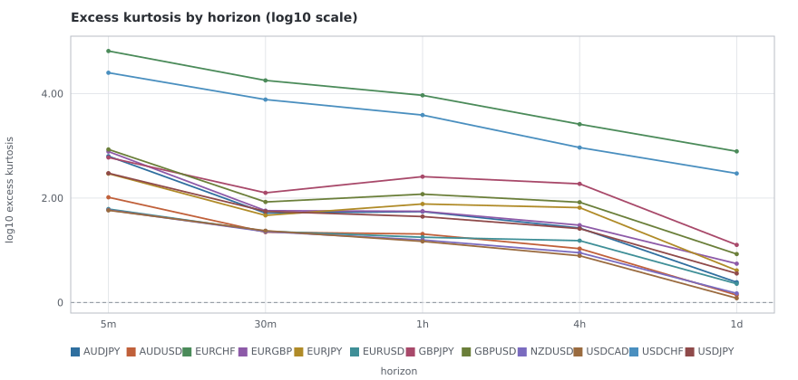

*Excess kurtosis of log returns at each horizon, one line per pair, on a log10 axis. Linear, one pair's SNB-de-peg outlier is four orders of magnitude above the rest and flattens every other line onto the floor. The CSV carries the untransformed values.* — source table: [`T4/kurtosis_by_horizon.csv`](T4/kurtosis_by_horizon.csv)

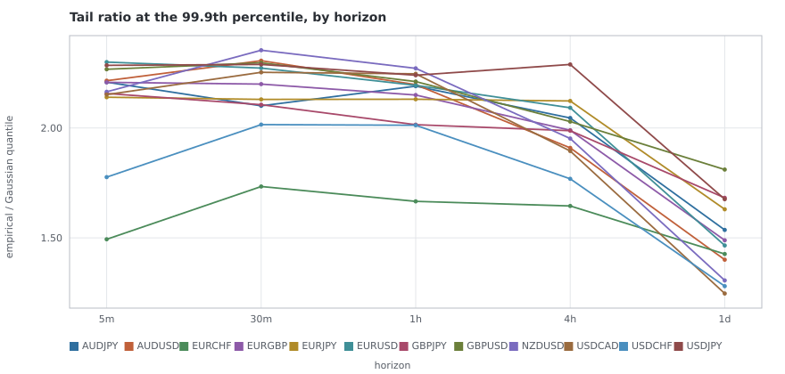

*How much larger the 1-in-1,000 move is than a Gaussian of the same variance would put there. 1.0 is Gaussian.* — source table: [`T4/tail_ratio_by_horizon.csv`](T4/tail_ratio_by_horizon.csv)

*Return standard deviation in basis points at each horizon, log10. Under square-root-of-time scaling these lines would be straight and parallel, since the horizon ladder is close to geometric; where a pair bends, its variance is not accumulating linearly. The CSV carries the untransformed values.* — source table: [`T4/sd_by_horizon.csv`](T4/sd_by_horizon.csv)

Jarque-Bera is reported in the result document and deliberately not tabulated here. At these sample sizes the statistic runs to six figures for every pair at every horizon and the p-value is zero to machine precision, which establishes only that FX returns are not Gaussian — something nobody doubted, and something the skew and kurtosis columns above say with an effect size attached.

## 2 — Stationarity and memory

### Unit-root sanity

The level series is rebuilt from the gap-filtered returns rather than read off the price column, so the regression differences the same series everything else here measures and never across a weekend. The null is a unit root, so a τ **below** the critical value rejects it.

Of 60 pair-horizon cells, **5** reject a unit root in the level and **60** reject it in the returns. That is the sanity result and it is the only thing this test is being asked for: prices behave like random walks, returns emphatically do not, and at hundreds of thousands of observations the test has the power to reject on departures far too small to trade, so the sign and the magnitude are what to read.

| pair | horizon | τ (levels) | rejects at 1% | τ (returns) | rejects at 1% |
| --- | --- | --- | --- | --- | --- |
| `AUDJPY` | `5m` | -1.06 | **no** | -265.8 | yes |
| `AUDUSD` | `5m` | -3.22 | **no** | -266.5 | yes |
| `EURCHF` | `5m` | -2.26 | **no** | -304.8 | yes |
| `EURGBP` | `5m` | -2.60 | **no** | -265.5 | yes |
| `EURJPY` | `5m` | -0.35 | **no** | -262.4 | yes |
| `EURUSD` | `5m` | -2.76 | **no** | -264.1 | yes |
| `GBPJPY` | `5m` | -0.41 | **no** | -261.0 | yes |
| `GBPUSD` | `5m` | -3.16 | **no** | -263.1 | yes |
| `NZDUSD` | `5m` | -2.97 | **no** | -267.6 | yes |
| `USDCAD` | `5m` | -3.50 | yes | -266.1 | yes |
| `USDCHF` | `5m` | -3.31 | **no** | -289.9 | yes |
| `USDJPY` | `5m` | -0.15 | **no** | -264.0 | yes |
| `AUDJPY` | `30m` | -1.14 | **no** | -109.4 | yes |
| `AUDUSD` | `30m` | -3.15 | **no** | -108.0 | yes |
| `EURCHF` | `30m` | -1.97 | **no** | -113.4 | yes |
| `EURGBP` | `30m` | -2.70 | **no** | -108.1 | yes |
| `EURJPY` | `30m` | -0.63 | **no** | -110.1 | yes |
| `EURUSD` | `30m` | -2.69 | **no** | -108.2 | yes |
| `GBPJPY` | `30m` | -0.87 | **no** | -109.8 | yes |
| `GBPUSD` | `30m` | -3.19 | **no** | -108.2 | yes |
| `NZDUSD` | `30m` | -3.09 | **no** | -107.2 | yes |
| `USDCAD` | `30m` | -3.54 | yes | -108.0 | yes |
| `USDCHF` | `30m` | -3.59 | yes | -111.6 | yes |
| `USDJPY` | `30m` | -0.20 | **no** | -107.3 | yes |
| `AUDJPY` | `1h` | -1.03 | **no** | -76.7 | yes |
| `AUDUSD` | `1h` | -3.06 | **no** | -76.6 | yes |
| `EURCHF` | `1h` | -2.16 | **no** | -74.5 | yes |
| `EURGBP` | `1h` | -2.54 | **no** | -77.1 | yes |
| `EURJPY` | `1h` | -0.73 | **no** | -76.1 | yes |
| `EURUSD` | `1h` | -2.60 | **no** | -77.5 | yes |
| `GBPJPY` | `1h` | -0.90 | **no** | -76.7 | yes |
| `GBPUSD` | `1h` | -3.13 | **no** | -77.2 | yes |
| `NZDUSD` | `1h` | -2.83 | **no** | -76.3 | yes |
| `USDCAD` | `1h` | -3.45 | yes | -76.7 | yes |
| `USDCHF` | `1h` | -3.82 | yes | -76.0 | yes |
| `USDJPY` | `1h` | -0.27 | **no** | -75.1 | yes |
| `AUDJPY` | `4h` | -2.02 | **no** | -38.1 | yes |
| `AUDUSD` | `4h` | -2.52 | **no** | -37.9 | yes |
| `EURCHF` | `4h` | -1.85 | **no** | -38.1 | yes |
| `EURGBP` | `4h` | -2.43 | **no** | -38.3 | yes |

_First 40 of 60 cells; the whole table is in `result.json`._

### The variance-ratio profile — the trend-versus-reversion fingerprint

A variance ratio above 1 says a q-period move is larger than q independent one-period moves would be: returns reinforce, which is what a trend looks like. Below 1 says they cancel, which is what mean reversion looks like. The whole profile across q is worth more than any single value, because a series can trend at one aggregation and revert at another — and several here do.

The statistic is Lo and MacKinlay's heteroskedasticity-robust `z*`. The homoskedastic form would reject on volatility clustering alone, and section 3 shows every pair at every horizon clusters, so the robust form is not a refinement here — it is the difference between measuring memory and measuring variance.

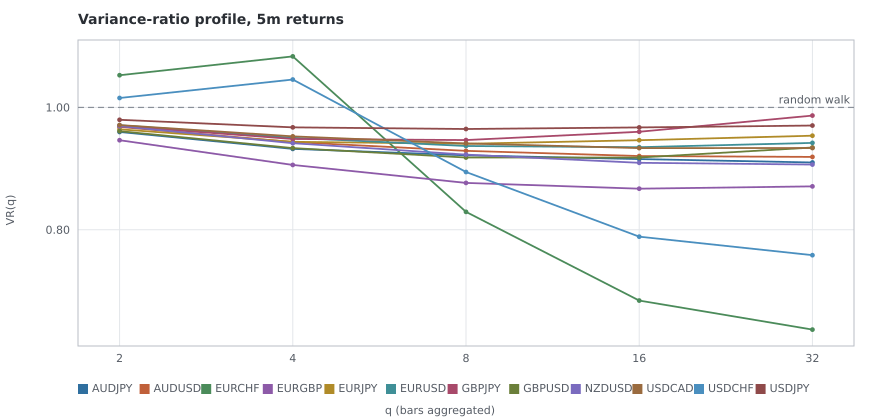

*Variance-ratio profile at the 5m horizon. Above 1 is trending, below 1 is reverting, and the dashed line is the random walk.* — source table: [`T4/variance_ratio_5m.csv`](T4/variance_ratio_5m.csv)

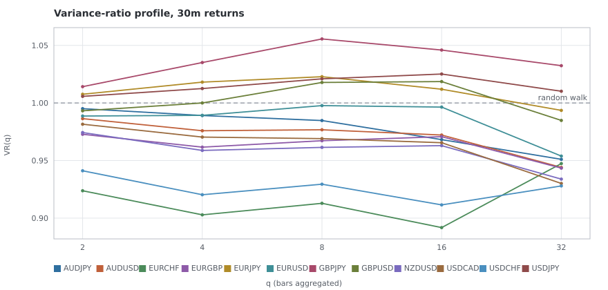

*Variance-ratio profile at the 30m horizon. Above 1 is trending, below 1 is reverting, and the dashed line is the random walk.* — source table: [`T4/variance_ratio_30m.csv`](T4/variance_ratio_30m.csv)

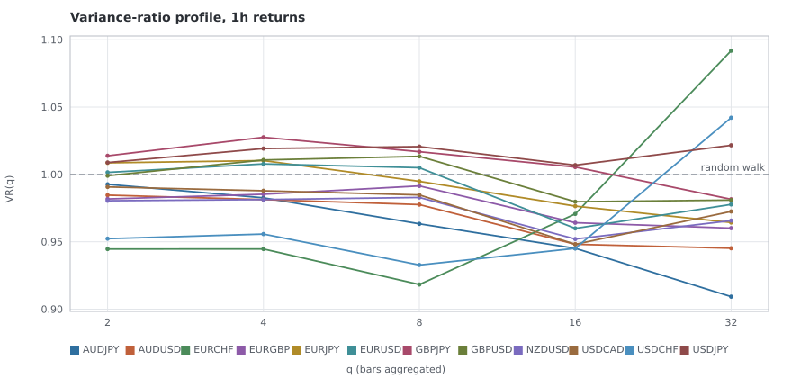

*Variance-ratio profile at the 1h horizon. Above 1 is trending, below 1 is reverting, and the dashed line is the random walk.* — source table: [`T4/variance_ratio_1h.csv`](T4/variance_ratio_1h.csv)

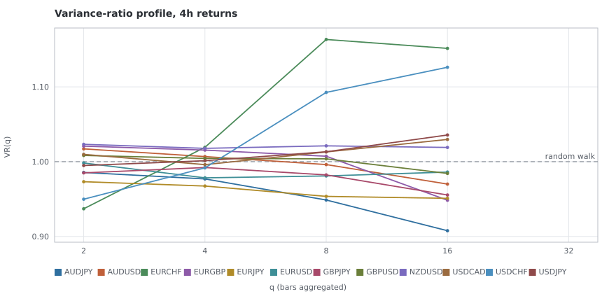

*Variance-ratio profile at the 4h horizon. Above 1 is trending, below 1 is reverting, and the dashed line is the random walk.* — source table: [`T4/variance_ratio_4h.csv`](T4/variance_ratio_4h.csv)

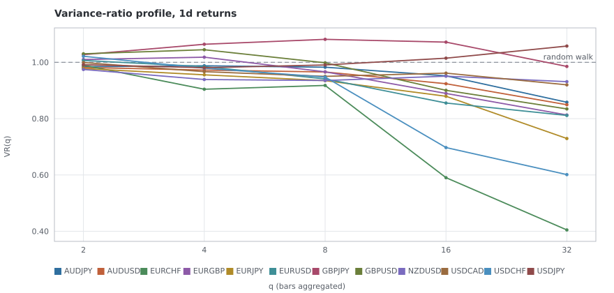

*Variance-ratio profile at the 1d horizon. Above 1 is trending, below 1 is reverting, and the dashed line is the random walk.* — source table: [`T4/variance_ratio_1d.csv`](T4/variance_ratio_1d.csv)

Every cell, with the z of the q=4 rung — the one the character table ranks on:

| pair | horizon | VR(2) | VR(4) | VR(8) | VR(16) | VR(32) | z at q=4 |
| --- | --- | --- | --- | --- | --- | --- | --- |
| `AUDJPY` | `5m` | 0.9599 | 0.9322 | 0.9217 | 0.9155 | 0.9100 | -3.14 |
| `AUDUSD` | `5m` | 0.9681 | 0.9434 | 0.9290 | 0.9205 | 0.9191 | -7.26 |
| `EURCHF` | `5m` | 1.0527 | 1.0835 | 0.8293 | 0.6842 | 0.6367 | 0.26 |
| `EURGBP` | `5m` | 0.9464 | 0.9060 | 0.8766 | 0.8671 | 0.8709 | -6.22 |
| `EURJPY` | `5m` | 0.9642 | 0.9438 | 0.9406 | 0.9464 | 0.9538 | -3.54 |
| `EURUSD` | `5m` | 0.9708 | 0.9504 | 0.9369 | 0.9350 | 0.9420 | -7.79 |
| `GBPJPY` | `5m` | 0.9695 | 0.9484 | 0.9467 | 0.9602 | 0.9867 | -3.40 |
| `GBPUSD` | `5m` | 0.9612 | 0.9335 | 0.9181 | 0.9181 | 0.9345 | -3.41 |
| `NZDUSD` | `5m` | 0.9694 | 0.9415 | 0.9228 | 0.9095 | 0.9066 | -10.26 |
| `USDCAD` | `5m` | 0.9712 | 0.9527 | 0.9411 | 0.9335 | 0.9336 | -9.15 |
| `USDCHF` | `5m` | 1.0154 | 1.0456 | 0.8944 | 0.7887 | 0.7584 | 0.19 |
| `USDJPY` | `5m` | 0.9798 | 0.9674 | 0.9647 | 0.9673 | 0.9704 | -2.50 |
| `AUDJPY` | `30m` | 0.9950 | 0.9891 | 0.9847 | 0.9682 | 0.9511 | -0.73 |
| `AUDUSD` | `30m` | 0.9864 | 0.9759 | 0.9767 | 0.9722 | 0.9440 | -2.14 |
| `EURCHF` | `30m` | 0.9238 | 0.9029 | 0.9129 | 0.8918 | 0.9474 | -1.63 |
| `EURGBP` | `30m` | 0.9728 | 0.9616 | 0.9672 | 0.9707 | 0.9434 | -2.45 |
| `EURJPY` | `30m` | 1.0076 | 1.0181 | 1.0228 | 1.0119 | 0.9936 | 1.17 |
| `EURUSD` | `30m` | 0.9887 | 0.9893 | 0.9977 | 0.9964 | 0.9539 | -1.04 |
| `GBPJPY` | `30m` | 1.0142 | 1.0351 | 1.0556 | 1.0459 | 1.0324 | 1.30 |
| `GBPUSD` | `30m` | 0.9932 | 1.0000 | 1.0178 | 1.0186 | 0.9848 | 0.00 |
| `NZDUSD` | `30m` | 0.9743 | 0.9588 | 0.9614 | 0.9629 | 0.9339 | -4.27 |
| `USDCAD` | `30m` | 0.9815 | 0.9704 | 0.9690 | 0.9655 | 0.9301 | -3.11 |
| `USDCHF` | `30m` | 0.9411 | 0.9203 | 0.9295 | 0.9115 | 0.9280 | -1.78 |
| `USDJPY` | `30m` | 1.0057 | 1.0125 | 1.0210 | 1.0251 | 1.0102 | 0.96 |
| `AUDJPY` | `1h` | 0.9926 | 0.9826 | 0.9633 | 0.9451 | 0.9093 | -0.97 |
| `AUDUSD` | `1h` | 0.9846 | 0.9813 | 0.9776 | 0.9482 | 0.9452 | -1.23 |
| `EURCHF` | `1h` | 0.9446 | 0.9446 | 0.9183 | 0.9707 | 1.0918 | -1.09 |
| `EURGBP` | `1h` | 0.9818 | 0.9853 | 0.9915 | 0.9641 | 0.9601 | -0.82 |
| `EURJPY` | `1h` | 1.0086 | 1.0103 | 0.9949 | 0.9765 | 0.9643 | 0.53 |
| `EURUSD` | `1h` | 1.0015 | 1.0078 | 1.0050 | 0.9599 | 0.9777 | 0.56 |
| `GBPJPY` | `1h` | 1.0138 | 1.0276 | 1.0168 | 1.0055 | 0.9815 | 0.86 |
| `GBPUSD` | `1h` | 0.9990 | 1.0107 | 1.0134 | 0.9797 | 0.9809 | 0.45 |
| `NZDUSD` | `1h` | 0.9805 | 0.9813 | 0.9829 | 0.9520 | 0.9657 | -1.45 |
| `USDCAD` | `1h` | 0.9907 | 0.9879 | 0.9848 | 0.9481 | 0.9725 | -0.95 |
| `USDCHF` | `1h` | 0.9523 | 0.9557 | 0.9328 | 0.9451 | 1.0421 | -1.03 |
| `USDJPY` | `1h` | 1.0088 | 1.0192 | 1.0206 | 1.0069 | 1.0216 | 1.14 |
| `AUDJPY` | `4h` | 0.9856 | 0.9769 | 0.9487 | 0.9077 | — | -0.66 |
| `AUDUSD` | `4h` | 1.0171 | 1.0068 | 0.9961 | 0.9700 | — | 0.28 |
| `EURCHF` | `4h` | 0.9370 | 1.0192 | 1.1634 | 1.1515 | — | 0.13 |
| `EURGBP` | `4h` | 1.0208 | 1.0155 | 1.0073 | 0.9484 | — | 0.48 |
| `EURJPY` | `4h` | 0.9732 | 0.9674 | 0.9536 | 0.9510 | — | -0.59 |
| `EURUSD` | `4h` | 0.9982 | 0.9784 | 0.9809 | 0.9861 | — | -0.87 |
| `GBPJPY` | `4h` | 0.9850 | 0.9922 | 0.9823 | 0.9554 | — | -0.10 |
| `GBPUSD` | `4h` | 1.0083 | 1.0044 | 1.0037 | 0.9843 | — | 0.09 |
| `NZDUSD` | `4h` | 1.0232 | 1.0178 | 1.0212 | 1.0190 | — | 0.82 |
| `USDCAD` | `4h` | 1.0097 | 0.9960 | 1.0130 | 1.0297 | — | -0.21 |
| `USDCHF` | `4h` | 0.9498 | 0.9917 | 1.0926 | 1.1262 | — | -0.07 |
| `USDJPY` | `4h` | 0.9948 | 1.0013 | 1.0132 | 1.0357 | — | 0.04 |
| `AUDJPY` | `1d` | 0.9844 | 0.9877 | 0.9827 | 0.9520 | 0.8582 | -0.27 |
| `AUDUSD` | `1d` | 0.9817 | 0.9724 | 0.9657 | 0.9240 | 0.8494 | -0.64 |
| `EURCHF` | `1d` | 0.9897 | 0.9044 | 0.9180 | 0.5903 | 0.4047 | -1.15 |
| `EURGBP` | `1d` | 1.0100 | 1.0182 | 0.9661 | 0.8895 | 0.8130 | 0.33 |
| `EURJPY` | `1d` | 0.9777 | 0.9556 | 0.9349 | 0.8794 | 0.7294 | -1.02 |
| `EURUSD` | `1d` | 1.0066 | 0.9847 | 0.9411 | 0.8555 | 0.8113 | -0.35 |
| `GBPJPY` | `1d` | 1.0273 | 1.0642 | 1.0816 | 1.0718 | 0.9854 | 1.03 |
| `GBPUSD` | `1d` | 1.0303 | 1.0448 | 0.9983 | 0.9005 | 0.8345 | 0.74 |
| `NZDUSD` | `1d` | 0.9746 | 0.9390 | 0.9354 | 0.9508 | 0.9313 | -1.51 |
| `USDCAD` | `1d` | 0.9992 | 0.9668 | 0.9501 | 0.9616 | 0.9200 | -0.76 |
| `USDCHF` | `1d` | 1.0214 | 0.9792 | 0.9476 | 0.6973 | 0.6012 | -0.36 |
| `USDJPY` | `1d` | 0.9915 | 0.9810 | 0.9907 | 1.0147 | 1.0578 | -0.41 |

### Return autocorrelation and sign persistence

Effect sizes, not just significance. `ρ(1)` is the lag-1 return autocorrelation over pairs inside a span; `Σ|ρ|` sums the first 10 lags, which is the honest way to see whether memory that is invisible at lag 1 is hiding further out. `p(same sign)` is the share of returns keeping the previous return's sign, and 0.5 is a fair coin.

| pair | horizon | ρ(1) | Σ\|ρ\| over 10 lags | Ljung-Box p | p(same sign) | z | continuation ρ (h=4) | (h=12) |
| --- | --- | --- | --- | --- | --- | --- | --- | --- |
| `AUDJPY` | `5m` | -0.0401 | 0.0737 | <1e-16 | 0.4819 | -31.3 | -0.0232 | -0.0147 |
| `AUDUSD` | `5m` | -0.0319 | 0.0557 | <1e-16 | 0.4860 | -24.1 | -0.0223 | -0.0143 |
| `EURCHF` | `5m` | 0.0525 | 0.4919 | <1e-16 | 0.4754 | -42.1 | -0.0796 | -0.0793 |
| `EURGBP` | `5m` | -0.0531 | 0.0940 | <1e-16 | 0.4764 | -40.5 | -0.0377 | -0.0223 |
| `EURJPY` | `5m` | -0.0360 | 0.0491 | <1e-16 | 0.4818 | -31.5 | -0.0174 | -0.0078 |
| `EURUSD` | `5m` | -0.0294 | 0.0491 | <1e-16 | 0.4855 | -24.9 | -0.0193 | -0.0102 |
| `GBPJPY` | `5m` | -0.0305 | 0.0579 | <1e-16 | 0.4809 | -33.0 | -0.0158 | -0.0058 |
| `GBPUSD` | `5m` | -0.0386 | 0.0646 | <1e-16 | 0.4835 | -28.5 | -0.0246 | -0.0128 |
| `NZDUSD` | `5m` | -0.0303 | 0.0564 | <1e-16 | 0.4874 | -21.6 | -0.0229 | -0.0167 |
| `USDCAD` | `5m` | -0.0287 | 0.0484 | <1e-16 | 0.4866 | -23.1 | -0.0190 | -0.0121 |
| `USDCHF` | `5m` | 0.0156 | 0.2665 | <1e-16 | 0.4834 | -28.5 | -0.0413 | -0.0527 |
| `USDJPY` | `5m` | -0.0202 | 0.0370 | <1e-16 | 0.4858 | -24.5 | -0.0100 | -0.0059 |
| `AUDJPY` | `30m` | -0.0073 | 0.0370 | 0.0058 | 0.4812 | -13.3 | -0.0061 | -0.0097 |
| `AUDUSD` | `30m` | -0.0164 | 0.0430 | 3.9e-07 | 0.4804 | -13.8 | -0.0098 | -0.0077 |
| `EURCHF` | `30m` | -0.0786 | 0.1586 | <1e-16 | 0.4706 | -20.7 | -0.0291 | -0.0386 |
| `EURGBP` | `30m` | -0.0291 | 0.0538 | <1e-16 | 0.4716 | -20.0 | -0.0146 | -0.0109 |
| `EURJPY` | `30m` | 0.0053 | 0.0559 | 4.4e-08 | 0.4810 | -13.5 | 0.0038 | -0.0062 |
| `EURUSD` | `30m` | -0.0143 | 0.0362 | 0.0001 | 0.4807 | -13.6 | -0.0053 | -0.0048 |
| `GBPJPY` | `30m` | 0.0118 | 0.0755 | <1e-16 | 0.4802 | -14.0 | 0.0164 | -0.0037 |
| `GBPUSD` | `30m` | -0.0093 | 0.0484 | 1.4e-05 | 0.4785 | -15.2 | 0.0032 | -0.0032 |
| `NZDUSD` | `30m` | -0.0276 | 0.0533 | <1e-16 | 0.4848 | -10.7 | -0.0134 | -0.0095 |
| `USDCAD` | `30m` | -0.0201 | 0.0494 | 3.8e-10 | 0.4836 | -11.6 | -0.0105 | -0.0080 |
| `USDCHF` | `30m` | -0.0611 | 0.1207 | <1e-16 | 0.4811 | -13.3 | -0.0248 | -0.0316 |
| `USDJPY` | `30m` | 0.0032 | 0.0424 | 0.0001 | 0.4838 | -11.4 | 0.0035 | 0.0006 |
| `AUDJPY` | `1h` | -0.0071 | 0.0652 | 0.0002 | 0.4877 | -6.1 | -0.0123 | -0.0116 |
| `AUDUSD` | `1h` | -0.0177 | 0.0443 | 0.0024 | 0.4873 | -6.3 | -0.0108 | -0.0144 |
| `EURCHF` | `1h` | -0.0608 | 0.2641 | <1e-16 | 0.4709 | -14.5 | -0.0210 | 0.0149 |
| `EURGBP` | `1h` | -0.0221 | 0.0790 | 4.0e-12 | 0.4785 | -10.7 | -0.0024 | -0.0134 |
| `EURJPY` | `1h` | 0.0070 | 0.0644 | 6.1e-08 | 0.4824 | -8.8 | -0.0042 | -0.0050 |
| `EURUSD` | `1h` | -0.0032 | 0.0389 | 0.1912 | 0.4808 | -9.6 | -0.0064 | -0.0142 |
| `GBPJPY` | `1h` | 0.0113 | 0.1007 | <1e-16 | 0.4833 | -8.3 | 0.0105 | -0.0029 |
| `GBPUSD` | `1h` | -0.0051 | 0.0708 | 2.1e-07 | 0.4834 | -8.3 | 0.0060 | -0.0116 |
| `NZDUSD` | `1h` | -0.0220 | 0.0757 | 2.1e-08 | 0.4889 | -5.5 | -0.0085 | -0.0159 |
| `USDCAD` | `1h` | -0.0109 | 0.0392 | 0.1297 | 0.4831 | -8.4 | -0.0116 | -0.0123 |
| `USDCHF` | `1h` | -0.0529 | 0.2110 | <1e-16 | 0.4817 | -9.1 | -0.0179 | 0.0015 |
| `USDJPY` | `1h` | 0.0062 | 0.0377 | 0.2463 | 0.4851 | -7.4 | 0.0031 | 0.0004 |
| `AUDJPY` | `4h` | -0.0267 | 0.1036 | 0.0008 | 0.4914 | -2.1 | -0.0248 | -0.0182 |
| `AUDUSD` | `4h` | -0.0011 | 0.1103 | 0.0009 | 0.4942 | -1.4 | -0.0135 | -0.0215 |
| `EURCHF` | `4h` | -0.0896 | 0.3737 | <1e-16 | 0.4841 | -3.9 | 0.0130 | 0.0025 |
| `EURGBP` | `4h` | -0.0029 | 0.1072 | 0.0020 | 0.4860 | -3.5 | -0.0147 | -0.0328 |
| `EURJPY` | `4h` | -0.0460 | 0.1526 | 8.5e-10 | 0.4867 | -3.3 | -0.0305 | 0.0015 |
| `EURUSD` | `4h` | -0.0268 | 0.1356 | 2.1e-06 | 0.4877 | -3.0 | -0.0295 | -0.0058 |
| `GBPJPY` | `4h` | -0.0350 | 0.1137 | 2.7e-05 | 0.4900 | -2.5 | -0.0205 | -0.0017 |
| `GBPUSD` | `4h` | -0.0155 | 0.0857 | 0.0810 | 0.4836 | -4.0 | -0.0192 | -0.0156 |
| `NZDUSD` | `4h` | 0.0047 | 0.1007 | 0.0168 | 0.4987 | -0.3 | -0.0083 | -0.0144 |
| `USDCAD` | `4h` | -0.0127 | 0.1047 | 0.0106 | 0.4903 | -2.4 | -0.0080 | -0.0065 |
| `USDCHF` | `4h` | -0.0757 | 0.2517 | <1e-16 | 0.4839 | -4.0 | -0.0065 | -0.0024 |
| `USDJPY` | `4h` | -0.0226 | 0.1040 | 0.0047 | 0.4908 | -2.3 | -0.0060 | -0.0060 |
| `AUDJPY` | `1d` | -0.0163 | 0.2027 | 0.1265 | 0.4985 | -0.2 | -0.0129 | -0.0092 |
| `AUDUSD` | `1d` | -0.0184 | 0.1392 | 0.7883 | 0.4883 | -1.2 | 0.0018 | -0.0239 |
| `EURCHF` | `1d` | -0.0110 | 0.4518 | <1e-16 | 0.4785 | -2.2 | -0.0300 | -0.0715 |
| `EURGBP` | `1d` | 0.0099 | 0.1529 | 0.3778 | 0.4890 | -1.1 | -0.0139 | -0.0340 |
| `EURJPY` | `1d` | -0.0230 | 0.1221 | 0.7132 | 0.4996 | -0.0 | -0.0249 | -0.0236 |
| `EURUSD` | `1d` | 0.0063 | 0.1992 | 0.0489 | 0.4977 | -0.2 | -0.0107 | -0.0338 |
| `GBPJPY` | `1d` | 0.0271 | 0.2052 | 0.1038 | 0.5102 | 1.0 | 0.0205 | 0.0094 |
| `GBPUSD` | `1d` | 0.0311 | 0.1737 | 0.3995 | 0.5166 | 1.7 | 0.0075 | -0.0289 |
| `NZDUSD` | `1d` | -0.0254 | 0.2077 | 0.1282 | 0.4977 | -0.2 | -0.0023 | -0.0097 |
| `USDCAD` | `1d` | 0.0004 | 0.1333 | 0.7014 | 0.4902 | -1.0 | -0.0108 | 0.0002 |
| `USDCHF` | `1d` | 0.0210 | 0.3662 | 1.9e-06 | 0.5000 | 0.0 | 0.0068 | -0.0766 |
| `USDJPY` | `1d` | -0.0091 | 0.1006 | 0.9459 | 0.4800 | -2.1 | -0.0035 | 0.0011 |

The continuation columns correlate one return against the sum of the next h. It is the same question the variance ratio asks, in a form that survives being conditioned on a regime — which is why section 3 uses it and why it is reported unconditionally here, so the two are on one scale. Its z is deflated by √h for the overlap it is built from; without that correction a value of 0.01 would read as twenty sigma.

## 3 — Volatility: clustering, regimes and the clock

### Clustering

The autocorrelation of |return| is the single strongest statistical regularity in this whole battery, and it is an order of magnitude larger and longer-lived than anything in the returns themselves. Whatever is forecastable in FX at these horizons is the *size* of the next move, not its direction.

| pair | horizon | ρ\|r\|(1) | ρ\|r\|(5) | ρ\|r\|(20) | half-life (bars) | ρ r²(1) | r² half-life | Ljung-Box p |
| --- | --- | --- | --- | --- | --- | --- | --- | --- |
| `AUDJPY` | `5m` | 0.2973 | 0.2274 | 0.1589 | 26.0 | 0.2337 | 10.1 | <1e-16 |
| `AUDUSD` | `5m` | 0.2703 | 0.2036 | 0.1352 | 23.0 | 0.1548 | 10.8 | <1e-16 |
| `EURCHF` | `5m` | 0.5527 | 0.1820 | 0.0784 | 7.3 | 0.3475 | 1.8 | <1e-16 |
| `EURGBP` | `5m` | 0.3172 | 0.2528 | 0.2019 | 37.8 | 0.0643 | 9.6 | <1e-16 |
| `EURJPY` | `5m` | 0.2988 | 0.2252 | 0.1659 | 27.9 | 0.2444 | 21.9 | <1e-16 |
| `EURUSD` | `5m` | 0.3132 | 0.2469 | 0.1827 | 30.0 | 0.1403 | 17.5 | <1e-16 |
| `GBPJPY` | `5m` | 0.2907 | 0.2307 | 0.1881 | 34.9 | 0.0994 | 33.2 | <1e-16 |
| `GBPUSD` | `5m` | 0.3132 | 0.2359 | 0.1891 | 34.2 | 0.1250 | 9.2 | <1e-16 |
| `NZDUSD` | `5m` | 0.2569 | 0.1844 | 0.1217 | 21.3 | 0.1164 | 12.0 | <1e-16 |
| `USDCAD` | `5m` | 0.2873 | 0.2322 | 0.1668 | 29.0 | 0.0951 | 15.1 | <1e-16 |
| `USDCHF` | `5m` | 0.5414 | 0.2164 | 0.1047 | 8.8 | 0.6148 | 1.8 | <1e-16 |
| `USDJPY` | `5m` | 0.3005 | 0.2375 | 0.1698 | 27.6 | 0.1526 | 14.3 | <1e-16 |
| `AUDJPY` | `30m` | 0.2657 | 0.1546 | 0.1228 | 23.4 | 0.1469 | 9.3 | <1e-16 |
| `AUDUSD` | `30m` | 0.2316 | 0.1132 | 0.0766 | 14.7 | 0.1599 | 15.0 | <1e-16 |
| `EURCHF` | `30m` | 0.2310 | 0.1253 | 0.0654 | 12.2 | 0.0102 | — | <1e-16 |
| `EURGBP` | `30m` | 0.2851 | 0.2057 | 0.0187 | 5.4 | 0.1383 | 8.7 | <1e-16 |
| `EURJPY` | `30m` | 0.2577 | 0.1462 | 0.0670 | 12.3 | 0.2048 | 9.1 | <1e-16 |
| `EURUSD` | `30m` | 0.2659 | 0.1646 | 0.0021 | 4.0 | 0.1127 | 5.0 | <1e-16 |
| `GBPJPY` | `30m` | 0.2738 | 0.1681 | 0.0806 | 12.7 | 0.2653 | 8.0 | <1e-16 |
| `GBPUSD` | `30m` | 0.2785 | 0.1811 | 0.0157 | 5.7 | 0.1818 | 9.8 | <1e-16 |
| `NZDUSD` | `30m` | 0.2086 | 0.1005 | 0.0709 | 14.7 | 0.0986 | 13.5 | <1e-16 |
| `USDCAD` | `30m` | 0.2565 | 0.1467 | -0.0026 | 4.4 | 0.0890 | 3.9 | <1e-16 |
| `USDCHF` | `30m` | 0.2355 | 0.1212 | 0.0365 | 7.7 | 0.0137 | — | <1e-16 |
| `USDJPY` | `30m` | 0.2604 | 0.1575 | 0.1075 | 17.8 | 0.0940 | 7.5 | <1e-16 |
| `AUDJPY` | `1h` | 0.2367 | 0.1553 | 0.0942 | 24.4 | 0.0977 | 12.1 | <1e-16 |
| `AUDUSD` | `1h` | 0.2115 | 0.1148 | 0.0610 | 22.2 | 0.1845 | 17.6 | <1e-16 |
| `EURCHF` | `1h` | 0.2100 | 0.1258 | 0.0909 | 14.7 | 0.0059 | 22.6 | <1e-16 |
| `EURGBP` | `1h` | 0.2896 | 0.1514 | 0.1479 | 1.5 | 0.0785 | 8.6 | <1e-16 |
| `EURJPY` | `1h` | 0.2460 | 0.1390 | 0.0963 | 16.2 | 0.0800 | 7.5 | <1e-16 |
| `EURUSD` | `1h` | 0.2596 | 0.1270 | 0.1042 | 1.9 | 0.1471 | 8.1 | <1e-16 |
| `GBPJPY` | `1h` | 0.2558 | 0.1626 | 0.1102 | 16.7 | 0.0674 | 7.1 | <1e-16 |
| `GBPUSD` | `1h` | 0.2723 | 0.1497 | 0.1171 | 9.8 | 0.0778 | 7.4 | <1e-16 |
| `NZDUSD` | `1h` | 0.1883 | 0.1016 | 0.0618 | 24.4 | 0.1391 | 17.1 | <1e-16 |
| `USDCAD` | `1h` | 0.2437 | 0.1045 | 0.0952 | 1.6 | 0.1330 | 11.2 | <1e-16 |
| `USDCHF` | `1h` | 0.2260 | 0.1337 | 0.0964 | 8.9 | 0.0107 | 10.0 | <1e-16 |
| `USDJPY` | `1h` | 0.2478 | 0.1441 | 0.0940 | 21.1 | 0.0982 | 9.2 | <1e-16 |
| `AUDJPY` | `4h` | 0.2098 | 0.1214 | 0.0839 | 25.9 | 0.2205 | 16.2 | <1e-16 |
| `AUDUSD` | `4h` | 0.1315 | 0.0902 | 0.0403 | 27.5 | 0.1433 | 12.6 | <1e-16 |
| `EURCHF` | `4h` | 0.2048 | 0.1182 | -0.0036 | 6.5 | 0.0251 | 2.8 | <1e-16 |
| `EURGBP` | `4h` | 0.2323 | 0.1682 | 0.0267 | — | 0.1649 | 15.5 | <1e-16 |
| `EURJPY` | `4h` | 0.2260 | 0.1267 | 0.0484 | 22.3 | 0.2723 | 11.7 | <1e-16 |
| `EURUSD` | `4h` | 0.1775 | 0.1389 | 0.0135 | — | 0.1431 | 4.4 | <1e-16 |
| `GBPJPY` | `4h` | 0.2687 | 0.1363 | 0.0441 | 24.1 | 0.2249 | 19.0 | <1e-16 |
| `GBPUSD` | `4h` | 0.2335 | 0.1533 | 0.0228 | — | 0.1811 | 52.8 | <1e-16 |
| `NZDUSD` | `4h` | 0.1185 | 0.0928 | 0.0545 | 93.6 | 0.1193 | 41.7 | <1e-16 |
| `USDCAD` | `4h` | 0.1458 | 0.1187 | -0.0171 | — | 0.0902 | 373.8 | <1e-16 |
| `USDCHF` | `4h` | 0.2169 | 0.1147 | 0.0078 | 3.0 | 0.0541 | 0.8 | <1e-16 |
| `USDJPY` | `4h` | 0.1910 | 0.1242 | 0.0608 | 31.9 | 0.1381 | 13.8 | <1e-16 |
| `AUDJPY` | `1d` | 0.1811 | 0.1324 | 0.0336 | 10.6 | 0.1376 | 8.8 | <1e-16 |
| `AUDUSD` | `1d` | 0.0867 | 0.0904 | 0.0833 | 41.0 | 0.1115 | 22.6 | <1e-16 |
| `EURCHF` | `1d` | 0.0370 | 0.0711 | 0.0945 | 99.0 | -0.0008 | — | <1e-16 |
| `EURGBP` | `1d` | 0.1873 | 0.1178 | 0.0822 | 22.8 | 0.2270 | 10.0 | <1e-16 |
| `EURJPY` | `1d` | 0.1272 | 0.0982 | 0.0421 | 16.9 | 0.0823 | 12.0 | <1e-16 |
| `EURUSD` | `1d` | 0.1156 | 0.1306 | 0.0946 | 31.4 | 0.1073 | 16.1 | <1e-16 |
| `GBPJPY` | `1d` | 0.1779 | 0.1182 | 0.0126 | 10.6 | 0.1738 | 26.0 | <1e-16 |
| `GBPUSD` | `1d` | 0.1786 | 0.0909 | 0.0647 | 15.9 | 0.2226 | 8.1 | <1e-16 |
| `NZDUSD` | `1d` | 0.0737 | 0.0669 | 0.0917 | 37.9 | 0.0758 | 21.9 | <1e-16 |
| `USDCAD` | `1d` | 0.1391 | 0.1124 | 0.0775 | 26.5 | 0.1569 | 14.4 | <1e-16 |
| `USDCHF` | `1d` | 0.0496 | 0.0702 | 0.0437 | 14.8 | -0.0005 | — | <1e-16 |
| `USDJPY` | `1d` | 0.1624 | 0.1420 | 0.0816 | 18.9 | 0.1225 | 12.2 | <1e-16 |

A half-life is fitted by least squares to the log of the leading run of positive autocorrelations, and is reported as absent rather than as a number when the sequence does not decay — a negative half-life in a table is a number with no referent that nobody notices.

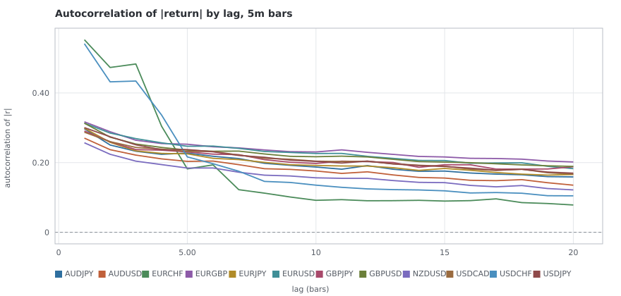

*Autocorrelation of |return| by lag at the 5m horizon -- the volatility-clustering signature.* — source table: [`T4/volatility_acf_5m.csv`](T4/volatility_acf_5m.csv)

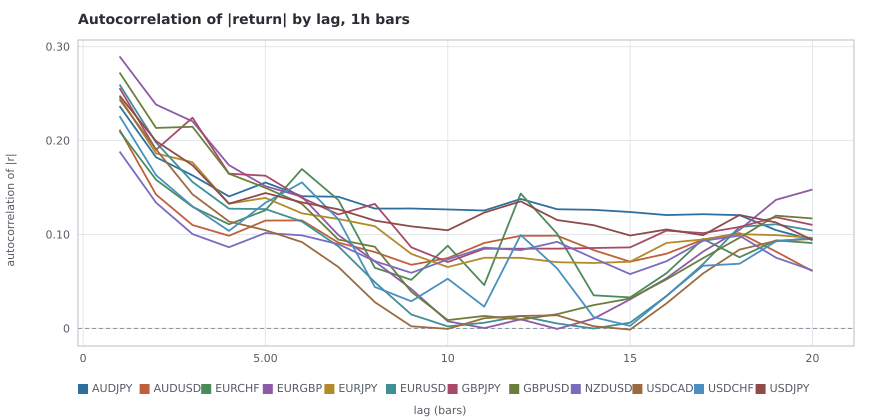

*Autocorrelation of |return| by lag at the 1h horizon -- the volatility-clustering signature.* — source table: [`T4/volatility_acf_1h.csv`](T4/volatility_acf_1h.csv)

### Regimes

Terciles of trailing volatility, and how the memory statistics differ inside each. The regime label uses only returns before the one it labels; see the method note above for why that shift is the whole test.

| pair | horizon | σ high/low | ρ(1) low | mid | high | p(same) low | mid | high | cont ρ low | cont ρ high |
| --- | --- | --- | --- | --- | --- | --- | --- | --- | --- | --- |
| `AUDJPY` | `5m` | 2.46 | -0.0430 | -0.0306 | -0.0427 | 0.4790 | 0.4831 | 0.4835 | -0.0252 | -0.0263 |
| `AUDUSD` | `5m` | 2.21 | -0.0311 | -0.0268 | -0.0341 | 0.4839 | 0.4871 | 0.4869 | -0.0186 | -0.0268 |
| `EURCHF` | `5m` | 4.29 | -0.0644 | -0.0654 | 0.0671 | 0.4675 | 0.4756 | 0.4827 | 0.1717 | -0.1782 |
| `EURGBP` | `5m` | 3.34 | -0.0749 | -0.0490 | -0.0531 | 0.4706 | 0.4763 | 0.4820 | -0.0631 | -0.0251 |
| `EURJPY` | `5m` | 2.67 | -0.0406 | -0.0276 | -0.0381 | 0.4779 | 0.4844 | 0.4831 | -0.0239 | -0.0209 |
| `EURUSD` | `5m` | 3.09 | -0.0355 | -0.0250 | -0.0302 | 0.4816 | 0.4866 | 0.4881 | -0.0264 | -0.0212 |
| `GBPJPY` | `5m` | 2.69 | -0.0403 | -0.0257 | -0.0310 | 0.4772 | 0.4816 | 0.4839 | -0.0178 | -0.0111 |
| `GBPUSD` | `5m` | 3.17 | -0.0404 | -0.0248 | -0.0425 | 0.4799 | 0.4837 | 0.4867 | -0.0257 | -0.0131 |
| `NZDUSD` | `5m` | 2.09 | -0.0201 | -0.0301 | -0.0324 | 0.4890 | 0.4859 | 0.4875 | -0.0171 | -0.0246 |
| `USDCAD` | `5m` | 2.75 | -0.0290 | -0.0278 | -0.0290 | 0.4848 | 0.4883 | 0.4867 | -0.0262 | -0.0172 |
| `USDCHF` | `5m` | 4.03 | -0.0441 | -0.0354 | 0.0256 | 0.4786 | 0.4842 | 0.4870 | -0.0411 | -0.0440 |
| `USDJPY` | `5m` | 2.91 | -0.0183 | -0.0135 | -0.0221 | 0.4814 | 0.4869 | 0.4889 | -0.0003 | -0.0130 |
| `AUDJPY` | `30m` | 1.94 | -0.0117 | -0.0055 | -0.0073 | 0.4782 | 0.4845 | 0.4810 | 0.0028 | -0.0158 |
| `AUDUSD` | `30m` | 1.63 | -0.0188 | -0.0196 | -0.0149 | 0.4784 | 0.4815 | 0.4812 | -0.0142 | -0.0077 |
| `EURCHF` | `30m` | 0.93 | -0.0178 | -0.0569 | -0.1190 | 0.4736 | 0.4689 | 0.4694 | -0.0087 | -0.0553 |
| `EURGBP` | `30m` | 2.04 | -0.0297 | -0.0349 | -0.0274 | 0.4730 | 0.4657 | 0.4760 | -0.0140 | -0.0128 |
| `EURJPY` | `30m` | 1.96 | -0.0128 | -0.0087 | 0.0138 | 0.4791 | 0.4818 | 0.4821 | 0.0059 | -0.0007 |
| `EURUSD` | `30m` | 1.85 | -0.0242 | -0.0261 | -0.0082 | 0.4799 | 0.4798 | 0.4826 | -0.0044 | -0.0021 |
| `GBPJPY` | `30m` | 2.04 | -0.0079 | -0.0056 | 0.0210 | 0.4804 | 0.4778 | 0.4825 | 0.0206 | 0.0177 |
| `GBPUSD` | `30m` | 1.89 | -0.0124 | -0.0132 | -0.0075 | 0.4828 | 0.4761 | 0.4766 | -0.0041 | 0.0082 |
| `NZDUSD` | `30m` | 1.64 | -0.0196 | -0.0174 | -0.0345 | 0.4858 | 0.4881 | 0.4806 | 0.0006 | -0.0180 |
| `USDCAD` | `30m` | 1.74 | -0.0205 | -0.0245 | -0.0186 | 0.4849 | 0.4821 | 0.4838 | -0.0219 | -0.0122 |
| `USDCHF` | `30m` | 1.08 | -0.0151 | -0.0301 | -0.0921 | 0.4886 | 0.4763 | 0.4784 | -0.0201 | -0.0341 |
| `USDJPY` | `30m` | 2.12 | 0.0035 | -0.0018 | 0.0047 | 0.4855 | 0.4830 | 0.4827 | 0.0281 | -0.0069 |
| `AUDJPY` | `1h` | 1.98 | 0.0035 | -0.0000 | -0.0116 | 0.4883 | 0.4893 | 0.4856 | 0.0074 | -0.0216 |
| `AUDUSD` | `1h` | 1.57 | -0.0157 | -0.0150 | -0.0201 | 0.4883 | 0.4822 | 0.4913 | -0.0112 | -0.0086 |
| `EURCHF` | `1h` | 0.89 | -0.0170 | -0.0443 | -0.0935 | 0.4736 | 0.4681 | 0.4712 | 0.0096 | -0.0556 |
| `EURGBP` | `1h` | 1.76 | -0.0251 | -0.0185 | -0.0235 | 0.4822 | 0.4789 | 0.4744 | -0.0000 | 0.0068 |
| `EURJPY` | `1h` | 1.89 | 0.0152 | -0.0022 | 0.0089 | 0.4869 | 0.4815 | 0.4790 | 0.0090 | -0.0083 |
| `EURUSD` | `1h` | 1.54 | 0.0026 | -0.0296 | 0.0066 | 0.4861 | 0.4737 | 0.4826 | 0.0089 | -0.0054 |
| `GBPJPY` | `1h` | 1.89 | 0.0108 | 0.0066 | 0.0127 | 0.4846 | 0.4857 | 0.4792 | 0.0143 | 0.0115 |
| `GBPUSD` | `1h` | 1.60 | -0.0041 | -0.0106 | -0.0037 | 0.4881 | 0.4811 | 0.4807 | 0.0012 | 0.0117 |
| `NZDUSD` | `1h` | 1.54 | -0.0100 | -0.0219 | -0.0260 | 0.4930 | 0.4914 | 0.4820 | -0.0026 | -0.0149 |
| `USDCAD` | `1h` | 1.37 | -0.0190 | -0.0094 | -0.0099 | 0.4805 | 0.4847 | 0.4839 | -0.0045 | -0.0209 |
| `USDCHF` | `1h` | 1.98 | -0.0160 | -0.0281 | -0.0660 | 0.4835 | 0.4815 | 0.4800 | -0.0070 | -0.0193 |
| `USDJPY` | `1h` | 2.01 | 0.0247 | 0.0054 | 0.0036 | 0.4878 | 0.4812 | 0.4862 | 0.0264 | -0.0028 |
| `AUDJPY` | `4h` | 1.78 | 0.0117 | -0.0053 | -0.0434 | 0.4961 | 0.4849 | 0.4933 | 0.0276 | -0.0498 |
| `AUDUSD` | `4h` | 1.58 | -0.0078 | 0.0005 | -0.0002 | 0.4914 | 0.4951 | 0.4963 | 0.0026 | -0.0241 |
| `EURCHF` | `4h` | 0.87 | 0.0034 | -0.0196 | -0.1584 | 0.4888 | 0.4890 | 0.4754 | 0.0608 | -0.0520 |
| `EURGBP` | `4h` | 1.98 | -0.0109 | 0.0086 | -0.0061 | 0.4803 | 0.4998 | 0.4779 | 0.0023 | -0.0163 |

_First 40 of 60 cells; the whole table is in `result.json`._

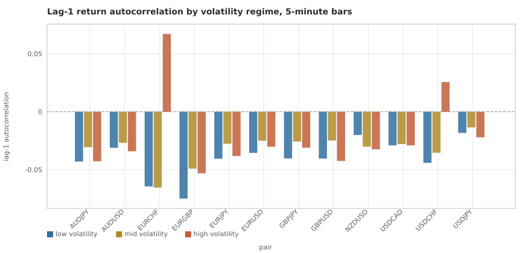

*Lag-1 return autocorrelation inside each trailing-volatility tercile, 5-minute bars. The regime label uses only returns before the one it labels.* — source table: [`T4/regime_rho1_5m.csv`](T4/regime_rho1_5m.csv)

### The clock

Volatility, spread and quote density by hour of day, on hourly bars. Three separate daylight-saving rules move the session map, so these are UTC hours and the session boundaries inside them drift by an hour twice a year — which is exactly why the session table in section 4 is computed from the derived boundaries rather than from these buckets.

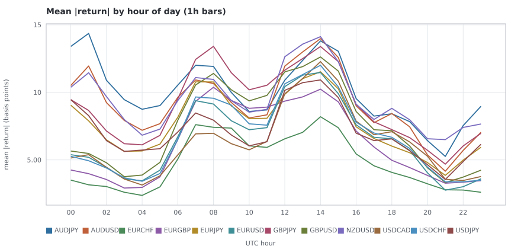

*Mean absolute hourly return by UTC hour, one line per pair.* — source table: [`T4/volatility_by_hour.csv`](T4/volatility_by_hour.csv)

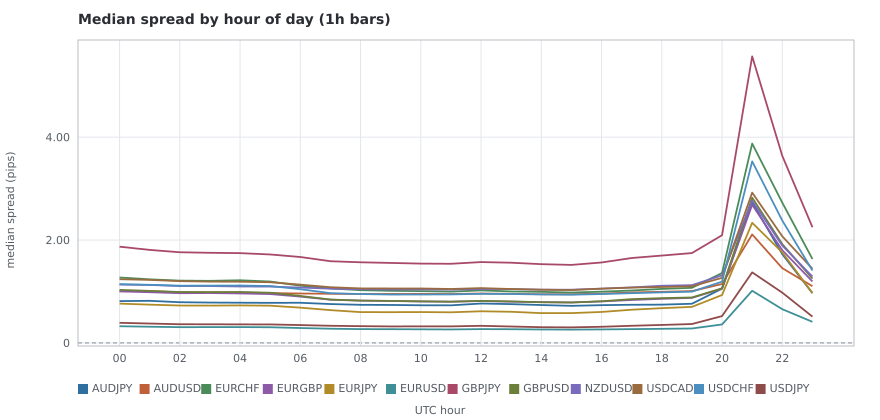

*Median quoted spread by UTC hour. The roll window is the spike.* — source table: [`T4/spread_by_hour.csv`](T4/spread_by_hour.csv)

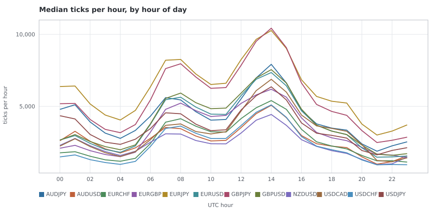

*Median tick count by UTC hour -- the density series R4 asks to characterise, at its finest published grain.* — source table: [`T4/density_by_hour.csv`](T4/density_by_hour.csv)

### By day of week

The same hourly bars, split by weekday. Each cell is mean |return| in basis points, then median spread in pips — per bar, because Monday and Friday are short days by construction and their totals would only be measuring the length of the trading week.

| pair | Mon | Tue | Wed | Thu | Fri | Sun |
| --- | --- | --- | --- | --- | --- | --- |
| `AUDJPY` | 8.93 / 0.798 | 10.24 / 0.793 | 10.07 / 0.798 | 10.47 / 0.808 | 10.37 / 0.792 | 11.68 / 1.853 |
| `AUDUSD` | 7.99 / 0.997 | 9.22 / 0.991 | 9.38 / 0.993 | 9.59 / 0.997 | 9.46 / 0.986 | 8.43 / 1.510 |
| `EURCHF` | 4.62 / 1.125 | 4.57 / 1.110 | 4.62 / 1.118 | 5.20 / 1.128 | 5.23 / 1.108 | 3.86 / 3.032 |
| `EURGBP` | 5.86 / 0.897 | 6.22 / 0.888 | 6.22 / 0.891 | 6.54 / 0.898 | 6.63 / 0.880 | 4.66 / 1.913 |
| `EURJPY` | 7.08 / 0.724 | 7.48 / 0.707 | 7.52 / 0.710 | 8.08 / 0.717 | 8.27 / 0.694 | 7.91 / 1.884 |
| `EURUSD` | 6.01 / 0.294 | 6.35 / 0.289 | 6.62 / 0.290 | 7.02 / 0.293 | 7.05 / 0.287 | 5.01 / 0.692 |
| `GBPJPY` | 8.29 / 1.763 | 9.00 / 1.729 | 9.01 / 1.736 | 9.33 / 1.753 | 9.57 / 1.725 | 9.11 / 3.836 |
| `GBPUSD` | 6.90 / 0.912 | 7.43 / 0.899 | 7.62 / 0.906 | 7.79 / 0.910 | 8.10 / 0.891 | 5.54 / 2.017 |
| `NZDUSD` | 8.37 / 1.105 | 9.37 / 1.094 | 10.14 / 1.102 | 9.79 / 1.104 | 9.66 / 1.088 | 8.79 / 1.901 |
| `USDCAD` | 5.70 / 1.143 | 6.22 / 1.127 | 6.59 / 1.134 | 6.38 / 1.139 | 6.88 / 1.128 | 5.31 / 2.097 |
| `USDCHF` | 6.20 / 1.044 | 6.51 / 1.034 | 6.75 / 1.036 | 7.33 / 1.039 | 7.29 / 1.022 | 5.12 / 2.534 |
| `USDJPY` | 6.33 / 0.378 | 6.91 / 0.366 | 7.33 / 0.367 | 7.37 / 0.372 | 7.71 / 0.360 | 7.46 / 1.053 |

The Sunday column is the weekly open: two or three hours of thin quoting, and the row it produces is the reason the daily horizon drops those bars rather than counting them as days.

## 4 — Session and spread structure

Computed on `1h` bars with the session boundaries **derived** from each centre's own local clock, so they move with British Summer Time and US daylight saving independently, as they do in reality.

### By session

| pair | session | bars | mean \|r\| (bp) | sd (bp) | median spread (pips) | p90 spread | median ticks | ρ(1) |
| --- | --- | --- | --- | --- | --- | --- | --- | --- |
| `AUDJPY` | tokyo | 19,622 | 10.89 | 17.31 | 0.792 | 1.276 | 3,998 | 0.0195 |
| `AUDJPY` | london | 13,015 | 10.12 | 14.65 | 0.737 | 1.204 | 4,682 | -0.0105 |
| `AUDJPY` | london ny overlap | 8,081 | 13.17 | 18.88 | 0.751 | 1.239 | 7,270 | 0.0019 |
| `AUDJPY` | new york | 15,652 | 8.29 | 12.62 | 0.791 | 1.395 | 3,615 | -0.0306 |
| `AUDJPY` | sydney | 6,980 | 7.53 | 13.18 | 1.596 | 5.749 | 2,262 | -0.1254 |
| `AUDUSD` | tokyo | 19,621 | 9.21 | 13.76 | 0.983 | 1.202 | 2,486 | -0.0093 |
| `AUDUSD` | london | 13,015 | 9.32 | 12.78 | 0.952 | 1.148 | 3,011 | -0.0181 |
| `AUDUSD` | london ny overlap | 8,081 | 13.86 | 19.88 | 0.954 | 1.159 | 4,656 | 0.0036 |
| `AUDUSD` | new york | 15,651 | 7.73 | 11.91 | 1.010 | 1.353 | 2,308 | -0.0253 |
| `AUDUSD` | sydney | 6,983 | 5.79 | 9.57 | 1.385 | 3.366 | 1,230 | -0.1766 |
| `EURCHF` | tokyo | 19,616 | 3.43 | 5.58 | 1.198 | 1.893 | 1,652 | -0.0583 |
| `EURCHF` | london | 13,015 | 6.85 | 17.00 | 1.011 | 1.358 | 3,619 | -0.0611 |
| `EURCHF` | london ny overlap | 8,081 | 7.65 | 11.29 | 1.003 | 1.392 | 5,171 | 0.0350 |
| `EURCHF` | new york | 15,651 | 4.36 | 7.24 | 1.079 | 1.723 | 2,348 | -0.0548 |
| `EURCHF` | sydney | 6,983 | 2.59 | 5.02 | 2.485 | 8.400 | 1,137 | -0.5430 |
| `EURGBP` | tokyo | 19,621 | 4.25 | 7.42 | 0.958 | 1.247 | 2,090 | -0.0205 |
| `EURGBP` | london | 13,015 | 9.42 | 13.33 | 0.810 | 1.009 | 4,712 | -0.0048 |
| `EURGBP` | london ny overlap | 8,081 | 10.07 | 14.18 | 0.801 | 1.019 | 6,028 | -0.0005 |
| `EURGBP` | new york | 15,651 | 5.41 | 8.23 | 0.867 | 1.327 | 2,984 | -0.0570 |
| `EURGBP` | sydney | 6,982 | 3.32 | 7.25 | 1.699 | 5.182 | 1,499 | -0.1291 |
| `EURJPY` | tokyo | 19,622 | 7.12 | 11.68 | 0.725 | 1.345 | 5,454 | 0.0181 |
| `EURJPY` | london | 13,015 | 9.27 | 13.53 | 0.600 | 1.197 | 7,332 | 0.0091 |
| `EURJPY` | london ny overlap | 8,081 | 11.31 | 15.85 | 0.596 | 1.205 | 9,884 | 0.0290 |
| `EURJPY` | new york | 15,651 | 6.26 | 9.46 | 0.716 | 1.346 | 5,516 | -0.0221 |
| `EURJPY` | sydney | 6,983 | 5.02 | 8.68 | 1.613 | 5.938 | 3,320 | -0.0631 |
| `EURUSD` | tokyo | 19,622 | 4.93 | 7.54 | 0.307 | 0.449 | 2,563 | -0.0116 |
| `EURUSD` | london | 13,015 | 8.15 | 11.49 | 0.266 | 0.371 | 4,947 | -0.0082 |
| `EURUSD` | london ny overlap | 8,081 | 11.62 | 16.88 | 0.265 | 0.366 | 7,082 | 0.0263 |
| `EURUSD` | new york | 15,651 | 6.18 | 9.43 | 0.280 | 0.471 | 3,387 | -0.0229 |
| `EURUSD` | sydney | 6,985 | 3.07 | 5.02 | 0.611 | 2.004 | 1,454 | -0.1050 |
| `GBPJPY` | tokyo | 19,622 | 7.90 | 14.21 | 1.749 | 2.599 | 4,451 | 0.0474 |
| `GBPJPY` | london | 13,015 | 11.54 | 16.67 | 1.550 | 2.250 | 7,027 | 0.0094 |
| `GBPJPY` | london ny overlap | 8,081 | 13.08 | 18.24 | 1.549 | 2.366 | 9,858 | 0.0083 |
| `GBPJPY` | new york | 15,651 | 7.50 | 11.43 | 1.765 | 2.691 | 4,880 | -0.0175 |
| `GBPJPY` | sydney | 6,981 | 6.03 | 12.14 | 3.388 | 11.436 | 2,642 | -0.0646 |
| `GBPUSD` | tokyo | 19,621 | 5.47 | 9.73 | 0.977 | 1.296 | 2,695 | 0.0092 |
| `GBPUSD` | london | 13,015 | 10.22 | 14.37 | 0.812 | 1.037 | 5,311 | -0.0006 |
| `GBPUSD` | london ny overlap | 8,081 | 12.61 | 17.84 | 0.802 | 1.045 | 7,224 | -0.0003 |
| `GBPUSD` | new york | 15,651 | 6.81 | 10.47 | 0.884 | 1.347 | 3,477 | -0.0153 |
| `GBPUSD` | sydney | 6,981 | 3.75 | 8.42 | 1.797 | 5.140 | 1,584 | -0.0823 |

_First 40 of 60 pair-sessions; the whole table is in `result.json`._

### The roll window as its own regime (pre-reg #4 evidence)

The daily roll, 16:00–18:00 `America/New_York`, derived per bar rather than pinned to a UTC hour — 17:00 New York is 21:00Z in summer and 22:00Z in winter, and a rule written in UTC is wrong for half of every year.

Pre-registered decision #4 excludes this window from strategy execution by default and says the exclusion is revisable at a checkpoint **with EDA evidence**. This is that evidence. It is not this card's to act on.

| pair | roll bars | roll mean \|r\| (bp) | elsewhere | vol ratio | roll median spread | elsewhere | spread ratio | density ratio | roll ρ(1) |
| --- | --- | --- | --- | --- | --- | --- | --- | --- | --- |
| `AUDJPY` | 5,276 | 5.70 | 10.39 | 0.55 | 1.987 | 0.776 | 2.56 | 0.45 | -0.0433 |
| `AUDUSD` | 5,278 | 4.53 | 9.49 | 0.48 | 1.697 | 0.982 | 1.73 | 0.39 | -0.0805 |
| `EURCHF` | 5,278 | 2.88 | 4.98 | 0.58 | 2.623 | 1.099 | 2.39 | 0.49 | -0.3192 |
| `EURGBP` | 5,277 | 3.45 | 6.49 | 0.53 | 2.013 | 0.876 | 2.30 | 0.54 | -0.1205 |
| `EURJPY` | 5,277 | 4.14 | 7.97 | 0.52 | 1.816 | 0.686 | 2.65 | 0.48 | -0.0139 |
| `EURUSD` | 5,279 | 2.96 | 6.87 | 0.43 | 0.735 | 0.286 | 2.57 | 0.42 | -0.0358 |
| `GBPJPY` | 5,277 | 5.06 | 9.35 | 0.54 | 3.918 | 1.697 | 2.31 | 0.46 | -0.0544 |
| `GBPUSD` | 5,277 | 3.60 | 7.85 | 0.46 | 2.081 | 0.888 | 2.34 | 0.43 | -0.1157 |
| `NZDUSD` | 5,276 | 6.23 | 9.72 | 0.64 | 2.200 | 1.084 | 2.03 | 0.40 | -0.0357 |
| `USDCAD` | 5,276 | 3.98 | 6.52 | 0.61 | 2.154 | 1.121 | 1.92 | 0.46 | -0.1092 |
| `USDCHF` | 5,278 | 3.50 | 7.05 | 0.50 | 2.509 | 1.019 | 2.46 | 0.41 | -0.2728 |
| `USDJPY` | 5,277 | 3.87 | 7.39 | 0.52 | 1.046 | 0.354 | 2.95 | 0.46 | -0.0254 |

Read the two ratio columns together. The roll hour is the one window of the day where the spread widens and the volatility falls at the same time — every other quiet period on the clock is quiet in both. A strategy trading through it pays materially more to move a price that is moving materially less.

### Spread inside tick-count bands (ruling R3)

R3 forbids comparing a spread statistic across eras without controlling for ticks per hour, because a percentile taken over a thousand-tick hour and one taken over six thousand are not the same instrument. The control is to compare inside a band and never across one, and every spread figure in this report obeys it.

| pair | band | bars | median spread (pips) | p90 | share inside the roll |
| --- | --- | --- | --- | --- | --- |
| `AUDJPY` | `<500` | 266 | 5.558 | 16.850 | 62.0% |
| `AUDJPY` | `500-1k` | 904 | 1.885 | 8.951 | 62.8% |
| `AUDJPY` | `1k-3k` | 16,769 | 0.731 | 1.860 | 19.8% |
| `AUDJPY` | `3k-10k` | 40,203 | 0.796 | 1.315 | 3.0% |
| `AUDJPY` | `>=10k` | 5,208 | 0.993 | 1.423 | 0.3% |
| `AUDUSD` | `<500` | 1,090 | 2.729 | 5.844 | 66.8% |
| `AUDUSD` | `500-1k` | 3,882 | 1.161 | 2.958 | 43.4% |
| `AUDUSD` | `1k-3k` | 32,324 | 0.977 | 1.264 | 8.1% |
| `AUDUSD` | `3k-10k` | 24,080 | 0.999 | 1.264 | 1.1% |
| `AUDUSD` | `>=10k` | 1,975 | 1.036 | 1.455 | 0.0% |
| `EURCHF` | `<500` | 1,405 | 1.491 | 12.032 | 34.4% |
| `EURCHF` | `500-1k` | 6,971 | 1.238 | 3.545 | 18.1% |
| `EURCHF` | `1k-3k` | 29,116 | 1.147 | 2.228 | 10.7% |
| `EURCHF` | `3k-10k` | 24,302 | 1.072 | 1.770 | 1.7% |
| `EURCHF` | `>=10k` | 1,552 | 1.263 | 1.959 | 0.5% |
| `EURGBP` | `<500` | 736 | 1.413 | 9.039 | 37.0% |
| `EURGBP` | `500-1k` | 3,682 | 0.998 | 3.509 | 19.2% |
| `EURGBP` | `1k-3k` | 25,852 | 0.947 | 1.645 | 13.6% |
| `EURGBP` | `3k-10k` | 30,533 | 0.843 | 1.215 | 2.5% |
| `EURGBP` | `>=10k` | 2,547 | 1.000 | 1.777 | 0.3% |
| `EURJPY` | `<500` | 174 | 8.039 | 22.098 | 75.3% |
| `EURJPY` | `500-1k` | 473 | 3.803 | 11.338 | 65.1% |
| `EURJPY` | `1k-3k` | 7,248 | 0.752 | 2.685 | 28.1% |
| `EURJPY` | `3k-10k` | 43,496 | 0.671 | 1.325 | 6.2% |
| `EURJPY` | `>=10k` | 11,961 | 1.028 | 1.475 | 1.0% |
| `EURUSD` | `<500` | 625 | 1.164 | 3.450 | 55.0% |
| `EURUSD` | `500-1k` | 2,708 | 0.394 | 1.961 | 33.6% |
| `EURUSD` | `1k-3k` | 22,991 | 0.310 | 0.615 | 15.0% |
| `EURUSD` | `3k-10k` | 32,793 | 0.278 | 0.446 | 1.8% |
| `EURUSD` | `>=10k` | 4,237 | 0.302 | 0.485 | 0.1% |
| `GBPJPY` | `<500` | 184 | 13.962 | 32.521 | 58.7% |
| `GBPJPY` | `500-1k` | 524 | 6.292 | 19.754 | 60.9% |
| `GBPJPY` | `1k-3k` | 11,047 | 1.897 | 4.679 | 23.8% |
| `GBPJPY` | `3k-10k` | 42,371 | 1.669 | 2.587 | 5.0% |
| `GBPJPY` | `>=10k` | 9,224 | 2.010 | 3.280 | 1.1% |
| `GBPUSD` | `<500` | 506 | 4.057 | 12.539 | 54.4% |
| `GBPUSD` | `500-1k` | 2,028 | 1.289 | 5.023 | 37.9% |
| `GBPUSD` | `1k-3k` | 21,878 | 0.985 | 1.794 | 15.3% |
| `GBPUSD` | `3k-10k` | 34,464 | 0.852 | 1.239 | 2.5% |
| `GBPUSD` | `>=10k` | 4,473 | 0.989 | 1.575 | 0.4% |

_First 40 of 60 pair-bands; the whole table is in `result.json`._

### Spread against volatility

The unconditional correlation and the same correlation inside each band. Where they disagree it is the unconditional one to distrust: spread and volatility both move with the hour of day and with the era, so an uncontrolled correlation is partly measuring the clock.

| pair | log spread vs log \|r\| | inside 500-1k | 1k-3k | 3k-10k | ≥10k | log ticks vs log \|r\| | log ticks vs log spread |
| --- | --- | --- | --- | --- | --- | --- | --- |
| `AUDJPY` | 0.015 | 0.142 | 0.004 | 0.024 | 0.074 | 0.258 | -0.038 |
| `AUDUSD` | -0.050 | -0.027 | -0.025 | 0.043 | 0.237 | 0.267 | -0.244 |
| `EURCHF` | -0.034 | 0.069 | -0.014 | 0.009 | -0.003 | 0.267 | -0.205 |
| `EURGBP` | -0.083 | 0.016 | -0.038 | -0.068 | 0.090 | 0.308 | -0.181 |
| `EURJPY` | -0.024 | 0.067 | 0.003 | -0.053 | 0.026 | 0.299 | -0.032 |
| `EURUSD` | -0.106 | -0.037 | -0.055 | -0.038 | 0.205 | 0.316 | -0.276 |
| `GBPJPY` | -0.043 | 0.129 | 0.002 | -0.039 | 0.002 | 0.327 | -0.148 |
| `GBPUSD` | -0.109 | -0.020 | -0.051 | -0.064 | 0.073 | 0.343 | -0.249 |
| `NZDUSD` | -0.021 | -0.005 | 0.012 | 0.080 | 0.107 | 0.239 | -0.241 |
| `USDCAD` | -0.096 | -0.012 | -0.026 | -0.035 | 0.154 | 0.299 | -0.328 |
| `USDCHF` | -0.063 | -0.011 | -0.035 | -0.001 | 0.093 | 0.295 | -0.230 |
| `USDJPY` | 0.024 | 0.033 | -0.019 | -0.062 | 0.105 | 0.332 | 0.168 |

## 5 — Stability: the load-bearing section

The T4 card calls this section load-bearing and it is right to. Everything above is a number computed over ten years; this asks whether it means anything about any particular part of them. A property whose sign flips between halves is reported as unstable, never averaged: the average of a trend and a reversion is a number that describes neither regime and would be traded in both.

### Split-half: 2015-01-01 → the split, and 2020-01-01 → 2025-02-28

The split is fixed on the calendar rather than on the sample. Splitting at the median bar would put the boundary wherever the quote density happened to change, and the question is whether a property survives *time*.

Across 60 pair-horizon cells the sign changes between halves in **18** for the variance ratio, **17** for lag-1 return autocorrelation, **8** for sign persistence and **0** for volatility clustering. The last of those is the point of the table: volatility memory is the one property that does not change its mind.

| pair | horizon | sd₁ | sd₂ | VR(4)₁ | VR(4)₂ | same side | ρ(1)₁ | ρ(1)₂ | same side | ρ\|r\|(1)₁ | ρ\|r\|(1)₂ | same side |
| --- | --- | --- | --- | --- | --- | --- | --- | --- | --- | --- | --- | --- |
| `AUDJPY` | `5m` | 4.73 | 4.59 | 0.9130 | 0.9520 | yes | -0.0548 | -0.0251 | yes | 0.3001 | 0.2942 | yes |
| `AUDUSD` | `5m` | 3.85 | 4.31 | 0.9220 | 0.9599 | yes | -0.0449 | -0.0220 | yes | 0.2493 | 0.2836 | yes |
| `EURCHF` | `5m` | 4.69 | 2.24 | 1.1233 | 0.9113 | **no** | 0.0752 | -0.0442 | **no** | 0.5890 | 0.3209 | yes |
| `EURGBP` | `5m` | 3.52 | 2.63 | 0.9053 | 0.9069 | yes | -0.0531 | -0.0532 | yes | 0.2946 | 0.3391 | yes |
| `EURJPY` | `5m` | 3.61 | 3.45 | 0.9242 | 0.9646 | yes | -0.0487 | -0.0226 | yes | 0.3005 | 0.2967 | yes |
| `EURUSD` | `5m` | 3.18 | 2.93 | 0.9410 | 0.9610 | yes | -0.0355 | -0.0223 | yes | 0.3111 | 0.3145 | yes |
| `GBPJPY` | `5m` | 4.56 | 3.94 | 0.9418 | 0.9568 | yes | -0.0331 | -0.0270 | yes | 0.2897 | 0.2903 | yes |
| `GBPUSD` | `5m` | 3.71 | 3.54 | 0.9058 | 0.9629 | yes | -0.0535 | -0.0227 | yes | 0.3141 | 0.3122 | yes |
| `NZDUSD` | `5m` | 4.16 | 4.29 | 0.9196 | 0.9615 | yes | -0.0439 | -0.0180 | yes | 0.2464 | 0.2662 | yes |
| `USDCAD` | `5m` | 3.03 | 2.70 | 0.9455 | 0.9614 | yes | -0.0347 | -0.0213 | yes | 0.2803 | 0.2946 | yes |
| `USDCHF` | `5m` | 4.90 | 3.00 | 1.0798 | 0.9561 | **no** | 0.0300 | -0.0216 | **no** | 0.6095 | 0.2938 | yes |
| `USDJPY` | `5m` | 3.29 | 3.44 | 0.9391 | 0.9925 | yes | -0.0357 | -0.0065 | yes | 0.2866 | 0.3124 | yes |
| `AUDJPY` | `30m` | 10.97 | 10.91 | 0.9919 | 0.9864 | yes | -0.0126 | -0.0022 | yes | 0.2538 | 0.2777 | yes |
| `AUDUSD` | `30m` | 9.03 | 10.34 | 0.9761 | 0.9758 | yes | -0.0176 | -0.0155 | yes | 0.1885 | 0.2588 | yes |
| `EURCHF` | `30m` | 8.75 | 5.25 | 0.8946 | 0.9252 | yes | -0.0915 | -0.0440 | yes | 0.2098 | 0.3112 | yes |
| `EURGBP` | `30m` | 8.13 | 6.23 | 0.9797 | 0.9321 | yes | -0.0194 | -0.0452 | yes | 0.2567 | 0.3126 | yes |
| `EURJPY` | `30m` | 8.44 | 8.28 | 1.0231 | 1.0130 | yes | 0.0055 | 0.0050 | yes | 0.2522 | 0.2629 | yes |
| `EURUSD` | `30m` | 7.53 | 7.07 | 1.0127 | 0.9637 | **no** | -0.0010 | -0.0288 | yes | 0.2553 | 0.2771 | yes |
| `GBPJPY` | `30m` | 10.77 | 9.46 | 1.0678 | 0.9941 | **no** | 0.0245 | -0.0042 | **no** | 0.2793 | 0.2646 | yes |
| `GBPUSD` | `30m` | 8.54 | 8.59 | 1.0403 | 0.9615 | **no** | 0.0062 | -0.0241 | **no** | 0.2688 | 0.2879 | yes |
| `NZDUSD` | `30m` | 9.81 | 10.29 | 0.9500 | 0.9665 | yes | -0.0357 | -0.0206 | yes | 0.1756 | 0.2370 | yes |
| `USDCAD` | `30m` | 7.27 | 6.51 | 0.9732 | 0.9671 | yes | -0.0212 | -0.0188 | yes | 0.2363 | 0.2800 | yes |
| `USDCHF` | `30m` | 10.13 | 7.24 | 0.9089 | 0.9421 | yes | -0.0739 | -0.0370 | yes | 0.2282 | 0.2533 | yes |
| `USDJPY` | `30m` | 7.77 | 8.36 | 1.0036 | 1.0199 | yes | -0.0042 | 0.0093 | **no** | 0.2483 | 0.2697 | yes |
| `AUDJPY` | `1h` | 15.54 | 15.53 | 0.9937 | 0.9719 | yes | 0.0046 | -0.0185 | **no** | 0.2169 | 0.2562 | yes |
| `AUDUSD` | `1h` | 12.76 | 14.61 | 0.9751 | 0.9859 | yes | -0.0156 | -0.0193 | yes | 0.1622 | 0.2435 | yes |
| `EURCHF` | `1h` | 12.31 | 7.31 | 0.9457 | 0.9422 | yes | -0.0686 | -0.0395 | yes | 0.1902 | 0.2855 | yes |
| `EURGBP` | `1h` | 11.40 | 8.68 | 0.9983 | 0.9637 | yes | -0.0161 | -0.0320 | yes | 0.2557 | 0.3243 | yes |
| `EURJPY` | `1h` | 12.14 | 11.77 | 1.0119 | 1.0086 | yes | 0.0125 | 0.0014 | yes | 0.2354 | 0.2568 | yes |
| `EURUSD` | `1h` | 10.70 | 9.94 | 1.0297 | 0.9834 | **no** | 0.0120 | -0.0203 | **no** | 0.2561 | 0.2627 | yes |
| `GBPJPY` | `1h` | 15.57 | 13.45 | 1.0643 | 0.9800 | **no** | 0.0298 | -0.0128 | **no** | 0.2423 | 0.2728 | yes |
| `GBPUSD` | `1h` | 12.17 | 12.16 | 1.0619 | 0.9613 | **no** | 0.0230 | -0.0325 | **no** | 0.2446 | 0.3000 | yes |
| `NZDUSD` | `1h` | 13.73 | 14.45 | 0.9789 | 0.9835 | yes | -0.0251 | -0.0194 | yes | 0.1538 | 0.2177 | yes |
| `USDCAD` | `1h` | 10.21 | 9.13 | 0.9959 | 0.9782 | yes | -0.0052 | -0.0178 | yes | 0.2312 | 0.2569 | yes |
| `USDCHF` | `1h` | 14.33 | 10.09 | 0.9499 | 0.9673 | yes | -0.0655 | -0.0283 | yes | 0.2171 | 0.2485 | yes |
| `USDJPY` | `1h` | 11.00 | 11.90 | 1.0162 | 1.0216 | yes | 0.0124 | 0.0010 | yes | 0.2318 | 0.2600 | yes |
| `AUDJPY` | `4h` | 30.74 | 30.12 | 0.9745 | 0.9792 | yes | -0.0317 | -0.0218 | yes | 0.2148 | 0.2046 | yes |
| `AUDUSD` | `4h` | 24.84 | 28.44 | 1.0054 | 1.0081 | yes | -0.0119 | 0.0068 | **no** | 0.0870 | 0.1589 | yes |
| `EURCHF` | `4h` | 23.74 | 13.82 | 1.0374 | 0.9691 | **no** | -0.1135 | -0.0212 | yes | 0.2101 | 0.1807 | yes |
| `EURGBP` | `4h` | 22.43 | 16.86 | 1.0306 | 0.9903 | **no** | -0.0001 | -0.0079 | yes | 0.2006 | 0.2561 | yes |

_First 40 of 60 cells; the whole table is in `result.json`._

### Rolling 2-year windows

Sign agreement is the share of rolling windows whose statistic sits on the same side of its null as the full-window estimate. The labels are descriptive and nothing is dropped or promoted on them:

| label | sign agreement at least |
| --- | --- |
| `STABLE` | 90% |
| `MOSTLY-STABLE` | 75% |
| `MIXED` | 60% |
| `UNSTABLE` | 0% |

| pair | horizon | windows | VR(4) | ρ(1) | p(same sign) | ρ\|r\|(1) |
| --- | --- | --- | --- | --- | --- | --- |
| `AUDJPY` | `5m` | 17 | 100% STABLE | 100% STABLE | 100% STABLE | 100% STABLE |
| `AUDUSD` | `5m` | 17 | 100% STABLE | 100% STABLE | 100% STABLE | 100% STABLE |
| `EURCHF` | `5m` | 17 | 6% UNSTABLE | 6% UNSTABLE | 100% STABLE | 100% STABLE |
| `EURGBP` | `5m` | 17 | 100% STABLE | 100% STABLE | 100% STABLE | 100% STABLE |
| `EURJPY` | `5m` | 17 | 100% STABLE | 100% STABLE | 100% STABLE | 100% STABLE |
| `EURUSD` | `5m` | 17 | 100% STABLE | 100% STABLE | 100% STABLE | 100% STABLE |
| `GBPJPY` | `5m` | 17 | 100% STABLE | 100% STABLE | 100% STABLE | 100% STABLE |
| `GBPUSD` | `5m` | 17 | 100% STABLE | 100% STABLE | 100% STABLE | 100% STABLE |
| `NZDUSD` | `5m` | 17 | 100% STABLE | 100% STABLE | 100% STABLE | 100% STABLE |
| `USDCAD` | `5m` | 17 | 100% STABLE | 100% STABLE | 100% STABLE | 100% STABLE |
| `USDCHF` | `5m` | 17 | 6% UNSTABLE | 6% UNSTABLE | 100% STABLE | 100% STABLE |
| `USDJPY` | `5m` | 17 | 82% MOSTLY-STABLE | 94% STABLE | 100% STABLE | 100% STABLE |
| `AUDJPY` | `30m` | 17 | 59% UNSTABLE | 82% MOSTLY-STABLE | 100% STABLE | 100% STABLE |
| `AUDUSD` | `30m` | 17 | 88% MOSTLY-STABLE | 100% STABLE | 100% STABLE | 100% STABLE |
| `EURCHF` | `30m` | 17 | 100% STABLE | 100% STABLE | 100% STABLE | 100% STABLE |
| `EURGBP` | `30m` | 17 | 94% STABLE | 100% STABLE | 100% STABLE | 100% STABLE |
| `EURJPY` | `30m` | 17 | 41% UNSTABLE | 41% UNSTABLE | 100% STABLE | 100% STABLE |
| `EURUSD` | `30m` | 17 | 76% MOSTLY-STABLE | 82% MOSTLY-STABLE | 100% STABLE | 100% STABLE |
| `GBPJPY` | `30m` | 17 | 24% UNSTABLE | 24% UNSTABLE | 100% STABLE | 100% STABLE |
| `GBPUSD` | `30m` | 17 | 18% UNSTABLE | 82% MOSTLY-STABLE | 100% STABLE | 100% STABLE |
| `NZDUSD` | `30m` | 17 | 100% STABLE | 100% STABLE | 100% STABLE | 100% STABLE |
| `USDCAD` | `30m` | 17 | 100% STABLE | 100% STABLE | 100% STABLE | 100% STABLE |
| `USDCHF` | `30m` | 17 | 100% STABLE | 100% STABLE | 100% STABLE | 100% STABLE |
| `USDJPY` | `30m` | 17 | 53% UNSTABLE | 47% UNSTABLE | 100% STABLE | 100% STABLE |
| `AUDJPY` | `1h` | 17 | 53% UNSTABLE | 65% MIXED | 100% STABLE | 100% STABLE |
| `AUDUSD` | `1h` | 17 | 88% MOSTLY-STABLE | 100% STABLE | 100% STABLE | 100% STABLE |
| `EURCHF` | `1h` | 17 | 100% STABLE | 100% STABLE | 100% STABLE | 100% STABLE |
| `EURGBP` | `1h` | 17 | 82% MOSTLY-STABLE | 100% STABLE | 100% STABLE | 100% STABLE |
| `EURJPY` | `1h` | 17 | 47% UNSTABLE | 47% UNSTABLE | 100% STABLE | 100% STABLE |
| `EURUSD` | `1h` | 17 | 41% UNSTABLE | 76% MOSTLY-STABLE | 100% STABLE | 100% STABLE |
| `GBPJPY` | `1h` | 17 | 41% UNSTABLE | 24% UNSTABLE | 100% STABLE | 100% STABLE |
| `GBPUSD` | `1h` | 17 | 47% UNSTABLE | 76% MOSTLY-STABLE | 100% STABLE | 100% STABLE |
| `NZDUSD` | `1h` | 17 | 100% STABLE | 100% STABLE | 100% STABLE | 100% STABLE |
| `USDCAD` | `1h` | 17 | 59% UNSTABLE | 82% MOSTLY-STABLE | 100% STABLE | 100% STABLE |
| `USDCHF` | `1h` | 17 | 100% STABLE | 100% STABLE | 100% STABLE | 100% STABLE |
| `USDJPY` | `1h` | 17 | 65% MIXED | 53% UNSTABLE | 100% STABLE | 100% STABLE |
| `AUDJPY` | `4h` | 17 | 76% MOSTLY-STABLE | 82% MOSTLY-STABLE | 71% MIXED | 100% STABLE |
| `AUDUSD` | `4h` | 17 | 71% MIXED | 35% UNSTABLE | 53% UNSTABLE | 100% STABLE |
| `EURCHF` | `4h` | 17 | 35% UNSTABLE | 82% MOSTLY-STABLE | 94% STABLE | 100% STABLE |
| `EURGBP` | `4h` | 17 | 59% UNSTABLE | 53% UNSTABLE | 100% STABLE | 100% STABLE |

_First 40 of 60 cells; the whole table is in `result.json`._

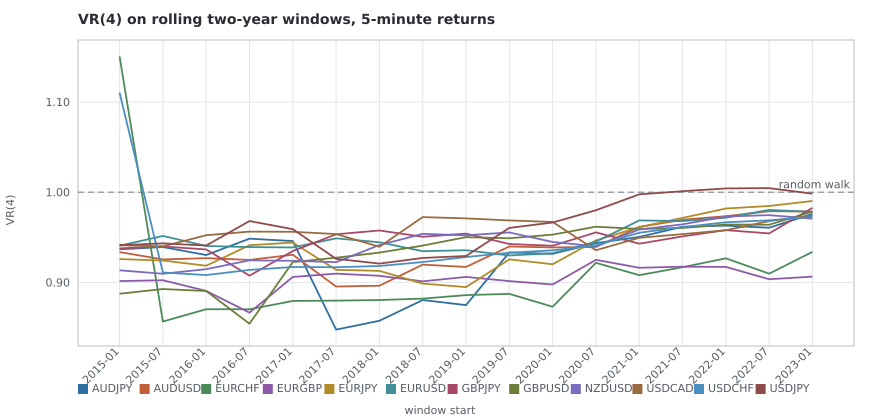

*Variance ratio at q=4 on rolling two-year windows of 5-minute returns. The dashed line is the random walk; a series that crosses it is a property that changed sign inside the decade.* — source table: [`T4/rolling_vr4_5m.csv`](T4/rolling_vr4_5m.csv)

### Rank stability

A statistic can hold its sign for every pair and still be useless for choosing *between* pairs, if the order it puts them in is noise. Spearman between the two halves' rankings asks that directly. A pair ranking that does not survive the split is a ranking no card downstream should select on.

| horizon | sd | excess kurtosis | ρ\|r\|(1) | VR(4) | ρ(1) | p(same sign) |
| --- | --- | --- | --- | --- | --- | --- |
| `5m` | 0.371 | 0.608 | 0.482 | -0.084 | 0.161 | 0.874 |
| `30m` | 0.622 | 0.531 | 0.469 | 0.531 | 0.524 | 0.615 |
| `1h` | 0.601 | 0.469 | 0.720 | 0.224 | 0.545 | 0.678 |
| `4h` | 0.657 | 0.063 | 0.469 | 0.217 | 0.469 | -0.147 |
| `1d` | 0.482 | 0.643 | 0.462 | 0.140 | 0.042 | -0.098 |

### Appendix — the full history, era-tagged

The same memory and volatility statistics on `1h` and `1d` bars back to 2005-01-03, to show which properties survive the 2000s. AUDUSD starts in 2011 by ruling R1 and the loader refuses the earlier dates rather than trusting this card to remember.

The era tags come from ruling R7's by-year agreement table, read out of the committed classification. An era is defined by **how well the cross-check could see the year**, not by how the year's statistics came out — which is the only ordering under which the split is not a search for the boundary that makes a property look stable. A `thin` year is not a year whose numbers are wrong; it is a year whose numbers have no second opinion.

| era | years | span | which |
| --- | --- | --- | --- |
| `corroborated` | 17 | 2009–2025 | 2009, 2010, 2011, 2012, 2013, 2014, 2015, 2016, 2017, 2018, 2019, 2020, 2021, 2022, 2023, 2024, 2025 |
| `partly-corroborated` | 1 | 2008–2008 | 2008 |
| `thin` | 3 | 2005–2007 | 2005, 2006, 2007 |

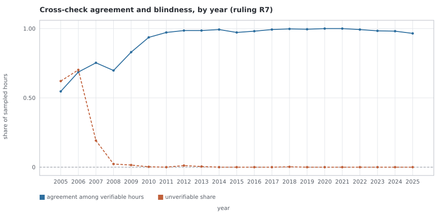

*Ruling R7's by-year cross-check agreement and the share of hours it could not verify. The era tags in the appendix come from the second series.* — source table: [`T4/agreement_by_year.csv`](T4/agreement_by_year.csv)

| year | sampled | `PASS` | `BLOCKED` | `UNVERIFIABLE` | agreement | unverifiable | era |
| --- | --- | --- | --- | --- | --- | --- | --- |
| 2005 | 396 | 82 | 68 | 246 | 54.7% | 62.1% | `thin` |
| 2006 | 396 | 81 | 37 | 278 | 68.6% | 70.2% | `thin` |
| 2007 | 396 | 241 | 79 | 76 | 75.3% | 19.2% | `thin` |
| 2008 | 396 | 270 | 117 | 9 | 69.8% | 2.3% | `partly-corroborated` |
| 2009 | 394 | 322 | 66 | 6 | 83.0% | 1.5% | `corroborated` |
| 2010 | 396 | 370 | 25 | 1 | 93.7% | 0.2% | `corroborated` |
| 2011 | 432 | 420 | 12 | 0 | 97.2% | 0.0% | `corroborated` |
| 2012 | 432 | 421 | 6 | 5 | 98.6% | 1.2% | `corroborated` |
| 2013 | 432 | 424 | 6 | 2 | 98.6% | 0.5% | `corroborated` |
| 2014 | 432 | 429 | 3 | 0 | 99.3% | 0.0% | `corroborated` |
| 2015 | 432 | 420 | 12 | 0 | 97.2% | 0.0% | `corroborated` |
| 2016 | 429 | 421 | 8 | 0 | 98.1% | 0.0% | `corroborated` |
| 2017 | 432 | 429 | 3 | 0 | 99.3% | 0.0% | `corroborated` |
| 2018 | 432 | 430 | 1 | 1 | 99.8% | 0.2% | `corroborated` |
| 2019 | 432 | 430 | 2 | 0 | 99.5% | 0.0% | `corroborated` |
| 2020 | 432 | 432 | 0 | 0 | 100.0% | 0.0% | `corroborated` |
| 2021 | 432 | 432 | 0 | 0 | 100.0% | 0.0% | `corroborated` |
| 2022 | 430 | 427 | 3 | 0 | 99.3% | 0.0% | `corroborated` |
| 2023 | 432 | 425 | 7 | 0 | 98.4% | 0.0% | `corroborated` |
| 2024 | 432 | 424 | 8 | 0 | 98.2% | 0.0% | `corroborated` |
| 2025 | 432 | 417 | 15 | 0 | 96.5% | 0.0% | `corroborated` |

#### `1d` over the full history

| pair | returns | VR(4) all | VR(4) corroborated | VR(4) partly-corroborated | VR(4) thin | same side | ρ\|r\|(1) all | ρ\|r\|(1) corroborated | ρ\|r\|(1) partly-corroborated | ρ\|r\|(1) thin | same side |
| --- | --- | --- | --- | --- | --- | --- | --- | --- | --- | --- | --- |
| `AUDJPY` | 5,257 | 0.9070 | 0.9701 | 0.7333 | 1.0056 | **no** | 0.3140 | 0.2055 | 0.3470 | 0.3702 | yes |
| `AUDUSD` | 3,692 | 0.9713 | 0.9713 | — | — | — | 0.0822 | 0.0822 | — | — | — |
| `EURCHF` | 5,257 | 0.9312 | 0.9391 | 0.8360 | 0.9025 | yes | 0.1903 | 0.1719 | 0.2860 | 0.0929 | yes |
| `EURGBP` | 5,257 | 1.0041 | 0.9893 | 0.9532 | 1.1188 | **no** | 0.2193 | 0.1920 | 0.3016 | 0.0591 | yes |
| `EURJPY` | 5,249 | 0.9133 | 0.9379 | 0.8305 | 0.8790 | yes | 0.2406 | 0.1863 | 0.2895 | 0.2781 | yes |
| `EURUSD` | 5,257 | 0.9831 | 0.9573 | 1.1822 | 0.9498 | **no** | 0.1508 | 0.1385 | 0.1869 | 0.0294 | yes |
| `GBPJPY` | 5,257 | 1.0004 | 1.0215 | 0.8663 | 0.9825 | **no** | 0.2543 | 0.1897 | 0.2983 | 0.3835 | yes |
| `GBPUSD` | 5,257 | 1.0366 | 1.0153 | 1.1527 | 1.0442 | yes | 0.1741 | 0.1691 | 0.1626 | 0.1010 | yes |
| `NZDUSD` | 5,257 | 0.9845 | 0.9712 | 0.9644 | 1.0803 | **no** | 0.1792 | 0.1386 | 0.2013 | 0.2168 | yes |
| `USDCAD` | 5,257 | 0.9841 | 0.9589 | 1.1415 | 0.9209 | **no** | 0.2141 | 0.1453 | 0.4416 | 0.0764 | yes |
| `USDCHF` | 5,257 | 0.9839 | 0.9711 | 1.0794 | 0.9807 | **no** | 0.0987 | 0.0793 | 0.1581 | 0.0618 | yes |
| `USDJPY` | 5,249 | 0.9376 | 0.9675 | 0.7288 | 0.9580 | yes | 0.1805 | 0.1664 | 0.1952 | 0.0435 | yes |

#### `1h` over the full history

| pair | returns | VR(4) all | VR(4) corroborated | VR(4) partly-corroborated | VR(4) thin | same side | ρ\|r\|(1) all | ρ\|r\|(1) corroborated | ρ\|r\|(1) partly-corroborated | ρ\|r\|(1) thin | same side |
| --- | --- | --- | --- | --- | --- | --- | --- | --- | --- | --- | --- |
| `AUDJPY` | 124,795 | 0.9652 | 0.9668 | 0.9742 | 0.9274 | yes | 0.3324 | 0.2745 | 0.3817 | 0.2774 | yes |
| `AUDUSD` | 87,528 | 0.9817 | 0.9817 | — | — | — | 0.2016 | 0.2016 | — | — | — |
| `EURCHF` | 124,793 | 0.9644 | 0.9686 | 0.9409 | 0.9069 | yes | 0.2700 | 0.2592 | 0.3068 | 0.2051 | yes |
| `EURGBP` | 124,792 | 0.9836 | 0.9903 | 0.9580 | 0.9434 | yes | 0.2912 | 0.2810 | 0.3059 | 0.2040 | yes |
| `EURJPY` | 124,445 | 0.9898 | 0.9912 | 0.9861 | 0.9859 | yes | 0.3072 | 0.2769 | 0.3711 | 0.2179 | yes |
| `EURUSD` | 124,800 | 0.9986 | 1.0005 | 0.9791 | 1.0083 | **no** | 0.2601 | 0.2522 | 0.3015 | 0.1701 | yes |
| `GBPJPY` | 124,793 | 0.9972 | 0.9970 | 1.0163 | 0.9513 | **no** | 0.3030 | 0.2703 | 0.3634 | 0.2471 | yes |
| `GBPUSD` | 124,791 | 0.9917 | 0.9938 | 0.9715 | 0.9997 | yes | 0.2806 | 0.2692 | 0.3466 | 0.1790 | yes |
| `NZDUSD` | 124,753 | 0.9502 | 0.9698 | 0.8701 | 0.9397 | yes | 0.2405 | 0.2032 | 0.3419 | 0.1940 | yes |
| `USDCAD` | 124,790 | 0.9591 | 0.9643 | 0.9579 | 0.9323 | yes | 0.2932 | 0.2736 | 0.3387 | 0.2105 | yes |
| `USDCHF` | 124,792 | 0.9798 | 0.9746 | 0.9890 | 1.0099 | **no** | 0.2372 | 0.2333 | 0.2256 | 0.1912 | yes |
| `USDJPY` | 124,442 | 0.9898 | 1.0007 | 0.9598 | 0.9560 | **no** | 0.2586 | 0.2513 | 0.2585 | 0.1865 | yes |

## 6 — Tick density, and whether it may be used as an activity proxy (ruling R4)

Ruling R4 forbids treating a tick count as a volume or activity proxy until a T4 card has characterised the series. This section is that characterisation, and it ends in a verdict rather than a table.

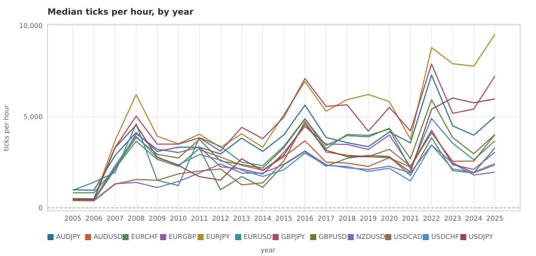

*Median ticks per hour by calendar year, full history. AUDUSD starts in 2011 by ruling R1.* — source table: [`T4/density_by_year.csv`](T4/density_by_year.csv)

| year | pairs | min ticks/hour | median | max | median spread inside the 3k-10k band |
| --- | --- | --- | --- | --- | --- |
| 2005 | 11 | 396 | 481 | 993 | 1.847 |
| 2006 | 11 | 380 | 459 | 1,408 | 1.847 |
| 2007 | 11 | 1,297 | 2,200 | 3,687 | 1.850 |
| 2008 | 11 | 1,395 | 4,065 | 6,213 | 2.151 |
| 2009 | 11 | 1,113 | 2,781 | 3,935 | 2.002 |
| 2010 | 11 | 1,220 | 2,357 | 3,509 | 1.721 |
| 2011 | 12 | 1,709 | 3,326 | 4,042 | 1.571 |
| 2012 | 12 | 991 | 2,627 | 3,365 | 1.347 |
| 2013 | 12 | 1,259 | 2,377 | 4,418 | 1.177 |
| 2014 | 12 | 1,131 | 2,070 | 3,795 | 0.843 |
| 2015 | 12 | 2,084 | 3,037 | 5,113 | 1.025 |
| 2016 | 12 | 3,002 | 4,737 | 7,091 | 1.021 |
| 2017 | 12 | 2,283 | 3,242 | 5,569 | 0.821 |
| 2018 | 12 | 2,195 | 3,481 | 5,938 | 0.875 |
| 2019 | 12 | 1,997 | 3,202 | 6,219 | 0.925 |
| 2020 | 12 | 2,169 | 3,998 | 5,827 | 0.873 |
| 2021 | 12 | 1,475 | 2,256 | 4,214 | 0.875 |
| 2022 | 12 | 3,448 | 4,902 | 8,792 | 1.219 |
| 2023 | 12 | 2,037 | 3,550 | 7,909 | 1.106 |
| 2024 | 12 | 1,797 | 2,637 | 7,773 | 0.970 |
| 2025 | 12 | 1,959 | 4,019 | 9,517 | 0.997 |

The spread column is band-controlled per ruling R3. Compare it with the uncontrolled series and the difference is the size of the instrument problem R3 exists to name.

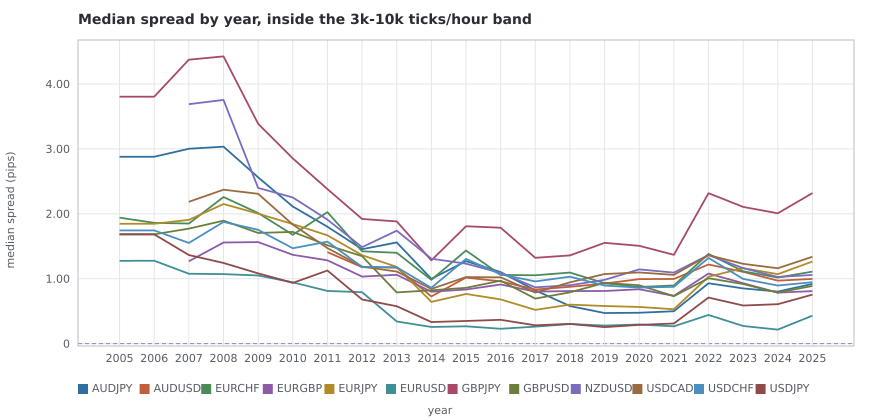

*Median spread by year measured only inside the 3k-10k ticks-per-hour band, which is ruling R3's control: a spread compared across eras must be compared at constant quote density.* — source table: [`T4/spread_by_year.csv`](T4/spread_by_year.csv)

### What density tracks

| pair | annual density vs vol (Spearman) | (Pearson, log) | bar-level log ticks vs log \|r\| | annual vs spread | annual vs band-controlled spread |
| --- | --- | --- | --- | --- | --- |
| `AUDJPY` | 0.229 | 0.218 | 0.181 | -0.467 | -0.467 |
| `AUDUSD` | 0.686 | 0.704 | 0.274 | 0.511 | 0.489 |
| `EURCHF` | 0.647 | 0.486 | 0.254 | 0.113 | 0.005 |
| `EURGBP` | 0.727 | 0.555 | 0.208 | 0.087 | 0.289 |
| `EURJPY` | 0.145 | 0.251 | 0.171 | -0.317 | -0.325 |
| `EURUSD` | 0.177 | 0.043 | 0.201 | -0.331 | -0.325 |
| `GBPJPY` | 0.313 | 0.330 | 0.199 | -0.426 | -0.414 |
| `GBPUSD` | 0.684 | 0.363 | 0.214 | -0.144 | -0.134 |
| `NZDUSD` | -0.212 | -0.178 | 0.167 | -0.579 | -0.489 |
| `USDCAD` | -0.083 | -0.132 | 0.173 | -0.518 | -0.397 |
| `USDCHF` | 0.406 | 0.186 | 0.205 | 0.320 | 0.365 |
| `USDJPY` | 0.365 | 0.334 | 0.187 | -0.156 | -0.170 |

Two correlations, two different answers. **Within a year, at bar level, density and volatility move together** — the log-tick to log-|return| correlation runs 0.17 to 0.27 across the twelve pairs, positive for every one. **Across years it collapses**, to between -0.21 and 0.73. That gap is the whole finding: the year-to-year level of the density series is set by the feed, and only its variation inside a year is set by the market.

### Structural breaks

The rule, stated rather than tuned: |d log median ticks per hour| > 3.0 x the store-wide median absolute year-over-year change. The scale is derived from the series being described — the store-wide median absolute year-over-year change is 0.260 in logs, so the threshold is 0.781. Choosing it against the answer is how a break list becomes a list of the years somebody expected.

| measure | value |
| --- | --- |
| pair-years examined | 234 |
| break candidates | 19 |
| years where at least half the universe moves | 2007 |

| pair | year | Δ log median ticks | ratio |
| --- | --- | --- | --- |
| `EURJPY` | 2007 | 2.097 | 8.14× |
| `USDJPY` | 2007 | 1.973 | 7.19× |
| `GBPJPY` | 2007 | 1.899 | 6.68× |
| `EURGBP` | 2007 | 1.637 | 5.14× |
| `GBPUSD` | 2007 | 1.630 | 5.11× |
| `USDCHF` | 2007 | 1.609 | 5.00× |
| `USDCAD` | 2007 | 1.228 | 3.41× |
| `EURCHF` | 2012 | -1.193 | 0.30× |
| `NZDUSD` | 2007 | 1.171 | 3.22× |
| `EURUSD` | 2011 | 1.152 | 3.16× |
| `EURUSD` | 2009 | -1.115 | 0.33× |
| `AUDJPY` | 2007 | 1.090 | 2.98× |
| `USDJPY` | 2022 | 1.013 | 2.75× |
| `EURCHF` | 2007 | 0.962 | 2.62× |
| `EURUSD` | 2008 | 0.864 | 2.37× |
| `USDCHF` | 2022 | 0.849 | 2.34× |
| `EURJPY` | 2022 | 0.847 | 2.33× |
| `EURUSD` | 2022 | 0.828 | 2.29× |
| `GBPUSD` | 2022 | 0.789 | 2.20× |

| year | pairs flagged |
| --- | --- |
| 2007 | 10 |
| 2008 | 1 |
| 2009 | 1 |
| 2011 | 1 |
| 2012 | 1 |
| 2022 | 5 |

### Verdict on ruling R4

**Tick count is usable as an activity proxy within a pair-year, and is not usable across years without one.** Concretely, three conditions, all of which the evidence above supports and none of which it establishes beyond the sampled window:

1. **Within a year and within a pair**, ticks per hour tracks realised volatility positively for every pair in the universe, at bar level. A statistic that conditions on density inside a year — a session comparison, an intraday regime, a liquidity filter — is reading the market.
2. **Across years, it is not.** The annual series is dominated by feed changes: 19 pair-years exceed a threshold set from the data's own dispersion, and one year moves at least half the universe at once, which no market event does to twelve currency pairs simultaneously with no volatility signature to match.
3. **Any cross-era comparison must hold density constant**, which is ruling R3 arriving from the other direction. The band-controlled spread column above is what that looks like in practice.

R4 asks for a characterisation before the proxy may be used. This is it, with its conditions attached. Whether the ruling is lifted, and in which of those three forms, is a checkpoint decision and not this card's.

## 7 — The unexplained empty dates T3 handed over

T3 found 312 dates carrying 963 empty trading hours that its holiday calendar does not explain, and passed them to this card as data facts rather than holidays. The first thing to say about them is that most of them are not facts about the data at all.

### The finding: a third of the list is the exclusion filter's own shadow

**236 of the 312 dates have no readable empty pair on them.** T3's classifier filters a date's empty pairs down to the ones research may read, and ruling R1 removes AUDUSD before 2011 — so a date on which *only* AUDUSD went quiet in 2008 survives as a row whose pair list is then empty, and is counted as an unexplained date. Every one of them falls in 2007–2010, which is where the exclusion window is.

That is an observation about T3's derivation, not a defect this card is authorised to fix: changing the classifier would change the committed holiday calendar, and the T4 card does not cover that. It is recorded here for the checkpoint, which is where the card says observations go.

**76 dates survive** as real. All 963 of the empty hours belong to them — the artefact rows carry none, which is exactly what makes them artefacts. The rest of this section is about the survivors.

### Classification

| class | dates | what the evidence supports |
| --- | --- | --- |
| `r1_artefact` | 236 | the only pair that went quiet was AUDUSD inside ruling R1's exclusion window, so the readable-pair filter emptied the row |
| `week_boundary` | 36 | a Sunday or Friday date at most three hours deep — the FX week edge, where the feed and the derived boundary need not agree to the hour |
| `calendar_holiday` | 7 | the static major-holiday list names the date |
| `currency_holiday` | 14 | every empty pair shares a currency, so that currency's own market was shut and the crosses kept trading |
| `feed_artefact` | 8 | at least half the readable universe went quiet, but too shallowly to be a market closure |
| `unknown` | 11 | none of the above, and the report says so rather than guessing |

Rolled up into the three buckets the card asks for:

| kind | dates |
| --- | --- |
| `partial holiday` | 21 |
| `feed artefact` | 44 |
| `bookkeeping artefact` | 236 |
| `unknown` | 11 |

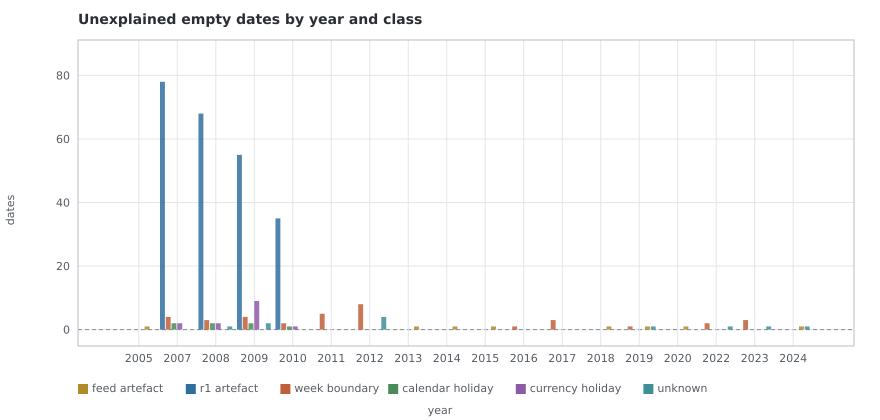

*Unexplained empty dates by year and class -- the 312 dates T3 handed to this card.* — source table: [`T4/empties_by_year.csv`](T4/empties_by_year.csv)

### By weekday

The single most informative cut, and it is not subtle:

| weekday | dates (all) |
| --- | --- |
| Mon | 11 |
| Tue | 14 |
| Wed | 10 |
| Thu | 13 |
| Fri | 118 |
| Sun | 146 |

Restricted to the dates with a readable empty pair:

| weekday | dates |
| --- | --- |
| Mon | 7 |
| Tue | 12 |
| Wed | 7 |
| Thu | 10 |
| Fri | 19 |
| Sun | 21 |

The FX week opens Sunday 17:00 New York and closes Friday 17:00, so those two days carry a handful of open hours each and the feed and the derived boundary need not agree about them to the hour. An empty hour there is the week edge, not a closure — which is why the classification treats a shallow Sunday or Friday date as a feed artefact rather than leaving it in the unknown pile.

### By year and by pair

| year | `r1_artefact` | `week_boundary` | `calendar_holiday` | `currency_holiday` | `feed_artefact` | `unknown` |
| --- | --- | --- | --- | --- | --- | --- |
| 2005 | 0 | 0 | 0 | 0 | 1 | 0 |
| 2007 | 78 | 4 | 2 | 2 | 0 | 0 |
| 2008 | 68 | 3 | 2 | 2 | 0 | 1 |
| 2009 | 55 | 4 | 2 | 9 | 0 | 2 |
| 2010 | 35 | 2 | 1 | 1 | 0 | 0 |
| 2011 | 0 | 5 | 0 | 0 | 0 | 0 |
| 2012 | 0 | 8 | 0 | 0 | 0 | 4 |
| 2013 | 0 | 0 | 0 | 0 | 1 | 0 |
| 2014 | 0 | 0 | 0 | 0 | 1 | 0 |
| 2015 | 0 | 0 | 0 | 0 | 1 | 0 |
| 2016 | 0 | 1 | 0 | 0 | 0 | 0 |
| 2017 | 0 | 3 | 0 | 0 | 0 | 0 |
| 2018 | 0 | 0 | 0 | 0 | 1 | 0 |
| 2019 | 0 | 1 | 0 | 0 | 1 | 1 |
| 2020 | 0 | 0 | 0 | 0 | 1 | 0 |
| 2022 | 0 | 2 | 0 | 0 | 0 | 1 |
| 2023 | 0 | 3 | 0 | 0 | 0 | 1 |
| 2024 | 0 | 0 | 0 | 0 | 1 | 1 |

| pair | dates | empty hours |
| --- | --- | --- |
| `EURJPY` | 62 | 340 |
| `USDJPY` | 60 | 338 |
| `NZDUSD` | 20 | 38 |
| `AUDUSD` | 20 | 35 |
| `AUDJPY` | 15 | 28 |
| `USDCAD` | 16 | 28 |
| `GBPJPY` | 15 | 27 |
| `GBPUSD` | 16 | 27 |
| `EURGBP` | 15 | 26 |
| `EURUSD` | 16 | 26 |
| `EURCHF` | 15 | 25 |
| `USDCHF` | 15 | 25 |

### The deepest of them

| date | weekday | pairs empty | empty hours | deepest pair | class | static holiday |
| --- | --- | --- | --- | --- | --- | --- |
| 2007-12-25 | Tue | 2 | 48 | 24 | `calendar_holiday` | Christmas Day |
| 2009-06-15 | Mon | 2 | 48 | 24 | `currency_holiday` | — |
| 2009-06-16 | Tue | 2 | 48 | 24 | `currency_holiday` | — |
| 2009-06-17 | Wed | 2 | 48 | 24 | `currency_holiday` | — |
| 2009-06-18 | Thu | 2 | 48 | 24 | `currency_holiday` | — |
| 2008-01-01 | Tue | 2 | 44 | 22 | `calendar_holiday` | New Year's Day |
| 2008-12-25 | Thu | 2 | 44 | 22 | `calendar_holiday` | Christmas Day |
| 2009-01-01 | Thu | 2 | 44 | 22 | `calendar_holiday` | New Year's Day |
| 2009-12-25 | Fri | 2 | 44 | 22 | `calendar_holiday` | Christmas Day |
| 2010-01-01 | Fri | 2 | 44 | 22 | `calendar_holiday` | New Year's Day |
| 2019-05-26 | Sun | 12 | 33 | 3 | `week_boundary` | — |
| 2009-06-19 | Fri | 2 | 28 | 14 | `currency_holiday` | — |
| 2015-12-31 | Thu | 12 | 24 | 2 | `feed_artefact` | — |
| 2017-12-31 | Sun | 12 | 24 | 2 | `week_boundary` | — |
| 2020-12-31 | Thu | 12 | 24 | 2 | `feed_artefact` | — |
| 2023-12-31 | Sun | 12 | 24 | 2 | `week_boundary` | — |
| 2024-12-31 | Tue | 12 | 24 | 2 | `feed_artefact` | — |
| 2018-12-31 | Mon | 12 | 23 | 2 | `feed_artefact` | — |
| 2005-01-18 | Tue | 11 | 22 | 2 | `feed_artefact` | — |
| 2019-12-31 | Tue | 12 | 22 | 2 | `feed_artefact` | — |

## Multiple testing, counted

**5 trial(s) are ledgered under this card** and this result registers **1,164 hypothesis tests** across 9 families. Both numbers matter and they are different numbers.

The T4 card asks for every test to be a ledgered trial. The ledger records *experiments* — one entry per run, written before the run — and filling it with three thousand individual z-statistics would destroy the thing it is for. So the tests are registered inside the hashed result instead, at the granularity that is actually needed: a test cannot be dropped from its family after its p-value has been seen, and the family has a size the report can state next to a claim. Every claim in the hypothesis section below carries both.

Benjamini-Hochberg runs within each family at FDR 0.05. BH rather than Bonferroni because the family is twelve pairs by five horizons of tests on overlapping data, where controlling the expected false-discovery proportion is the honest target and family-wise error is a target nothing would survive.

| family | tests | usable | BH threshold p | rejected | share |
| --- | --- | --- | --- | --- | --- |
| `forward_continuation` | 180 | 180 | 0.0110 | 64 | 35.6% |
| `jarque_bera` | 60 | 60 | <1e-16 | 60 | 100.0% |
| `regime_autocorr` | 180 | 180 | 0.0237 | 88 | 48.9% |
| `regime_continuation` | 180 | 180 | 0.0098 | 40 | 22.2% |
| `return_ljung_box` | 60 | 60 | 0.0168 | 46 | 76.7% |
| `session_autocorr` | 84 | 84 | 0.0290 | 52 | 61.9% |
| `sign_persistence` | 60 | 60 | 0.0393 | 48 | 80.0% |
| `variance_ratio` | 300 | 288 | 0.0072 | 45 | 15.6% |
| `volatility_ljung_box` | 60 | 60 | <1e-16 | 60 | 100.0% |

`jarque_bera` rejecting everything is the expected result and not a finding: at these sample sizes a normality test has the power to reject on the third decimal of a moment. It is in the table because a family excluded from the count is a family that stops being counted.

## The universe character table

Every pair at every horizon, ranked by the size of its variance-ratio departure from a random walk. The fingerprint is called `TREND` or `REVERT` only when the q=4 variance ratio survives the false-discovery correction across all 60 cells; otherwise it is `FLAT`, which means *this battery found no directional memory*, not that there is none.

**No pair is dropped or promoted by this table.** Stability sits beside the effect size as a label rather than being folded into a score, precisely so it cannot be read as a decision. The card is explicit that the decisions are the checkpoint's.

| pair | horizon | fingerprint | VR(4) | z | q | ρ(1) | p(same) | ρ\|r\|(1) | vol half-life | kurtosis | sd (bp) | spread (pips) | rolling agreement | stability | split-half same side |
| --- | --- | --- | --- | --- | --- | --- | --- | --- | --- | --- | --- | --- | --- | --- | --- |
| `EURCHF` | `30m` | **FLAT** | 0.9029 | -1.63 | 0.3653 | -0.0786 | 0.4706 | 0.231 | 12.2 | 17889.1 | 7.19 | 1.119 | 100% | `STABLE` | yes |
| `EURCHF` | `1d` | **FLAT** | 0.9044 | -1.15 | 0.6387 | -0.0110 | 0.4785 | 0.037 | 99.0 | 783.9 | 49.77 | 1.203 | 88% | `MOSTLY-STABLE` | yes |
| `EURGBP` | `5m` | **REVERT** | 0.9060 | -6.22 | 8.7e-09 | -0.0531 | 0.4764 | 0.317 | 37.8 | 776.7 | 3.10 | 0.889 | 100% | `STABLE` | yes |
| `EURCHF` | `5m` | **FLAT** | 1.0835 | 0.26 | 0.8978 | 0.0525 | 0.4754 | 0.553 | 7.3 | 65406.0 | 3.66 | 1.116 | 6% | `UNSTABLE` | **no** |
| `USDCHF` | `30m` | **FLAT** | 0.9203 | -1.78 | 0.2853 | -0.0611 | 0.4811 | 0.236 | 7.7 | 7686.6 | 8.78 | 1.037 | 100% | `STABLE` | yes |
| `AUDJPY` | `5m` | **REVERT** | 0.9322 | -3.14 | 0.0130 | -0.0401 | 0.4819 | 0.297 | 26.0 | 633.0 | 4.66 | 0.790 | 100% | `STABLE` | yes |
| `GBPUSD` | `5m` | **REVERT** | 0.9335 | -3.41 | 0.0058 | -0.0386 | 0.4835 | 0.313 | 34.2 | 853.2 | 3.62 | 0.905 | 100% | `STABLE` | yes |
| `GBPJPY` | `1d` | **FLAT** | 1.0642 | 1.03 | 0.6886 | 0.0271 | 0.5102 | 0.178 | 10.6 | 12.7 | 69.43 | 1.823 | 71% | `MIXED` | yes |
| `NZDUSD` | `1d` | **FLAT** | 0.9390 | -1.51 | 0.4424 | -0.0254 | 0.4977 | 0.074 | 37.9 | 1.5 | 65.74 | 1.133 | 59% | `UNSTABLE` | yes |
| `NZDUSD` | `5m` | **REVERT** | 0.9415 | -10.26 | <1e-16 | -0.0303 | 0.4874 | 0.257 | 21.3 | 59.3 | 4.22 | 1.093 | 100% | `STABLE` | yes |
| `AUDUSD` | `5m` | **REVERT** | 0.9434 | -7.26 | <1e-16 | -0.0319 | 0.4860 | 0.270 | 23.0 | 103.4 | 4.09 | 0.992 | 100% | `STABLE` | yes |
| `EURJPY` | `5m` | **REVERT** | 0.9438 | -3.54 | 0.0039 | -0.0360 | 0.4818 | 0.299 | 27.9 | 293.8 | 3.53 | 0.715 | 100% | `STABLE` | yes |
| `EURCHF` | `1h` | **FLAT** | 0.9446 | -1.09 | 0.6632 | -0.0608 | 0.4709 | 0.210 | 14.7 | 9277.5 | 10.08 | 1.125 | 100% | `STABLE` | yes |
| `GBPJPY` | `5m` | **REVERT** | 0.9484 | -3.40 | 0.0058 | -0.0305 | 0.4809 | 0.291 | 34.9 | 598.5 | 4.26 | 1.736 | 100% | `STABLE` | yes |
| `EURUSD` | `5m` | **REVERT** | 0.9504 | -7.79 | <1e-16 | -0.0294 | 0.4855 | 0.313 | 30.0 | 61.6 | 3.05 | 0.290 | 100% | `STABLE` | yes |
| `USDCAD` | `5m` | **REVERT** | 0.9527 | -9.15 | <1e-16 | -0.0287 | 0.4866 | 0.287 | 29.0 | 58.2 | 2.87 | 1.130 | 100% | `STABLE` | yes |
| `USDCHF` | `5m` | **FLAT** | 1.0456 | 0.19 | 0.9257 | 0.0156 | 0.4834 | 0.541 | 8.8 | 25089.5 | 4.05 | 1.034 | 6% | `UNSTABLE` | **no** |
| `GBPUSD` | `1d` | **FLAT** | 1.0448 | 0.74 | 0.7567 | 0.0311 | 0.5166 | 0.179 | 15.9 | 8.5 | 58.41 | 0.922 | 47% | `UNSTABLE` | yes |
| `EURJPY` | `1d` | **FLAT** | 0.9556 | -1.02 | 0.6886 | -0.0230 | 0.4996 | 0.127 | 16.9 | 4.1 | 56.74 | 0.733 | 100% | `STABLE` | yes |
| `USDCHF` | `1h` | **FLAT** | 0.9557 | -1.03 | 0.6886 | -0.0529 | 0.4817 | 0.226 | 8.9 | 3884.4 | 12.36 | 1.042 | 100% | `STABLE` | yes |
| `NZDUSD` | `30m` | **REVERT** | 0.9588 | -4.27 | 0.0002 | -0.0276 | 0.4848 | 0.209 | 14.7 | 22.8 | 10.06 | 1.099 | 100% | `STABLE` | yes |
| `EURGBP` | `30m` | **FLAT** | 0.9616 | -2.45 | 0.0798 | -0.0291 | 0.4716 | 0.285 | 5.4 | 57.4 | 7.22 | 0.891 | 94% | `STABLE` | yes |
| `GBPJPY` | `30m` | **FLAT** | 1.0351 | 1.30 | 0.5638 | 0.0118 | 0.4802 | 0.274 | 12.7 | 126.1 | 10.12 | 1.746 | 24% | `UNSTABLE` | **no** |
| `USDCAD` | `1d` | **FLAT** | 0.9668 | -0.76 | 0.7540 | 0.0004 | 0.4902 | 0.139 | 26.5 | 1.2 | 45.37 | 1.157 | 59% | `UNSTABLE` | **no** |
| `EURJPY` | `4h` | **FLAT** | 0.9674 | -0.59 | 0.8118 | -0.0460 | 0.4867 | 0.226 | 22.3 | 65.6 | 24.05 | 0.757 | 65% | `MIXED` | yes |
| `USDJPY` | `5m` | **FLAT** | 0.9674 | -2.50 | 0.0739 | -0.0202 | 0.4858 | 0.301 | 27.6 | 298.9 | 3.37 | 0.370 | 82% | `MOSTLY-STABLE` | yes |
| `USDCAD` | `30m` | **REVERT** | 0.9704 | -3.11 | 0.0141 | -0.0201 | 0.4836 | 0.256 | 4.4 | 23.7 | 6.89 | 1.135 | 100% | `STABLE` | yes |
| `GBPJPY` | `1h` | **FLAT** | 1.0276 | 0.86 | 0.7340 | 0.0113 | 0.4833 | 0.256 | 16.7 | 257.1 | 14.53 | 1.756 | 41% | `UNSTABLE` | **no** |
| `AUDUSD` | `1d` | **FLAT** | 0.9724 | -0.64 | 0.7977 | -0.0184 | 0.4883 | 0.087 | 41.0 | 1.4 | 63.61 | 1.009 | 65% | `MIXED` | yes |
| `AUDUSD` | `30m` | **FLAT** | 0.9759 | -2.14 | 0.1596 | -0.0164 | 0.4804 | 0.232 | 14.7 | 22.2 | 9.72 | 0.994 | 88% | `MOSTLY-STABLE` | yes |
| `AUDJPY` | `4h` | **FLAT** | 0.9769 | -0.66 | 0.7926 | -0.0267 | 0.4914 | 0.210 | 25.9 | 26.6 | 30.42 | 0.849 | 76% | `MOSTLY-STABLE` | yes |
| `EURUSD` | `4h` | **FLAT** | 0.9784 | -0.87 | 0.7340 | -0.0268 | 0.4877 | 0.178 | — | 15.3 | 20.59 | 0.297 | 65% | `MIXED` | yes |
| `USDCHF` | `1d` | **FLAT** | 0.9792 | -0.36 | 0.8876 | 0.0210 | 0.5000 | 0.050 | 14.8 | 295.9 | 59.28 | 1.089 | 41% | `UNSTABLE` | **no** |
| `EURCHF` | `4h` | **FLAT** | 1.0192 | 0.13 | 0.9422 | -0.0896 | 0.4841 | 0.205 | 6.5 | 2593.3 | 19.34 | 1.142 | 35% | `UNSTABLE` | **no** |
| `USDJPY` | `1h` | **FLAT** | 1.0192 | 1.14 | 0.6438 | 0.0062 | 0.4851 | 0.248 | 21.1 | 44.2 | 11.46 | 0.373 | 65% | `MIXED` | yes |
| `USDJPY` | `1d` | **FLAT** | 0.9810 | -0.41 | 0.8722 | -0.0091 | 0.4800 | 0.162 | 18.9 | 3.6 | 56.15 | 0.400 | 65% | `MIXED` | yes |
| `AUDUSD` | `1h` | **FLAT** | 0.9813 | -1.23 | 0.6036 | -0.0177 | 0.4873 | 0.212 | 22.2 | 20.5 | 13.73 | 0.996 | 88% | `MOSTLY-STABLE` | yes |
| `NZDUSD` | `1h` | **FLAT** | 0.9813 | -1.45 | 0.4776 | -0.0220 | 0.4889 | 0.188 | 24.4 | 15.8 | 14.10 | 1.103 | 100% | `STABLE` | yes |
| `EURGBP` | `1d` | **FLAT** | 1.0182 | 0.33 | 0.8876 | 0.0099 | 0.4890 | 0.187 | 22.8 | 5.5 | 47.86 | 0.923 | 18% | `UNSTABLE` | **no** |
| `EURJPY` | `30m` | **FLAT** | 1.0181 | 1.17 | 0.6357 | 0.0053 | 0.4810 | 0.258 | 12.3 | 46.6 | 8.36 | 0.715 | 41% | `UNSTABLE` | yes |
| `NZDUSD` | `4h` | **FLAT** | 1.0178 | 0.82 | 0.7340 | 0.0047 | 0.4987 | 0.118 | 93.6 | 9.0 | 27.34 | 1.125 | 82% | `MOSTLY-STABLE` | yes |
| `AUDJPY` | `1h` | **FLAT** | 0.9826 | -0.97 | 0.7046 | -0.0071 | 0.4877 | 0.237 | 24.4 | 55.0 | 15.54 | 0.805 | 53% | `UNSTABLE` | yes |
| `EURGBP` | `4h` | **FLAT** | 1.0155 | 0.48 | 0.8376 | -0.0029 | 0.4860 | 0.232 | — | 30.2 | 19.79 | 0.904 | 59% | `UNSTABLE` | **no** |
| `EURUSD` | `1d` | **FLAT** | 0.9847 | -0.35 | 0.8876 | 0.0063 | 0.4977 | 0.116 | 31.4 | 2.3 | 48.90 | 0.299 | 65% | `MIXED` | **no** |
| `EURGBP` | `1h` | **FLAT** | 0.9853 | -0.82 | 0.7340 | -0.0221 | 0.4785 | 0.290 | 1.5 | 55.8 | 10.11 | 0.895 | 82% | `MOSTLY-STABLE` | yes |
| `USDJPY` | `30m` | **FLAT** | 1.0125 | 0.96 | 0.7046 | 0.0032 | 0.4838 | 0.260 | 17.8 | 55.7 | 8.07 | 0.371 | 53% | `UNSTABLE` | yes |
| `AUDJPY` | `1d` | **FLAT** | 0.9877 | -0.27 | 0.8957 | -0.0163 | 0.4985 | 0.181 | 10.6 | 2.4 | 72.09 | 0.875 | 59% | `UNSTABLE` | yes |
| `USDCAD` | `1h` | **FLAT** | 0.9879 | -0.95 | 0.7046 | -0.0109 | 0.4831 | 0.244 | 1.6 | 14.8 | 9.68 | 1.139 | 59% | `UNSTABLE` | yes |
| `AUDJPY` | `30m` | **FLAT** | 0.9891 | -0.73 | 0.7589 | -0.0073 | 0.4812 | 0.266 | 23.4 | 51.6 | 10.94 | 0.798 | 59% | `UNSTABLE` | yes |
| `EURUSD` | `30m` | **FLAT** | 0.9893 | -1.04 | 0.6886 | -0.0143 | 0.4807 | 0.266 | 4.0 | 23.2 | 7.30 | 0.291 | 76% | `MOSTLY-STABLE` | **no** |
| `GBPUSD` | `1h` | **FLAT** | 1.0107 | 0.45 | 0.8464 | -0.0051 | 0.4834 | 0.272 | 9.8 | 118.8 | 12.16 | 0.909 | 47% | `UNSTABLE` | **no** |
| `EURJPY` | `1h` | **FLAT** | 1.0103 | 0.53 | 0.8194 | 0.0070 | 0.4824 | 0.246 | 16.2 | 77.0 | 11.96 | 0.719 | 47% | `UNSTABLE` | yes |
| `USDCHF` | `4h` | **FLAT** | 0.9917 | -0.07 | 0.9598 | -0.0757 | 0.4839 | 0.217 | 3.0 | 927.0 | 23.92 | 1.058 | 71% | `MIXED` | **no** |
| `GBPJPY` | `4h` | **FLAT** | 0.9922 | -0.10 | 0.9568 | -0.0350 | 0.4900 | 0.269 | 24.1 | 187.2 | 29.27 | 1.829 | 59% | `UNSTABLE` | **no** |
| `EURUSD` | `1h` | **FLAT** | 1.0078 | 0.56 | 0.8167 | -0.0032 | 0.4808 | 0.260 | 1.9 | 17.8 | 10.32 | 0.292 | 41% | `UNSTABLE` | **no** |
| `AUDUSD` | `4h` | **FLAT** | 1.0068 | 0.28 | 0.8876 | -0.0011 | 0.4942 | 0.131 | 27.5 | 10.8 | 26.73 | 1.010 | 71% | `MIXED` | yes |
| `GBPUSD` | `4h` | **FLAT** | 1.0044 | 0.09 | 0.9596 | -0.0155 | 0.4836 | 0.234 | — | 83.1 | 24.20 | 0.923 | 53% | `UNSTABLE` | yes |
| `USDCAD` | `4h` | **FLAT** | 0.9960 | -0.21 | 0.9204 | -0.0127 | 0.4903 | 0.146 | — | 7.8 | 18.91 | 1.159 | 53% | `UNSTABLE` | **no** |
| `USDJPY` | `4h` | **FLAT** | 1.0013 | 0.04 | 0.9751 | -0.0226 | 0.4908 | 0.191 | 31.9 | 26.0 | 23.07 | 0.401 | 53% | `UNSTABLE` | **no** |
| `GBPUSD` | `30m` | **FLAT** | 1.0000 | 0.00 | 0.9998 | -0.0093 | 0.4785 | 0.279 | 5.7 | 84.2 | 8.57 | 0.906 | 18% | `UNSTABLE` | **no** |

## What this implies about where edge might live

Questions for T7 cards, not answers. Each carries the size of the family its p-value came from, the trial count under this card, and the stability caveat that applies to it — because a hypothesis stated without those three is a hypothesis somebody will test on the strength of a number that was one of sixty.

Everything below rests on **5 ledgered trial(s)** under this card and on the **300-test** variance-ratio family, in which Benjamini-Hochberg rejects 45 at FDR 0.05.

### The horizons where directional memory survives correction

**`EURGBP` at `5m` — mean-reversion.** VR(4) = 0.9060 (z = -6.22, BH q = 8.7e-09 within a family of 300), ρ(1) = -0.0531, p(same sign) = 0.4764 over 759,104 returns. Stability: `STABLE` — it holds its sign in every rolling window measured, and the split-half sign agrees. By volatility tercile ρ(1) is -0.0749 (low), -0.0490 (mid), -0.0531 (high), strongest in the **low** one. By session it is strongest in **sydney** (ρ(1) = -0.1291, median spread 1.699 pips against 0.889 across all hours, 1,499 ticks/hour) — **and that is the caveat, not the opportunity**: the session where the reversion is largest is also the one where the spread is 1.9× the pair's own median. Returns here are mid-to-mid, so this is not bid-ask bounce in the textbook sense, but quote noise in a thin book produces the same signature and is equally untradeable. Whether the effect survives outside that session is the question, not whether it is biggest inside it. **Question for a T7 card:** does a mean-reversion rule at `5m` on `EURGBP` survive walk-forward validation once the round trip costs 0.889 pips of spread plus commission — and does restricting it to the regime and session above improve the net or merely shrink the sample? Strategy classes: mean-reversion, session-conditional, vol-conditional.

**`AUDJPY` at `5m` — mean-reversion.** VR(4) = 0.9322 (z = -3.14, BH q = 0.0130 within a family of 300), ρ(1) = -0.0401, p(same sign) = 0.4819 over 759,253 returns. Stability: `STABLE` — it holds its sign in every rolling window measured, and the split-half sign agrees. By volatility tercile ρ(1) is -0.0430 (low), -0.0306 (mid), -0.0427 (high), strongest in the **low** one. By session it is strongest in **sydney** (ρ(1) = -0.1254, median spread 1.596 pips against 0.790 across all hours, 2,262 ticks/hour) — **and that is the caveat, not the opportunity**: the session where the reversion is largest is also the one where the spread is 2.0× the pair's own median. Returns here are mid-to-mid, so this is not bid-ask bounce in the textbook sense, but quote noise in a thin book produces the same signature and is equally untradeable. Whether the effect survives outside that session is the question, not whether it is biggest inside it. **Question for a T7 card:** does a mean-reversion rule at `5m` on `AUDJPY` survive walk-forward validation once the round trip costs 0.790 pips of spread plus commission — and does restricting it to the regime and session above improve the net or merely shrink the sample? Strategy classes: mean-reversion, session-conditional, vol-conditional.

**`GBPUSD` at `5m` — mean-reversion.** VR(4) = 0.9335 (z = -3.41, BH q = 0.0058 within a family of 300), ρ(1) = -0.0386, p(same sign) = 0.4835 over 759,275 returns. Stability: `STABLE` — it holds its sign in every rolling window measured, and the split-half sign agrees. By volatility tercile ρ(1) is -0.0404 (low), -0.0248 (mid), -0.0425 (high), strongest in the **high** one. By session it is strongest in **sydney** (ρ(1) = -0.0823, median spread 1.797 pips against 0.905 across all hours, 1,584 ticks/hour) — **and that is the caveat, not the opportunity**: the session where the reversion is largest is also the one where the spread is 2.0× the pair's own median. Returns here are mid-to-mid, so this is not bid-ask bounce in the textbook sense, but quote noise in a thin book produces the same signature and is equally untradeable. Whether the effect survives outside that session is the question, not whether it is biggest inside it. **Question for a T7 card:** does a mean-reversion rule at `5m` on `GBPUSD` survive walk-forward validation once the round trip costs 0.905 pips of spread plus commission — and does restricting it to the regime and session above improve the net or merely shrink the sample? Strategy classes: mean-reversion, session-conditional, vol-conditional.

**`NZDUSD` at `5m` — mean-reversion.** VR(4) = 0.9415 (z = -10.26, BH q = <1e-16 within a family of 300), ρ(1) = -0.0303, p(same sign) = 0.4874 over 758,862 returns. Stability: `STABLE` — it holds its sign in every rolling window measured, and the split-half sign agrees. By volatility tercile ρ(1) is -0.0201 (low), -0.0301 (mid), -0.0324 (high), strongest in the **high** one. By session it is strongest in **sydney** (ρ(1) = -0.1179, median spread 1.757 pips against 1.093 across all hours, 1,100 ticks/hour) — **and that is the caveat, not the opportunity**: the session where the reversion is largest is also the one where the spread is 1.6× the pair's own median. Returns here are mid-to-mid, so this is not bid-ask bounce in the textbook sense, but quote noise in a thin book produces the same signature and is equally untradeable. Whether the effect survives outside that session is the question, not whether it is biggest inside it. **Question for a T7 card:** does a mean-reversion rule at `5m` on `NZDUSD` survive walk-forward validation once the round trip costs 1.093 pips of spread plus commission — and does restricting it to the regime and session above improve the net or merely shrink the sample? Strategy classes: mean-reversion, session-conditional, vol-conditional.

**`AUDUSD` at `5m` — mean-reversion.** VR(4) = 0.9434 (z = -7.26, BH q = <1e-16 within a family of 300), ρ(1) = -0.0319, p(same sign) = 0.4860 over 759,279 returns. Stability: `STABLE` — it holds its sign in every rolling window measured, and the split-half sign agrees. By volatility tercile ρ(1) is -0.0311 (low), -0.0268 (mid), -0.0341 (high), strongest in the **high** one. By session it is strongest in **sydney** (ρ(1) = -0.1766, median spread 1.385 pips against 0.992 across all hours, 1,230 ticks/hour) — **and that is the caveat, not the opportunity**: the session where the reversion is largest is also the one where the spread is 1.4× the pair's own median. Returns here are mid-to-mid, so this is not bid-ask bounce in the textbook sense, but quote noise in a thin book produces the same signature and is equally untradeable. Whether the effect survives outside that session is the question, not whether it is biggest inside it. **Question for a T7 card:** does a mean-reversion rule at `5m` on `AUDUSD` survive walk-forward validation once the round trip costs 0.992 pips of spread plus commission — and does restricting it to the regime and session above improve the net or merely shrink the sample? Strategy classes: mean-reversion, session-conditional, vol-conditional.

**`EURJPY` at `5m` — mean-reversion.** VR(4) = 0.9438 (z = -3.54, BH q = 0.0039 within a family of 300), ρ(1) = -0.0360, p(same sign) = 0.4818 over 758,706 returns. Stability: `STABLE` — it holds its sign in every rolling window measured, and the split-half sign agrees. By volatility tercile ρ(1) is -0.0406 (low), -0.0276 (mid), -0.0381 (high), strongest in the **low** one. By session it is strongest in **sydney** (ρ(1) = -0.0631, median spread 1.613 pips against 0.715 across all hours, 3,320 ticks/hour) — **and that is the caveat, not the opportunity**: the session where the reversion is largest is also the one where the spread is 2.3× the pair's own median. Returns here are mid-to-mid, so this is not bid-ask bounce in the textbook sense, but quote noise in a thin book produces the same signature and is equally untradeable. Whether the effect survives outside that session is the question, not whether it is biggest inside it. **Question for a T7 card:** does a mean-reversion rule at `5m` on `EURJPY` survive walk-forward validation once the round trip costs 0.715 pips of spread plus commission — and does restricting it to the regime and session above improve the net or merely shrink the sample? Strategy classes: mean-reversion, session-conditional, vol-conditional.

**`GBPJPY` at `5m` — mean-reversion.** VR(4) = 0.9484 (z = -3.40, BH q = 0.0058 within a family of 300), ρ(1) = -0.0305, p(same sign) = 0.4809 over 758,589 returns. Stability: `STABLE` — it holds its sign in every rolling window measured, and the split-half sign agrees. By volatility tercile ρ(1) is -0.0403 (low), -0.0257 (mid), -0.0310 (high), strongest in the **low** one. By session it is strongest in **sydney** (ρ(1) = -0.0646, median spread 3.388 pips against 1.736 across all hours, 2,642 ticks/hour) — **and that is the caveat, not the opportunity**: the session where the reversion is largest is also the one where the spread is 2.0× the pair's own median. Returns here are mid-to-mid, so this is not bid-ask bounce in the textbook sense, but quote noise in a thin book produces the same signature and is equally untradeable. Whether the effect survives outside that session is the question, not whether it is biggest inside it. **Question for a T7 card:** does a mean-reversion rule at `5m` on `GBPJPY` survive walk-forward validation once the round trip costs 1.736 pips of spread plus commission — and does restricting it to the regime and session above improve the net or merely shrink the sample? Strategy classes: mean-reversion, session-conditional, vol-conditional.

**`EURUSD` at `5m` — mean-reversion.** VR(4) = 0.9504 (z = -7.79, BH q = <1e-16 within a family of 300), ρ(1) = -0.0294, p(same sign) = 0.4855 over 759,420 returns. Stability: `STABLE` — it holds its sign in every rolling window measured, and the split-half sign agrees. By volatility tercile ρ(1) is -0.0355 (low), -0.0250 (mid), -0.0302 (high), strongest in the **low** one. By session it is strongest in **sydney** (ρ(1) = -0.1050, median spread 0.611 pips against 0.290 across all hours, 1,454 ticks/hour) — **and that is the caveat, not the opportunity**: the session where the reversion is largest is also the one where the spread is 2.1× the pair's own median. Returns here are mid-to-mid, so this is not bid-ask bounce in the textbook sense, but quote noise in a thin book produces the same signature and is equally untradeable. Whether the effect survives outside that session is the question, not whether it is biggest inside it. **Question for a T7 card:** does a mean-reversion rule at `5m` on `EURUSD` survive walk-forward validation once the round trip costs 0.290 pips of spread plus commission — and does restricting it to the regime and session above improve the net or merely shrink the sample? Strategy classes: mean-reversion, session-conditional, vol-conditional.

**`USDCAD` at `5m` — mean-reversion.** VR(4) = 0.9527 (z = -9.15, BH q = <1e-16 within a family of 300), ρ(1) = -0.0287, p(same sign) = 0.4866 over 759,094 returns. Stability: `STABLE` — it holds its sign in every rolling window measured, and the split-half sign agrees. By volatility tercile ρ(1) is -0.0290 (low), -0.0278 (mid), -0.0290 (high), strongest in the **high** one. By session it is strongest in **sydney** (ρ(1) = -0.1825, median spread 1.918 pips against 1.130 across all hours, 1,189 ticks/hour) — **and that is the caveat, not the opportunity**: the session where the reversion is largest is also the one where the spread is 1.7× the pair's own median. Returns here are mid-to-mid, so this is not bid-ask bounce in the textbook sense, but quote noise in a thin book produces the same signature and is equally untradeable. Whether the effect survives outside that session is the question, not whether it is biggest inside it. **Question for a T7 card:** does a mean-reversion rule at `5m` on `USDCAD` survive walk-forward validation once the round trip costs 1.130 pips of spread plus commission — and does restricting it to the regime and session above improve the net or merely shrink the sample? Strategy classes: mean-reversion, session-conditional, vol-conditional.

**`NZDUSD` at `30m` — mean-reversion.** VR(4) = 0.9588 (z = -4.27, BH q = 0.0002 within a family of 300), ρ(1) = -0.0276, p(same sign) = 0.4848 over 126,130 returns. Stability: `STABLE` — it holds its sign in every rolling window measured, and the split-half sign agrees. By volatility tercile ρ(1) is -0.0196 (low), -0.0174 (mid), -0.0345 (high), strongest in the **high** one. By session it is strongest in **sydney** (ρ(1) = -0.1179, median spread 1.757 pips against 1.099 across all hours, 1,100 ticks/hour) — **and that is the caveat, not the opportunity**: the session where the reversion is largest is also the one where the spread is 1.6× the pair's own median. Returns here are mid-to-mid, so this is not bid-ask bounce in the textbook sense, but quote noise in a thin book produces the same signature and is equally untradeable. Whether the effect survives outside that session is the question, not whether it is biggest inside it. **Question for a T7 card:** does a mean-reversion rule at `30m` on `NZDUSD` survive walk-forward validation once the round trip costs 1.099 pips of spread plus commission — and does restricting it to the regime and session above improve the net or merely shrink the sample? Strategy classes: mean-reversion, session-conditional, vol-conditional.

**`USDCAD` at `30m` — mean-reversion.** VR(4) = 0.9704 (z = -3.11, BH q = 0.0141 within a family of 300), ρ(1) = -0.0201, p(same sign) = 0.4836 over 126,146 returns. Stability: `STABLE` — it holds its sign in every rolling window measured, and the split-half sign agrees. By volatility tercile ρ(1) is -0.0205 (low), -0.0245 (mid), -0.0186 (high), strongest in the **mid** one. By session it is strongest in **sydney** (ρ(1) = -0.1825, median spread 1.918 pips against 1.135 across all hours, 1,189 ticks/hour) — **and that is the caveat, not the opportunity**: the session where the reversion is largest is also the one where the spread is 1.7× the pair's own median. Returns here are mid-to-mid, so this is not bid-ask bounce in the textbook sense, but quote noise in a thin book produces the same signature and is equally untradeable. Whether the effect survives outside that session is the question, not whether it is biggest inside it. **Question for a T7 card:** does a mean-reversion rule at `30m` on `USDCAD` survive walk-forward validation once the round trip costs 1.135 pips of spread plus commission — and does restricting it to the regime and session above improve the net or merely shrink the sample? Strategy classes: mean-reversion, session-conditional, vol-conditional.

### Where it does not

49 of 60 cells are `FLAT`, and no cell at `1h`, `4h`, `1d` survives at all. The reading a T7 card should take from that is narrow and specific: **unconditional linear memory in returns is not where the edge is** at these horizons, for these pairs, over this decade. It says nothing about conditional memory, about non-linear structure, or about cross-pair structure, which is T6's question and not asked here.

### The strongest regularity in the battery is not directional

**Volatility clustering, every pair, every horizon.** The |return| autocorrelation is positive at lag 1 in every one of 60 cells, with a half-life between 1.5 bars (`EURGBP|1h`) and 99.0 (`EURCHF|1d`). Its Ljung-Box family has 60 tests and BH rejects 60. It flips sign between halves in 0 cells — which is the point: this is the one property in the battery that does not change its mind.

**Question for a T7 card:** since the forecastable quantity is the size of the move rather than its direction, is the right use of this a *sizing* rule rather than an *entry* rule — position scaled inversely to forecast volatility, on top of whatever entry the directional evidence supports? That is a different experiment from a volatility strategy and a much cheaper one, because it changes the size of trades a rule was going to make anyway rather than making new ones. Strategy classes: vol-conditional sizing, vol-conditional filtering.

The caveat is the same one that applies everywhere here: 5 ledgered trial(s), and clustering is the most-documented regularity in financial time series, so finding it is a check that the pipeline works rather than a discovery.

### Session structure is a cost story before it is a signal story

Across 12 pairs and five derived sessions, the cheapest median spread anywhere is 0.265 pips (`EURUSD` in london ny overlap) and the dearest is 3.388 (`GBPJPY` in sydney) — a factor of 12.8. The session autocorrelation family has 84 tests and BH rejects 52, so session-conditional *memory* exists; but the spread spread, so to speak, is much the larger number.

The roll window is the extreme case: at its worst, `USDJPY` pays 2.95× the spread for 0.52× the volatility. **Question for a T7 card:** is a session restriction better modelled as an execution constraint — trade only where the spread is in its own cheapest band — than as a signal condition? The two look identical in a backtest and differ completely in what they claim, and only the first survives being wrong about the signal. Strategy classes: session-conditional execution, session-conditional entry.

Caveat: 5 ledgered trial(s); the session boundaries are derived rather than fitted, but which session is cheapest for a pair is a ranking, and section 5's rank-stability table is where to check whether it survives the split before any card selects on it.

### Memory changes with the regime, and the direction of the change is not the same everywhere

The regime autocorrelation family has 180 tests with BH rejecting 88; the regime continuation family has 180 with 40. The difference between high-volatility and low-volatility lag-1 autocorrelation runs from -0.1618 (`EURCHF|4h`) to 0.1594 (`USDCHF|1d`) — it changes sign across the universe, which means there is no single statement of the form *FX reverts more when it is quiet* that holds for every pair.

**Question for a T7 card:** for the pairs where the regime difference is large and stable, does conditioning entry on the trailing-volatility tercile improve out-of-sample net P&L, or does it merely cut the sample by two thirds and the cost base by less? The second is the failure mode, and it looks like success in-sample. Strategy classes: vol-conditional entry, vol-conditional sizing.

Caveat: 5 ledgered trial(s), and the regime label is a tercile boundary estimated on the same decade — a T7 card must re-estimate it inside each training window or it has fitted the regime to the test set, which is precisely the leak the walk-forward harness exists to catch.

### What would falsify each of these

Stated now, before any of them is tested, because a hypothesis whose falsification condition is written after the result is not one:

| hypothesis class | what would kill it |
| --- | --- |
| short-horizon mean reversion | a walk-forward whose out-of-sample net P&L at 1.5× costs is below zero, which given the median spread in the character table is where this one most likely dies — the effect is measured in fractions of a basis point and the round trip is measured in pips |
| volatility-conditional sizing | a regime split whose out-of-sample volatility ordering does not hold, or a strategy whose edge disappears once position size is the only thing conditioned on |
| session-conditional execution | session boundaries whose effect does not survive being re-derived on the second half, or a spread advantage that vanishes once ruling R3's density control is applied |
| roll-window avoidance | nothing in this card — pre-reg #4 already excludes it, and the evidence here supports the exclusion rather than testing it |

The first row is the honest headline. Every directional effect this battery found is small enough that T5's cost geometry, not T4's statistics, will decide whether any of it is tradeable — which is exactly what the next card is for.

## Provenance

* Config: `experiments/T4-character/config.toml` (sha256 `bde2558543c9663c`)
* Bars: `data/research/bars/timeframe=<TF>/pair=<PAIR>/`, read only through `research.loader.ResearchLoader` in `scoring` mode, which is what enforces the seal and ruling R1 on every date served.
* Manifests: `data/research/manifests/pair=<PAIR>/<YYYY-MM>/manifest.json` for section 7, read the canonical way (SPEC2 §The canonical manifest reading) through the same `research.calendar_build` code T3 used.
* Cross-check classes: `config/crosscheck.toml`, derived under ruling R7 and re-derived and compared on every run of the T3 experiment. The appendix era tags come from it.
* Result: `experiments/T4-character/result.json`, hash `7b8fdf506b78f2e9827a572a8060a2694d6707d8368c7eb5f20a1e4201ef978f`
* Figures: 19 under `T4/`, each beside the CSV of the numbers it was drawn from. Both are regenerated from `result.json` by `python -m research.character_report`.
* Loader mode `scoring`, scored `False`, re-run class `full`. It served 84 file(s) across 12 pair(s), 5 timeframe(s) and 6307 date(s); sealed dates served: none; calendar dates withheld by an exclusion window: 2,189 across 1 pair(s) — ruling R1, the appendix window this card asked AUDUSD for and did not get.
* Research gate: exit 0 (full, 2026-09-06)

