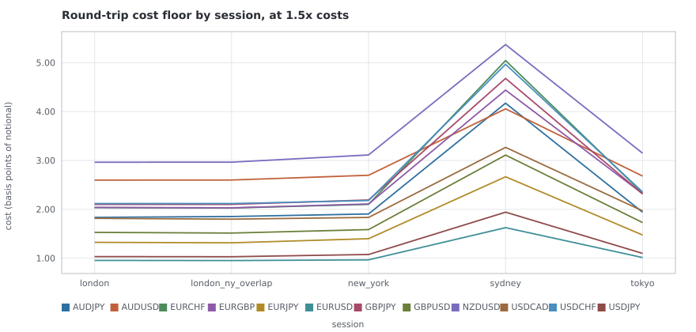
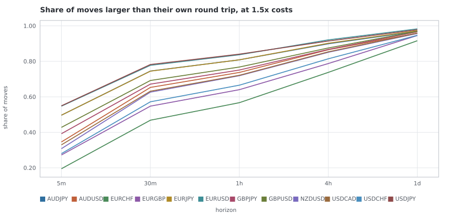
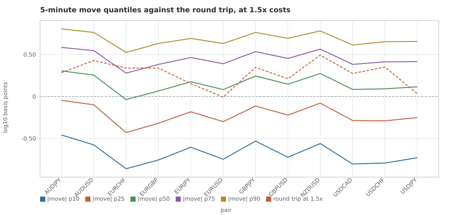
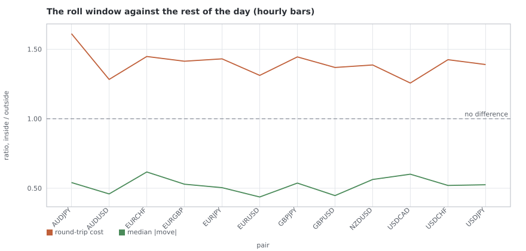
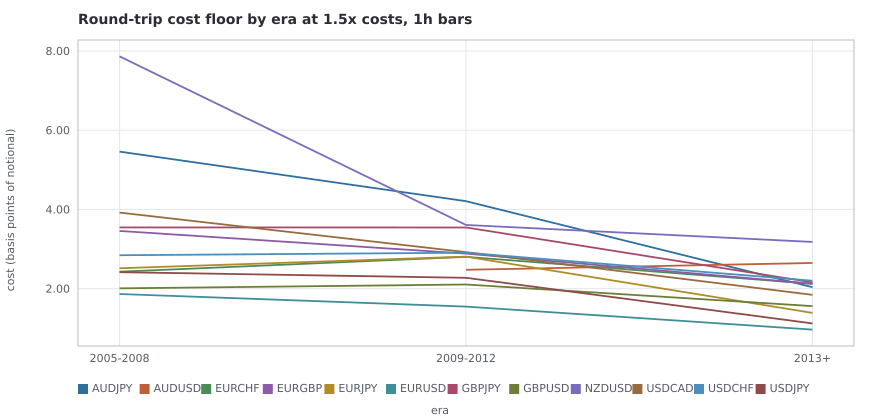
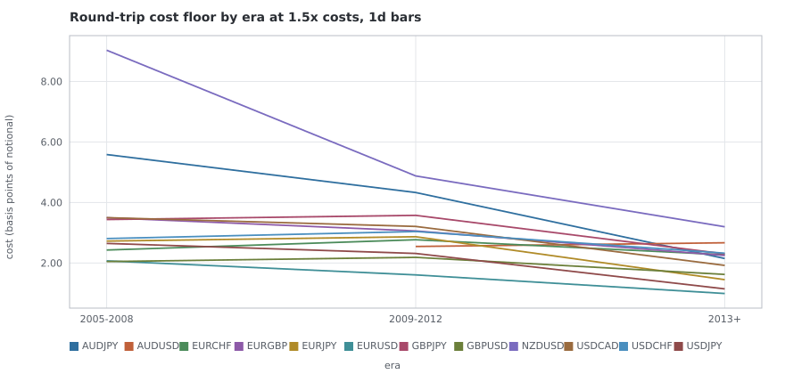

# T5 — EDA battery II: cost geometry

**Primary window:** 2015-01-01 → 2025-02-28, 12 pairs, horizons `5m`, `30m`, `1h`, `4h`, `1d` · **Era section:** 2005-01-03 → 2025-02-28 on `1h`, `1d` · **Task card:** `taskcards/T5.md` · **Experiment:** `T5-cost-geometry` · **Seed:** 20260906 · **Result hash:** `c4194024c1e4ec98`

**Trials ledgered under T5:** 3 (SPEC2 pre-reg #10).

This card measures what the twelve pairs **cost** and puts it beside what T4 measured them to **be**. Everything in it is arithmetic and a map: no backtest, no scorecard, no candidate advanced or killed, and no claim anywhere that an edge exists. Pre-registered decision #3 puts those decisions in chat, between cards.

**Every cost figure here comes out of `fxlab.costs.IBCostModel`.** Not one pip figure is typed into the experiment or into this report. `research.costs` builds two quotes from stored bars, hands them to the model and hands the answer back; the ladder rungs are the model's own `cost_multiplier`, and the experiment measures rather than assumes that a rung scales the finished cost exactly.

### What the battery found, in five sentences

1. **The rule the card names is closed everywhere; the upper bound is not.** On `|ρ(1)| × sd` — what a rule trading the measured autocorrelation would earn — **11 of 11** D2 cells are closed in every variant tested, the round trip costing 10× to 24× the edge. Under the variance-ratio *upper bound*, which credits a rule with every basis point of variance the reversion removed, **7 survive** the 1.5× bar and **1 is parked**. The two measures differ by 12× to 17×, and section 4 argues the bound is the wrong number to plan on.
2. **Session is the largest lever in the card, and it is a cost lever.** The dearest session costs up to 2.49× the cheapest one *within the same pair*, against directional effects T4 measured in hundredths of a basis point. Decision D3's execution constraint is quantified in section 1.
3. **The horizon ladder is the other lever.** One round trip is one round trip however long the position is held, while the median move grows with the holding period — so move-over-cost rises at every step of the ladder for **12 of 12** pairs. The shortest horizon that clears its own cost is in section 3.
4. **The ranked map has 456 cells and the top of it is not where the memory is.** The best `5m` cell ranks 202 of 456 and its worst ranks 456; the best `1d` cell ranks 1. T4 found every one of its variance-ratio survivors at `5m` and `30m`, which are the dearest horizons to trade relative to what they move.
5. **The pre-2013 evidence points one way.** On `1h` bars the 2005-2008 era costs 1.37× what `2013+` costs at the survival bar, and the cross-check could not verify 38.5% of the hours it sampled there, agreeing with 69.1% of the ones it could. The recommendation and the rule that produced it are at the end of this report, and the decision is the checkpoint's.

The honest one-line summary: **T4 found the direction, and T5 finds the round trip costs about an order of magnitude more than trading that direction earns** — unless a rule can extract the whole of the reverting component, which is what the bound assumes and no rule does.

## The decisions and rulings this card is shaped by

A ruling listed without its consequence is decoration, so each is stated with where it actually bites.

| decision | statement | where it bites here |
| --- | --- | --- |
| **pre-reg #1** | the cost ladder is 1.0, 1.2, 1.5, 2.0× and the survival bar is 1.5× | every table carries the full ladder; every verdict in section 4 is the bar's, and no second threshold is added anywhere |
| **pre-reg #4** | the roll window is excluded from execution | section 5 quantifies it; the roll window is excluded from the ranked map, because a window nothing may trade in is not a place edge can survive |
| **R3** | spread comparisons across eras must control for ticks per hour | section 6 reports every era inside the `3k-10k` band and the uncontrolled figure beside it, and section 1 carries a density column so a session comparison can be checked for being a density comparison |
| **R8** | the static major-holiday list is the eligibility rule; the empties-derived calendar is informational | stated, not applied — this card runs no backtest. Step 0 repaired the informational component and re-issued T3 |
| **D1** | T4 is the universe-character baseline; nothing promoted or dropped | all twelve pairs and all five horizons are measured; nothing here drops one either |
| **D2** | the eleven T4 reversion cells are this card's formal cost-geometry test set | section 4 verdicts every one of them and adds none. The set is in `experiments/T5-cost-geometry/config.toml`, written before any cost was computed |
| **D3** | T7 inherits four overlays, not entries | section 1 quantifies the cheapest-spread band as an execution constraint; section 4 tests every cell inside it |
| **P0-A** | USD accounting is unfixed | the caveat is stated under every table, and the reference size is chosen so no figure here depends on the one term the defect touches |

### How a cost is produced

A round trip is two orders. Entry crosses to the ask and pays its commission; exit crosses back to the bid and pays its own. Gross P&L is measured mid to mid — the Phase 1 accounting convention — so both crossings are an explicit cost line rather than a haircut hidden in a fill price, which is the only reason a cost can be put beside a return distribution at all.

The comparison is in **basis points of notional**, which is the break-even move: a trade whose gross mid-to-mid return is smaller than this loses money by arithmetic, before any question of whether the move was forecastable.

| choice | value | why |
| --- | --- | --- |
| cost model | `fxlab.costs.IBCostModel` | the Phase 1 model, unchanged. This card changes no cost parameter and no validation rule |
| commission rate | 2e-05 (0.20 bp per order) | IB tier 1, declared in `[experiment.costs]` and carried in the hashed result |
| per-order minimum | USD 2.00 | the one currency-sensitive term in the model, and the whole of P0-A |
| reference size | 1,000,000 units | far above the size at which the minimum binds for any pair, so no figure in this report depends on the term P0-A would change |
| spread source | the entry bar's mean spread for the entry leg, the exit bar's for the exit leg | using one bar's spread twice would understate the cost of exactly the moments the spread is moving |
| ladder | 1.0×, 1.2×, 1.5×, 2.0× | applied as the model's own `cost_multiplier`, not as a multiplication in a report |
| volatility regime | terciles of the standard deviation of the previous 20 returns | strictly backward-looking, as in T4: bucketing a return by a volatility estimate containing it would make every regime finding circular |
| session grain | `1h` bars; session statistics only at `5m`, `30m`, `1h` | a 4-hour bar spans two sessions and a daily bar spans all of them, so a session statistic there would describe the label rather than the market |
| variance-ratio aggregation | q = 4 | the rung T4's fingerprint and its false-discovery correction were computed on; a bound taken at a different q would bound a different claim from the one D2 pre-registered |

### Two things the experiment measures rather than assumes

**That a ladder rung scales the finished cost exactly.** Every per-move cost here is priced once at 1.0× and multiplied, which is only legitimate if `cost_multiplier` scales both cost lines including the floor. The experiment asks the model, on a grid that deliberately includes sizes small enough for the floor to bind:

| check | result |
| --- | --- |
| grid points priced | 6 |
| of those, with the per-order floor binding | 5 |
| worst relative disagreement between a rung and the scaled base | 0 |
| within tolerance | yes |

**That the reference size is above the floor.** The notional at which the commission rate overtakes the per-order minimum is found by bisection on the model itself, not by dividing its parameters:

| quantity | value |
| --- | --- |
| notional where the rate overtakes the floor (quote currency) | 100,000 |
| priced moves at or below it | **0** |

> **P0-A caveat.** 8 of the twelve pairs above are not USD-quoted (`USDJPY`, `USDCHF`, `USDCAD`, `EURGBP`, `EURJPY`, `GBPJPY`, `EURCHF`, `AUDJPY`), and SPEC2 prerequisite P0-A is **unfixed**: commission is floored against a quote-currency notional and cross-pair P&L is summed without conversion. Every cost in this table is a ratio of two quote-currency quantities and is therefore currency-free; the one currency-sensitive term is the USD 2.00 per-order floor, which binds on **0** of the priced moves at this card's reference size of 1,000,000 units. Commission is reported in the quote currency, as the model computes it.

## 1 — The round-trip cost floor

What it costs to get in and out once, before anything is known about where the price goes. Everything else in this report is measured against these numbers.

The two cost columns are separate medians over the same moves, so they need not add to the total column exactly — the median of a sum is not the sum of the medians, and rounding them into agreement would be inventing a number.

Read them apart all the same. The **commission** is a constant 0.20 bp per order — 0.40 bp for the round trip — at every size above the floor and in every session and era; it is the same number for `EURUSD` in the London overlap and for `GBPJPY` in Sydney. The **spread** is everything that varies. So a pair's cost geometry is its spread geometry plus a constant, and every difference between two cells below is a difference in the spread.

### Unconditional, on hourly bars

| pair | bars | median spread (pips) | p90 spread | median ticks | spread cost (bp) | commission (bp) | cost @ 1.0× (bp) | cost @ 1.2× (bp) | cost @ 1.5× (bp) | cost @ 2.0× (bp) | p90 cost @ 1.5× (bp) |
| --- | --- | --- | --- | --- | --- | --- | --- | --- | --- | --- | --- |
| `AUDJPY` | 62,810 | 0.801 | 1.403 | 4,211 | 0.9055 | 0.4000 | 1.3054 | 1.5665 | 1.9581 | 2.6109 | 3.1939 |
| `AUDUSD` | 62,810 | 0.995 | 1.343 | 2,643 | 1.3979 | 0.4000 | 1.7979 | 2.1575 | 2.6968 | 3.5958 | 3.6665 |
| `EURCHF` | 62,804 | 1.122 | 2.088 | 2,513 | 1.0682 | 0.4000 | 1.4682 | 1.7618 | 2.2023 | 2.9364 | 3.9139 |
| `EURGBP` | 62,810 | 0.893 | 1.490 | 3,167 | 1.0669 | 0.4000 | 1.4669 | 1.7603 | 2.2003 | 2.9338 | 3.4398 |
| `EURJPY` | 62,812 | 0.715 | 1.440 | 6,210 | 0.5587 | 0.4000 | 0.9587 | 1.1504 | 1.4380 | 1.9174 | 2.2153 |
| `EURUSD` | 62,814 | 0.292 | 0.502 | 3,584 | 0.2588 | 0.4000 | 0.6588 | 0.7905 | 0.9882 | 1.3176 | 1.3557 |
| `GBPJPY` | 62,810 | 1.749 | 2.942 | 5,537 | 1.0931 | 0.4000 | 1.4932 | 1.7918 | 2.2397 | 2.9863 | 3.6911 |
| `GBPUSD` | 62,809 | 0.906 | 1.478 | 3,785 | 0.6919 | 0.4000 | 1.0919 | 1.3102 | 1.6378 | 2.1837 | 2.4964 |
| `NZDUSD` | 62,805 | 1.101 | 1.589 | 2,358 | 1.6933 | 0.4000 | 2.0934 | 2.5121 | 3.1401 | 4.1868 | 4.5582 |
| `USDCAD` | 62,810 | 1.137 | 1.712 | 3,008 | 0.8651 | 0.4000 | 1.2651 | 1.5181 | 1.8976 | 2.5301 | 2.6790 |
| `USDCHF` | 62,805 | 1.039 | 1.773 | 2,248 | 1.1047 | 0.4000 | 1.5048 | 1.8058 | 2.2572 | 3.0096 | 3.7326 |
| `USDJPY` | 62,811 | 0.371 | 0.832 | 3,527 | 0.3283 | 0.4000 | 0.7283 | 0.8740 | 1.0924 | 1.4566 | 1.6175 |

> **P0-A caveat.** 8 of the twelve pairs above are not USD-quoted (`USDJPY`, `USDCHF`, `USDCAD`, `EURGBP`, `EURJPY`, `GBPJPY`, `EURCHF`, `AUDJPY`), and SPEC2 prerequisite P0-A is **unfixed**: commission is floored against a quote-currency notional and cross-pair P&L is summed without conversion. Every cost in this table is a ratio of two quote-currency quantities and is therefore currency-free; the one currency-sensitive term is the USD 2.00 per-order floor, which binds on **0** of the priced moves at this card's reference size of 1,000,000 units. Commission is reported in the quote currency, as the model computes it.

*The round-trip cost floor by session at the 1.5x rung, on hourly bars, in basis points of notional. This is decision D3's execution constraint as a picture: the cheapest band per pair is the low point of its line.* — source table: [`T5/cost_floor_by_session.csv`](T5/cost_floor_by_session.csv)

### By session

The session boundaries are **derived** from each centre's own local clock, so they move with British Summer Time and US daylight saving independently, as they do in reality. The density column is there because ruling R3 says a spread comparison that does not hold ticks per hour still is partly a comparison of tick counts.

| pair | session | returns | median spread (pips) | p90 spread | median ticks | cost @ 1.0× (bp) | cost @ 1.2× (bp) | cost @ 1.5× (bp) | cost @ 2.0× (bp) | median \|move\| (bp) | move / cost @ 1.5× |
| --- | --- | --- | --- | --- | --- | --- | --- | --- | --- | --- | --- |
| `AUDJPY` | london | 13,015 | 0.737 | 1.204 | 4,682 | 1.2232 | 1.4679 | 1.8348 | 2.4465 | 7.235 | 3.94 |
| `AUDJPY` | london ny overlap | 8,081 | 0.751 | 1.239 | 7,270 | 1.2353 | 1.4824 | 1.8530 | 2.4707 | 9.557 | 5.16 |
| `AUDJPY` | new york | 15,652 | 0.791 | 1.395 | 3,615 | 1.2698 | 1.5237 | 1.9047 | 2.5396 | 5.586 | 2.93 |
| `AUDJPY` | sydney | 6,442 | 1.488 | 4.776 | 2,348 | 2.7812 | 3.3374 | 4.1718 | 5.5624 | 4.714 | 1.13 |
| `AUDJPY` | tokyo | 19,620 | 0.792 | 1.276 | 3,999 | 1.2937 | 1.5525 | 1.9406 | 2.5875 | 7.450 | 3.84 |
| `AUDUSD` | london | 13,015 | 0.952 | 1.148 | 3,011 | 1.7320 | 2.0784 | 2.5980 | 3.4640 | 7.154 | 2.75 |
| `AUDUSD` | london ny overlap | 8,081 | 0.954 | 1.159 | 4,656 | 1.7330 | 2.0796 | 2.5995 | 3.4660 | 10.164 | 3.91 |
| `AUDUSD` | new york | 15,650 | 1.010 | 1.353 | 2,308 | 1.7979 | 2.1574 | 2.6968 | 3.5957 | 5.230 | 1.94 |
| `AUDUSD` | sydney | 6,445 | 1.329 | 3.017 | 1,284 | 2.7042 | 3.2451 | 4.0563 | 5.4085 | 3.776 | 0.93 |
| `AUDUSD` | tokyo | 19,619 | 0.983 | 1.202 | 2,486 | 1.7869 | 2.1443 | 2.6804 | 3.5738 | 6.585 | 2.46 |
| `EURCHF` | london | 13,015 | 1.011 | 1.358 | 3,619 | 1.3567 | 1.6281 | 2.0351 | 2.7135 | 4.910 | 2.41 |
| `EURCHF` | london ny overlap | 8,081 | 1.003 | 1.392 | 5,171 | 1.3508 | 1.6210 | 2.0263 | 2.7017 | 5.636 | 2.78 |
| `EURCHF` | new york | 15,650 | 1.079 | 1.723 | 2,348 | 1.4009 | 1.6811 | 2.1014 | 2.8018 | 2.961 | 1.41 |
| `EURCHF` | sydney | 6,444 | 2.336 | 7.071 | 1,170 | 3.3628 | 4.0353 | 5.0441 | 6.7255 | 1.760 | 0.35 |
| `EURCHF` | tokyo | 19,614 | 1.198 | 1.893 | 1,652 | 1.5555 | 1.8665 | 2.3332 | 3.1109 | 2.242 | 0.96 |
| `EURGBP` | london | 13,015 | 0.810 | 1.009 | 4,712 | 1.3590 | 1.6308 | 2.0385 | 2.7180 | 6.831 | 3.35 |
| `EURGBP` | london ny overlap | 8,081 | 0.801 | 1.019 | 6,028 | 1.3538 | 1.6245 | 2.0307 | 2.7075 | 7.523 | 3.70 |
| `EURGBP` | new york | 15,650 | 0.867 | 1.327 | 2,984 | 1.4061 | 1.6874 | 2.1092 | 2.8123 | 3.625 | 1.72 |
| `EURGBP` | sydney | 6,444 | 1.614 | 4.691 | 1,533 | 2.9592 | 3.5511 | 4.4389 | 5.9185 | 1.984 | 0.45 |
| `EURGBP` | tokyo | 19,620 | 0.958 | 1.247 | 2,090 | 1.5467 | 1.8560 | 2.3200 | 3.0934 | 2.737 | 1.18 |
| `EURJPY` | london | 13,015 | 0.600 | 1.197 | 7,332 | 0.8829 | 1.0595 | 1.3244 | 1.7658 | 6.574 | 4.96 |
| `EURJPY` | london ny overlap | 8,081 | 0.596 | 1.205 | 9,884 | 0.8763 | 1.0516 | 1.3145 | 1.7527 | 8.307 | 6.32 |
| `EURJPY` | new york | 15,650 | 0.716 | 1.346 | 5,515 | 0.9326 | 1.1192 | 1.3990 | 1.8653 | 4.264 | 3.05 |
| `EURJPY` | sydney | 6,444 | 1.481 | 4.703 | 3,467 | 1.7775 | 2.1330 | 2.6662 | 3.5549 | 3.143 | 1.18 |
| `EURJPY` | tokyo | 19,622 | 0.725 | 1.345 | 5,454 | 0.9826 | 1.1791 | 1.4739 | 1.9652 | 4.750 | 3.22 |
| `EURUSD` | london | 13,015 | 0.266 | 0.371 | 4,947 | 0.6366 | 0.7640 | 0.9550 | 1.2733 | 6.008 | 6.29 |
| `EURUSD` | london ny overlap | 8,081 | 0.265 | 0.366 | 7,082 | 0.6344 | 0.7613 | 0.9516 | 1.2688 | 8.280 | 8.70 |
| `EURUSD` | new york | 15,650 | 0.280 | 0.471 | 3,386 | 0.6439 | 0.7726 | 0.9658 | 1.2877 | 4.148 | 4.29 |
| `EURUSD` | sydney | 6,446 | 0.572 | 1.679 | 1,492 | 1.0832 | 1.2998 | 1.6247 | 2.1663 | 1.957 | 1.20 |
| `EURUSD` | tokyo | 19,622 | 0.307 | 0.449 | 2,563 | 0.6753 | 0.8104 | 1.0130 | 1.3507 | 3.422 | 3.38 |
| `GBPJPY` | london | 13,015 | 1.550 | 2.250 | 7,027 | 1.4003 | 1.6804 | 2.1005 | 2.8007 | 8.247 | 3.93 |
| `GBPJPY` | london ny overlap | 8,081 | 1.549 | 2.366 | 9,858 | 1.4007 | 1.6809 | 2.1011 | 2.8015 | 9.677 | 4.61 |
| `GBPJPY` | new york | 15,650 | 1.765 | 2.691 | 4,880 | 1.4609 | 1.7531 | 2.1913 | 2.9218 | 5.080 | 2.32 |
| `GBPJPY` | sydney | 6,444 | 3.137 | 9.702 | 2,728 | 3.1191 | 3.7429 | 4.6786 | 6.2382 | 3.674 | 0.79 |
| `GBPJPY` | tokyo | 19,620 | 1.749 | 2.598 | 4,451 | 1.5430 | 1.8516 | 2.3145 | 3.0859 | 5.221 | 2.26 |
| `GBPUSD` | london | 13,015 | 0.812 | 1.037 | 5,311 | 1.0187 | 1.2224 | 1.5280 | 2.0374 | 7.569 | 4.95 |
| `GBPUSD` | london ny overlap | 8,081 | 0.802 | 1.045 | 7,224 | 1.0095 | 1.2114 | 1.5142 | 2.0189 | 9.361 | 6.18 |
| `GBPUSD` | new york | 15,650 | 0.884 | 1.347 | 3,477 | 1.0567 | 1.2680 | 1.5850 | 2.1133 | 4.636 | 2.92 |
| `GBPUSD` | sydney | 6,444 | 1.693 | 4.432 | 1,639 | 2.0732 | 2.4878 | 3.1097 | 4.1463 | 2.191 | 0.70 |
| `GBPUSD` | tokyo | 19,619 | 0.977 | 1.296 | 2,695 | 1.1528 | 1.3834 | 1.7292 | 2.3056 | 3.714 | 2.15 |
| `NZDUSD` | london | 13,015 | 1.040 | 1.291 | 2,683 | 1.9757 | 2.3708 | 2.9635 | 3.9514 | 7.378 | 2.49 |
| `NZDUSD` | london ny overlap | 8,081 | 1.043 | 1.323 | 4,151 | 1.9765 | 2.3718 | 2.9648 | 3.9530 | 10.124 | 3.41 |
| `NZDUSD` | new york | 15,652 | 1.121 | 1.592 | 2,036 | 2.0752 | 2.4903 | 3.1128 | 4.1504 | 5.773 | 1.85 |
| `NZDUSD` | sydney | 6,443 | 1.659 | 3.962 | 1,156 | 3.5807 | 4.2968 | 5.3710 | 7.1614 | 4.670 | 0.87 |
| `NZDUSD` | tokyo | 19,614 | 1.103 | 1.437 | 2,201 | 2.0989 | 2.5187 | 3.1484 | 4.1978 | 6.705 | 2.13 |
| `USDCAD` | london | 13,015 | 1.057 | 1.300 | 3,438 | 1.2103 | 1.4523 | 1.8154 | 2.4205 | 4.891 | 2.69 |
| `USDCAD` | london ny overlap | 8,081 | 1.048 | 1.305 | 6,322 | 1.1992 | 1.4391 | 1.7989 | 2.3985 | 8.503 | 4.73 |
| `USDCAD` | new york | 15,650 | 1.101 | 1.544 | 3,483 | 1.2226 | 1.4671 | 1.8338 | 2.4451 | 4.907 | 2.68 |
| `USDCAD` | sydney | 6,443 | 1.828 | 4.468 | 1,235 | 2.1784 | 2.6140 | 3.2675 | 4.3567 | 2.316 | 0.71 |
| `USDCAD` | tokyo | 19,621 | 1.192 | 1.488 | 2,187 | 1.3122 | 1.5747 | 1.9684 | 2.6245 | 3.268 | 1.66 |
| `USDCHF` | london | 13,016 | 0.944 | 1.280 | 3,149 | 1.4120 | 1.6944 | 2.1181 | 2.8241 | 6.413 | 3.03 |
| `USDCHF` | london ny overlap | 8,081 | 0.951 | 1.292 | 4,791 | 1.4118 | 1.6942 | 2.1178 | 2.8237 | 8.624 | 4.07 |
| `USDCHF` | new york | 15,650 | 1.009 | 1.557 | 2,057 | 1.4533 | 1.7439 | 2.1799 | 2.9066 | 4.419 | 2.03 |
| `USDCHF` | sydney | 6,444 | 1.970 | 6.164 | 949 | 3.3119 | 3.9743 | 4.9678 | 6.6238 | 2.248 | 0.45 |
| `USDCHF` | tokyo | 19,614 | 1.102 | 1.666 | 1,430 | 1.5705 | 1.8846 | 2.3557 | 3.1409 | 3.360 | 1.43 |
| `USDJPY` | london | 13,015 | 0.322 | 0.663 | 3,874 | 0.6884 | 0.8260 | 1.0326 | 1.3767 | 4.928 | 4.77 |
| `USDJPY` | london ny overlap | 8,081 | 0.317 | 0.688 | 6,010 | 0.6866 | 0.8239 | 1.0299 | 1.3732 | 7.801 | 7.57 |
| `USDJPY` | new york | 15,650 | 0.376 | 0.768 | 3,018 | 0.7170 | 0.8604 | 1.0755 | 1.4340 | 4.028 | 3.75 |
| `USDJPY` | sydney | 6,443 | 0.825 | 2.549 | 2,013 | 1.2943 | 1.5532 | 1.9415 | 2.5887 | 3.088 | 1.59 |
| `USDJPY` | tokyo | 19,622 | 0.364 | 0.785 | 3,323 | 0.7317 | 0.8781 | 1.0976 | 1.4635 | 4.535 | 4.13 |

> **P0-A caveat.** 8 of the twelve pairs above are not USD-quoted (`USDJPY`, `USDCHF`, `USDCAD`, `EURGBP`, `EURJPY`, `GBPJPY`, `EURCHF`, `AUDJPY`), and SPEC2 prerequisite P0-A is **unfixed**: commission is floored against a quote-currency notional and cross-pair P&L is summed without conversion. Every cost in this table is a ratio of two quote-currency quantities and is therefore currency-free; the one currency-sensitive term is the USD 2.00 per-order floor, which binds on **0** of the priced moves at this card's reference size of 1,000,000 units. Commission is reported in the quote currency, as the model computes it.

### By volatility tercile

The regime label uses only returns strictly before the one it labels. The interesting column is the last one: the high-volatility tercile is where the moves are, and the spread does not widen nearly as fast as the move does, so it is also where the arithmetic is most favourable — which is the opposite of where T4 found the strongest reversion in most pairs.

| pair | tercile | returns | median spread (pips) | median ticks | cost @ 1.5× (bp) | median \|move\| (bp) | move / cost @ 1.5× | share of moves above cost |
| --- | --- | --- | --- | --- | --- | --- | --- | --- |
| `AUDJPY` | high | 20,930 | 0.966 | 5,345 | 2.2815 | 9.322 | 4.09 | 84.6% |
| `AUDJPY` | low | 20,930 | 0.676 | 3,425 | 1.7690 | 5.163 | 2.92 | 77.1% |
| `AUDJPY` | mid | 20,930 | 0.783 | 4,133 | 1.9334 | 6.612 | 3.42 | 80.9% |
| `AUDUSD` | high | 20,930 | 1.057 | 3,318 | 2.8939 | 8.076 | 2.79 | 77.8% |
| `AUDUSD` | low | 20,930 | 0.943 | 2,188 | 2.6065 | 5.022 | 1.93 | 69.1% |
| `AUDUSD` | mid | 20,930 | 0.989 | 2,623 | 2.6767 | 6.246 | 2.33 | 74.3% |
| `EURCHF` | high | 20,928 | 1.285 | 2,863 | 2.4562 | 3.950 | 1.61 | 60.3% |
| `EURCHF` | low | 20,928 | 1.024 | 2,303 | 2.0553 | 2.468 | 1.20 | 53.8% |
| `EURCHF` | mid | 20,928 | 1.109 | 2,417 | 2.1852 | 2.922 | 1.34 | 56.1% |
| `EURGBP` | high | 20,930 | 0.959 | 3,742 | 2.3548 | 4.925 | 2.09 | 69.1% |
| `EURGBP` | low | 20,930 | 0.834 | 2,719 | 2.0660 | 3.022 | 1.46 | 59.6% |
| `EURGBP` | mid | 20,930 | 0.898 | 3,156 | 2.1945 | 3.676 | 1.67 | 63.5% |
| `EURJPY` | high | 20,931 | 0.871 | 7,467 | 1.5793 | 6.877 | 4.35 | 84.5% |
| `EURJPY` | low | 20,931 | 0.609 | 5,247 | 1.3290 | 3.817 | 2.87 | 77.0% |
| `EURJPY` | mid | 20,930 | 0.697 | 6,182 | 1.4176 | 5.104 | 3.60 | 81.1% |
| `EURUSD` | high | 20,931 | 0.317 | 4,063 | 1.0261 | 5.419 | 5.28 | 86.5% |
| `EURUSD` | low | 20,932 | 0.273 | 3,202 | 0.9626 | 3.424 | 3.56 | 81.1% |
| `EURUSD` | mid | 20,931 | 0.294 | 3,563 | 0.9884 | 4.037 | 4.08 | 83.5% |
| `GBPJPY` | high | 20,930 | 1.933 | 6,783 | 2.4238 | 7.774 | 3.21 | 79.3% |
| `GBPJPY` | low | 20,930 | 1.639 | 4,668 | 2.1358 | 4.710 | 2.21 | 71.1% |
| `GBPJPY` | mid | 20,930 | 1.688 | 5,388 | 2.2124 | 5.642 | 2.55 | 74.9% |
| `GBPUSD` | high | 20,930 | 1.023 | 4,426 | 1.7831 | 5.629 | 3.16 | 78.5% |
| `GBPUSD` | low | 20,930 | 0.832 | 3,419 | 1.5504 | 4.223 | 2.72 | 75.7% |
| `GBPUSD` | mid | 20,929 | 0.897 | 3,674 | 1.6245 | 4.573 | 2.82 | 76.2% |
| `NZDUSD` | high | 20,928 | 1.214 | 2,876 | 3.3794 | 8.434 | 2.50 | 76.1% |
| `NZDUSD` | low | 20,929 | 1.022 | 1,969 | 2.9479 | 5.436 | 1.84 | 68.1% |
| `NZDUSD` | mid | 20,928 | 1.095 | 2,331 | 3.1236 | 6.503 | 2.08 | 71.6% |
| `USDCAD` | high | 20,930 | 1.175 | 3,431 | 1.9614 | 5.251 | 2.68 | 76.6% |
| `USDCAD` | low | 20,930 | 1.124 | 2,754 | 1.8648 | 3.457 | 1.85 | 67.8% |
| `USDCAD` | mid | 20,930 | 1.126 | 2,928 | 1.8939 | 4.090 | 2.16 | 72.1% |
| `USDCHF` | high | 20,928 | 1.199 | 2,544 | 2.4972 | 5.336 | 2.14 | 68.7% |
| `USDCHF` | low | 20,929 | 0.962 | 2,090 | 2.1416 | 3.798 | 1.77 | 65.4% |
| `USDCHF` | mid | 20,928 | 1.020 | 2,172 | 2.2338 | 4.106 | 1.84 | 65.7% |
| `USDJPY` | high | 20,930 | 0.532 | 5,225 | 1.2237 | 6.778 | 5.54 | 88.1% |
| `USDJPY` | low | 20,931 | 0.306 | 2,545 | 1.0184 | 3.216 | 3.16 | 79.4% |
| `USDJPY` | mid | 20,930 | 0.356 | 3,430 | 1.0760 | 4.616 | 4.29 | 84.7% |

> **P0-A caveat.** 8 of the twelve pairs above are not USD-quoted (`USDJPY`, `USDCHF`, `USDCAD`, `EURGBP`, `EURJPY`, `GBPJPY`, `EURCHF`, `AUDJPY`), and SPEC2 prerequisite P0-A is **unfixed**: commission is floored against a quote-currency notional and cross-pair P&L is summed without conversion. Every cost in this table is a ratio of two quote-currency quantities and is therefore currency-free; the one currency-sensitive term is the USD 2.00 per-order floor, which binds on **0** of the priced moves at this card's reference size of 1,000,000 units. Commission is reported in the quote currency, as the model computes it.

### Session × tercile

The card asks for the floor by pair × session × volatility tercile, and this is it. It is long, and the whole of it is in `result.json`; the first 40 rows are here.

| pair | session | tercile | returns | median spread (pips) | cost @ 1.5× (bp) | median \|move\| (bp) | move / cost @ 1.5× |
| --- | --- | --- | --- | --- | --- | --- | --- |
| `AUDJPY` | london ny overlap | high | 2,449 | 0.910 | 2.1379 | 13.453 | 6.29 |
| `AUDJPY` | london ny overlap | low | 2,990 | 0.608 | 1.6517 | 7.357 | 4.45 |
| `AUDJPY` | london ny overlap | mid | 2,639 | 0.748 | 1.8626 | 9.528 | 5.12 |
| `AUDJPY` | london | high | 4,418 | 0.875 | 2.0815 | 9.995 | 4.80 |
| `AUDJPY` | london | low | 4,397 | 0.585 | 1.6217 | 5.504 | 3.39 |
| `AUDJPY` | london | mid | 4,195 | 0.724 | 1.8207 | 7.084 | 3.89 |
| `AUDJPY` | new york | high | 5,587 | 0.943 | 2.1573 | 7.853 | 3.64 |
| `AUDJPY` | new york | low | 4,624 | 0.679 | 1.7262 | 4.006 | 2.32 |
| `AUDJPY` | new york | mid | 5,438 | 0.764 | 1.8660 | 5.463 | 2.93 |
| `AUDJPY` | sydney | high | 2,046 | 1.737 | 4.6245 | 6.561 | 1.42 |
| `AUDJPY` | sydney | low | 2,278 | 1.216 | 3.8168 | 3.826 | 1.00 |
| `AUDJPY` | sydney | mid | 2,117 | 1.477 | 4.1222 | 4.498 | 1.09 |
| `AUDJPY` | tokyo | high | 6,430 | 0.982 | 2.3074 | 10.179 | 4.41 |
| `AUDJPY` | tokyo | low | 6,641 | 0.660 | 1.7567 | 5.803 | 3.30 |
| `AUDJPY` | tokyo | mid | 6,541 | 0.777 | 1.9197 | 7.359 | 3.83 |
| `AUDUSD` | london ny overlap | high | 2,225 | 1.024 | 2.7611 | 13.691 | 4.96 |
| `AUDUSD` | london ny overlap | low | 3,210 | 0.911 | 2.5296 | 8.136 | 3.22 |
| `AUDUSD` | london ny overlap | mid | 2,643 | 0.961 | 2.6013 | 10.534 | 4.05 |
| `AUDUSD` | london | high | 4,085 | 1.014 | 2.7470 | 9.462 | 3.44 |
| `AUDUSD` | london | low | 4,641 | 0.907 | 2.5282 | 5.611 | 2.22 |
| `AUDUSD` | london | mid | 4,284 | 0.951 | 2.5837 | 7.322 | 2.83 |
| `AUDUSD` | new york | high | 5,807 | 1.069 | 2.8693 | 6.913 | 2.41 |
| `AUDUSD` | new york | low | 4,519 | 0.958 | 2.6047 | 3.815 | 1.46 |
| `AUDUSD` | new york | mid | 5,321 | 0.999 | 2.6612 | 5.163 | 1.94 |
| `AUDUSD` | sydney | high | 2,225 | 1.503 | 4.4249 | 4.736 | 1.07 |
| `AUDUSD` | sydney | low | 2,091 | 1.192 | 3.7416 | 3.057 | 0.82 |
| `AUDUSD` | sydney | mid | 2,128 | 1.310 | 3.9979 | 3.661 | 0.92 |
| `AUDUSD` | tokyo | high | 6,588 | 1.037 | 2.8624 | 8.326 | 2.91 |
| `AUDUSD` | tokyo | low | 6,469 | 0.939 | 2.6107 | 5.326 | 2.04 |
| `AUDUSD` | tokyo | mid | 6,554 | 0.979 | 2.6612 | 6.576 | 2.47 |
| `EURCHF` | london ny overlap | high | 2,171 | 1.135 | 2.2416 | 7.893 | 3.52 |
| `EURCHF` | london ny overlap | low | 3,251 | 0.938 | 1.9037 | 4.343 | 2.28 |
| `EURCHF` | london ny overlap | mid | 2,656 | 1.008 | 2.0263 | 5.890 | 2.91 |
| `EURCHF` | london | high | 3,654 | 1.141 | 2.2533 | 6.962 | 3.09 |
| `EURCHF` | london | low | 5,252 | 0.943 | 1.9215 | 3.784 | 1.97 |
| `EURCHF` | london | mid | 4,104 | 1.012 | 2.0393 | 5.046 | 2.47 |
| `EURCHF` | new york | high | 5,793 | 1.180 | 2.2442 | 4.077 | 1.82 |
| `EURCHF` | new york | low | 4,477 | 0.985 | 1.9639 | 2.209 | 1.12 |
| `EURCHF` | new york | mid | 5,377 | 1.057 | 2.0861 | 2.770 | 1.33 |
| `EURCHF` | sydney | high | 2,496 | 2.721 | 5.5992 | 2.190 | 0.39 |

_First 40 of 180 cells; the whole table is in `result.json`._

> **P0-A caveat.** 8 of the twelve pairs above are not USD-quoted (`USDJPY`, `USDCHF`, `USDCAD`, `EURGBP`, `EURJPY`, `GBPJPY`, `EURCHF`, `AUDJPY`), and SPEC2 prerequisite P0-A is **unfixed**: commission is floored against a quote-currency notional and cross-pair P&L is summed without conversion. Every cost in this table is a ratio of two quote-currency quantities and is therefore currency-free; the one currency-sensitive term is the USD 2.00 per-order floor, which binds on **0** of the priced moves at this card's reference size of 1,000,000 units. Commission is reported in the quote currency, as the model computes it.

### Inside tick-count bands (ruling R3)

R3's control, applied to cost rather than to spread alone: compare inside a band, never across one. Read against the session table it answers the question that table cannot — how much of a session's cost advantage is the session and how much is the book being thicker at that hour.

| pair | band | returns | median spread (pips) | p90 spread | cost @ 1.5× (bp) | median \|move\| (bp) | move / cost @ 1.5× |
| --- | --- | --- | --- | --- | --- | --- | --- |
| `AUDJPY` | `1k-3k` | 16,542 | 0.725 | 1.727 | 1.8576 | 4.186 | 2.25 |
| `AUDJPY` | `3k-10k` | 40,134 | 0.796 | 1.313 | 1.9339 | 7.970 | 4.12 |
| `AUDJPY` | `500-1k` | 761 | 1.452 | 8.041 | 3.7359 | 2.497 | 0.67 |
| `AUDJPY` | `<500` | 166 | 3.991 | 17.368 | 6.9199 | 2.686 | 0.39 |
| `AUDJPY` | `>=10k` | 5,207 | 0.993 | 1.423 | 2.2652 | 14.588 | 6.44 |
| `AUDUSD` | `1k-3k` | 32,173 | 0.976 | 1.249 | 2.6597 | 5.183 | 1.95 |
| `AUDUSD` | `3k-10k` | 24,072 | 0.999 | 1.264 | 2.6965 | 9.707 | 3.60 |
| `AUDUSD` | `500-1k` | 3,675 | 1.141 | 2.619 | 3.0984 | 2.768 | 0.89 |
| `AUDUSD` | `<500` | 915 | 2.285 | 5.516 | 4.9429 | 2.167 | 0.44 |
| `AUDUSD` | `>=10k` | 1,975 | 1.036 | 1.455 | 2.7242 | 13.691 | 5.03 |
| `EURCHF` | `1k-3k` | 28,947 | 1.145 | 2.183 | 2.2257 | 2.534 | 1.14 |
| `EURCHF` | `3k-10k` | 24,269 | 1.071 | 1.762 | 2.1082 | 4.947 | 2.35 |
| `EURCHF` | `500-1k` | 6,810 | 1.225 | 3.031 | 2.3880 | 1.565 | 0.66 |
| `EURCHF` | `<500` | 1,226 | 1.318 | 9.735 | 2.8235 | 1.154 | 0.41 |
| `EURCHF` | `>=10k` | 1,552 | 1.263 | 1.959 | 2.4591 | 7.906 | 3.21 |
| `EURGBP` | `1k-3k` | 25,621 | 0.944 | 1.580 | 2.2852 | 2.610 | 1.14 |
| `EURGBP` | `3k-10k` | 30,487 | 0.843 | 1.209 | 2.1092 | 6.061 | 2.87 |
| `EURGBP` | `500-1k` | 3,519 | 0.988 | 2.106 | 2.3570 | 1.577 | 0.67 |
| `EURGBP` | `<500` | 636 | 1.110 | 7.032 | 2.9914 | 1.217 | 0.41 |
| `EURGBP` | `>=10k` | 2,547 | 1.000 | 1.777 | 2.3288 | 11.176 | 4.80 |
| `EURJPY` | `1k-3k` | 7,021 | 0.738 | 2.272 | 1.4634 | 2.460 | 1.68 |
| `EURJPY` | `3k-10k` | 43,392 | 0.670 | 1.315 | 1.3890 | 4.968 | 3.58 |
| `EURJPY` | `500-1k` | 352 | 2.233 | 10.265 | 3.4993 | 1.891 | 0.54 |
| `EURJPY` | `<500` | 100 | 4.879 | 22.883 | 5.0671 | 2.139 | 0.42 |
| `EURJPY` | `>=10k` | 11,947 | 1.028 | 1.473 | 1.6430 | 9.880 | 6.01 |
| `EURUSD` | `1k-3k` | 22,772 | 0.309 | 0.586 | 1.0117 | 2.779 | 2.75 |
| `EURUSD` | `3k-10k` | 32,763 | 0.278 | 0.445 | 0.9694 | 5.940 | 6.13 |
| `EURUSD` | `500-1k` | 2,522 | 0.378 | 1.558 | 1.1556 | 1.572 | 1.36 |
| `EURUSD` | `<500` | 522 | 0.842 | 2.784 | 1.7095 | 1.074 | 0.63 |
| `EURUSD` | `>=10k` | 4,235 | 0.302 | 0.485 | 1.0022 | 9.809 | 9.79 |
| `GBPJPY` | `1k-3k` | 10,814 | 1.880 | 4.042 | 2.3994 | 3.116 | 1.30 |
| `GBPJPY` | `3k-10k` | 42,267 | 1.667 | 2.571 | 2.1712 | 6.184 | 2.85 |
| `GBPJPY` | `500-1k` | 402 | 3.913 | 15.202 | 5.2746 | 2.120 | 0.40 |
| `GBPJPY` | `<500` | 109 | 12.114 | 32.773 | 11.8728 | 3.072 | 0.26 |
| `GBPJPY` | `>=10k` | 9,218 | 2.010 | 3.274 | 2.4036 | 13.174 | 5.48 |
| `GBPUSD` | `1k-3k` | 21,678 | 0.982 | 1.725 | 1.7075 | 2.931 | 1.72 |
| `GBPUSD` | `3k-10k` | 34,422 | 0.852 | 1.235 | 1.5751 | 6.564 | 4.17 |
| `GBPUSD` | `500-1k` | 1,853 | 1.209 | 4.273 | 2.2161 | 1.806 | 0.82 |
| `GBPUSD` | `<500` | 383 | 3.020 | 12.702 | 3.2498 | 1.395 | 0.43 |
| `GBPUSD` | `>=10k` | 4,473 | 0.989 | 1.575 | 1.7682 | 13.185 | 7.46 |

_First 40 of 60 pair-bands; the whole table is in `result.json`._

> **P0-A caveat.** 8 of the twelve pairs above are not USD-quoted (`USDJPY`, `USDCHF`, `USDCAD`, `EURGBP`, `EURJPY`, `GBPJPY`, `EURCHF`, `AUDJPY`), and SPEC2 prerequisite P0-A is **unfixed**: commission is floored against a quote-currency notional and cross-pair P&L is summed without conversion. Every cost in this table is a ratio of two quote-currency quantities and is therefore currency-free; the one currency-sensitive term is the USD 2.00 per-order floor, which binds on **0** of the priced moves at this card's reference size of 1,000,000 units. Commission is reported in the quote currency, as the model computes it.

### The cheapest executable band (decision D3, quantified)

D3 carries session restriction into T7 as an **execution constraint** — trade where the spread is in its own cheapest band — and explicitly not as a signal claim. The two look identical in a backtest and differ completely in what they assert, and only the execution reading survives being wrong about the signal. So this is a cost ranking and nothing else. The roll window is excluded, because pre-reg #4 already excludes it from execution and ranking a window nothing may trade in would produce a cheapest band no strategy could use.

| pair | cheapest session | cost @ 1.5× (bp) | median spread (pips) | share of hours | dearest session | its cost @ 1.5× (bp) | dearest / cheapest | ranking, cheapest first |
| --- | --- | --- | --- | --- | --- | --- | --- | --- |
| `AUDJPY` | london | 1.8348 | 0.737 | 20.7% | sydney | 4.1718 | 2.27× | london → london ny overlap → new york → tokyo → sydney |
| `AUDUSD` | london | 2.5980 | 0.952 | 20.7% | sydney | 4.0563 | 1.56× | london → london ny overlap → tokyo → new york → sydney |
| `EURCHF` | london ny overlap | 2.0263 | 1.003 | 12.9% | sydney | 5.0441 | 2.49× | london ny overlap → london → new york → tokyo → sydney |
| `EURGBP` | london ny overlap | 2.0307 | 0.801 | 12.9% | sydney | 4.4389 | 2.19× | london ny overlap → london → new york → tokyo → sydney |
| `EURJPY` | london ny overlap | 1.3145 | 0.596 | 12.9% | sydney | 2.6662 | 2.03× | london ny overlap → london → new york → tokyo → sydney |
| `EURUSD` | london ny overlap | 0.9516 | 0.265 | 12.9% | sydney | 1.6247 | 1.71× | london ny overlap → london → new york → tokyo → sydney |
| `GBPJPY` | london | 2.1005 | 1.550 | 20.7% | sydney | 4.6786 | 2.23× | london → london ny overlap → new york → tokyo → sydney |
| `GBPUSD` | london ny overlap | 1.5142 | 0.802 | 12.9% | sydney | 3.1097 | 2.05× | london ny overlap → london → new york → tokyo → sydney |
| `NZDUSD` | london | 2.9635 | 1.040 | 20.7% | sydney | 5.3710 | 1.81× | london → london ny overlap → new york → tokyo → sydney |
| `USDCAD` | london ny overlap | 1.7989 | 1.048 | 12.9% | sydney | 3.2675 | 1.82× | london ny overlap → london → new york → tokyo → sydney |
| `USDCHF` | london ny overlap | 2.1178 | 0.951 | 12.9% | sydney | 4.9678 | 2.35× | london ny overlap → london → new york → tokyo → sydney |
| `USDJPY` | london ny overlap | 1.0299 | 0.317 | 12.9% | sydney | 1.9415 | 1.89× | london ny overlap → london → new york → tokyo → sydney |

> **P0-A caveat.** 8 of the twelve pairs above are not USD-quoted (`USDJPY`, `USDCHF`, `USDCAD`, `EURGBP`, `EURJPY`, `GBPJPY`, `EURCHF`, `AUDJPY`), and SPEC2 prerequisite P0-A is **unfixed**: commission is floored against a quote-currency notional and cross-pair P&L is summed without conversion. Every cost in this table is a ratio of two quote-currency quantities and is therefore currency-free; the one currency-sensitive term is the USD 2.00 per-order floor, which binds on **0** of the priced moves at this card's reference size of 1,000,000 units. Commission is reported in the quote currency, as the model computes it.

### The minimum viable notional, and exactly what P0-A costs

The per-order minimum is the one place in the cost model where the quote currency matters, so this table is SPEC2 prerequisite P0-A with a number attached. The notional is measured off the model by bisection; the unit figure divides it by the pair's own median mid over the window. The floor is a **USD 2.00** figure and the model applies it to a **quote-currency** notional, so for the eight non-USD-quoted pairs it is the wrong size — badly so for the JPY crosses, where a 2-unit floor is worth about two US cents.

| pair | quote | USD-quoted | median mid | floor binds below (quote notional) | …which is (units) | conversion pair P0-A would use | what the floor is actually worth (USD) |
| --- | --- | --- | --- | --- | --- | --- | --- |
| `EURUSD` | USD | yes | 1.11375 | 100,000 | 89,786 | — | 2.0000 |
| `GBPUSD` | USD | yes | 1.29888 | 100,000 | 76,989 | — | 2.0000 |
| `USDJPY` | JPY | **no** | 113.10850 | 100,000 | 884 | `USDJPY` | 0.0177 |
| `USDCHF` | CHF | **no** | 0.95869 | 100,000 | 104,309 | `USDCHF` | 2.0862 |
| `AUDUSD` | USD | yes | 0.71747 | 100,000 | 139,378 | — | 2.0000 |
| `USDCAD` | CAD | **no** | 1.31862 | 100,000 | 75,837 | `USDCAD` | 1.5167 |
| `NZDUSD` | USD | yes | 0.66856 | 100,000 | 149,575 | — | 2.0000 |
| `EURGBP` | GBP | **no** | 0.85967 | 100,000 | 116,323 | `GBPUSD` | 2.5978 |
| `EURJPY` | JPY | **no** | 130.37000 | 100,000 | 767 | `USDJPY` | 0.0177 |
| `GBPJPY` | JPY | **no** | 152.48775 | 100,000 | 655 | `USDJPY` | 0.0177 |
| `EURCHF` | CHF | **no** | 1.07608 | 100,000 | 92,929 | `USDCHF` | 2.0862 |
| `AUDJPY` | JPY | **no** | 84.69800 | 100,000 | 1,180 | `USDJPY` | 0.0177 |

> **Nothing in that table is used as a cost anywhere in this report.** The floor is a usd figure applied to a quote-currency notional; the illustrative columns size the gap and are used in no cost figure anywhere in this card. P0-A requires a fill-time, lookahead-safe rate and its own card; implementing it is an explicit non-goal here. What this card owes is the size of the gap, and that is the size of it.

## 2 — Realised moves against the floor

The "where can edge even exist" map, in its raw form. A horizon whose median move is below its own round trip cannot host a strategy that trades every bar: the median trade loses money before any question of forecasting arises. A horizon whose median move is above it *can* host one — which is a statement about arithmetic and not about the existence of a signal, and this report never says otherwise.

The last column is measured **move by move**, not by comparing two medians. Spread and volatility move together, so the share of moves that beat the cost quoted around them is a different and more useful number than the share that would beat the median cost.

*The median absolute move divided by the median round-trip cost, at the 1.5x rung, on a log10 axis. The dashed line is parity: below it the median move does not pay for the trade that captured it, and no signal can change that. The CSV carries the untransformed ratio.* — source table: [`T5/move_over_cost_by_horizon.csv`](T5/move_over_cost_by_horizon.csv)

*The share of individual moves larger than the round trip quoted around them, at the 1.5x rung. Measured move by move rather than by comparing two medians, because spread and volatility move together.* — source table: [`T5/share_above_cost_by_horizon.csv`](T5/share_above_cost_by_horizon.csv)

### `5m`

| pair | moves | p10 | p25 | **p50** | p75 | p90 | p99 | cost @ 1.0× | cost @ 1.2× | cost @ 1.5× | cost @ 2.0× | p50 move / cost @ 1.5× | share above cost @ 1.0× | share above cost @ 1.2× | share above cost @ 1.5× | share above cost @ 2.0× |
| --- | --- | --- | --- | --- | --- | --- | --- | --- | --- | --- | --- | --- | --- | --- | --- | --- |
| `AUDJPY` | 759,253 | 0.348 | 0.900 | 2.021 | 3.845 | 6.397 | 15.17 | 1.2823 | 1.5388 | 1.9235 | 2.5647 | 1.05 | 63.1% | 57.4% | 49.6% | 38.9% |
| `AUDUSD` | 759,279 | 0.265 | 0.796 | 1.798 | 3.526 | 5.803 | 13.38 | 1.7902 | 2.1483 | 2.6853 | 3.5804 | 0.67 | 49.0% | 42.7% | 34.6% | 23.6% |
| `EURCHF` | 758,420 | 0.138 | 0.372 | 0.919 | 1.899 | 3.353 | 8.26 | 1.4547 | 1.7456 | 2.1820 | 2.9093 | 0.42 | 31.8% | 26.0% | 19.5% | 12.3% |
| `EURGBP` | 759,104 | 0.175 | 0.481 | 1.163 | 2.412 | 4.285 | 10.51 | 1.4538 | 1.7445 | 2.1806 | 2.9075 | 0.53 | 40.2% | 34.2% | 27.2% | 18.9% |
| `EURJPY` | 758,706 | 0.249 | 0.657 | 1.499 | 2.916 | 4.921 | 11.79 | 0.9498 | 1.1398 | 1.4247 | 1.8997 | 1.05 | 62.8% | 57.2% | 49.7% | 39.3% |
| `EURUSD` | 759,420 | 0.179 | 0.502 | 1.209 | 2.458 | 4.283 | 10.66 | 0.6564 | 0.7876 | 0.9846 | 1.3127 | 1.23 | 66.7% | 61.9% | 54.7% | 45.4% |
| `GBPJPY` | 758,589 | 0.294 | 0.771 | 1.755 | 3.427 | 5.798 | 13.90 | 1.4825 | 1.7790 | 2.2237 | 2.9650 | 0.79 | 53.6% | 47.3% | 39.2% | 28.8% |
| `GBPUSD` | 759,275 | 0.189 | 0.600 | 1.403 | 2.841 | 4.940 | 12.07 | 1.0856 | 1.3028 | 1.6285 | 2.1713 | 0.86 | 55.6% | 50.3% | 42.8% | 33.2% |
| `NZDUSD` | 758,862 | 0.275 | 0.834 | 1.881 | 3.674 | 6.045 | 13.69 | 2.0750 | 2.4901 | 3.1126 | 4.1501 | 0.60 | 45.6% | 39.2% | 30.8% | 20.4% |
| `USDCAD` | 759,094 | 0.157 | 0.517 | 1.214 | 2.416 | 4.111 | 9.73 | 1.2552 | 1.5062 | 1.8827 | 2.5103 | 0.65 | 47.3% | 40.6% | 33.0% | 23.4% |
| `USDCHF` | 758,689 | 0.161 | 0.513 | 1.235 | 2.588 | 4.496 | 10.96 | 1.4935 | 1.7922 | 2.2403 | 2.9871 | 0.55 | 41.4% | 35.6% | 28.0% | 19.4% |
| `USDJPY` | 759,387 | 0.186 | 0.561 | 1.306 | 2.610 | 4.533 | 11.33 | 0.7218 | 0.8662 | 1.0827 | 1.4436 | 1.21 | 66.6% | 61.6% | 54.9% | 44.8% |

### `30m`

| pair | moves | p10 | p25 | **p50** | p75 | p90 | p99 | cost @ 1.0× | cost @ 1.2× | cost @ 1.5× | cost @ 2.0× | p50 move / cost @ 1.5× | share above cost @ 1.0× | share above cost @ 1.2× | share above cost @ 1.5× | share above cost @ 2.0× |
| --- | --- | --- | --- | --- | --- | --- | --- | --- | --- | --- | --- | --- | --- | --- | --- | --- |
| `AUDJPY` | 126,146 | 0.831 | 2.150 | 4.826 | 9.201 | 15.462 | 37.12 | 1.2921 | 1.5505 | 1.9381 | 2.5841 | 2.49 | 82.1% | 78.9% | 74.5% | 67.7% |
| `AUDUSD` | 126,149 | 0.775 | 1.970 | 4.402 | 8.443 | 13.934 | 32.85 | 1.7920 | 2.1504 | 2.6880 | 3.5840 | 1.64 | 75.2% | 71.1% | 65.3% | 56.1% |
| `EURCHF` | 126,126 | 0.359 | 0.942 | 2.198 | 4.420 | 7.843 | 19.12 | 1.4609 | 1.7531 | 2.1914 | 2.9219 | 1.00 | 59.6% | 54.0% | 46.8% | 37.2% |
| `EURGBP` | 126,150 | 0.455 | 1.169 | 2.742 | 5.713 | 10.244 | 25.46 | 1.4598 | 1.7517 | 2.1896 | 2.9195 | 1.25 | 66.3% | 61.4% | 54.8% | 45.6% |
| `EURJPY` | 126,146 | 0.607 | 1.579 | 3.570 | 7.037 | 12.025 | 28.56 | 0.9531 | 1.1437 | 1.4296 | 1.9062 | 2.50 | 82.1% | 79.0% | 74.5% | 67.5% |
| `EURUSD` | 126,158 | 0.490 | 1.267 | 2.946 | 5.964 | 10.454 | 26.23 | 0.6572 | 0.7887 | 0.9858 | 1.3144 | 2.99 | 84.6% | 81.8% | 77.8% | 71.7% |
| `GBPJPY` | 126,145 | 0.719 | 1.846 | 4.194 | 8.247 | 14.131 | 33.78 | 1.4860 | 1.7832 | 2.2289 | 2.9719 | 1.88 | 76.6% | 72.7% | 67.2% | 59.0% |
| `GBPUSD` | 126,149 | 0.561 | 1.458 | 3.366 | 6.843 | 11.998 | 29.61 | 1.0879 | 1.3055 | 1.6319 | 2.1759 | 2.06 | 77.9% | 74.4% | 69.2% | 61.7% |
| `NZDUSD` | 126,130 | 0.819 | 2.109 | 4.691 | 8.830 | 14.319 | 33.71 | 2.0825 | 2.4990 | 3.1238 | 4.1650 | 1.50 | 73.2% | 68.9% | 62.6% | 53.2% |
| `USDCAD` | 126,146 | 0.498 | 1.301 | 2.973 | 5.825 | 9.892 | 23.99 | 1.2601 | 1.5122 | 1.8902 | 2.5203 | 1.57 | 73.5% | 69.0% | 63.2% | 54.2% |
| `USDCHF` | 126,128 | 0.505 | 1.323 | 3.081 | 6.186 | 10.739 | 26.41 | 1.4985 | 1.7981 | 2.2477 | 2.9969 | 1.37 | 68.4% | 63.8% | 57.2% | 48.1% |
| `USDJPY` | 126,154 | 0.541 | 1.397 | 3.224 | 6.392 | 11.128 | 28.06 | 0.7244 | 0.8693 | 1.0866 | 1.4488 | 2.97 | 84.7% | 82.0% | 78.2% | 72.0% |

### `1h`

| pair | moves | p10 | p25 | **p50** | p75 | p90 | p99 | cost @ 1.0× | cost @ 1.2× | cost @ 1.5× | cost @ 2.0× | p50 move / cost @ 1.5× | share above cost @ 1.0× | share above cost @ 1.2× | share above cost @ 1.5× | share above cost @ 2.0× |
| --- | --- | --- | --- | --- | --- | --- | --- | --- | --- | --- | --- | --- | --- | --- | --- | --- |
| `AUDJPY` | 62,810 | 1.190 | 3.018 | 6.777 | 13.085 | 22.046 | 52.60 | 1.3054 | 1.5665 | 1.9581 | 2.6109 | 3.46 | 86.9% | 84.4% | 80.9% | 75.3% |
| `AUDUSD` | 62,810 | 1.069 | 2.760 | 6.281 | 12.062 | 19.869 | 46.49 | 1.7979 | 2.1575 | 2.6968 | 3.5958 | 2.33 | 81.5% | 78.4% | 73.8% | 66.4% |
| `EURCHF` | 62,804 | 0.501 | 1.312 | 3.032 | 6.181 | 10.880 | 26.86 | 1.4682 | 1.7618 | 2.2023 | 2.9364 | 1.38 | 67.9% | 63.1% | 56.7% | 47.8% |
| `EURGBP` | 62,810 | 0.631 | 1.621 | 3.793 | 8.038 | 14.579 | 35.71 | 1.4669 | 1.7603 | 2.2003 | 2.9338 | 1.72 | 73.8% | 69.6% | 64.0% | 55.8% |
| `EURJPY` | 62,812 | 0.857 | 2.218 | 5.072 | 10.080 | 17.226 | 40.12 | 0.9587 | 1.1504 | 1.4380 | 1.9174 | 3.53 | 86.8% | 84.4% | 80.9% | 75.4% |
| `EURUSD` | 62,814 | 0.698 | 1.814 | 4.197 | 8.478 | 14.831 | 37.36 | 0.6588 | 0.7905 | 0.9882 | 1.3176 | 4.25 | 88.8% | 86.7% | 83.7% | 79.1% |
| `GBPJPY` | 62,810 | 1.024 | 2.608 | 5.888 | 11.680 | 20.312 | 47.99 | 1.4932 | 1.7918 | 2.2397 | 2.9863 | 2.63 | 82.6% | 79.5% | 75.1% | 68.6% |
| `GBPUSD` | 62,809 | 0.782 | 2.072 | 4.752 | 9.738 | 17.146 | 42.03 | 1.0919 | 1.3102 | 1.6378 | 2.1837 | 2.90 | 83.6% | 80.9% | 76.8% | 70.7% |
| `NZDUSD` | 62,805 | 1.168 | 2.982 | 6.679 | 12.477 | 20.294 | 48.37 | 2.0934 | 2.5121 | 3.1401 | 4.1868 | 2.13 | 80.2% | 76.9% | 71.9% | 64.1% |
| `USDCAD` | 62,810 | 0.705 | 1.847 | 4.206 | 8.262 | 14.070 | 34.32 | 1.2651 | 1.5181 | 1.8976 | 2.5301 | 2.22 | 80.3% | 76.8% | 72.1% | 64.7% |
| `USDCHF` | 62,805 | 0.748 | 1.891 | 4.345 | 8.697 | 15.256 | 37.25 | 1.5048 | 1.8058 | 2.2572 | 3.0096 | 1.93 | 76.1% | 72.2% | 66.6% | 58.6% |
| `USDJPY` | 62,811 | 0.764 | 1.978 | 4.594 | 9.110 | 16.000 | 40.15 | 0.7283 | 0.8740 | 1.0924 | 1.4566 | 4.21 | 88.9% | 86.9% | 84.1% | 79.3% |

### `4h`

| pair | moves | p10 | p25 | **p50** | p75 | p90 | p99 | cost @ 1.0× | cost @ 1.2× | cost @ 1.5× | cost @ 2.0× | p50 move / cost @ 1.5× | share above cost @ 1.0× | share above cost @ 1.2× | share above cost @ 1.5× | share above cost @ 2.0× |
| --- | --- | --- | --- | --- | --- | --- | --- | --- | --- | --- | --- | --- | --- | --- | --- | --- |
| `AUDJPY` | 15,834 | 2.298 | 5.941 | 13.630 | 26.912 | 45.253 | 101.93 | 1.4132 | 1.6959 | 2.1198 | 2.8264 | 6.43 | 93.1% | 91.8% | 89.9% | 86.9% |
| `AUDUSD` | 15,835 | 2.170 | 5.621 | 12.605 | 24.437 | 40.532 | 88.43 | 1.8504 | 2.2205 | 2.7757 | 3.7009 | 4.54 | 90.9% | 89.0% | 86.6% | 82.2% |
| `EURCHF` | 15,835 | 1.021 | 2.662 | 5.955 | 12.111 | 21.386 | 49.23 | 1.5439 | 1.8527 | 2.3159 | 3.0878 | 2.57 | 82.0% | 78.7% | 73.8% | 66.7% |
| `EURGBP` | 15,835 | 1.229 | 3.260 | 7.886 | 16.457 | 29.370 | 71.00 | 1.5243 | 1.8292 | 2.2865 | 3.0486 | 3.45 | 85.3% | 82.5% | 78.8% | 73.4% |
| `EURJPY` | 15,836 | 1.694 | 4.444 | 10.465 | 20.636 | 34.684 | 79.67 | 1.0195 | 1.2234 | 1.5293 | 2.0390 | 6.84 | 93.3% | 92.0% | 90.2% | 87.1% |
| `EURUSD` | 15,836 | 1.441 | 3.635 | 8.563 | 17.193 | 30.221 | 73.41 | 0.6730 | 0.8076 | 1.0095 | 1.3460 | 8.48 | 94.7% | 93.7% | 92.1% | 89.5% |
| `GBPJPY` | 15,834 | 2.082 | 5.386 | 12.421 | 24.307 | 41.211 | 95.92 | 1.5671 | 1.8805 | 2.3506 | 3.1342 | 5.28 | 90.9% | 89.3% | 86.7% | 82.4% |
| `GBPUSD` | 15,834 | 1.576 | 4.075 | 9.774 | 20.101 | 34.485 | 81.52 | 1.1310 | 1.3572 | 1.6965 | 2.2620 | 5.76 | 91.7% | 90.1% | 87.5% | 83.8% |
| `NZDUSD` | 15,832 | 2.263 | 5.941 | 13.258 | 25.142 | 40.733 | 90.26 | 2.1515 | 2.5818 | 3.2273 | 4.3031 | 4.11 | 89.7% | 87.9% | 85.1% | 80.5% |
| `USDCAD` | 15,835 | 1.433 | 3.697 | 8.361 | 16.523 | 28.620 | 67.24 | 1.2927 | 1.5512 | 1.9390 | 2.5853 | 4.31 | 90.1% | 88.1% | 85.4% | 81.0% |
| `USDCHF` | 15,835 | 1.467 | 3.759 | 8.823 | 17.684 | 30.094 | 72.42 | 1.5654 | 1.8785 | 2.3481 | 3.1309 | 3.76 | 87.2% | 85.0% | 81.4% | 75.6% |
| `USDJPY` | 15,836 | 1.497 | 3.970 | 9.344 | 18.859 | 32.797 | 79.04 | 0.7723 | 0.9267 | 1.1584 | 1.5446 | 8.07 | 94.2% | 93.2% | 91.5% | 88.9% |

### `1d`

| pair | moves | p10 | p25 | **p50** | p75 | p90 | p99 | cost @ 1.0× | cost @ 1.2× | cost @ 1.5× | cost @ 2.0× | p50 move / cost @ 1.5× | share above cost @ 1.0× | share above cost @ 1.2× | share above cost @ 1.5× | share above cost @ 2.0× |
| --- | --- | --- | --- | --- | --- | --- | --- | --- | --- | --- | --- | --- | --- | --- | --- | --- |
| `AUDJPY` | 2,649 | 6.589 | 17.578 | 41.206 | 75.889 | 112.948 | 219.38 | 1.3782 | 1.6538 | 2.0673 | 2.7563 | 19.93 | 98.1% | 97.7% | 97.0% | 95.7% |
| `AUDUSD` | 2,649 | 6.671 | 17.170 | 37.922 | 67.384 | 104.050 | 185.53 | 1.8109 | 2.1730 | 2.7163 | 3.6217 | 13.96 | 97.2% | 96.5% | 95.9% | 94.5% |
| `EURCHF` | 2,649 | 3.025 | 8.081 | 18.363 | 33.046 | 53.575 | 100.02 | 1.5272 | 1.8327 | 2.2909 | 3.0545 | 8.02 | 94.5% | 93.3% | 91.6% | 89.3% |
| `EURGBP` | 2,649 | 4.478 | 11.293 | 25.014 | 47.278 | 73.207 | 152.08 | 1.5020 | 1.8024 | 2.2530 | 3.0041 | 11.10 | 96.4% | 95.7% | 94.6% | 92.8% |
| `EURJPY` | 2,649 | 6.109 | 14.895 | 31.873 | 56.529 | 90.869 | 178.12 | 0.9750 | 1.1700 | 1.4625 | 1.9500 | 21.79 | 98.2% | 97.8% | 97.3% | 96.5% |
| `EURUSD` | 2,649 | 5.273 | 12.807 | 28.451 | 51.097 | 76.829 | 151.41 | 0.6653 | 0.7984 | 0.9980 | 1.3307 | 28.51 | 98.9% | 98.8% | 98.3% | 97.8% |
| `GBPJPY` | 2,649 | 6.951 | 16.213 | 35.995 | 67.615 | 104.459 | 213.81 | 1.5512 | 1.8615 | 2.3269 | 3.1025 | 15.47 | 97.8% | 97.3% | 96.7% | 95.4% |
| `GBPUSD` | 2,649 | 5.727 | 14.732 | 31.558 | 56.846 | 90.405 | 177.43 | 1.0994 | 1.3193 | 1.6491 | 2.1988 | 19.14 | 98.0% | 97.5% | 96.9% | 95.9% |
| `NZDUSD` | 2,649 | 7.473 | 19.100 | 41.180 | 69.787 | 104.694 | 188.45 | 2.1275 | 2.5530 | 3.1912 | 4.2549 | 12.90 | 97.7% | 97.1% | 95.7% | 94.3% |
| `USDCAD` | 2,649 | 4.528 | 11.664 | 25.860 | 48.363 | 73.785 | 135.85 | 1.2777 | 1.5333 | 1.9166 | 2.5555 | 13.49 | 97.4% | 96.6% | 95.9% | 94.0% |
| `USDCHF` | 2,649 | 4.848 | 12.539 | 27.977 | 50.054 | 77.284 | 142.51 | 1.5580 | 1.8696 | 2.3370 | 3.1160 | 11.97 | 96.5% | 95.8% | 94.7% | 93.2% |
| `USDJPY` | 2,649 | 5.178 | 13.379 | 29.647 | 54.765 | 88.089 | 187.35 | 0.7564 | 0.9077 | 1.1346 | 1.5128 | 26.13 | 98.5% | 98.3% | 97.8% | 97.2% |

*Absolute-move quantiles at the 5-minute horizon against that pair's own round-trip cost at 1.5x, both in basis points. Where the cost line sits inside the quantile fan is where a 5-minute rule has to find its edge.* — source table: [`T5/move_quantiles_vs_cost_5m.csv`](T5/move_quantiles_vs_cost_5m.csv)

> **P0-A caveat.** 8 of the twelve pairs above are not USD-quoted (`USDJPY`, `USDCHF`, `USDCAD`, `EURGBP`, `EURJPY`, `GBPJPY`, `EURCHF`, `AUDJPY`), and SPEC2 prerequisite P0-A is **unfixed**: commission is floored against a quote-currency notional and cross-pair P&L is summed without conversion. Every cost in this table is a ratio of two quote-currency quantities and is therefore currency-free; the one currency-sensitive term is the USD 2.00 per-order floor, which binds on **0** of the priced moves at this card's reference size of 1,000,000 units. Commission is reported in the quote currency, as the model computes it.

## 3 — The minimum viable holding period

The shortest horizon on the ladder at which the median absolute move clears the round trip at the pinned 1.5× bar. Read down the ladder in order and stop at the first horizon that pays for itself; **none** means no horizon on the ladder does, which is a finding rather than a missing value.

This is a necessary condition and nowhere near a sufficient one. A horizon clearing here means the *typical* move is bigger than the cost of capturing it — a rule still has to know which direction, and T4's answer to that is that it barely does.

| pair | all hours | outside the roll | low vol | mid vol | high vol |
| --- | --- | --- | --- | --- | --- |
| `AUDJPY` | `5m` | `5m` | `30m` | `5m` | `5m` |
| `AUDUSD` | `30m` | `30m` | `30m` | `30m` | `5m` |
| `EURCHF` | `30m` | `30m` | `1h` | `30m` | `30m` |
| `EURGBP` | `30m` | `30m` | `1h` | `30m` | `5m` |
| `EURJPY` | `5m` | `5m` | `30m` | `5m` | `5m` |
| `EURUSD` | `5m` | `5m` | `30m` | `5m` | `5m` |
| `GBPJPY` | `30m` | `30m` | `30m` | `30m` | `5m` |
| `GBPUSD` | `30m` | `30m` | `30m` | `30m` | `5m` |
| `NZDUSD` | `30m` | `30m` | `30m` | `30m` | `30m` |
| `USDCAD` | `30m` | `30m` | `30m` | `30m` | `5m` |
| `USDCHF` | `30m` | `30m` | `30m` | `30m` | `30m` |
| `USDJPY` | `5m` | `5m` | `30m` | `5m` | `5m` |

> **P0-A caveat.** 8 of the twelve pairs above are not USD-quoted (`USDJPY`, `USDCHF`, `USDCAD`, `EURGBP`, `EURJPY`, `GBPJPY`, `EURCHF`, `AUDJPY`), and SPEC2 prerequisite P0-A is **unfixed**: commission is floored against a quote-currency notional and cross-pair P&L is summed without conversion. Every cost in this table is a ratio of two quote-currency quantities and is therefore currency-free; the one currency-sensitive term is the USD 2.00 per-order floor, which binds on **0** of the priced moves at this card's reference size of 1,000,000 units. Commission is reported in the quote currency, as the model computes it.

### By session

The ratio columns are the median move over the median cost at 1.5×, so 1.00 is exactly break-even on the typical move and the first horizon above 1.00 is the answer in the third column.

| pair | session | shortest that clears | 5m ratio | 30m ratio | 1h ratio | 4h ratio | 1d ratio |
| --- | --- | --- | --- | --- | --- | --- | --- |
| `AUDJPY` | london | `5m` | 1.21 | 2.89 | 3.94 | — | — |
| `AUDJPY` | london ny overlap | `5m` | 1.49 | 3.57 | 5.16 | — | — |
| `AUDJPY` | new york | `30m` | 0.89 | 2.12 | 2.93 | — | — |
| `AUDJPY` | sydney | `1h` | 0.48 | 0.93 | 1.13 | — | — |
| `AUDJPY` | tokyo | `5m` | 1.14 | 2.72 | 3.84 | — | — |
| `AUDUSD` | london | `30m` | 0.80 | 1.92 | 2.75 | — | — |
| `AUDUSD` | london ny overlap | `5m` | 1.08 | 2.63 | 3.91 | — | — |
| `AUDUSD` | new york | `30m` | 0.56 | 1.38 | 1.94 | — | — |
| `AUDUSD` | sydney | **none** | 0.34 | 0.75 | 0.93 | — | — |
| `AUDUSD` | tokyo | `30m` | 0.71 | 1.73 | 2.46 | — | — |
| `EURCHF` | london | `30m` | 0.70 | 1.71 | 2.41 | — | — |
| `EURCHF` | london ny overlap | `30m` | 0.79 | 1.94 | 2.78 | — | — |
| `EURCHF` | new york | `30m` | 0.43 | 1.01 | 1.41 | — | — |
| `EURCHF` | sydney | **none** | 0.16 | 0.31 | 0.35 | — | — |
| `EURCHF` | tokyo | **none** | 0.29 | 0.70 | 0.96 | — | — |
| `EURGBP` | london | `30m` | 0.95 | 2.34 | 3.35 | — | — |
| `EURGBP` | london ny overlap | `5m` | 1.03 | 2.52 | 3.70 | — | — |
| `EURGBP` | new york | `30m` | 0.53 | 1.25 | 1.72 | — | — |
| `EURGBP` | sydney | **none** | 0.21 | 0.38 | 0.45 | — | — |
| `EURGBP` | tokyo | `1h` | 0.36 | 0.86 | 1.18 | — | — |
| `EURJPY` | london | `5m` | 1.45 | 3.52 | 4.96 | — | — |
| `EURJPY` | london ny overlap | `5m` | 1.73 | 4.25 | 6.32 | — | — |
| `EURJPY` | new york | `30m` | 0.92 | 2.17 | 3.05 | — | — |
| `EURJPY` | sydney | `1h` | 0.44 | 0.92 | 1.18 | — | — |
| `EURJPY` | tokyo | `30m` | 0.96 | 2.30 | 3.22 | — | — |
| `EURUSD` | london | `5m` | 1.81 | 4.45 | 6.29 | — | — |
| `EURUSD` | london ny overlap | `5m` | 2.39 | 5.89 | 8.70 | — | — |
| `EURUSD` | new york | `5m` | 1.24 | 3.04 | 4.29 | — | — |
| `EURUSD` | sydney | `1h` | 0.43 | 0.93 | 1.20 | — | — |
| `EURUSD` | tokyo | `30m` | 0.95 | 2.37 | 3.38 | — | — |
| `GBPJPY` | london | `5m` | 1.14 | 2.81 | 3.93 | — | — |
| `GBPJPY` | london ny overlap | `5m` | 1.29 | 3.12 | 4.61 | — | — |
| `GBPJPY` | new york | `30m` | 0.71 | 1.69 | 2.32 | — | — |
| `GBPJPY` | sydney | **none** | 0.34 | 0.65 | 0.79 | — | — |
| `GBPJPY` | tokyo | `30m` | 0.68 | 1.60 | 2.26 | — | — |
| `GBPUSD` | london | `5m` | 1.41 | 3.49 | 4.95 | — | — |
| `GBPUSD` | london ny overlap | `5m` | 1.69 | 4.20 | 6.18 | — | — |
| `GBPUSD` | new york | `30m` | 0.86 | 2.08 | 2.92 | — | — |
| `GBPUSD` | sydney | **none** | 0.28 | 0.58 | 0.70 | — | — |
| `GBPUSD` | tokyo | `30m` | 0.61 | 1.53 | 2.15 | — | — |

_First 40 of 60 pair-sessions; the whole table is in `result.json`._

> **P0-A caveat.** 8 of the twelve pairs above are not USD-quoted (`USDJPY`, `USDCHF`, `USDCAD`, `EURGBP`, `EURJPY`, `GBPJPY`, `EURCHF`, `AUDJPY`), and SPEC2 prerequisite P0-A is **unfixed**: commission is floored against a quote-currency notional and cross-pair P&L is summed without conversion. Every cost in this table is a ratio of two quote-currency quantities and is therefore currency-free; the one currency-sensitive term is the USD 2.00 per-order floor, which binds on **0** of the priced moves at this card's reference size of 1,000,000 units. Commission is reported in the quote currency, as the model computes it.

## 4 — The formal test of the D2 test set

The 11 cells decision D2 pre-registered — the ones whose q=4 variance ratio survived Benjamini-Hochberg at FDR 0.05 inside T4's 300-test family — against the cost of trading them. The set is in the experiment config, written before any cost was computed. No cell was added and none was dropped.

**This is an analytical bound, not a backtest.** A cell that fails here cannot pass a backtest, which is the point: the arithmetic is cheap and the walk-forward is not. A cell that passes gets its backtest in T7 and nothing more is claimed for it here.

### The two edges, and why there are two

**Lag-1, the card's figure: `|ρ(1)| × sd`.** A rule forecasting `r(t) = ρ·r(t−1)` has a forecast whose standard deviation is `|ρ|·sd`; trading its sign earns the expected absolute forecast, which for a Gaussian is 0.798 times that. The card names the larger of the two and this report uses it, so the arithmetic errs towards keeping a cell open rather than closing it on an unstated refinement. One bar held, one round trip paid.

**The variance-ratio bound, multi-lag.** Over q bars a random walk would have variance `q·sd²` and the series has `VR(q)·q·sd²`. The difference is variance the reverting component removed, so the standard deviation of anything forecastable from the past is at most `sqrt((1 − VR(q))·q)·sd`. **It is an upper bound and a generous one**: it credits a rule with every basis point of removed variance, which no rule gets, and it buys a q-bar hold for one round trip. Where a cell below is not closed, it is this number that failed to close it.

Both are gross, per trade, in basis points of notional. The cost subtracted from them is the median round trip in that same slice, at each rung of the ladder.

### How far apart the two measures are, and which one to plan on

Across the 11 cells the bound is 12× to 17× the lag-1 figure. That gap is not noise and it is not a modelling choice — it is what the bound is for, and the size of it can be read off the arithmetic.

Take the simplest process that produces this autocorrelation structure: `r(t) = e(t) - θ·e(t-1)`, a first-order moving average, whose lag-1 autocorrelation is about `-θ` for small `θ`. A rule that knows `θ` exactly and forecasts `-θ·e(t-1)` earns about `θ·sd` per trade — the lag-1 figure. The variance the reversion removes over `q` bars is about `2(q-1)θ·sd²`, so the bound is about `sqrt(2(q-1)θ)·sd`, and for a `θ` of a few hundredths the square root is an order of magnitude larger than `θ` itself. **The bound overstates what an optimal rule earns from exactly this structure by roughly the factor observed above.** It is a bound: it is right that nothing can do better, and wrong as an estimate of what anything will do.

So the two columns answer two questions. *Is this cell arithmetically impossible?* — the bound answers that, and a cell it closes is closed for good. *Is this cell worth a walk-forward?* — the lag-1 figure is the honest input to that, and it closes every cell in this set. A T7 card taking a surviving cell forward is betting that a better rule than lag-1 recovers a large fraction of the bound, and that bet is the thing to state in its own card rather than to inherit from this table.

*The 11 pre-registered D2 cells: the lag-1 implied edge, the variance-ratio upper bound, and the round trip they have to pay, on a log10 axis in basis points. The gap between the two edge series is the difference between what a rule could earn and what an oracle could.* — source table: [`T5/d2_edge_versus_cost.csv`](T5/d2_edge_versus_cost.csv)

### Unconditionally, all hours

| pair | horizon | moves | ρ(1) | sd (bp) | VR(4) | lag-1 edge (bp) | VR bound (bp) | cost @ 1.5× (bp) | lag-1 verdict | VR-bound verdict |
| --- | --- | --- | --- | --- | --- | --- | --- | --- | --- | --- |
| `EURGBP` | `5m` | 759,104 | -0.05310 | 3.097 | 0.90596 | 0.16445 | 1.89936 | 2.18065 | CLOSED | PARKED |
| `AUDJPY` | `5m` | 759,253 | -0.04014 | 4.655 | 0.93222 | 0.18685 | 2.42381 | 1.92351 | CLOSED | SURVIVES |
| `GBPUSD` | `5m` | 759,275 | -0.03859 | 3.624 | 0.93351 | 0.13984 | 1.86879 | 1.62846 | CLOSED | SURVIVES |
| `NZDUSD` | `5m` | 758,862 | -0.03032 | 4.224 | 0.94151 | 0.12805 | 2.04301 | 3.11256 | CLOSED | CLOSED |
| `AUDUSD` | `5m` | 759,279 | -0.03194 | 4.091 | 0.94334 | 0.13067 | 1.94736 | 2.68533 | CLOSED | CLOSED |
| `EURJPY` | `5m` | 758,706 | -0.03601 | 3.533 | 0.94382 | 0.12723 | 1.67496 | 1.42474 | CLOSED | SURVIVES |
| `GBPJPY` | `5m` | 758,589 | -0.03046 | 4.259 | 0.94843 | 0.12973 | 1.93436 | 2.22374 | CLOSED | PARKED |
| `EURUSD` | `5m` | 759,420 | -0.02937 | 3.053 | 0.95038 | 0.08966 | 1.35986 | 0.98455 | CLOSED | SURVIVES |
| `USDCAD` | `5m` | 759,094 | -0.02868 | 2.869 | 0.95271 | 0.08229 | 1.24788 | 1.88274 | CLOSED | CLOSED |
| `NZDUSD` | `30m` | 126,130 | -0.02762 | 10.058 | 0.95878 | 0.27777 | 4.08410 | 3.12376 | CLOSED | SURVIVES |
| `USDCAD` | `30m` | 126,146 | -0.02008 | 6.894 | 0.97038 | 0.13846 | 2.37304 | 1.89020 | CLOSED | SURVIVES |

> **P0-A caveat.** 8 of the twelve pairs above are not USD-quoted (`USDJPY`, `USDCHF`, `USDCAD`, `EURGBP`, `EURJPY`, `GBPJPY`, `EURCHF`, `AUDJPY`), and SPEC2 prerequisite P0-A is **unfixed**: commission is floored against a quote-currency notional and cross-pair P&L is summed without conversion. Every cost in this table is a ratio of two quote-currency quantities and is therefore currency-free; the one currency-sensitive term is the USD 2.00 per-order floor, which binds on **0** of the priced moves at this card's reference size of 1,000,000 units. Commission is reported in the quote currency, as the model computes it.

### The arithmetic, cell by cell

Every variant the card asks for: unconditional, restricted to the pair's own cheapest session band, outside the roll window, and inside each volatility tercile. The variance ratio needs a contiguous window, so it can only be conditioned on something that arrives in contiguous blocks — a session does, a volatility tercile does not, and the tercile rows carry a lag-1 figure and an explicit dash rather than a blank column.

#### `EURGBP` at `5m` — **SURVIVES**

| variant | edge measure | moves | gross edge (bp) | cost @ 1.5× (bp) | net @ 1.0× (bp) | net @ 1.2× (bp) | net @ 1.5× (bp) | net @ 2.0× (bp) | verdict |
| --- | --- | --- | --- | --- | --- | --- | --- | --- | --- |
| all hours | \|ρ(1)\| × sd | 759,104 | 0.16445 | 2.18065 | -1.28932 | -1.58007 | -2.01620 | -2.74309 | **CLOSED** |
| all hours | VR(4) bound | 759,104 | 1.89936 | 2.18065 | 0.44559 | 0.15484 | -0.28129 | -1.00818 | **PARKED** |
| high volatility | \|ρ(1)\| × sd | 253,028 | 0.23952 | 2.13676 | -1.18499 | -1.46989 | -1.89724 | -2.60950 | **CLOSED** |
| high volatility | VR(4) bound | — | — | — | — | — | — | — | — |
| low volatility | \|ρ(1)\| × sd | 253,028 | 0.10110 | 2.24345 | -1.39453 | -1.69366 | -2.14235 | -2.89017 | **CLOSED** |
| low volatility | VR(4) bound | — | — | — | — | — | — | — | — |
| mid volatility | \|ρ(1)\| × sd | 253,028 | 0.12571 | 2.15231 | -1.30917 | -1.59614 | -2.02660 | -2.74404 | **CLOSED** |
| mid volatility | VR(4) bound | — | — | — | — | — | — | — | — |
| outside the roll window | \|ρ(1)\| × sd | 696,743 | 0.14850 | 2.15170 | -1.28597 | -1.57286 | -2.00320 | -2.72044 | **CLOSED** |
| outside the roll window | VR(4) bound | 696,743 | 1.77713 | 2.15170 | 0.34266 | 0.05577 | -0.37457 | -1.09181 | **PARKED** |
| session london_ny_overlap | \|ρ(1)\| × sd | 96,948 | 0.12530 | 2.01309 | -1.21676 | -1.48517 | -1.88779 | -2.55882 | **CLOSED** |
| session london_ny_overlap | VR(4) bound | 96,948 | 2.34986 | 2.01309 | 1.00780 | 0.73939 | 0.33677 | -0.33426 | **SURVIVES** |

Verdict **SURVIVES**, from the *session london_ny_overlap* variant on the variance-ratio bound measure. 9 of 12 variant-measure combinations produced a verdict at all, and the **best** of those was taken, which is the conservative direction for a bound: a cell whose most favourable conditioning still cannot pay for its round trip cannot be rescued by a backtest. The cost of that asymmetry is that a surviving verdict here is a licence to test and never a result — picking the best of many is a selection, and a T7 card acting on one owes the trial count.

#### `AUDJPY` at `5m` — **SURVIVES**

| variant | edge measure | moves | gross edge (bp) | cost @ 1.5× (bp) | net @ 1.0× (bp) | net @ 1.2× (bp) | net @ 1.5× (bp) | net @ 2.0× (bp) | verdict |
| --- | --- | --- | --- | --- | --- | --- | --- | --- | --- |
| all hours | \|ρ(1)\| × sd | 759,253 | 0.18685 | 1.92351 | -1.09549 | -1.35196 | -1.73666 | -2.37783 | **CLOSED** |
| all hours | VR(4) bound | 759,253 | 2.42381 | 1.92351 | 1.14147 | 0.88500 | 0.50030 | -0.14087 | **SURVIVES** |
| high volatility | \|ρ(1)\| × sd | 253,078 | 0.28165 | 2.12722 | -1.13650 | -1.42013 | -1.84557 | -2.55464 | **CLOSED** |
| high volatility | VR(4) bound | — | — | — | — | — | — | — | — |
| low volatility | \|ρ(1)\| × sd | 253,078 | 0.11521 | 1.79945 | -1.08442 | -1.32435 | -1.68424 | -2.28405 | **CLOSED** |
| low volatility | VR(4) bound | — | — | — | — | — | — | — | — |
| mid volatility | \|ρ(1)\| × sd | 253,077 | 0.11579 | 1.88810 | -1.14294 | -1.39469 | -1.77231 | -2.40167 | **CLOSED** |
| mid volatility | VR(4) bound | — | — | — | — | — | — | — | — |
| outside the roll window | \|ρ(1)\| × sd | 696,759 | 0.13364 | 1.88210 | -1.12109 | -1.37204 | -1.74846 | -2.37583 | **CLOSED** |
| outside the roll window | VR(4) bound | 696,759 | 2.04818 | 1.88210 | 0.79345 | 0.54250 | 0.16608 | -0.46129 | **SURVIVES** |
| session london | \|ρ(1)\| × sd | 156,167 | 0.09290 | 1.81028 | -1.11395 | -1.35532 | -1.71738 | -2.32081 | **CLOSED** |
| session london | VR(4) bound | 156,167 | 2.13644 | 1.81028 | 0.92959 | 0.68822 | 0.32616 | -0.27727 | **SURVIVES** |

Verdict **SURVIVES**, from the *all hours* variant on the variance-ratio bound measure. 9 of 12 variant-measure combinations produced a verdict at all, and the **best** of those was taken, which is the conservative direction for a bound: a cell whose most favourable conditioning still cannot pay for its round trip cannot be rescued by a backtest. The cost of that asymmetry is that a surviving verdict here is a licence to test and never a result — picking the best of many is a selection, and a T7 card acting on one owes the trial count.

#### `GBPUSD` at `5m` — **SURVIVES**

| variant | edge measure | moves | gross edge (bp) | cost @ 1.5× (bp) | net @ 1.0× (bp) | net @ 1.2× (bp) | net @ 1.5× (bp) | net @ 2.0× (bp) | verdict |
| --- | --- | --- | --- | --- | --- | --- | --- | --- | --- |
| all hours | \|ρ(1)\| × sd | 759,275 | 0.13984 | 1.62846 | -0.94580 | -1.16293 | -1.48862 | -2.03144 | **CLOSED** |
| all hours | VR(4) bound | 759,275 | 1.86879 | 1.62846 | 0.78315 | 0.56602 | 0.24033 | -0.30249 | **SURVIVES** |
| high volatility | \|ρ(1)\| × sd | 253,085 | 0.22130 | 1.59273 | -0.84052 | -1.05288 | -1.37143 | -1.90234 | **CLOSED** |
| high volatility | VR(4) bound | — | — | — | — | — | — | — | — |
| low volatility | \|ρ(1)\| × sd | 253,085 | 0.06637 | 1.71109 | -1.07436 | -1.30250 | -1.64472 | -2.21508 | **CLOSED** |
| low volatility | VR(4) bound | — | — | — | — | — | — | — | — |
| mid volatility | \|ρ(1)\| × sd | 253,085 | 0.07654 | 1.58595 | -0.98076 | -1.19222 | -1.50941 | -2.03806 | **CLOSED** |
| mid volatility | VR(4) bound | — | — | — | — | — | — | — | — |
| outside the roll window | \|ρ(1)\| × sd | 696,720 | 0.12984 | 1.60742 | -0.94177 | -1.15610 | -1.47758 | -2.01339 | **CLOSED** |
| outside the roll window | VR(4) bound | 696,720 | 1.75624 | 1.60742 | 0.68463 | 0.47030 | 0.14882 | -0.38699 | **SURVIVES** |
| session london_ny_overlap | \|ρ(1)\| × sd | 96,950 | 0.13040 | 1.50984 | -0.87616 | -1.07748 | -1.37944 | -1.88273 | **CLOSED** |
| session london_ny_overlap | VR(4) bound | 96,950 | 2.29776 | 1.50984 | 1.29120 | 1.08988 | 0.78792 | 0.28463 | **SURVIVES** |

Verdict **SURVIVES**, from the *session london_ny_overlap* variant on the variance-ratio bound measure. 9 of 12 variant-measure combinations produced a verdict at all, and the **best** of those was taken, which is the conservative direction for a bound: a cell whose most favourable conditioning still cannot pay for its round trip cannot be rescued by a backtest. The cost of that asymmetry is that a surviving verdict here is a licence to test and never a result — picking the best of many is a selection, and a T7 card acting on one owes the trial count.

#### `NZDUSD` at `5m` — **CLOSED**

| variant | edge measure | moves | gross edge (bp) | cost @ 1.5× (bp) | net @ 1.0× (bp) | net @ 1.2× (bp) | net @ 1.5× (bp) | net @ 2.0× (bp) | verdict |
| --- | --- | --- | --- | --- | --- | --- | --- | --- | --- |
| all hours | \|ρ(1)\| × sd | 758,862 | 0.12805 | 3.11256 | -1.94699 | -2.36200 | -2.98451 | -4.02203 | **CLOSED** |
| all hours | VR(4) bound | 758,862 | 2.04301 | 3.11256 | -0.03203 | -0.44704 | -1.06955 | -2.10707 | **CLOSED** |
| high volatility | \|ρ(1)\| × sd | 252,947 | 0.18495 | 3.23908 | -1.97444 | -2.40631 | -3.05413 | -4.13382 | **CLOSED** |
| high volatility | VR(4) bound | — | — | — | — | — | — | — | — |
| low volatility | \|ρ(1)\| × sd | 252,948 | 0.05481 | 3.03560 | -1.96892 | -2.37367 | -2.98079 | -3.99266 | **CLOSED** |
| low volatility | VR(4) bound | — | — | — | — | — | — | — | — |
| mid volatility | \|ρ(1)\| × sd | 252,947 | 0.11063 | 3.05891 | -1.92864 | -2.33650 | -2.94828 | -3.96791 | **CLOSED** |
| mid volatility | VR(4) bound | — | — | — | — | — | — | — | — |
| outside the roll window | \|ρ(1)\| × sd | 696,485 | 0.11813 | 3.06916 | -1.92798 | -2.33720 | -2.95103 | -3.97409 | **CLOSED** |
| outside the roll window | VR(4) bound | 696,485 | 1.93399 | 3.06916 | -0.11212 | -0.52134 | -1.13517 | -2.15823 | **CLOSED** |
| session london | \|ρ(1)\| × sd | 156,154 | 0.10901 | 2.95563 | -1.86141 | -2.25549 | -2.84662 | -3.83182 | **CLOSED** |
| session london | VR(4) bound | 156,154 | 2.14382 | 2.95563 | 0.17340 | -0.22068 | -0.81181 | -1.79701 | **CLOSED** |

Verdict **CLOSED**, from the *session london* variant on the variance-ratio bound measure. 9 of 12 variant-measure combinations produced a verdict at all, and the **best** of those was taken, which is the conservative direction for a bound: a cell whose most favourable conditioning still cannot pay for its round trip cannot be rescued by a backtest. The cost of that asymmetry is that a surviving verdict here is a licence to test and never a result — picking the best of many is a selection, and a T7 card acting on one owes the trial count.

#### `AUDUSD` at `5m` — **CLOSED**

| variant | edge measure | moves | gross edge (bp) | cost @ 1.5× (bp) | net @ 1.0× (bp) | net @ 1.2× (bp) | net @ 1.5× (bp) | net @ 2.0× (bp) | verdict |
| --- | --- | --- | --- | --- | --- | --- | --- | --- | --- |
| all hours | \|ρ(1)\| × sd | 759,279 | 0.13067 | 2.68533 | -1.65955 | -2.01759 | -2.55466 | -3.44977 | **CLOSED** |
| all hours | VR(4) bound | 759,279 | 1.94736 | 2.68533 | 0.15714 | -0.20090 | -0.73797 | -1.63308 | **CLOSED** |
| high volatility | \|ρ(1)\| × sd | 253,086 | 0.19073 | 2.75082 | -1.64315 | -2.00993 | -2.56009 | -3.47703 | **CLOSED** |
| high volatility | VR(4) bound | — | — | — | — | — | — | — | — |
| low volatility | \|ρ(1)\| × sd | 253,087 | 0.07852 | 2.66967 | -1.70126 | -2.05722 | -2.59115 | -3.48104 | **CLOSED** |
| low volatility | VR(4) bound | — | — | — | — | — | — | — | — |
| mid volatility | \|ρ(1)\| × sd | 253,086 | 0.09490 | 2.64547 | -1.66875 | -2.02148 | -2.55057 | -3.43240 | **CLOSED** |
| mid volatility | VR(4) bound | — | — | — | — | — | — | — | — |
| outside the roll window | \|ρ(1)\| × sd | 696,701 | 0.11255 | 2.65358 | -1.65651 | -2.01032 | -2.54103 | -3.42556 | **CLOSED** |
| outside the roll window | VR(4) bound | 696,701 | 1.75134 | 2.65358 | -0.01772 | -0.37153 | -0.90224 | -1.78677 | **CLOSED** |
| session london | \|ρ(1)\| × sd | 156,165 | 0.09303 | 2.59392 | -1.63625 | -1.98211 | -2.50089 | -3.36553 | **CLOSED** |
| session london | VR(4) bound | 156,165 | 2.04791 | 2.59392 | 0.31863 | -0.02723 | -0.54601 | -1.41065 | **CLOSED** |

Verdict **CLOSED**, from the *session london* variant on the variance-ratio bound measure. 9 of 12 variant-measure combinations produced a verdict at all, and the **best** of those was taken, which is the conservative direction for a bound: a cell whose most favourable conditioning still cannot pay for its round trip cannot be rescued by a backtest. The cost of that asymmetry is that a surviving verdict here is a licence to test and never a result — picking the best of many is a selection, and a T7 card acting on one owes the trial count.

#### `EURJPY` at `5m` — **SURVIVES**

| variant | edge measure | moves | gross edge (bp) | cost @ 1.5× (bp) | net @ 1.0× (bp) | net @ 1.2× (bp) | net @ 1.5× (bp) | net @ 2.0× (bp) | verdict |
| --- | --- | --- | --- | --- | --- | --- | --- | --- | --- |
| all hours | \|ρ(1)\| × sd | 758,706 | 0.12723 | 1.42474 | -0.82260 | -1.01256 | -1.29751 | -1.77243 | **CLOSED** |
| all hours | VR(4) bound | 758,706 | 1.67496 | 1.42474 | 0.72513 | 0.53517 | 0.25022 | -0.22470 | **SURVIVES** |
| high volatility | \|ρ(1)\| × sd | 252,895 | 0.19172 | 1.47040 | -0.78854 | -0.98460 | -1.27868 | -1.76881 | **CLOSED** |
| high volatility | VR(4) bound | — | — | — | — | — | — | — | — |
| low volatility | \|ρ(1)\| × sd | 252,896 | 0.07652 | 1.40987 | -0.86339 | -1.05138 | -1.33335 | -1.80331 | **CLOSED** |
| low volatility | VR(4) bound | — | — | — | — | — | — | — | — |
| mid volatility | \|ρ(1)\| × sd | 252,895 | 0.08091 | 1.39428 | -0.84861 | -1.03451 | -1.31337 | -1.77813 | **CLOSED** |
| mid volatility | VR(4) bound | — | — | — | — | — | — | — | — |
| outside the roll window | \|ρ(1)\| × sd | 696,749 | 0.10518 | 1.39958 | -0.82788 | -1.01449 | -1.29440 | -1.76093 | **CLOSED** |
| outside the roll window | VR(4) bound | 696,749 | 1.51317 | 1.39958 | 0.58011 | 0.39350 | 0.11359 | -0.35294 | **SURVIVES** |
| session london_ny_overlap | \|ρ(1)\| × sd | 96,950 | 0.09459 | 1.30986 | -0.77865 | -0.95330 | -1.21527 | -1.65189 | **CLOSED** |
| session london_ny_overlap | VR(4) bound | 96,950 | 1.58628 | 1.30986 | 0.71304 | 0.53839 | 0.27642 | -0.16020 | **SURVIVES** |

Verdict **SURVIVES**, from the *session london_ny_overlap* variant on the variance-ratio bound measure. 9 of 12 variant-measure combinations produced a verdict at all, and the **best** of those was taken, which is the conservative direction for a bound: a cell whose most favourable conditioning still cannot pay for its round trip cannot be rescued by a backtest. The cost of that asymmetry is that a surviving verdict here is a licence to test and never a result — picking the best of many is a selection, and a T7 card acting on one owes the trial count.

#### `GBPJPY` at `5m` — **PARKED**

| variant | edge measure | moves | gross edge (bp) | cost @ 1.5× (bp) | net @ 1.0× (bp) | net @ 1.2× (bp) | net @ 1.5× (bp) | net @ 2.0× (bp) | verdict |
| --- | --- | --- | --- | --- | --- | --- | --- | --- | --- |
| all hours | \|ρ(1)\| × sd | 758,589 | 0.12973 | 2.22374 | -1.35276 | -1.64926 | -2.09401 | -2.83526 | **CLOSED** |
| all hours | VR(4) bound | 758,589 | 1.93436 | 2.22374 | 0.45187 | 0.15537 | -0.28938 | -1.03063 | **PARKED** |
| high volatility | \|ρ(1)\| × sd | 252,856 | 0.18793 | 2.25835 | -1.31764 | -1.61875 | -2.07042 | -2.82321 | **CLOSED** |
| high volatility | VR(4) bound | — | — | — | — | — | — | — | — |
| low volatility | \|ρ(1)\| × sd | 252,857 | 0.09074 | 2.23765 | -1.40103 | -1.69938 | -2.14691 | -2.89279 | **CLOSED** |
| low volatility | VR(4) bound | — | — | — | — | — | — | — | — |
| mid volatility | \|ρ(1)\| × sd | 252,856 | 0.09139 | 2.18132 | -1.36283 | -1.65367 | -2.08993 | -2.81704 | **CLOSED** |
| mid volatility | VR(4) bound | — | — | — | — | — | — | — | — |
| outside the roll window | \|ρ(1)\| × sd | 696,744 | 0.12281 | 2.19308 | -1.33924 | -1.63165 | -2.07027 | -2.80129 | **CLOSED** |
| outside the roll window | VR(4) bound | 696,744 | 1.87687 | 2.19308 | 0.41482 | 0.12241 | -0.31621 | -1.04723 | **PARKED** |
| session london | \|ρ(1)\| × sd | 156,169 | 0.07281 | 2.09014 | -1.32061 | -1.59930 | -2.01733 | -2.71404 | **CLOSED** |
| session london | VR(4) bound | 156,169 | 1.56737 | 2.09014 | 0.17395 | -0.10474 | -0.52277 | -1.21948 | **CLOSED** |

Verdict **PARKED**, from the *all hours* variant on the variance-ratio bound measure. 9 of 12 variant-measure combinations produced a verdict at all, and the **best** of those was taken, which is the conservative direction for a bound: a cell whose most favourable conditioning still cannot pay for its round trip cannot be rescued by a backtest. The cost of that asymmetry is that a surviving verdict here is a licence to test and never a result — picking the best of many is a selection, and a T7 card acting on one owes the trial count.

#### `EURUSD` at `5m` — **SURVIVES**

| variant | edge measure | moves | gross edge (bp) | cost @ 1.5× (bp) | net @ 1.0× (bp) | net @ 1.2× (bp) | net @ 1.5× (bp) | net @ 2.0× (bp) | verdict |
| --- | --- | --- | --- | --- | --- | --- | --- | --- | --- |
| all hours | \|ρ(1)\| × sd | 759,420 | 0.08966 | 0.98455 | -0.56671 | -0.69798 | -0.89489 | -1.22307 | **CLOSED** |
| all hours | VR(4) bound | 759,420 | 1.35986 | 0.98455 | 0.70349 | 0.57222 | 0.37531 | 0.04713 | **SURVIVES** |
| high volatility | \|ρ(1)\| × sd | 253,133 | 0.13403 | 0.97463 | -0.51573 | -0.64568 | -0.84060 | -1.16548 | **CLOSED** |
| high volatility | VR(4) bound | — | — | — | — | — | — | — | — |
| low volatility | \|ρ(1)\| × sd | 253,134 | 0.05087 | 1.00764 | -0.62089 | -0.75525 | -0.95677 | -1.29266 | **CLOSED** |
| low volatility | VR(4) bound | — | — | — | — | — | — | — | — |
| mid volatility | \|ρ(1)\| × sd | 253,133 | 0.06226 | 0.97304 | -0.58643 | -0.71617 | -0.91078 | -1.23513 | **CLOSED** |
| mid volatility | VR(4) bound | — | — | — | — | — | — | — | — |
| outside the roll window | \|ρ(1)\| × sd | 696,772 | 0.08210 | 0.97728 | -0.56942 | -0.69972 | -0.89518 | -1.22094 | **CLOSED** |
| outside the roll window | VR(4) bound | 696,772 | 1.24636 | 0.97728 | 0.59484 | 0.46454 | 0.26908 | -0.05668 | **SURVIVES** |
| session london_ny_overlap | \|ρ(1)\| × sd | 96,950 | 0.10848 | 0.94649 | -0.52252 | -0.64871 | -0.83801 | -1.15351 | **CLOSED** |
| session london_ny_overlap | VR(4) bound | 96,950 | 1.06726 | 0.94649 | 0.43626 | 0.31007 | 0.12077 | -0.19473 | **SURVIVES** |

Verdict **SURVIVES**, from the *all hours* variant on the variance-ratio bound measure. 9 of 12 variant-measure combinations produced a verdict at all, and the **best** of those was taken, which is the conservative direction for a bound: a cell whose most favourable conditioning still cannot pay for its round trip cannot be rescued by a backtest. The cost of that asymmetry is that a surviving verdict here is a licence to test and never a result — picking the best of many is a selection, and a T7 card acting on one owes the trial count.

#### `USDCAD` at `5m` — **CLOSED**

| variant | edge measure | moves | gross edge (bp) | cost @ 1.5× (bp) | net @ 1.0× (bp) | net @ 1.2× (bp) | net @ 1.5× (bp) | net @ 2.0× (bp) | verdict |
| --- | --- | --- | --- | --- | --- | --- | --- | --- | --- |
| all hours | \|ρ(1)\| × sd | 759,094 | 0.08229 | 1.88274 | -1.17287 | -1.42390 | -1.80045 | -2.42803 | **CLOSED** |
| all hours | VR(4) bound | 759,094 | 1.24788 | 1.88274 | -0.00728 | -0.25831 | -0.63486 | -1.26244 | **CLOSED** |
| high volatility | \|ρ(1)\| × sd | 253,025 | 0.11958 | 1.83954 | -1.10678 | -1.35206 | -1.71996 | -2.33315 | **CLOSED** |
| high volatility | VR(4) bound | — | — | — | — | — | — | — | — |
| low volatility | \|ρ(1)\| × sd | 253,025 | 0.04348 | 1.92110 | -1.23725 | -1.49340 | -1.87762 | -2.51798 | **CLOSED** |
| low volatility | VR(4) bound | — | — | — | — | — | — | — | — |
| mid volatility | \|ρ(1)\| × sd | 253,024 | 0.06500 | 1.88004 | -1.18836 | -1.43903 | -1.81504 | -2.44172 | **CLOSED** |
| mid volatility | VR(4) bound | — | — | — | — | — | — | — | — |
| outside the roll window | \|ρ(1)\| × sd | 696,630 | 0.07495 | 1.86580 | -1.16892 | -1.41769 | -1.79085 | -2.41278 | **CLOSED** |
| outside the roll window | VR(4) bound | 696,630 | 1.14594 | 1.86580 | -0.09793 | -0.34670 | -0.71986 | -1.34179 | **CLOSED** |
| session london_ny_overlap | \|ρ(1)\| × sd | 96,940 | 0.09620 | 1.78652 | -1.09481 | -1.33302 | -1.69032 | -2.28583 | **CLOSED** |
| session london_ny_overlap | VR(4) bound | 96,940 | 0.95859 | 1.78652 | -0.23242 | -0.47063 | -0.82793 | -1.42344 | **CLOSED** |

Verdict **CLOSED**, from the *all hours* variant on the variance-ratio bound measure. 9 of 12 variant-measure combinations produced a verdict at all, and the **best** of those was taken, which is the conservative direction for a bound: a cell whose most favourable conditioning still cannot pay for its round trip cannot be rescued by a backtest. The cost of that asymmetry is that a surviving verdict here is a licence to test and never a result — picking the best of many is a selection, and a T7 card acting on one owes the trial count.

#### `NZDUSD` at `30m` — **SURVIVES**

| variant | edge measure | moves | gross edge (bp) | cost @ 1.5× (bp) | net @ 1.0× (bp) | net @ 1.2× (bp) | net @ 1.5× (bp) | net @ 2.0× (bp) | verdict |
| --- | --- | --- | --- | --- | --- | --- | --- | --- | --- |
| all hours | \|ρ(1)\| × sd | 126,130 | 0.27777 | 3.12376 | -1.80474 | -2.22124 | -2.84599 | -3.88725 | **CLOSED** |
| all hours | VR(4) bound | 126,130 | 4.08410 | 3.12376 | 2.00159 | 1.58509 | 0.96034 | -0.08092 | **SURVIVES** |
| high volatility | \|ρ(1)\| × sd | 42,037 | 0.43365 | 3.35889 | -1.80561 | -2.25346 | -2.92524 | -4.04487 | **CLOSED** |
| high volatility | VR(4) bound | — | — | — | — | — | — | — | — |
| low volatility | \|ρ(1)\| × sd | 42,037 | 0.14984 | 2.95099 | -1.81749 | -2.21095 | -2.80115 | -3.78481 | **CLOSED** |
| low volatility | VR(4) bound | — | — | — | — | — | — | — | — |
| mid volatility | \|ρ(1)\| × sd | 42,036 | 0.16213 | 3.10091 | -1.90515 | -2.31860 | -2.93878 | -3.97242 | **CLOSED** |
| mid volatility | VR(4) bound | — | — | — | — | — | — | — | — |
| outside the roll window | \|ρ(1)\| × sd | 116,119 | 0.25878 | 3.08132 | -1.79544 | -2.20628 | -2.82254 | -3.84965 | **CLOSED** |
| outside the roll window | VR(4) bound | 116,119 | 2.88096 | 3.08132 | 0.82674 | 0.41590 | -0.20036 | -1.22747 | **PARKED** |
| session london | \|ρ(1)\| × sd | 26,028 | 0.28747 | 2.95707 | -1.68391 | -2.07819 | -2.66960 | -3.65529 | **CLOSED** |
| session london | VR(4) bound | 26,028 | 6.47285 | 2.95707 | 4.50147 | 4.10719 | 3.51578 | 2.53009 | **SURVIVES** |

Verdict **SURVIVES**, from the *session london* variant on the variance-ratio bound measure. 9 of 12 variant-measure combinations produced a verdict at all, and the **best** of those was taken, which is the conservative direction for a bound: a cell whose most favourable conditioning still cannot pay for its round trip cannot be rescued by a backtest. The cost of that asymmetry is that a surviving verdict here is a licence to test and never a result — picking the best of many is a selection, and a T7 card acting on one owes the trial count.

#### `USDCAD` at `30m` — **SURVIVES**

| variant | edge measure | moves | gross edge (bp) | cost @ 1.5× (bp) | net @ 1.0× (bp) | net @ 1.2× (bp) | net @ 1.5× (bp) | net @ 2.0× (bp) | verdict |
| --- | --- | --- | --- | --- | --- | --- | --- | --- | --- |
| all hours | \|ρ(1)\| × sd | 126,146 | 0.13846 | 1.89020 | -1.12167 | -1.37370 | -1.75174 | -2.38180 | **CLOSED** |
| all hours | VR(4) bound | 126,146 | 2.37304 | 1.89020 | 1.11291 | 0.86088 | 0.48284 | -0.14722 | **SURVIVES** |
| high volatility | \|ρ(1)\| × sd | 42,042 | 0.15998 | 1.94781 | -1.13856 | -1.39827 | -1.78783 | -2.43710 | **CLOSED** |
| high volatility | VR(4) bound | — | — | — | — | — | — | — | — |
| low volatility | \|ρ(1)\| × sd | 42,042 | 0.10108 | 1.86487 | -1.14216 | -1.39081 | -1.76379 | -2.38541 | **CLOSED** |
| low volatility | VR(4) bound | — | — | — | — | — | — | — | — |
| mid volatility | \|ρ(1)\| × sd | 42,042 | 0.16317 | 1.87906 | -1.08953 | -1.34007 | -1.71589 | -2.34224 | **CLOSED** |
| mid volatility | VR(4) bound | — | — | — | — | — | — | — | — |
| outside the roll window | \|ρ(1)\| × sd | 116,131 | 0.11743 | 1.87448 | -1.13222 | -1.38215 | -1.75705 | -2.38187 | **CLOSED** |
| outside the roll window | VR(4) bound | — | — | — | — | — | — | — | — |
| session london_ny_overlap | \|ρ(1)\| × sd | 16,160 | 0.07365 | 1.79408 | -1.12241 | -1.36162 | -1.72043 | -2.31846 | **CLOSED** |
| session london_ny_overlap | VR(4) bound | 16,160 | 3.29393 | 1.79408 | 2.09787 | 1.85866 | 1.49985 | 0.90182 | **SURVIVES** |

Verdict **SURVIVES**, from the *session london_ny_overlap* variant on the variance-ratio bound measure. 8 of 12 variant-measure combinations produced a verdict at all, and the **best** of those was taken, which is the conservative direction for a bound: a cell whose most favourable conditioning still cannot pay for its round trip cannot be rescued by a backtest. The cost of that asymmetry is that a surviving verdict here is a licence to test and never a result — picking the best of many is a selection, and a T7 card acting on one owes the trial count.

> **P0-A caveat.** 8 of the twelve pairs above are not USD-quoted (`USDJPY`, `USDCHF`, `USDCAD`, `EURGBP`, `EURJPY`, `GBPJPY`, `EURCHF`, `AUDJPY`), and SPEC2 prerequisite P0-A is **unfixed**: commission is floored against a quote-currency notional and cross-pair P&L is summed without conversion. Every cost in this table is a ratio of two quote-currency quantities and is therefore currency-free; the one currency-sensitive term is the USD 2.00 per-order floor, which binds on **0** of the priced moves at this card's reference size of 1,000,000 units. Commission is reported in the quote currency, as the model computes it.

## 5 — The roll window, quantified against cost (pre-reg #4)

The daily roll, 16:00–18:00 `America/New_York`, derived per bar rather than pinned to a UTC hour — 17:00 New York is 21:00Z in summer and 22:00Z in winter, and a rule written in UTC is wrong for half of every year.

T4 established that this window is dearer and quieter at once. This is the same fact in the units a trader would use: what a move has to be worth in there before it pays for itself, against what it has to be worth everywhere else. Pre-registered decision #4 already excludes the window from execution and says the exclusion is revisable at a checkpoint with EDA evidence. This is more of that evidence and it points the same way.

| pair | roll bars | roll spread (pips) | elsewhere | roll cost @ 1.5× (bp) | elsewhere | cost ratio | roll median \|move\| (bp) | elsewhere | move ratio | roll move / cost | elsewhere | roll share above cost | elsewhere |
| --- | --- | --- | --- | --- | --- | --- | --- | --- | --- | --- | --- | --- | --- |
| `AUDJPY` | 4,741 | 1.800 | 0.776 | 3.0952 | 1.9197 | 1.61× | 3.846 | 7.109 | 0.54× | 1.24 | 3.70 | 55.5% | 82.9% |
| `AUDUSD` | 4,742 | 1.579 | 0.982 | 3.4242 | 2.6680 | 1.28× | 3.071 | 6.683 | 0.46× | 0.90 | 2.50 | 42.8% | 76.3% |
| `EURCHF` | 4,742 | 2.223 | 1.099 | 3.1476 | 2.1736 | 1.45× | 1.951 | 3.160 | 0.62× | 0.62 | 1.45 | 28.0% | 59.0% |
| `EURGBP` | 4,742 | 1.778 | 0.876 | 3.0728 | 2.1727 | 1.41× | 2.113 | 3.993 | 0.53× | 0.69 | 1.84 | 34.0% | 66.5% |
| `EURJPY` | 4,742 | 1.653 | 0.686 | 2.0224 | 1.4132 | 1.43× | 2.695 | 5.342 | 0.50× | 1.33 | 3.78 | 56.2% | 82.9% |
| `EURUSD` | 4,743 | 0.638 | 0.286 | 1.2884 | 0.9819 | 1.31× | 1.958 | 4.476 | 0.44× | 1.52 | 4.56 | 60.8% | 85.6% |
| `GBPJPY` | 4,742 | 3.385 | 1.697 | 3.1926 | 2.2092 | 1.45× | 3.326 | 6.189 | 0.54× | 1.04 | 2.80 | 46.1% | 77.5% |
| `GBPUSD` | 4,742 | 1.742 | 0.888 | 2.2147 | 1.6183 | 1.37× | 2.265 | 5.067 | 0.45× | 1.02 | 3.13 | 46.4% | 79.3% |
| `NZDUSD` | 4,742 | 2.009 | 1.084 | 4.2941 | 3.0969 | 1.39× | 3.926 | 6.971 | 0.56× | 0.91 | 2.25 | 44.2% | 74.2% |
| `USDCAD` | 4,742 | 1.855 | 1.121 | 2.3653 | 1.8817 | 1.26× | 2.620 | 4.358 | 0.60× | 1.11 | 2.32 | 50.0% | 74.0% |
| `USDCHF` | 4,742 | 2.005 | 1.019 | 3.1833 | 2.2341 | 1.43× | 2.392 | 4.598 | 0.52× | 0.75 | 2.06 | 34.5% | 69.2% |
| `USDJPY` | 4,741 | 0.947 | 0.354 | 1.4947 | 1.0756 | 1.39× | 2.539 | 4.836 | 0.53× | 1.70 | 4.50 | 62.5% | 85.8% |

Two readings, both of which the table above supports and neither of which T4's version of it could give:

**The cost penalty is smaller than the spread penalty.** Inside the window the spread is a median 2.02× its level outside, but the round trip is only 1.41× — because the commission does not widen with the spread, and a flat 0.40 bp is a larger share of a cheap round trip than of a dear one. A card arguing about the roll window on spread ratios alone would overstate the penalty by about that difference.

**It does not matter, because the move falls further than the cost rises.** For 5 of 12 pairs the median move inside the window does not clear its own round trip at 1.5× at all, against 0 of 12 outside it. That is the arithmetic form of pre-registered decision #4, and it is a stronger statement than the spread ratio: the window is not merely dearer, it is a window in which the typical move is not worth capturing.

> **P0-A caveat.** 8 of the twelve pairs above are not USD-quoted (`USDJPY`, `USDCHF`, `USDCAD`, `EURGBP`, `EURJPY`, `GBPJPY`, `EURCHF`, `AUDJPY`), and SPEC2 prerequisite P0-A is **unfixed**: commission is floored against a quote-currency notional and cross-pair P&L is summed without conversion. Every cost in this table is a ratio of two quote-currency quantities and is therefore currency-free; the one currency-sensitive term is the USD 2.00 per-order floor, which binds on **0** of the priced moves at this card's reference size of 1,000,000 units. Commission is reported in the quote currency, as the model computes it.

*Inside the derived 16:00-18:00 New York roll window against outside it: the cost ratio and the move ratio, on hourly bars. Pre-registered decision #4 already excludes the window; a bar above 1 on cost and below 1 on move is why.* — source table: [`T5/roll_window_cost_and_move.csv`](T5/roll_window_cost_and_move.csv)

## 6 — The era question: what the pre-2013 data would cost (R7 evidence)

The full history on the two horizons the store supports it at, split on calendar years fixed by the task card rather than chosen here — a split picked after seeing which one makes the early data look better would not be evidence. Ruling R1 starts `AUDUSD` in 2011, so its early eras are absent rather than zero.

Each era is reported twice: uncontrolled, and inside ruling R3's `3k-10k` reference band. R3 exists for exactly this table — a spread median taken over thousand-tick hours and one taken over six-thousand-tick hours are not the same instrument, and the band composition column shows how much the instrument changed.

*The round-trip cost floor at 1.5x by calendar era on the 1h horizon, over the full history. Ruling R1 starts AUDUSD in 2011, so its early eras are absent rather than zero.* — source table: [`T5/cost_by_era_1h.csv`](T5/cost_by_era_1h.csv)

### `1h` bars

| pair | era | moves | median spread (pips) | cost @ 1.5× (bp) | median \|move\| (bp) | move / cost @ 1.5× | share above cost | band moves | band spread | band cost @ 1.5× | share in band |
| --- | --- | --- | --- | --- | --- | --- | --- | --- | --- | --- | --- |
| `AUDJPY` | 2005-2008 | 24,820 | 2.890 | 5.6022 | 8.015 | 1.43 | 63.0% | 7,231 | 2.882 | 5.4590 | 29.1% |
| `AUDJPY` | 2009-2012 | 24,820 | 2.032 | 4.3660 | 10.635 | 2.44 | 76.0% | 13,450 | 1.941 | 4.2081 | 54.2% |
| `AUDJPY` | 2013+ | 75,155 | 0.875 | 2.0746 | 6.780 | 3.27 | 80.3% | 47,575 | 0.860 | 2.0367 | 63.3% |
| `AUDUSD` | 2009-2012 | 12,374 | 1.356 | 2.5736 | 7.282 | 2.83 | 79.7% | 6,214 | 1.297 | 2.4764 | 50.2% |
| `AUDUSD` | 2013+ | 75,154 | 0.989 | 2.6388 | 6.168 | 2.34 | 74.5% | 27,261 | 0.998 | 2.6488 | 36.3% |
| `EURCHF` | 2005-2008 | 24,820 | 1.911 | 2.4340 | 2.625 | 1.08 | 50.3% | 5,471 | 1.942 | 2.4282 | 22.0% |
| `EURCHF` | 2009-2012 | 24,823 | 2.046 | 2.9118 | 2.810 | 0.96 | 47.5% | 8,495 | 1.922 | 2.8033 | 34.2% |
| `EURCHF` | 2013+ | 75,150 | 1.146 | 2.2133 | 2.769 | 1.25 | 53.9% | 26,077 | 1.084 | 2.1213 | 34.7% |
| `EURGBP` | 2005-2008 | 24,820 | 1.323 | 3.5038 | 3.759 | 1.07 | 50.7% | 5,009 | 1.377 | 3.4569 | 20.2% |
| `EURGBP` | 2009-2012 | 24,817 | 1.437 | 3.1268 | 5.109 | 1.63 | 63.5% | 12,248 | 1.320 | 2.8846 | 49.4% |
| `EURGBP` | 2013+ | 75,155 | 0.895 | 2.2120 | 3.673 | 1.66 | 63.2% | 33,960 | 0.847 | 2.1238 | 45.2% |
| `EURJPY` | 2005-2008 | 24,717 | 2.075 | 2.7643 | 5.690 | 2.06 | 72.5% | 6,734 | 1.946 | 2.5152 | 27.2% |
| `EURJPY` | 2009-2012 | 24,571 | 1.778 | 2.8860 | 8.658 | 3.00 | 79.7% | 15,768 | 1.726 | 2.8078 | 64.2% |
| `EURJPY` | 2013+ | 75,157 | 0.714 | 1.4258 | 5.127 | 3.60 | 81.2% | 51,086 | 0.678 | 1.3873 | 68.0% |
| `EURUSD` | 2005-2008 | 24,820 | 1.274 | 2.0948 | 4.793 | 2.29 | 74.7% | 8,731 | 1.125 | 1.8646 | 35.2% |
| `EURUSD` | 2009-2012 | 24,818 | 0.881 | 1.6087 | 6.539 | 4.06 | 84.4% | 9,384 | 0.826 | 1.5469 | 37.8% |
| `EURUSD` | 2013+ | 75,162 | 0.290 | 0.9822 | 4.040 | 4.11 | 83.4% | 37,480 | 0.277 | 0.9661 | 49.9% |
| `GBPJPY` | 2005-2008 | 24,820 | 3.883 | 3.4436 | 6.188 | 1.80 | 68.4% | 6,271 | 4.277 | 3.5459 | 25.3% |
| `GBPJPY` | 2009-2012 | 24,818 | 2.702 | 3.6408 | 8.383 | 2.30 | 74.0% | 14,643 | 2.609 | 3.5445 | 59.0% |
| `GBPJPY` | 2013+ | 75,155 | 1.732 | 2.2255 | 5.852 | 2.63 | 75.4% | 50,459 | 1.654 | 2.1591 | 67.1% |
| `GBPUSD` | 2005-2008 | 24,820 | 1.794 | 2.0664 | 4.830 | 2.34 | 74.1% | 5,155 | 1.786 | 2.0080 | 20.8% |
| `GBPUSD` | 2009-2012 | 24,816 | 1.739 | 2.2625 | 5.877 | 2.60 | 75.8% | 12,571 | 1.585 | 2.1046 | 50.7% |
| `GBPUSD` | 2013+ | 75,155 | 0.906 | 1.6156 | 4.504 | 2.79 | 76.2% | 38,953 | 0.848 | 1.5591 | 51.8% |
| `NZDUSD` | 2005-2008 | 24,818 | 3.773 | 8.7491 | 8.354 | 0.95 | 48.8% | 1,605 | 3.721 | 7.8635 | 6.5% |
| `NZDUSD` | 2009-2012 | 24,786 | 2.207 | 5.0790 | 9.572 | 1.88 | 70.1% | 4,443 | 1.577 | 3.6077 | 17.9% |
| `NZDUSD` | 2013+ | 75,149 | 1.130 | 3.1509 | 6.641 | 2.11 | 71.8% | 22,393 | 1.131 | 3.1788 | 29.8% |
| `USDCAD` | 2005-2008 | 24,820 | 2.196 | 3.4931 | 5.642 | 1.62 | 62.1% | 2,216 | 2.249 | 3.9197 | 8.9% |
| `USDCAD` | 2009-2012 | 24,815 | 1.846 | 3.3491 | 6.535 | 1.95 | 69.2% | 6,938 | 1.530 | 2.9211 | 28.0% |
| `USDCAD` | 2013+ | 75,155 | 1.126 | 1.9087 | 4.097 | 2.15 | 71.1% | 30,057 | 1.089 | 1.8436 | 40.0% |
| `USDCHF` | 2005-2008 | 24,820 | 1.821 | 2.8209 | 5.388 | 1.91 | 68.3% | 5,385 | 1.743 | 2.8440 | 21.7% |
| `USDCHF` | 2009-2012 | 24,821 | 1.667 | 3.1714 | 6.556 | 2.07 | 70.4% | 10,918 | 1.499 | 2.9074 | 44.0% |
| `USDCHF` | 2013+ | 75,151 | 1.047 | 2.2732 | 4.273 | 1.88 | 66.1% | 24,106 | 1.006 | 2.1996 | 32.1% |
| `USDJPY` | 2005-2008 | 24,713 | 1.595 | 2.6601 | 6.063 | 2.28 | 75.1% | 6,093 | 1.353 | 2.4158 | 24.7% |
| `USDJPY` | 2009-2012 | 24,572 | 1.010 | 2.3419 | 5.864 | 2.50 | 76.4% | 6,129 | 1.006 | 2.2737 | 24.9% |
| `USDJPY` | 2013+ | 75,157 | 0.375 | 1.1060 | 4.648 | 4.20 | 84.2% | 36,144 | 0.404 | 1.1217 | 48.1% |

*The round-trip cost floor at 1.5x by calendar era on the 1d horizon, over the full history. Ruling R1 starts AUDUSD in 2011, so its early eras are absent rather than zero.* — source table: [`T5/cost_by_era_1d.csv`](T5/cost_by_era_1d.csv)

### `1d` bars

**34 of 35** pair-eras have no rows inside the `3k-10k` band at this horizon, and their band columns are dashes rather than zeroes. A bar of this length holds far more quotes than the band admits, so R3's control simply has nothing to hold still here — which is a fact about the grain rather than about the era, and means the uncontrolled column is all there is at this horizon. The evidence table at the end of the report falls back to it for exactly these cells and says so.

| pair | era | moves | median spread (pips) | cost @ 1.5× (bp) | median \|move\| (bp) | move / cost @ 1.5× | share above cost | band moves | band spread | band cost @ 1.5× | share in band |
| --- | --- | --- | --- | --- | --- | --- | --- | --- | --- | --- | --- |
| `AUDJPY` | 2005-2008 | 1,042 | 2.890 | 5.5846 | 40.576 | 7.27 | 92.0% | — | — | — | 0.0% |
| `AUDJPY` | 2009-2012 | 1,043 | 2.015 | 4.3303 | 58.803 | 13.58 | 94.9% | — | — | — | 0.0% |
| `AUDJPY` | 2013+ | 3,172 | 0.933 | 2.1503 | 40.548 | 18.86 | 96.8% | — | — | — | 0.4% |
| `AUDUSD` | 2009-2012 | 520 | 1.322 | 2.5471 | 41.548 | 16.31 | 97.5% | — | — | — | 0.4% |
| `AUDUSD` | 2013+ | 3,172 | 1.000 | 2.6697 | 37.486 | 14.04 | 96.1% | — | — | — | 0.2% |
| `EURCHF` | 2005-2008 | 1,042 | 1.896 | 2.4299 | 15.354 | 6.32 | 92.3% | — | — | — | 0.0% |
| `EURCHF` | 2009-2012 | 1,043 | 1.989 | 2.7698 | 15.317 | 5.53 | 80.9% | — | — | — | 2.1% |
| `EURCHF` | 2013+ | 3,172 | 1.213 | 2.2730 | 16.410 | 7.22 | 90.4% | — | — | — | 0.2% |
| `EURGBP` | 2005-2008 | 1,042 | 1.313 | 3.4963 | 23.070 | 6.60 | 91.7% | — | — | — | 0.0% |
| `EURGBP` | 2009-2012 | 1,043 | 1.413 | 3.0608 | 35.664 | 11.65 | 94.5% | — | — | — | 0.0% |
| `EURGBP` | 2013+ | 3,172 | 0.921 | 2.2499 | 24.480 | 10.88 | 94.3% | — | — | — | 0.2% |
| `EURJPY` | 2005-2008 | 1,041 | 2.075 | 2.7252 | 34.738 | 12.75 | 95.4% | — | — | — | 0.0% |
| `EURJPY` | 2009-2012 | 1,036 | 1.741 | 2.8692 | 54.531 | 19.01 | 96.9% | — | — | — | 0.0% |
| `EURJPY` | 2013+ | 3,172 | 0.730 | 1.4508 | 31.935 | 22.01 | 97.3% | — | — | — | 0.3% |
| `EURUSD` | 2005-2008 | 1,042 | 1.269 | 2.0721 | 34.001 | 16.41 | 96.2% | — | — | — | 0.5% |
| `EURUSD` | 2009-2012 | 1,043 | 0.940 | 1.6081 | 43.687 | 27.17 | 98.3% | — | — | — | 0.0% |
| `EURUSD` | 2013+ | 3,172 | 0.297 | 0.9933 | 27.862 | 28.05 | 98.0% | — | — | — | 0.4% |
| `GBPJPY` | 2005-2008 | 1,042 | 3.862 | 3.4380 | 35.239 | 10.25 | 93.7% | — | — | — | 0.0% |
| `GBPJPY` | 2009-2012 | 1,043 | 2.646 | 3.5755 | 48.409 | 13.54 | 95.6% | — | — | — | 0.0% |
| `GBPJPY` | 2013+ | 3,172 | 1.788 | 2.3035 | 35.769 | 15.53 | 96.5% | — | — | — | 0.4% |
| `GBPUSD` | 2005-2008 | 1,042 | 1.772 | 2.0489 | 31.448 | 15.35 | 96.1% | — | — | — | 0.0% |
| `GBPUSD` | 2009-2012 | 1,043 | 1.698 | 2.1879 | 37.449 | 17.12 | 95.5% | — | — | — | 0.1% |
| `GBPUSD` | 2013+ | 3,172 | 0.917 | 1.6235 | 29.933 | 18.44 | 96.6% | — | — | — | 0.3% |
| `NZDUSD` | 2005-2008 | 1,042 | 3.772 | 8.7094 | 47.844 | 5.49 | 91.5% | 68 | 3.771 | 9.0323 | 6.5% |
| `NZDUSD` | 2009-2012 | 1,043 | 2.157 | 4.8783 | 55.747 | 11.43 | 95.2% | — | — | — | 0.4% |
| `NZDUSD` | 2013+ | 3,172 | 1.165 | 3.1983 | 40.875 | 12.78 | 95.3% | — | — | — | 0.2% |
| `USDCAD` | 2005-2008 | 1,042 | 2.184 | 3.4995 | 32.454 | 9.27 | 94.1% | — | — | — | 0.1% |
| `USDCAD` | 2009-2012 | 1,043 | 1.779 | 3.2096 | 38.686 | 12.05 | 95.2% | — | — | — | 0.2% |
| `USDCAD` | 2013+ | 3,172 | 1.147 | 1.9219 | 25.404 | 13.22 | 95.7% | — | — | — | 0.2% |
| `USDCHF` | 2005-2008 | 1,042 | 1.815 | 2.8098 | 38.632 | 13.75 | 94.5% | — | — | — | 0.0% |
| `USDCHF` | 2009-2012 | 1,043 | 1.642 | 3.0417 | 42.825 | 14.08 | 95.0% | — | — | — | 0.0% |
| `USDCHF` | 2013+ | 3,172 | 1.081 | 2.3255 | 27.838 | 11.97 | 94.5% | — | — | — | 0.2% |
| `USDJPY` | 2005-2008 | 1,041 | 1.601 | 2.6484 | 37.306 | 14.09 | 96.0% | — | — | — | 0.1% |
| `USDJPY` | 2009-2012 | 1,036 | 1.016 | 2.3167 | 35.262 | 15.22 | 96.1% | — | — | — | 0.1% |
| `USDJPY` | 2013+ | 3,172 | 0.402 | 1.1460 | 29.964 | 26.15 | 97.7% | — | — | — | 0.4% |

> **P0-A caveat.** 8 of the twelve pairs above are not USD-quoted (`USDJPY`, `USDCHF`, `USDCAD`, `EURGBP`, `EURJPY`, `GBPJPY`, `EURCHF`, `AUDJPY`), and SPEC2 prerequisite P0-A is **unfixed**: commission is floored against a quote-currency notional and cross-pair P&L is summed without conversion. Every cost in this table is a ratio of two quote-currency quantities and is therefore currency-free; the one currency-sensitive term is the USD 2.00 per-order floor, which binds on **0** of the priced moves at this card's reference size of 1,000,000 units. Commission is reported in the quote currency, as the model computes it.

### The by-year cross-check agreement, beside it

Ruling R7's classification of every sampled hour, read from the committed `config/crosscheck.toml`. The card asks for this table next to the cost tables because the two answer different halves of the same question: one says what the early era would cost to trade, the other says how much of it a second venue could corroborate at all. `UNVERIFIABLE` means the check could not see the hour, not that the hour was wrong.

| year | R7 era tag | sampled | PASS | BLOCKED | UNVERIFIABLE | agreement among verifiable | unverifiable share |
| --- | --- | --- | --- | --- | --- | --- | --- |
| 2005 | thin | 396 | 82 | 68 | 246 | 54.7% | 62.1% |
| 2006 | thin | 396 | 81 | 37 | 278 | 68.6% | 70.2% |
| 2007 | thin | 396 | 241 | 79 | 76 | 75.3% | 19.2% |
| 2008 | partly-corroborated | 396 | 270 | 117 | 9 | 69.8% | 2.3% |
| 2009 | corroborated | 394 | 322 | 66 | 6 | 83.0% | 1.5% |
| 2010 | corroborated | 396 | 370 | 25 | 1 | 93.7% | 0.2% |
| 2011 | corroborated | 432 | 420 | 12 | 0 | 97.2% | 0.0% |
| 2012 | corroborated | 432 | 421 | 6 | 5 | 98.6% | 1.2% |
| 2013 | corroborated | 432 | 424 | 6 | 2 | 98.6% | 0.5% |
| 2014 | corroborated | 432 | 429 | 3 | 0 | 99.3% | 0.0% |
| 2015 | corroborated | 432 | 420 | 12 | 0 | 97.2% | 0.0% |
| 2016 | corroborated | 429 | 421 | 8 | 0 | 98.1% | 0.0% |
| 2017 | corroborated | 432 | 429 | 3 | 0 | 99.3% | 0.0% |
| 2018 | corroborated | 432 | 430 | 1 | 1 | 99.8% | 0.2% |
| 2019 | corroborated | 432 | 430 | 2 | 0 | 99.5% | 0.0% |
| 2020 | corroborated | 432 | 432 | 0 | 0 | 100.0% | 0.0% |
| 2021 | corroborated | 432 | 432 | 0 | 0 | 100.0% | 0.0% |
| 2022 | corroborated | 430 | 427 | 3 | 0 | 99.3% | 0.0% |
| 2023 | corroborated | 432 | 425 | 7 | 0 | 98.4% | 0.0% |
| 2024 | corroborated | 432 | 424 | 8 | 0 | 98.2% | 0.0% |
| 2025 | corroborated | 432 | 417 | 15 | 0 | 96.5% | 0.0% |

## 7 — Cost sensitivity: the shape of a cost-model error

How much of the executable universe survives being wrong about costs. A cell here is one horizon in one session; it counts as executable at a rung when its median move exceeds its median round trip at that rung. **That is an arithmetic precondition and not a claim that a rule exists** — the same caveat as section 2, and it applies to every number in this table.

The point of the table is the gradient rather than the level. A pair whose count barely moves from 1.0× to 2.0× is one where a cost-model error costs little; a pair that loses half its cells is one where the whole case rests on the cost model being right, which is exactly the risk the 1.5× survival bar exists to absorb.

| pair | cells measured | executable @ 1.0× | executable @ 1.2× | executable @ 1.5× | executable @ 2.0× | share surviving 2.0× | cells lost from 1.0× to 2.0× |
| --- | --- | --- | --- | --- | --- | --- | --- |
| `AUDJPY` | 17 | 16 | 16 | 14 | 11 | 64.7% | `1h sydney`, `30m sydney`, `5m london`, `5m new_york`… |
| `AUDUSD` | 17 | 15 | 12 | 11 | 10 | 58.8% | `1h sydney`, `30m sydney`, `5m london`, `5m london_ny_overlap`… |
| `EURCHF` | 17 | 12 | 9 | 8 | 7 | 41.2% | `1h tokyo`, `30m new_york`, `30m tokyo`, `5m london`… |
| `EURGBP` | 17 | 12 | 12 | 10 | 7 | 41.2% | `1h tokyo`, `30m new_york`, `30m tokyo`, `5m london`… |
| `EURJPY` | 17 | 16 | 16 | 13 | 12 | 70.6% | `1h sydney`, `30m sydney`, `5m new_york`, `5m tokyo` |
| `EURUSD` | 17 | 16 | 16 | 14 | 12 | 70.6% | `1h sydney`, `30m sydney`, `5m new_york`, `5m tokyo` |
| `GBPJPY` | 17 | 15 | 12 | 12 | 10 | 58.8% | `1h sydney`, `5m london`, `5m london_ny_overlap`, `5m new_york`… |
| `GBPUSD` | 17 | 14 | 13 | 12 | 12 | 70.6% | `1h sydney`, `5m new_york` |
| `NZDUSD` | 17 | 14 | 12 | 10 | 9 | 52.9% | `1h sydney`, `30m new_york`, `30m sydney`, `5m london`… |
| `USDCAD` | 17 | 14 | 11 | 11 | 9 | 52.9% | `1h sydney`, `30m tokyo`, `5m london`, `5m london_ny_overlap`… |
| `USDCHF` | 17 | 12 | 12 | 11 | 9 | 52.9% | `30m tokyo`, `5m london`, `5m london_ny_overlap` |
| `USDJPY` | 17 | 16 | 16 | 16 | 13 | 76.5% | `30m sydney`, `5m new_york`, `5m tokyo` |

> **P0-A caveat.** 8 of the twelve pairs above are not USD-quoted (`USDJPY`, `USDCHF`, `USDCAD`, `EURGBP`, `EURJPY`, `GBPJPY`, `EURCHF`, `AUDJPY`), and SPEC2 prerequisite P0-A is **unfixed**: commission is floored against a quote-currency notional and cross-pair P&L is summed without conversion. Every cost in this table is a ratio of two quote-currency quantities and is therefore currency-free; the one currency-sensitive term is the USD 2.00 per-order floor, which binds on **0** of the priced moves at this card's reference size of 1,000,000 units. Commission is reported in the quote currency, as the model computes it.

*How many horizon-by-session cells still have a median move larger than their median round trip, as the cost ladder is climbed. This is the shape of what a cost-model error would cost -- and 'executable' here means only the arithmetic works, never that a signal exists.* — source table: [`T5/executable_universe_by_rung.csv`](T5/executable_universe_by_rung.csv)

## The D2 verdict table

One row per pre-registered cell, showing the variant and the measure that produced its verdict — the best of the ones tested, which is the conservative direction for a bound and a selection a T7 card has to account for.

| pair | horizon | verdict | from variant | measure | gross edge (bp) | cost @ 1.5× (bp) | net @ 1.2× | net @ 1.5× | net @ 2.0× | bound / lag-1 | cost / lag-1 edge |
| --- | --- | --- | --- | --- | --- | --- | --- | --- | --- | --- | --- |
| `EURGBP` | `5m` | **SURVIVES** | session london_ny_overlap | VR bound | 2.34986 | 2.01309 | 0.73939 | 0.33677 | -0.33426 | 12× | 13× |
| `AUDJPY` | `5m` | **SURVIVES** | all hours | VR bound | 2.42381 | 1.92351 | 0.88500 | 0.50030 | -0.14087 | 13× | 10× |
| `GBPUSD` | `5m` | **SURVIVES** | session london_ny_overlap | VR bound | 2.29776 | 1.50984 | 1.08988 | 0.78792 | 0.28463 | 13× | 12× |
| `NZDUSD` | `5m` | **CLOSED** | session london | VR bound | 2.14382 | 2.95563 | -0.22068 | -0.81181 | -1.79701 | 16× | 24× |
| `AUDUSD` | `5m` | **CLOSED** | session london | VR bound | 2.04791 | 2.59392 | -0.02723 | -0.54601 | -1.41065 | 15× | 21× |
| `EURJPY` | `5m` | **SURVIVES** | session london_ny_overlap | VR bound | 1.58628 | 1.30986 | 0.53839 | 0.27642 | -0.16020 | 13× | 11× |
| `GBPJPY` | `5m` | **PARKED** | all hours | VR bound | 1.93436 | 2.22374 | 0.15537 | -0.28938 | -1.03063 | 15× | 17× |
| `EURUSD` | `5m` | **SURVIVES** | all hours | VR bound | 1.35986 | 0.98455 | 0.57222 | 0.37531 | 0.04713 | 15× | 11× |
| `USDCAD` | `5m` | **CLOSED** | all hours | VR bound | 1.24788 | 1.88274 | -0.25831 | -0.63486 | -1.26244 | 15× | 23× |
| `NZDUSD` | `30m` | **SURVIVES** | session london | VR bound | 6.47285 | 2.95707 | 4.10719 | 3.51578 | 2.53009 | 15× | 11× |
| `USDCAD` | `30m` | **SURVIVES** | session london_ny_overlap | VR bound | 3.29393 | 1.79408 | 1.85866 | 1.49985 | 0.90182 | 17× | 14× |

| verdict | cells | what happens to them |
| --- | --- | --- |
| **SURVIVES** | 7 | earns a T7 card (D2). The bound clearing 1.5× is a licence to test, not a result |
| **PARKED** | 1 | clears 1.2× and not 1.5× (pre-reg #1). Visible, not deleted, and revisitable only if recorder-measured IB costs later prove the model overestimates — evidence, not preference |
| **CLOSED** | 3 | closed with the arithmetic recorded (D2). Below 1.2× is dead |

> **P0-A caveat.** 8 of the twelve pairs above are not USD-quoted (`USDJPY`, `USDCHF`, `USDCAD`, `EURGBP`, `EURJPY`, `GBPJPY`, `EURCHF`, `AUDJPY`), and SPEC2 prerequisite P0-A is **unfixed**: commission is floored against a quote-currency notional and cross-pair P&L is summed without conversion. Every cost in this table is a ratio of two quote-currency quantities and is therefore currency-free; the one currency-sensitive term is the USD 2.00 per-order floor, which binds on **0** of the priced moves at this card's reference size of 1,000,000 units. Commission is reported in the quote currency, as the model computes it.

## Where edge can survive — the ranked map

Every measured cell — pair × horizon × session or volatility regime — ranked by the median move divided by the median round trip, with the dearest ladder rung the median move still clears. The roll window is not in it: pre-reg #4 excludes it from execution, so it is not a place edge can survive whatever its arithmetic says.

**Read the title precisely.** This is where edge *can* survive, not where it *is*. A cell high on this list is one where a rule with a signal could pay for itself; T4's finding is that the signals are measured in hundredths of a basis point, and section 4 is what happens when the two are put together.

| highest rung the median move clears | cells |
| --- | --- |
| 1.0× and no dearer | 26 |
| 1.2× and no dearer | 23 |
| 1.5× and no dearer | 47 |
| 2.0× and no dearer | 306 |
| clears no rung at all | 54 |

The top 30 of 456:

| # | pair | horizon | slice | moves | median \|move\| (bp) | cost @ 1.0× (bp) | move / cost | survives to | share above cost @ 1.5× |
| --- | --- | --- | --- | --- | --- | --- | --- | --- | --- |
| 1 | `EURUSD` | `1d` | high vol | 876 | 34.690 | 0.6879 | 50.4× | **2.0×** | 98.6% |
| 2 | `USDJPY` | `1d` | high vol | 876 | 41.036 | 0.8630 | 47.5× | **2.0×** | 97.9% |
| 3 | `EURUSD` | `1d` | all hours | 2,649 | 28.451 | 0.6653 | 42.8× | **2.0×** | 98.3% |
| 4 | `EURUSD` | `1d` | mid vol | 876 | 27.879 | 0.6639 | 42.0× | **2.0×** | 97.8% |
| 5 | `USDJPY` | `1d` | mid vol | 876 | 29.833 | 0.7448 | 40.1× | **2.0×** | 97.9% |
| 6 | `USDJPY` | `1d` | all hours | 2,649 | 29.647 | 0.7564 | 39.2× | **2.0×** | 97.8% |
| 7 | `EURUSD` | `1d` | low vol | 877 | 24.306 | 0.6549 | 37.1× | **2.0×** | 98.4% |
| 8 | `EURJPY` | `1d` | mid vol | 876 | 32.866 | 0.9501 | 34.6× | **2.0×** | 97.0% |
| 9 | `EURJPY` | `1d` | high vol | 876 | 37.737 | 1.1130 | 33.9× | **2.0×** | 97.9% |
| 10 | `AUDJPY` | `1d` | high vol | 876 | 52.639 | 1.5707 | 33.5× | **2.0×** | 98.2% |
| 11 | `EURJPY` | `1d` | all hours | 2,649 | 31.873 | 0.9750 | 32.7× | **2.0×** | 97.3% |
| 12 | `GBPUSD` | `1d` | high vol | 876 | 38.333 | 1.1916 | 32.2× | **2.0×** | 97.7% |
| 13 | `USDJPY` | `1d` | low vol | 877 | 22.403 | 0.7152 | 31.3× | **2.0×** | 97.5% |
| 14 | `AUDJPY` | `1d` | all hours | 2,649 | 41.206 | 1.3782 | 29.9× | **2.0×** | 97.0% |
| 15 | `EURJPY` | `1d` | low vol | 877 | 26.597 | 0.9136 | 29.1× | **2.0×** | 96.8% |
| 16 | `GBPUSD` | `1d` | all hours | 2,649 | 31.558 | 1.0994 | 28.7× | **2.0×** | 96.9% |
| 17 | `AUDJPY` | `1d` | mid vol | 876 | 39.189 | 1.3784 | 28.4× | **2.0×** | 96.1% |
| 18 | `GBPJPY` | `1d` | high vol | 876 | 45.328 | 1.6283 | 27.8× | **2.0×** | 97.4% |
| 19 | `GBPUSD` | `1d` | mid vol | 876 | 30.001 | 1.0802 | 27.8× | **2.0×** | 97.0% |
| 20 | `GBPUSD` | `1d` | low vol | 877 | 28.031 | 1.0472 | 26.8× | **2.0×** | 96.1% |
| 21 | `AUDJPY` | `1d` | low vol | 877 | 32.640 | 1.2206 | 26.7× | **2.0×** | 96.7% |
| 22 | `USDCAD` | `1d` | high vol | 876 | 33.839 | 1.3081 | 25.9× | **2.0×** | 97.6% |
| 23 | `GBPJPY` | `1d` | mid vol | 876 | 36.087 | 1.5538 | 23.2× | **2.0×** | 96.9% |
| 24 | `GBPJPY` | `1d` | all hours | 2,649 | 35.995 | 1.5512 | 23.2× | **2.0×** | 96.7% |
| 25 | `AUDUSD` | `1d` | high vol | 876 | 45.427 | 1.9803 | 22.9× | **2.0×** | 96.7% |
| 26 | `EURGBP` | `1d` | high vol | 876 | 34.064 | 1.5786 | 21.6× | **2.0×** | 95.5% |
| 27 | `AUDUSD` | `1d` | all hours | 2,649 | 37.922 | 1.8109 | 20.9× | **2.0×** | 95.9% |
| 28 | `USDCAD` | `1d` | mid vol | 876 | 26.094 | 1.2472 | 20.9× | **2.0×** | 95.5% |
| 29 | `AUDUSD` | `1d` | mid vol | 876 | 36.748 | 1.7741 | 20.7× | **2.0×** | 95.1% |
| 30 | `NZDUSD` | `1d` | high vol | 876 | 48.807 | 2.3605 | 20.7× | **2.0×** | 96.6% |

_The whole 456-row map is in `result.json` under `payload.edge_map`._

> **P0-A caveat.** 8 of the twelve pairs above are not USD-quoted (`USDJPY`, `USDCHF`, `USDCAD`, `EURGBP`, `EURJPY`, `GBPJPY`, `EURCHF`, `AUDJPY`), and SPEC2 prerequisite P0-A is **unfixed**: commission is floored against a quote-currency notional and cross-pair P&L is summed without conversion. Every cost in this table is a ratio of two quote-currency quantities and is therefore currency-free; the one currency-sensitive term is the USD 2.00 per-order floor, which binds on **0** of the priced moves at this card's reference size of 1,000,000 units. Commission is reported in the quote currency, as the model computes it.

## The pre-2013 evidence, and a recommendation

The task card asks for an evidence table for the checkpoint's pre-2013 decision — training data, stress test only, or excluded — and says to **recommend, not decide**. So the rule that turns the evidence into a recommendation is stated first, in a form a checkpoint can disagree with, rather than being a number that appeared inside a paragraph:

> An era is recommended as **training data** only if the cross-check could see most of it (unverifiable share below 25%), agreed with it where it could (agreement at or above 75%), and cost within 2.0× of what the `2013+` era costs. An era that fails any of those is recommended as a **stress test only**: it is real data about a real market, and a rule fitted on a market whose round trip was twice as expensive is a rule fitted to a different problem. **Excluded** is reserved for an era that cannot be measured at all. None of these is a threshold on anything SPEC2 thresholds — pre-reg #1 pins exactly one bar and this adds no second one.

### On `1h` bars

Built from ruling R3's `3k-10k` band where the band has rows — **35 of 35** pair-eras at this horizon — and from the uncontrolled figure for the rest. At the daily grain every bar holds more quotes than the band admits, so there the density control has nothing to hold still and the uncontrolled figure is the only one there is.

| era | pairs measured | median spread (pips) | median cost @ 1.5× (bp) | vs `2013+` | median \|move\| (bp) | share of moves above cost | cross-check hours | unverifiable | agreement | recommendation |
| --- | --- | --- | --- | --- | --- | --- | --- | --- | --- | --- |
| 2005-2008 | 11 | 1.942 | 2.8440 | 1.37× | 8.073 | 78.0% | 1,584 | 38.5% | 69.1% | **stress test only — the cross-check could not see most of it; it disagreed where it could see it** |
| 2009-2012 | 12 | 1.553 | 2.8462 | 1.37× | 10.761 | 84.5% | 1,654 | 0.7% | 93.4% | **training data** |
| 2013+ | 12 | 0.929 | 2.0790 | 1.00× | 6.377 | 83.0% | 5,611 | 0.1% | 98.8% | **training data** |

### On `1d` bars

Built from ruling R3's `3k-10k` band where the band has rows — **1 of 35** pair-eras at this horizon — and from the uncontrolled figure for the rest. At the daily grain every bar holds more quotes than the band admits, so there the density control has nothing to hold still and the uncontrolled figure is the only one there is.

| era | pairs measured | median spread (pips) | median cost @ 1.5× (bp) | vs `2013+` | median \|move\| (bp) | share of moves above cost | cross-check hours | unverifiable | agreement | recommendation |
| --- | --- | --- | --- | --- | --- | --- | --- | --- | --- | --- |
| 2005-2008 | 11 | 1.896 | 2.8098 | 1.28× | 34.738 | 94.2% | 1,584 | 38.5% | 69.1% | **stress test only — the cross-check could not see most of it; it disagreed where it could see it** |
| 2009-2012 | 12 | 1.719 | 2.9555 | 1.34× | 42.186 | 95.3% | 1,654 | 0.7% | 93.4% | **training data** |
| 2013+ | 12 | 0.966 | 2.2001 | 1.00× | 29.948 | 96.3% | 5,611 | 0.1% | 98.8% | **training data** |

> **P0-A caveat.** 8 of the twelve pairs above are not USD-quoted (`USDJPY`, `USDCHF`, `USDCAD`, `EURGBP`, `EURJPY`, `GBPJPY`, `EURCHF`, `AUDJPY`), and SPEC2 prerequisite P0-A is **unfixed**: commission is floored against a quote-currency notional and cross-pair P&L is summed without conversion. Every cost in this table is a ratio of two quote-currency quantities and is therefore currency-free; the one currency-sensitive term is the USD 2.00 per-order floor, which binds on **0** of the priced moves at this card's reference size of 1,000,000 units. Commission is reported in the quote currency, as the model computes it.

The recommendation is this card's reading of its own evidence and nothing more. Ruling R7 already says the usage of `UNVERIFIABLE` hours before 2013 is a T5 decision on the by-year agreement evidence; the evidence is above, the reading is above, and the decision is the checkpoint's.

## Questions for T6 and T7

Questions, not answers, and not hypotheses this card is entitled to originate. Pre-registered decision #3 puts hypothesis selection in chat; what a card may do is say what its own evidence makes worth asking. Each is stated with the number that prompted it so it can be argued with.

**The 8 cells the bound could not close — `EURGBP`/`5m` (SURVIVES), `AUDJPY`/`5m` (SURVIVES), `GBPUSD`/`5m` (SURVIVES), `EURJPY`/`5m` (SURVIVES), `GBPJPY`/`5m` (PARKED), `EURUSD`/`5m` (SURVIVES), `NZDUSD`/`30m` (SURVIVES), `USDCAD`/`30m` (SURVIVES).** Every one of them is open on the variance-ratio *upper bound*, which credits a rule with all of the variance the reversion removed. **Question for a T7 card:** does a rule that actually has to forecast — rather than one credited with the whole reverting component — clear the same bar? The lag-1 figure says it does not, by a factor the table in section 4 states; the gap between the two is the entire question, and it is a question about how much of a variance-ratio departure is recoverable, which no statistic in T4 or T5 answers.

**The 3 closed cells died of the same thing.** Their round trip costs 21× to 24× what trading their measured autocorrelation earns. **Question for a T6 card:** if the single-pair reversion is that far short of its cost, is a cross-pair signal on the same horizon worth looking for at all — or does the cost geometry mean any surviving cross-pair structure has to live at `4h` and `1d`, where the move-over-cost ratio is an order of magnitude better and T4 found no directional memory at all? That tension is the sharpest thing this card produces and T6 is where it gets tested.

**The cheapest session is `london ny overlap` for 8 of 12 pairs.** **Question for a T7 card:** is decision D3's execution constraint better expressed as a session or as a live spread condition — trade only when the quoted spread is inside the pair's own cheapest decile, whenever that happens to be? The first is testable now and the second needs a spread the backtester currently takes from a bar mean, so the answer changes what the execution layer has to carry.

**The map's top cell is `EURUSD` `1d` high vol at 50.4× move over cost; its best `5m` cell is `EURUSD` at 3.6×.** **Question for a T7 card:** T4 found directional memory only at the horizons where this ratio is worst. Is there a formulation that trades the short-horizon signal but holds for a long-horizon time — entering on a `5m` reversion and exiting on a `4h` clock, so one round trip is amortised over a move an order of magnitude larger? That is a different rule from either horizon's own and neither T4 nor T5 has measured it.

**Cost sensitivity is not uniform: `EURCHF` (41.2%), `EURGBP` (41.2%), `NZDUSD` (52.9%) keep the smallest share of their executable cells at 2.0×.** **Question for a checkpoint:** does the recorder work that would replace the modelled spread with a measured one belong before T7 rather than after it? Pre-reg #1 allows a parked candidate to be revisited on recorder-measured costs, and this table is where that revisiting would have the most to change.

**What this card did not ask.** No cross-pair question is answered here — that is T6's card and this one may not originate it. No strategy is specified, no parameter is chosen, and nothing is backtested. Decision D4 banks the external-data question for a later checkpoint and this card leaves it banked.

## Addendum — the cost floors at the 100,000-unit reference notional (decision D9)

**This section was appended after the card closed**, by the T6 card's Step 0. SPEC2 decision D9, fixed at the M5 checkpoint, moves the research reference notional from 1,000,000 units to 100,000 — the size at which the USD 2.00 per-order minimum equals the 0.20 bp rate on a 100,000 USD notional, and roughly what the funded account carries. **Nothing above it changed**: the same series, the same slices, the same cost model and the same ladder, re-priced at one different size, which is what lets the two sets of tables be read against each other.

The spread cost in basis points cannot move with size — it is a ratio of two quantities that both scale with it — so every difference below is the per-order minimum and nothing else. The experiment measures that rather than asserting it: **288 of 288** slice rows carry an identical spread line at both sizes.

### Where the floor binds, and the two answers to that question

At 1,000,000 units the per-order minimum bound on **0** of the priced moves, which is why no figure above depends on it. At 100,000 it binds for **6 of 12** pairs — `AUDUSD`, `EURCHF`, `EURGBP`, `EURUSD`, `NZDUSD`, `USDCHF` — and for 3 of them on every single move.

**There are two answers to "does it bind", and they disagree.** The model floors a USD 2.00 minimum against a **quote-currency** notional, which is exactly SPEC2 prerequisite P0-A. The `illustrative` columns show what the same order would pay under the USD accounting P0-A would supply, using the median-mid conversion illustration section 1 already carries. They are used in no cost figure, no verdict and no ranked table anywhere in this report — they size the defect, they do not repair it.

| pair | base | quote | quote notional @ 100,000 | model floors? | illustrative USD notional | USD from the rate | USD after the floor | P0-A multiple | P0-A floors? | verdicts |
| --- | --- | --- | --- | --- | --- | --- | --- | --- | --- | --- |
| `EURUSD` | EUR | USD | 111,375 | no | 111,375 | 2.228 | 2.228 | 1.000× | no | agree |
| `GBPUSD` | GBP | USD | 129,888 | no | 129,888 | 2.598 | 2.598 | 1.000× | no | agree |
| `USDJPY` | USD | JPY | 11,310,850 | no | 100,000 | 2.000 | 2.000 | 1.000× | no | agree |
| `USDCHF` | USD | CHF | 95,868 | **yes** | 100,000 | 2.000 | 2.000 | 1.000× | no | **disagree** |
| `AUDUSD` | AUD | USD | 71,747 | **yes** | 71,747 | 1.435 | 2.000 | 1.394× | **yes** | agree |
| `USDCAD` | USD | CAD | 131,861 | no | 100,000 | 2.000 | 2.000 | 1.000× | no | agree |
| `NZDUSD` | NZD | USD | 66,856 | **yes** | 66,856 | 1.337 | 2.000 | 1.496× | **yes** | agree |
| `EURGBP` | EUR | GBP | 85,967 | **yes** | 111,375 | 2.228 | 2.228 | 1.000× | no | **disagree** |
| `EURJPY` | EUR | JPY | 13,037,000 | no | 111,375 | 2.228 | 2.228 | 1.000× | no | agree |
| `GBPJPY` | GBP | JPY | 15,248,775 | no | 129,888 | 2.598 | 2.598 | 1.000× | no | agree |
| `EURCHF` | EUR | CHF | 107,608 | no | 111,375 | 2.228 | 2.228 | 1.000× | no | agree |
| `AUDJPY` | AUD | JPY | 8,469,800 | no | 71,747 | 1.435 | 2.000 | 1.394× | **yes** | **disagree** |

**3 pair(s) are priced on the wrong side of the floor at this size** — `USDCHF`, `EURGBP`, `AUDJPY`. Concretely: the model floors `USDCHF` because 100,000 USD is 95,868 **CHF**, while under USD accounting it is a 100,000 USD notional and does not floor; and it does not floor `AUDJPY` because 100,000 AUD is 8,469,800 **JPY**, while under USD accounting it is a 71,747 USD notional and pays 1.39× the modelled commission. That is P0-A stated as an amount rather than as a caveat, and at 1,000,000 units it did not arise at all. **It is the concrete reason SPEC2 decision D10 puts a backtester-readiness card in front of any scorecard.**

### Unconditional, on hourly bars

The same twelve pairs as section 1's first table, at both sizes. The cost at 100,000 is never below the cost at 1,000,000 — the floor can only raise a commission — and the experiment checks that rather than assuming it.

| pair | moves | floor binds | @1.0× (1,000,000) | @1.2× (1,000,000) | @1.5× (1,000,000) | @2.0× (1,000,000) | @1.0× (100,000) | @1.2× (100,000) | @1.5× (100,000) | @2.0× (100,000) | ratio @ 1.5× | extra bp @ 1.5× |
| --- | --- | --- | --- | --- | --- | --- | --- | --- | --- | --- | --- | --- |
| `AUDJPY` | 62,810 | 0.0% | 1.3054 | 1.5665 | 1.9581 | 2.6109 | 1.3054 | 1.5665 | 1.9581 | 2.6109 | 1.000× | 0.0000 |
| `AUDUSD` | 62,810 | 100.0% | 1.7979 | 2.1575 | 2.6968 | 3.5958 | 1.9636 | 2.3564 | 2.9455 | 3.9273 | 1.092× | 0.2486 |
| `EURCHF` | 62,804 | 26.0% | 1.4682 | 1.7618 | 2.2023 | 2.9364 | 1.4730 | 1.7676 | 2.2095 | 2.9460 | 1.003× | 0.0072 |
| `EURGBP` | 62,810 | 100.0% | 1.4669 | 1.7603 | 2.2003 | 2.9338 | 1.5392 | 1.8471 | 2.3089 | 3.0785 | 1.049× | 0.1085 |
| `EURJPY` | 62,812 | 0.0% | 0.9587 | 1.1504 | 1.4380 | 1.9174 | 0.9587 | 1.1504 | 1.4380 | 1.9174 | 1.000× | 0.0000 |
| `EURUSD` | 62,814 | 1.8% | 0.6588 | 0.7905 | 0.9882 | 1.3176 | 0.6588 | 0.7905 | 0.9882 | 1.3176 | 1.000× | 0.0000 |
| `GBPJPY` | 62,810 | 0.0% | 1.4932 | 1.7918 | 2.2397 | 2.9863 | 1.4932 | 1.7918 | 2.2397 | 2.9863 | 1.000× | 0.0000 |
| `GBPUSD` | 62,809 | 0.0% | 1.0919 | 1.3102 | 1.6378 | 2.1837 | 1.0919 | 1.3102 | 1.6378 | 2.1837 | 1.000× | 0.0000 |
| `NZDUSD` | 62,805 | 100.0% | 2.0934 | 2.5121 | 3.1401 | 4.1868 | 2.2963 | 2.7555 | 3.4444 | 4.5926 | 1.097× | 0.3043 |
| `USDCAD` | 62,810 | 0.0% | 1.2651 | 1.5181 | 1.8976 | 2.5301 | 1.2651 | 1.5181 | 1.8976 | 2.5301 | 1.000× | 0.0000 |
| `USDCHF` | 62,805 | 90.8% | 1.5048 | 1.8058 | 2.2572 | 3.0096 | 1.5310 | 1.8372 | 2.2965 | 3.0620 | 1.017× | 0.0393 |
| `USDJPY` | 62,811 | 0.0% | 0.7283 | 0.8740 | 1.0924 | 1.4566 | 0.7283 | 0.8740 | 1.0924 | 1.4566 | 1.000× | 0.0000 |

The largest effect is `NZDUSD` at 1.097×, and the dearest single slice is `NZDUSD` london / low at 1.112× — 0.3172 bp more per round trip at the survival bar. That is small beside the spread differences section 1 measures, and it is not nothing: it is a commission line that has stopped being a constant.

### By session

Decision D3's execution constraint, re-costed. The ranking matters here rather than the level, because D3 uses it to choose a band rather than to price one.

| pair | session | returns | floor binds | cost @ 1.0× (bp) | cost @ 1.2× (bp) | cost @ 1.5× (bp) | cost @ 2.0× (bp) | ratio @ 1.5× | extra bp @ 1.5× |
| --- | --- | --- | --- | --- | --- | --- | --- | --- | --- |
| `EURUSD` | tokyo | 19,622 | 1.7% | 0.6753 | 0.8104 | 1.0130 | 1.3507 | 1.000× | 0.0000 |
| `EURUSD` | london | 13,015 | 1.8% | 0.6366 | 0.7640 | 0.9550 | 1.2733 | 1.000× | 0.0000 |
| `EURUSD` | london ny overlap | 8,081 | 1.9% | 0.6344 | 0.7613 | 0.9516 | 1.2688 | 1.000× | 0.0000 |
| `EURUSD` | new york | 15,650 | 1.8% | 0.6439 | 0.7726 | 0.9658 | 1.2877 | 1.000× | 0.0000 |
| `EURUSD` | sydney | 6,446 | 2.0% | 1.0832 | 1.2998 | 1.6248 | 2.1664 | 1.000× | 0.0001 |
| `GBPUSD` | tokyo | 19,619 | 0.0% | 1.1528 | 1.3834 | 1.7292 | 2.3056 | 1.000× | 0.0000 |
| `GBPUSD` | london | 13,015 | 0.0% | 1.0187 | 1.2224 | 1.5280 | 2.0374 | 1.000× | 0.0000 |
| `GBPUSD` | london ny overlap | 8,081 | 0.0% | 1.0095 | 1.2114 | 1.5142 | 2.0189 | 1.000× | 0.0000 |
| `GBPUSD` | new york | 15,650 | 0.0% | 1.0567 | 1.2680 | 1.5850 | 2.1133 | 1.000× | 0.0000 |
| `GBPUSD` | sydney | 6,444 | 0.0% | 2.0732 | 2.4878 | 3.1097 | 4.1463 | 1.000× | 0.0000 |
| `USDJPY` | tokyo | 19,622 | 0.0% | 0.7317 | 0.8781 | 1.0976 | 1.4635 | 1.000× | 0.0000 |
| `USDJPY` | london | 13,015 | 0.0% | 0.6884 | 0.8260 | 1.0326 | 1.3767 | 1.000× | 0.0000 |
| `USDJPY` | london ny overlap | 8,081 | 0.0% | 0.6866 | 0.8239 | 1.0299 | 1.3732 | 1.000× | 0.0000 |
| `USDJPY` | new york | 15,650 | 0.0% | 0.7170 | 0.8604 | 1.0755 | 1.4340 | 1.000× | 0.0000 |
| `USDJPY` | sydney | 6,443 | 0.0% | 1.2943 | 1.5532 | 1.9415 | 2.5887 | 1.000× | 0.0000 |
| `USDCHF` | tokyo | 19,614 | 90.6% | 1.5935 | 1.9122 | 2.3903 | 3.1871 | 1.015× | 0.0346 |
| `USDCHF` | london | 13,016 | 90.9% | 1.4372 | 1.7247 | 2.1559 | 2.8745 | 1.018× | 0.0378 |
| `USDCHF` | london ny overlap | 8,081 | 90.9% | 1.4369 | 1.7243 | 2.1554 | 2.8739 | 1.018× | 0.0377 |
| `USDCHF` | new york | 15,650 | 90.8% | 1.4812 | 1.7775 | 2.2218 | 2.9625 | 1.019× | 0.0419 |
| `USDCHF` | sydney | 6,444 | 91.5% | 3.3339 | 4.0007 | 5.0008 | 6.6678 | 1.007× | 0.0330 |
| `AUDUSD` | tokyo | 19,619 | 100.0% | 1.9530 | 2.3436 | 2.9295 | 3.9061 | 1.093× | 0.2492 |
| `AUDUSD` | london | 13,015 | 100.0% | 1.8936 | 2.2723 | 2.8404 | 3.7872 | 1.093× | 0.2424 |
| `AUDUSD` | london ny overlap | 8,081 | 100.0% | 1.8912 | 2.2694 | 2.8368 | 3.7823 | 1.091× | 0.2373 |
| `AUDUSD` | new york | 15,650 | 100.0% | 1.9618 | 2.3542 | 2.9428 | 3.9237 | 1.091× | 0.2460 |
| `AUDUSD` | sydney | 6,445 | 100.0% | 2.8604 | 3.4324 | 4.2906 | 5.7207 | 1.058× | 0.2342 |
| `USDCAD` | tokyo | 19,621 | 0.0% | 1.3122 | 1.5747 | 1.9684 | 2.6245 | 1.000× | 0.0000 |
| `USDCAD` | london | 13,015 | 0.0% | 1.2103 | 1.4523 | 1.8154 | 2.4205 | 1.000× | 0.0000 |
| `USDCAD` | london ny overlap | 8,081 | 0.0% | 1.1992 | 1.4391 | 1.7989 | 2.3985 | 1.000× | 0.0000 |
| `USDCAD` | new york | 15,650 | 0.0% | 1.2226 | 1.4671 | 1.8338 | 2.4451 | 1.000× | 0.0000 |
| `USDCAD` | sydney | 6,443 | 0.0% | 2.1784 | 2.6140 | 3.2675 | 4.3567 | 1.000× | 0.0000 |
| `NZDUSD` | tokyo | 19,614 | 100.0% | 2.2952 | 2.7542 | 3.4428 | 4.5903 | 1.093× | 0.2944 |
| `NZDUSD` | london | 13,015 | 100.0% | 2.1804 | 2.6165 | 3.2706 | 4.3608 | 1.104× | 0.3071 |
| `NZDUSD` | london ny overlap | 8,081 | 100.0% | 2.1830 | 2.6196 | 3.2745 | 4.3660 | 1.104× | 0.3097 |
| `NZDUSD` | new york | 15,652 | 100.0% | 2.2821 | 2.7386 | 3.4232 | 4.5643 | 1.100× | 0.3104 |
| `NZDUSD` | sydney | 6,443 | 100.0% | 3.7841 | 4.5409 | 5.6761 | 7.5682 | 1.057× | 0.3051 |
| `EURGBP` | tokyo | 19,620 | 100.0% | 1.6113 | 1.9335 | 2.4169 | 3.2226 | 1.042× | 0.0969 |
| `EURGBP` | london | 13,015 | 100.0% | 1.4212 | 1.7055 | 2.1318 | 2.8424 | 1.046× | 0.0934 |
| `EURGBP` | london ny overlap | 8,081 | 100.0% | 1.4190 | 1.7028 | 2.1285 | 2.8380 | 1.048× | 0.0978 |
| `EURGBP` | new york | 15,650 | 100.0% | 1.4758 | 1.7710 | 2.2138 | 2.9517 | 1.050× | 0.1046 |
| `EURGBP` | sydney | 6,444 | 100.0% | 3.0385 | 3.6462 | 4.5577 | 6.0770 | 1.027× | 0.1188 |

_First 40 of 60 pair-sessions; the whole table is in `result.json` under `payload.reference_addendum.rows`._

And what that does to the cheapest band each pair is allowed to trade in:

| pair | cheapest @ 1,000,000 | cheapest @ 100,000 |  | cost @ 1.5× (bp) | dearest / cheapest |
| --- | --- | --- | --- | --- | --- |
| `AUDJPY` | london | london | same | 1.8348 | 2.27× |
| `AUDUSD` | london | london ny overlap | **moved** | 2.8368 | 1.51× |
| `EURCHF` | london ny overlap | london ny overlap | same | 2.0325 | 2.48× |
| `EURGBP` | london ny overlap | london ny overlap | same | 2.1285 | 2.14× |
| `EURJPY` | london ny overlap | london ny overlap | same | 1.3145 | 2.03× |
| `EURUSD` | london ny overlap | london ny overlap | same | 0.9516 | 1.71× |
| `GBPJPY` | london | london | same | 2.1005 | 2.23× |
| `GBPUSD` | london ny overlap | london ny overlap | same | 1.5142 | 2.05× |
| `NZDUSD` | london | london | same | 3.2706 | 1.74× |
| `USDCAD` | london ny overlap | london ny overlap | same | 1.7989 | 1.82× |
| `USDCHF` | london ny overlap | london ny overlap | same | 2.1554 | 2.32× |
| `USDJPY` | london ny overlap | london ny overlap | same | 1.0299 | 1.89× |

**1 pair's cheapest band moves** — `AUDUSD`. The floor is a fixed charge, and a session does not dilute it any faster for being busier, so where two bands were close on spread the ranking can turn over on the commission. A T7 card taking D3's constraint forward should take it from this table rather than from section 1's, because it will trade at 100,000 units and not at 1,000,000.

### By volatility tercile

| pair | tercile | returns | floor binds | cost @ 1.0× (bp) | cost @ 1.2× (bp) | cost @ 1.5× (bp) | cost @ 2.0× (bp) | ratio @ 1.5× | extra bp @ 1.5× |
| --- | --- | --- | --- | --- | --- | --- | --- | --- | --- |
| `EURUSD` | low | 20,932 | 0.0% | 0.6417 | 0.7700 | 0.9626 | 1.2834 | 1.000× | 0.0000 |
| `EURUSD` | mid | 20,931 | 0.6% | 0.6589 | 0.7907 | 0.9884 | 1.3178 | 1.000× | 0.0000 |
| `EURUSD` | high | 20,931 | 4.9% | 0.6841 | 0.8209 | 1.0261 | 1.3681 | 1.000× | 0.0000 |
| `GBPUSD` | low | 20,930 | 0.0% | 1.0336 | 1.2403 | 1.5504 | 2.0672 | 1.000× | 0.0000 |
| `GBPUSD` | mid | 20,929 | 0.0% | 1.0830 | 1.2996 | 1.6245 | 2.1660 | 1.000× | 0.0000 |
| `GBPUSD` | high | 20,930 | 0.0% | 1.1887 | 1.4264 | 1.7831 | 2.3774 | 1.000× | 0.0000 |
| `USDJPY` | low | 20,931 | 0.0% | 0.6789 | 0.8147 | 1.0184 | 1.3578 | 1.000× | 0.0000 |
| `USDJPY` | mid | 20,930 | 0.0% | 0.7173 | 0.8608 | 1.0760 | 1.4346 | 1.000× | 0.0000 |
| `USDJPY` | high | 20,930 | 0.0% | 0.8158 | 0.9790 | 1.2237 | 1.6317 | 1.000× | 0.0000 |
| `USDCHF` | low | 20,929 | 89.7% | 1.4538 | 1.7446 | 2.1807 | 2.9077 | 1.018× | 0.0391 |
| `USDCHF` | mid | 20,928 | 91.2% | 1.5179 | 1.8215 | 2.2769 | 3.0358 | 1.019× | 0.0431 |
| `USDCHF` | high | 20,928 | 91.6% | 1.6856 | 2.0227 | 2.5284 | 3.3712 | 1.012× | 0.0312 |
| `AUDUSD` | low | 20,930 | 100.0% | 1.9054 | 2.2865 | 2.8581 | 3.8108 | 1.097× | 0.2515 |
| `AUDUSD` | mid | 20,930 | 100.0% | 1.9478 | 2.3374 | 2.9217 | 3.8957 | 1.092× | 0.2450 |
| `AUDUSD` | high | 20,930 | 100.0% | 2.1035 | 2.5242 | 3.1552 | 4.2069 | 1.090× | 0.2613 |
| `USDCAD` | low | 20,930 | 0.0% | 1.2432 | 1.4918 | 1.8648 | 2.4864 | 1.000× | 0.0000 |
| `USDCAD` | mid | 20,930 | 0.0% | 1.2626 | 1.5151 | 1.8939 | 2.5252 | 1.000× | 0.0000 |
| `USDCAD` | high | 20,930 | 0.0% | 1.3076 | 1.5691 | 1.9614 | 2.6152 | 1.000× | 0.0000 |
| `NZDUSD` | low | 20,929 | 100.0% | 2.1799 | 2.6159 | 3.2699 | 4.3598 | 1.109× | 0.3220 |
| `NZDUSD` | mid | 20,928 | 100.0% | 2.2829 | 2.7395 | 3.4244 | 4.5659 | 1.096× | 0.3008 |
| `NZDUSD` | high | 20,928 | 100.0% | 2.4763 | 2.9715 | 3.7144 | 4.9526 | 1.099× | 0.3351 |
| `EURGBP` | low | 20,930 | 100.0% | 1.4414 | 1.7297 | 2.1622 | 2.8829 | 1.047× | 0.0962 |
| `EURGBP` | mid | 20,930 | 100.0% | 1.5321 | 1.8385 | 2.2981 | 3.0641 | 1.047× | 0.1036 |
| `EURGBP` | high | 20,930 | 100.0% | 1.6670 | 2.0004 | 2.5005 | 3.3340 | 1.062× | 0.1457 |
| `EURJPY` | low | 20,931 | 0.0% | 0.8860 | 1.0632 | 1.3290 | 1.7720 | 1.000× | 0.0000 |
| `EURJPY` | mid | 20,930 | 0.0% | 0.9451 | 1.1341 | 1.4176 | 1.8902 | 1.000× | 0.0000 |
| `EURJPY` | high | 20,931 | 0.0% | 1.0529 | 1.2634 | 1.5793 | 2.1057 | 1.000× | 0.0000 |
| `GBPJPY` | low | 20,930 | 0.0% | 1.4239 | 1.7086 | 2.1358 | 2.8477 | 1.000× | 0.0000 |
| `GBPJPY` | mid | 20,930 | 0.0% | 1.4749 | 1.7699 | 2.2124 | 2.9499 | 1.000× | 0.0000 |
| `GBPJPY` | high | 20,930 | 0.0% | 1.6158 | 1.9390 | 2.4238 | 3.2317 | 1.000× | 0.0000 |
| `EURCHF` | low | 20,928 | 18.1% | 1.3730 | 1.6476 | 2.0596 | 2.7461 | 1.002× | 0.0042 |
| `EURCHF` | mid | 20,928 | 29.4% | 1.4611 | 1.7533 | 2.1916 | 2.9221 | 1.003× | 0.0064 |
| `EURCHF` | high | 20,928 | 30.4% | 1.6417 | 1.9701 | 2.4626 | 3.2834 | 1.003× | 0.0064 |
| `AUDJPY` | low | 20,930 | 0.0% | 1.1793 | 1.4152 | 1.7690 | 2.3586 | 1.000× | 0.0000 |
| `AUDJPY` | mid | 20,930 | 0.0% | 1.2889 | 1.5467 | 1.9334 | 2.5779 | 1.000× | 0.0000 |
| `AUDJPY` | high | 20,930 | 0.0% | 1.5210 | 1.8252 | 2.2815 | 3.0420 | 1.000× | 0.0000 |

### Session × tercile

The card's full grain, ranked by how much the floor costs the cell rather than alphabetically, so the cells the new reference actually moves are the ones on the page.

| pair | session | tercile | returns | floor binds | cost @ 1.5× (bp) | ratio @ 1.5× |
| --- | --- | --- | --- | --- | --- | --- |
| `NZDUSD` | london | low | 4,697 | 100.0% | 3.1480 | 1.112× |
| `NZDUSD` | london ny overlap | low | 3,182 | 100.0% | 3.1552 | 1.108× |
| `NZDUSD` | tokyo | low | 6,297 | 100.0% | 3.2699 | 1.108× |
| `NZDUSD` | new york | low | 4,661 | 100.0% | 3.2778 | 1.108× |
| `NZDUSD` | london | high | 4,085 | 100.0% | 3.4983 | 1.101× |
| `NZDUSD` | new york | high | 5,578 | 100.0% | 3.7044 | 1.101× |
| `NZDUSD` | new york | mid | 5,410 | 100.0% | 3.3784 | 1.101× |
| `AUDUSD` | london ny overlap | low | 3,210 | 100.0% | 2.7833 | 1.100× |
| `NZDUSD` | london ny overlap | high | 2,276 | 100.0% | 3.5531 | 1.100× |
| `AUDUSD` | london | low | 4,641 | 100.0% | 2.7804 | 1.100× |
| `NZDUSD` | london | mid | 4,228 | 100.0% | 3.2874 | 1.099× |
| `NZDUSD` | london ny overlap | mid | 2,620 | 100.0% | 3.2852 | 1.097× |
| `AUDUSD` | tokyo | low | 6,469 | 100.0% | 2.8631 | 1.097× |
| `AUDUSD` | new york | low | 4,519 | 100.0% | 2.8553 | 1.096× |
| `NZDUSD` | tokyo | high | 6,767 | 100.0% | 3.7087 | 1.096× |
| `NZDUSD` | tokyo | mid | 6,542 | 100.0% | 3.4186 | 1.095× |
| `AUDUSD` | london | mid | 4,284 | 100.0% | 2.8257 | 1.094× |
| `AUDUSD` | tokyo | mid | 6,554 | 100.0% | 2.9085 | 1.093× |
| `AUDUSD` | new york | mid | 5,321 | 100.0% | 2.9049 | 1.092× |
| `AUDUSD` | london ny overlap | mid | 2,643 | 100.0% | 2.8316 | 1.089× |
| `AUDUSD` | london | high | 4,085 | 100.0% | 2.9885 | 1.088× |
| `AUDUSD` | london ny overlap | high | 2,225 | 100.0% | 3.0025 | 1.087× |
| `AUDUSD` | tokyo | high | 6,588 | 100.0% | 3.1087 | 1.086× |
| `AUDUSD` | new york | high | 5,807 | 100.0% | 3.1122 | 1.085× |
| `EURGBP` | london ny overlap | high | 2,293 | 100.0% | 2.2870 | 1.068× |
| `EURGBP` | london | high | 3,346 | 100.0% | 2.3555 | 1.065× |
| `AUDUSD` | sydney | low | 2,091 | 100.0% | 3.9710 | 1.061× |
| `NZDUSD` | sydney | low | 2,092 | 100.0% | 5.0670 | 1.061× |
| `NZDUSD` | sydney | high | 2,222 | 100.0% | 6.4832 | 1.059× |
| `EURGBP` | new york | high | 5,869 | 100.0% | 2.3592 | 1.059× |
| `AUDUSD` | sydney | mid | 2,128 | 100.0% | 4.2338 | 1.059× |
| `EURGBP` | tokyo | high | 6,873 | 100.0% | 2.5952 | 1.059× |
| `NZDUSD` | sydney | mid | 2,128 | 100.0% | 5.5673 | 1.058× |
| `AUDUSD` | sydney | high | 2,225 | 100.0% | 4.6572 | 1.052× |
| `EURGBP` | new york | low | 4,454 | 100.0% | 2.1201 | 1.049× |
| `EURGBP` | london ny overlap | low | 3,220 | 100.0% | 2.0634 | 1.048× |
| `EURGBP` | london | low | 5,433 | 100.0% | 2.0636 | 1.046× |
| `EURGBP` | new york | mid | 5,324 | 100.0% | 2.1787 | 1.045× |
| `EURGBP` | london ny overlap | mid | 2,565 | 100.0% | 2.1024 | 1.045× |
| `EURGBP` | london | mid | 4,231 | 100.0% | 2.1277 | 1.045× |

_Dearest 40 of 180 cells by the ratio; the whole table is in `result.json`._

### The D2 verdicts, confirmed

The card's question: does any D2 verdict change at the new reference notional? It cannot improve — the floor can only raise a commission, so every net edge at this size is at most what it was — but a cell could close harder. Each cell is re-verdicted against **its own** cheapest band at this size rather than against section 1's, so the table is internally consistent rather than half inherited.

| pair | horizon | cost @ 1.5× (1,000,000) | cost @ 1.5× (100,000) | extra bp @ 1.5× | lag-1 @ 1,000,000 | lag-1 @ 100,000 | cell @ 1,000,000 | cell @ 100,000 |  |
| --- | --- | --- | --- | --- | --- | --- | --- | --- | --- |
| `EURGBP` | `5m` | 2.1806 | 2.2882 | 0.1075 | CLOSED | CLOSED | SURVIVES | SURVIVES | unchanged |
| `AUDJPY` | `5m` | 1.9235 | 1.9235 | 0.0000 | CLOSED | CLOSED | SURVIVES | SURVIVES | unchanged |
| `GBPUSD` | `5m` | 1.6285 | 1.6285 | 0.0000 | CLOSED | CLOSED | SURVIVES | SURVIVES | unchanged |
| `NZDUSD` | `5m` | 3.1126 | 3.4188 | 0.3063 | CLOSED | CLOSED | CLOSED | CLOSED | unchanged |
| `AUDUSD` | `5m` | 2.6853 | 2.9298 | 0.2445 | CLOSED | CLOSED | CLOSED | CLOSED | unchanged |
| `EURJPY` | `5m` | 1.4247 | 1.4247 | 0.0000 | CLOSED | CLOSED | SURVIVES | SURVIVES | unchanged |
| `GBPJPY` | `5m` | 2.2237 | 2.2237 | 0.0000 | CLOSED | CLOSED | PARKED | PARKED | unchanged |
| `EURUSD` | `5m` | 0.9846 | 0.9846 | 0.0000 | CLOSED | CLOSED | SURVIVES | SURVIVES | unchanged |
| `USDCAD` | `5m` | 1.8827 | 1.8827 | 0.0000 | CLOSED | CLOSED | CLOSED | CLOSED | unchanged |
| `NZDUSD` | `30m` | 3.1238 | 3.4293 | 0.3055 | CLOSED | CLOSED | SURVIVES | SURVIVES | unchanged |
| `USDCAD` | `30m` | 1.8902 | 1.8902 | 0.0000 | CLOSED | CLOSED | SURVIVES | SURVIVES | unchanged |

**No verdict changes.**

The lag-1 column is the measure SPEC2 decision D5 has since settled on, and it closes all eleven cells at both sizes. The cell column is this card's best-of-variants verdict, which D5 records as an oracle upper bound rather than a survival criterion. The monotonicity check — that no cell's cost fell when the size fell — returned **True**.

## Provenance

* Config: `experiments/T5-cost-geometry/config.toml` (sha256 `6742157e19d166eb`), which is where the cost model and the D2 test set are declared.
* Cost model: `fxlab.costs.IBCostModel`, unchanged from Phase 1. Every cost figure in this report was produced by it, through `research.costs`, from quotes built out of stored bars.
* Bars: `data/research/bars/timeframe=<TF>/pair=<PAIR>/`, read only through `research.loader.ResearchLoader` in `scoring` mode, which is what enforces the seal and ruling R1 on every date served.
* Cross-check classes: `config/crosscheck.toml`, derived under ruling R7 and re-derived and compared on every run of the T3 experiment. Section 6's agreement table comes from it.
* Result: `experiments/T5-cost-geometry/result.json`, hash `c4194024c1e4ec9838b5dcc8d15e4bbfc602bd96d55d4bbbd3413e21e6b8d97d`
* Figures: 9 under `T5/`, each beside the CSV of the numbers it was drawn from. Both are regenerated from `result.json` by `python -m research.cost_geometry_report`.
* Loader mode `scoring`, scored `False`, re-run class `full`. It served 84 file(s) across 12 pair(s), 5 timeframe(s) and 6307 date(s); sealed dates served: none; dates withheld by an exclusion window: 2,189 across 1 pair(s) — ruling R1, the full-history era section asking `AUDUSD` for years it may not have.
* Research gate: exit 0 (full, 2026-09-06)
