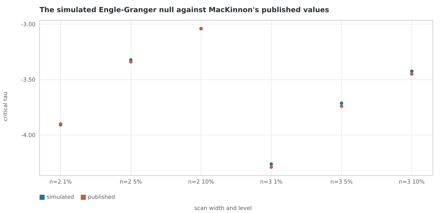
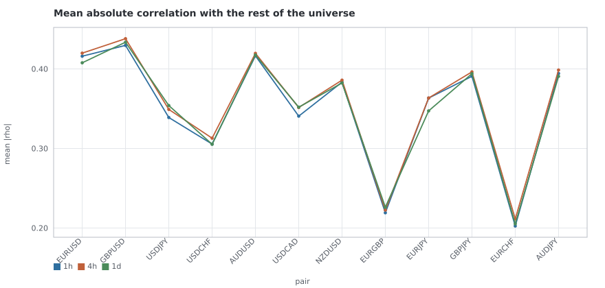
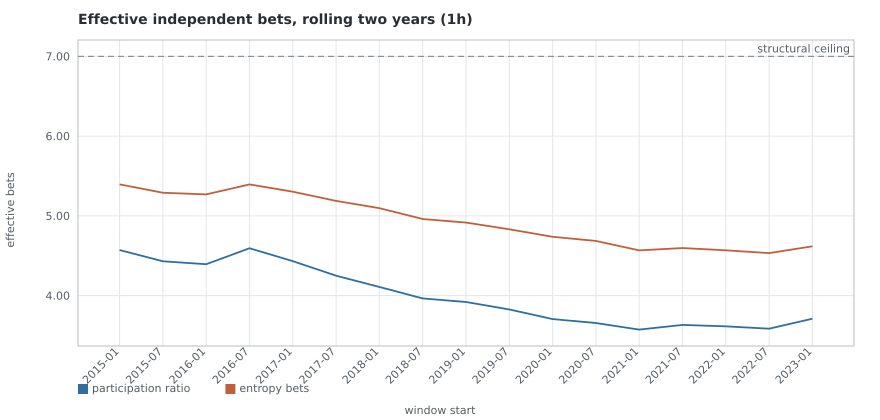
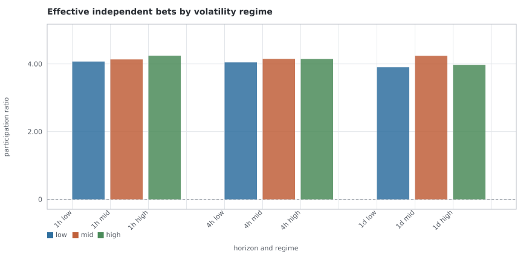
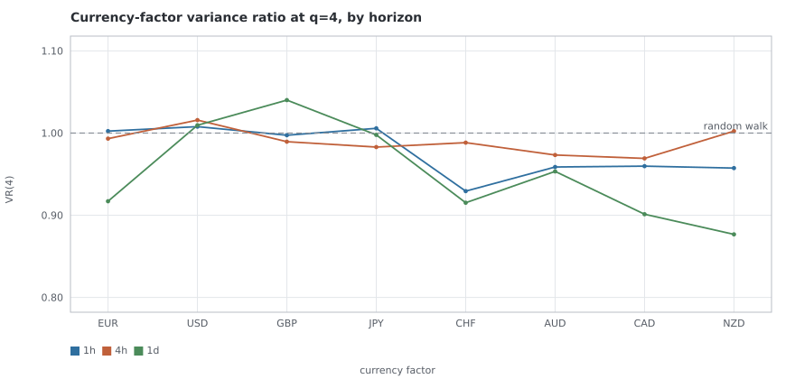
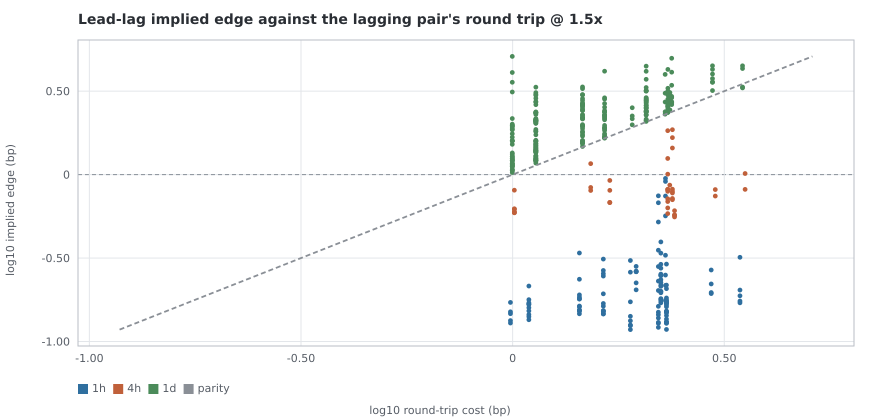
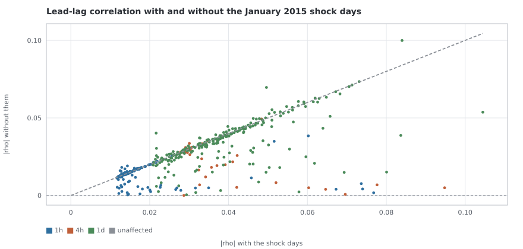
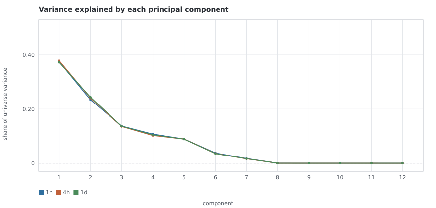

# T6 — EDA battery III: cross-pair structure

**Primary window:** 2015-01-01 → 2025-02-28, 12 pairs, horizons `1h`, `4h`, `1d` · **Discovery:** 2015-01-01 → 2019-12-31 · **Confirmations:** 2020-01-01 → 2025-02-28 and 2009-01-01 → 2012-12-31 (11 pairs, ruling R1) · **Characterisation only:** `5m`, `30m` (decision D7) · **Task card:** `taskcards/T6.md` · **Experiment:** `T6-cross-pair` · **Seed:** 20260906 · **Result hash:** `7912042f6401f81a`

**Trials ledgered under this card:** 4. **Hypothesis tests registered inside this result:** 13,881 across 16 families (SPEC2 pre-reg #10).

This card measures what the twelve pairs are **together**, and puts every relationship it finds against the round trip T5 priced — at the 100,000-unit reference notional SPEC2 decision D9 now fixes. Everything in it is a measurement and a map: no backtest, no scorecard, no candidate advanced or killed, no pair promoted or dropped. Pre-registered decision #3 puts those decisions in chat, between cards.

### What the battery found, in five sentences

1. **The universe is arithmetic before it is economics.** Twelve pairs across 8 currencies span 7 directions, so 5 of the twelve — `EURGBP`, `EURJPY`, `GBPJPY`, `EURCHF`, `AUDJPY` — are exact triangular functions of the other 7. Every relationship in this report is labelled for it, because a cointegration scan that does not separate the definition from the discovery ranks the definitions first.
2. **Nothing satisfies all three of the card's conditions.** 9 relationships survive the false-discovery correction across the scan **and** confirm in both untouched windows, and every one of them is a triangular identity — arbitrage relationships that exist by definition. Not one pays for the round trips of its own legs: the best of them needs the spread to reach 2.6 standard deviations from its mean before a full reversion covers the trade, and the worst needs 10.1.
3. **0 non-identity cointegration relationships confirm out of window.** 33 of them survive the correction inside the discovery window and every one of those fails in 2020-2025, in 2009-2012, or in both.
4. **The correlation structure is stable, and it is not the structure a diversification argument assumes.** The universe offers 4.24 effective independent bets against a nominal twelve and a structural ceiling of 7, the same 5 clusters appear at every research horizon, and correlations do **not** go to one in high volatility — the high-volatility regime carries 1.04× the effective bets of the low-volatility one.
5. **The one cell that passes every test this card can put to it is a lead-lag, not a cointegration.** `USDCAD` leads `USDCHF` by 1 bar at `1d`: it survives the correction with and without the January 2015 shock days, its sign holds in 94.1% of rolling two-year windows, and its implied edge is 2.10× the round trip of the pair it would trade. It is **one cell out of 4,752 lead-lag tests at the research horizons**, and that count belongs beside it wherever it is quoted.

The honest one-line summary: **this universe's only reliable cross-pair structure is the structure that is true by definition, and it is 10.1 times too narrow to pay for itself at its worst and 2.6 at its best.**

## The decisions and rulings this card is shaped by

A ruling listed without its consequence is decoration, so each is stated with where it actually bites.

| decision | statement | where it bites here |
| --- | --- | --- |
| **pre-reg #1** | the cost ladder is 1.0, 1.2, 1.5, 2.0× and the survival bar is 1.5× | every cost table carries the full ladder; every cost verdict is the bar's, and no second threshold is added |
| **pre-reg #9** | the universe is the twelve pairs | all twelve are scanned; none is promoted or dropped here |
| **pre-reg #10** | multiple-testing honesty | every test is registered inside the hashed result and corrected within its family; the trial count is stated beside every claim |
| **R1** | `AUDUSD` before 2011-01-01 is excluded | the early confirmation window runs on 11 pairs and says so; `AUDUSD` has no early confirmation available, which is recorded as `NO_WINDOW` rather than as a failure |
| **D4** | T6 is the primary remaining hypothesis source on price data alone; the external-data question is banked | the closing section says what this card's result implies for that question and originates nothing |
| **D6** | 2009-2012 and 2013+ are training data | 2009-2012 is used as a confirmation window rather than as a stress test |
| **D7** | cross-pair research horizons are `1h`, `4h`, `1d`; 5m and 30m are characterisation only | section 6 carries correlation and lead-lag summaries at `5m`, `30m` and raises no hypothesis at them |
| **D9** | the research reference notional is 100,000 units | every cost here is priced at it, and the per-order floor is inside the arithmetic rather than beside it — T5's Step 0 addendum measures where |
| **D10** | a backtester-readiness card precedes any scorecard | nothing here is backtested; the P0-A caveat is stated under every cost table |

## Method, and the six things that shape every number

### The universe has twelve series and seven degrees of freedom

A pair's log return is its base currency's strength less its quote's. With 8 currencies that is a design matrix of rank 7, so at most 7 of the twelve pairs can be independent and the remaining 5 are exact functions of them. Which five is not unique — any spanning set of 7 will do — so the report states one spanning set and what it determines rather than pretending there is a canonical answer:

| quantity | value |
| --- | --- |
| pairs | 12 |
| currencies | 8 |
| rank of the currency design | 7 |
| pairs it therefore determines | 5 |
| one spanning set | `EURUSD`, `GBPUSD`, `USDJPY`, `USDCHF`, `AUDUSD`, `USDCAD`, `NZDUSD` |
| the pairs it determines | `EURGBP`, `EURJPY`, `GBPJPY`, `EURCHF`, `AUDJPY` |

This is not a modelling choice and it is not a finding: `log EURGBP = log EURUSD - log GBPUSD` is what a cross rate **is**. It is stated first because it is the single most load-bearing fact in the card. A cointegration scan run without it produces a ranked list whose top entries are definitions, and the experiment therefore derives the identity flag from the design matrix for every relationship it reports rather than from a list somebody typed.

### Nothing spans a hole, and nothing is interpolated

Every horizon's series are aligned onto a **common** timestamp index by intersection, and every lagged estimator works inside the contiguous runs of that index. A bar one pair has and another does not is dropped from both rather than filled in: a filled value is a return nobody quoted, and a correlation computed against one is partly a correlation with an interpolation. The adjacency column is what the rule costs.

| horizon | window | pairs | rows | adjacency | from | to |
| --- | --- | --- | --- | --- | --- | --- |
| `1h` | primary | 12 | 62,766 | 99.14% | 2015-01-01 | 2025-02-28 |
| `1h` | discovery | 12 | 30,847 | 99.13% | 2015-01-01 | 2019-12-31 |
| `1h` | confirmation | 12 | 31,898 | 99.14% | 2020-01-01 | 2025-02-28 |
| `1h` | early | 11 | 24,542 | 99.11% | 2009-01-01 | 2012-12-31 |
| `4h` | primary | 12 | 15,826 | 96.61% | 2015-01-02 | 2025-02-28 |
| `4h` | discovery | 12 | 7,777 | 96.59% | 2015-01-02 | 2019-12-31 |
| `4h` | confirmation | 12 | 8,044 | 96.63% | 2020-01-02 | 2025-02-28 |
| `4h` | early | 11 | 6,197 | 96.58% | 2009-01-02 | 2012-12-31 |
| `1d` | primary | 12 | 2,650 | 100.00% | 2015-01-01 | 2025-02-28 |
| `1d` | discovery | 12 | 1,303 | 100.00% | 2015-01-01 | 2019-12-31 |
| `1d` | confirmation | 12 | 1,347 | 100.00% | 2020-01-01 | 2025-02-28 |
| `1d` | early | 11 | 1,035 | 99.90% | 2009-01-02 | 2012-12-31 |

### Discovery is one window and the confirmations are untouched

The cointegration scan and its false-discovery correction run in **2015-01-01 → 2019-12-31**. **2020-01-01 → 2025-02-28** and **2009-01-01 → 2012-12-31** are confirmations of a set that was fixed before they were looked at. The full primary window is reported for context and is **not** a third independent test, because it contains both halves.

Two honest consequences travel with that design. First, the discovery/confirmation split is the same partition T4's split-half used, so "split-half stable" and "confirmed out of window" are the same evidence rather than two pieces of it; the rolling 2-year windows stepped 6 months are the independent stability check. Second, the **lead-lag** scan runs on the full primary window rather than on the split, so its stability is T4's discipline — split-half sign and rolling sign agreement — and not this window design. Section 4 says which test each row got.

> **The confirmation rule.** A relationship discovered in the discovery window confirms in another window when its Engle-Granger residual rejects the unit root at p < 0.05 there **and** its hedge ratio keeps its sign and stays within a factor of 2.0 of the discovery value. It is declared in the experiment config, before any result existed, and it thresholds nothing SPEC2 thresholds — pre-reg #1 pins exactly one bar and this adds no second one.

### The p-values are simulated, and the simulation is checked

The Engle-Granger and Johansen statistics have no standard distribution, and a scan cannot have a correction until it has p-values. So the null is **simulated** from independent random walks put through the same functions the data goes through, from this experiment's seed: 20,000 draws of 2,000 observations at 10 lags. The smallest p-value it can produce is 5.0e-05, which is below the Benjamini-Hochberg threshold a lone survivor would have to clear — a simulation coarser than that could only find relationships in groups, and a scan that can only find them in groups is not a scan.

The simulation is checked against MacKinnon's **published** asymptotic critical values for the Engle-Granger residual test, which is what makes it an instrument rather than an assertion:

| variables in the regression | level | simulated | published | difference |
| --- | --- | --- | --- | --- |
| 2 | 1% | -3.908 | -3.900 | -0.008 |
| 2 | 5% | -3.323 | -3.340 | 0.017 |
| 2 | 10% | -3.041 | -3.040 | -0.001 |
| 3 | 1% | -4.262 | -4.290 | 0.028 |
| 3 | 5% | -3.713 | -3.740 | 0.027 |
| 3 | 10% | -3.424 | -3.450 | 0.026 |

*The simulated Engle-Granger null against MacKinnon's published asymptotic critical values, at both scan widths. The simulation is what every p-value in the cointegration scan is read off.* — source table: [`T6/simulated_null_against_published.csv`](T6/simulated_null_against_published.csv)

The Johansen critical values are **not** tabulated here, and that is deliberate: its distribution depends on which deterministic terms the model carries, and the published tables are easy to quote and easy to quote wrongly. The Johansen test is validated by what it does — on constructed systems whose answer is known, and by its rejection rate on fresh random walks — in `tests2/test_crossstats.py`, and its p-values come from the same simulation. This card runs it with an **unrestricted constant**: the levels of a decade of log FX prices carry a drift, and the variant that allows one is both the standard choice and the numerically robust one.

### A relationship pays one round trip per leg

A relationship holding one unit of notional in its first member against `beta` units in each of the others trades the residual `r0 - sum(beta_i ri)`, so its round trip is the first leg's plus each other leg's scaled by that leg's weight — all in basis points of the first leg's notional, which keeps the sum dimensionless and therefore currency-free. Every cost comes out of `fxlab.costs.IBCostModel` through `research.costs`, at 100,000 units, exactly as T5's do.

Two conventions are stated because they are choices:

* the amplitude a relationship is credited with is the **standard deviation of its own spread**, which is what entering one standard deviation from the mean and exiting at the mean earns, once, for one round trip of every leg. The per-bar move is reported beside it for a rule that would trade every bar;
* the cost verdict is taken in the **confirmation window**, so both the stability test and the cost test are out of sample. The discovery and primary figures are in `result.json`.

> **P0-A caveat.** SPEC2 prerequisite P0-A is **unfixed**: commission is floored against a quote-currency notional and cross-pair P&L is summed without conversion. Every cost here is a ratio of two quote-currency quantities and is therefore currency-free — except the per-order floor, which at this reference notional **does** bind for part of the universe. Every two-leg cost below names the legs whose floor binds, and T5's Step 0 addendum measures the size of the term. A cross-currency relationship's leg weights are also stated in each leg's own base units rather than in a common currency, which is the same defect seen from the sizing side. **This is decision D10's whole point.**

### The shock window

T4 reported it in terms: `EURCHF` and `USDCHF` carry the 2015 SNB de-peg inside the primary window — a 15% five-minute move, 403 standard deviations — and every statistic for those two pairs in the first half of the split is that afternoon. This card's strongest lead-lag cells are `EURCHF` and `USDCHF`, so it owes the same statistic with that afternoon removed, as a measurement rather than as a caveat.

The declared days are `2015-01-15`, `2015-01-16` — SNB removes the EURCHF floor (T4 section 5: a 15% five-minute move, 403 standard deviations) — fixed in the experiment config before any result existed. Removing them is **not** a correction to the data: the de-peg happened and those prices are real. The whole lead-lag family is re-scanned without them, in its own family with its own correction, so the comparison answers *which cells win* rather than *do the winners hold*.

## 1 — Correlation structure

Pairwise return correlations at each research horizon, their stability, their regime dependence and the network they form. Every pairwise correlation is a registered test, corrected within its horizon's family; at these sample sizes essentially all of them reject the null of zero, which is expected and is not a finding — the effect sizes and the stability are.

| horizon | rows | mean ρ | mean \|ρ\| | mean \|ρ\| without the shock days | participation ratio | entropy bets | components for 90% |
| --- | --- | --- | --- | --- | --- | --- | --- |
| `1h` | 62,766 | 0.1048 | 0.3501 | 0.3625 | 4.239 | 5.131 | 5 |
| `4h` | 15,826 | 0.1047 | 0.3558 | 0.3680 | 4.168 | 5.052 | 5 |
| `1d` | 2,650 | 0.0999 | 0.3513 | 0.3661 | 4.208 | 5.079 | 5 |

*Each pair's mean absolute correlation with the other eleven, by horizon. A pair high on this axis is a pair a portfolio gets little new information from.* — source table: [`T6/mean_correlation_by_pair.csv`](T6/mean_correlation_by_pair.csv)

The five strongest pairwise correlations at each horizon:

| horizon | pair | pair | ρ | rows |
| --- | --- | --- | --- | --- |
| `1h` | `AUDUSD` | `NZDUSD` | 0.8203 | 62,766 |
| `1h` | `EURJPY` | `GBPJPY` | 0.7240 | 62,766 |
| `1h` | `AUDUSD` | `AUDJPY` | 0.6993 | 62,766 |
| `1h` | `GBPJPY` | `AUDJPY` | 0.6616 | 62,766 |
| `1h` | `AUDUSD` | `USDCAD` | -0.6547 | 62,766 |
| `4h` | `AUDUSD` | `NZDUSD` | 0.8272 | 15,826 |
| `4h` | `EURJPY` | `GBPJPY` | 0.7407 | 15,826 |
| `4h` | `AUDUSD` | `AUDJPY` | 0.6811 | 15,826 |
| `4h` | `AUDUSD` | `USDCAD` | -0.6794 | 15,826 |
| `4h` | `GBPJPY` | `AUDJPY` | 0.6738 | 15,826 |
| `1d` | `AUDUSD` | `NZDUSD` | 0.8266 | 2,650 |
| `1d` | `EURJPY` | `GBPJPY` | 0.7289 | 2,650 |
| `1d` | `AUDUSD` | `USDCAD` | -0.6821 | 2,650 |
| `1d` | `GBPJPY` | `AUDJPY` | 0.6748 | 2,650 |
| `1d` | `AUDUSD` | `AUDJPY` | 0.6639 | 2,650 |

### Stability

| horizon | pairwise correlations | sign held across the split | mean absolute shift | largest shift |
| --- | --- | --- | --- | --- |
| `1h` | 66 | 62 / 66 | 0.1359 | `USDCHF`–`EURCHF` (0.688 → 0.379) |
| `4h` | 66 | 62 / 66 | 0.1362 | `USDJPY`–`EURGBP` (-0.282 → 0.047) |
| `1d` | 66 | 62 / 66 | 0.1443 | `GBPUSD`–`NZDUSD` (0.374 → 0.710) |

At `1h` the mean absolute correlation runs from 0.315 in 2015-01–2017-01 to 0.371 in 2023-01–2025-01, and the effective bets from 4.57 to 3.71. **The universe has been getting less diversified across the decade**, which is a different statement from the one a crisis-correlation argument makes and is visible in the rolling figure rather than in the regime table.

*The effective number of independent bets on rolling two-year windows, both measures, at the hourly horizon. The dashed line is the structural ceiling: twelve pairs across eight currencies span at most seven directions however they are correlated.* — source table: [`T6/effective_bets_rolling.csv`](T6/effective_bets_rolling.csv)

### Regime dependence — do correlations go to one?

The regime is universe-level: the cross-sectional mean of each pair's trailing volatility, bucketed into terciles, computed strictly before the row it labels. Bucketing a row by a volatility estimate containing it would put the largest moves in the highest bucket by construction.

| horizon | regime | rows | mean ρ | mean \|ρ\| | max \|ρ\| | participation ratio | components for 90% |
| --- | --- | --- | --- | --- | --- | --- | --- |
| `1h` | high | 20,915 | 0.1111 | 0.3446 | 0.8257 | 4.244 | 5 |
| `1h` | low | 20,916 | 0.0936 | 0.3641 | 0.8237 | 4.071 | 5 |
| `1h` | mid | 20,915 | 0.0994 | 0.3611 | 0.8078 | 4.133 | 5 |
| `4h` | high | 5,269 | 0.1081 | 0.3547 | 0.8373 | 4.145 | 5 |
| `4h` | low | 5,269 | 0.1003 | 0.3655 | 0.8219 | 4.045 | 5 |
| `4h` | mid | 5,268 | 0.1010 | 0.3599 | 0.8134 | 4.148 | 5 |
| `1d` | high | 877 | 0.0868 | 0.3735 | 0.8210 | 3.972 | 5 |
| `1d` | low | 877 | 0.1168 | 0.3802 | 0.8573 | 3.901 | 5 |
| `1d` | mid | 876 | 0.0977 | 0.3496 | 0.8151 | 4.240 | 5 |

*Effective bets by volatility regime, by horizon. If correlations went to one in a crisis the high-volatility bar would be the shortest of the three.* — source table: [`T6/effective_bets_by_regime.csv`](T6/effective_bets_by_regime.csv)

**Correlations do not go to one.** The high-volatility regime carries 1.02× to 1.04× the effective bets of the low-volatility one across the research horizons — a difference of a few percent, against an assumption that usually expects the number to halve. Whatever else this universe does under stress, it does not collapse into a single trade at these horizons. The diversification that is being lost is being lost slowly over the decade rather than suddenly in a regime, which the rolling figure shows and the regime table cannot.

### The network

Average-linkage clusters on the correlation distance `sqrt(2(1 - rho))`, cut at 1.00 — which is a correlation of a half. The cut is the whole of the clustering and is declared in the config rather than chosen after seeing the matrix.

| horizon | cluster | members |
| --- | --- | --- |
| `1h` | 1 | `EURUSD`, `GBPUSD`, `AUDUSD`, `NZDUSD` |
| `1h` | 2 | `USDJPY`, `EURJPY`, `GBPJPY`, `AUDJPY` |
| `1h` | 3 | `USDCHF`, `EURCHF` |
| `1h` | 4 | `EURGBP` |
| `1h` | 5 | `USDCAD` |
| `4h` | 1 | `EURUSD`, `GBPUSD`, `AUDUSD`, `NZDUSD` |
| `4h` | 2 | `USDJPY`, `EURJPY`, `GBPJPY`, `AUDJPY` |
| `4h` | 3 | `USDCHF`, `EURCHF` |
| `4h` | 4 | `EURGBP` |
| `4h` | 5 | `USDCAD` |
| `1d` | 1 | `EURUSD`, `GBPUSD`, `AUDUSD`, `NZDUSD` |
| `1d` | 2 | `USDJPY`, `EURJPY`, `GBPJPY`, `AUDJPY` |
| `1d` | 3 | `USDCHF`, `EURCHF` |
| `1d` | 4 | `EURGBP` |
| `1d` | 5 | `USDCAD` |

**The clusters are identical at every research horizon.** They are the currency blocs the design matrix already implies: a pair sits with the pairs it shares a currency with.

2 pairs cluster alone at `1h`, and the reasons are not the same:

| pair | mean \|ρ\| with the rest | strongest single \|ρ\| | currencies appearing in no other pair |
| --- | --- | --- | --- |
| `EURGBP` | 0.2192 | 0.5842 | — |
| `USDCAD` | 0.3407 | 0.6547 | CAD |

And the same network, regime by regime — the card asks how the clusters change in high volatility, which is a different question from how many independent directions they leave:

| horizon | regime | clusters | membership |
| --- | --- | --- | --- |
| `1h` | high | 5 | same partition as all hours |
| `1h` | low | 6 | `EURUSD`, `GBPUSD`, `AUDUSD`, `NZDUSD`; `EURJPY`, `GBPJPY`, `AUDJPY`; `USDJPY`, `USDCHF`; `EURCHF`; `EURGBP`; `USDCAD` |
| `1h` | mid | 6 | `EURUSD`, `GBPUSD`, `AUDUSD`, `NZDUSD`; `USDJPY`, `EURJPY`, `GBPJPY`, `AUDJPY`; `EURCHF`; `EURGBP`; `USDCAD`; `USDCHF` |
| `4h` | high | 5 | same partition as all hours |
| `4h` | low | 6 | `EURUSD`, `GBPUSD`, `AUDUSD`, `NZDUSD`; `EURJPY`, `GBPJPY`, `AUDJPY`; `USDJPY`, `USDCHF`; `EURCHF`; `EURGBP`; `USDCAD` |
| `4h` | mid | 6 | `EURUSD`, `GBPUSD`, `AUDUSD`, `NZDUSD`; `USDJPY`, `EURJPY`, `GBPJPY`, `AUDJPY`; `EURCHF`; `EURGBP`; `USDCAD`; `USDCHF` |
| `1d` | high | 6 | `EURUSD`, `GBPUSD`, `AUDUSD`, `NZDUSD`; `USDJPY`, `EURJPY`, `GBPJPY`, `AUDJPY`; `EURCHF`; `EURGBP`; `USDCAD`; `USDCHF` |
| `1d` | low | 6 | `EURUSD`, `GBPUSD`, `AUDUSD`, `NZDUSD`; `EURJPY`, `GBPJPY`, `AUDJPY`; `USDJPY`, `USDCHF`; `EURCHF`; `EURGBP`; `USDCAD` |
| `1d` | mid | 7 | `USDJPY`, `EURJPY`, `GBPJPY`, `AUDJPY`; `AUDUSD`, `NZDUSD`; `EURUSD`, `GBPUSD`; `EURCHF`; `EURGBP`; `USDCAD`; `USDCHF` |

**The clustering moves with the regime in 7 of 9 regime cells**, and the movement is concentrated: `EURCHF` (7), `USDCHF` (7), `AUDJPY` (3), `EURJPY` (3), `GBPJPY` (3) change who they sit with, out of 12 pairs. Everything else keeps its bloc in every regime at every horizon.

The direction is worth reading carefully, because it is the opposite of the usual story. The cells that reproduce the unconditional partition exactly are `1h` high, `4h` high — the **high-volatility** ones — and the deviations are in the quieter regimes. In high volatility this universe's network is not a collapsed version of itself; it is precisely itself.

## 2 — Currency-strength decomposition

Each pair's return factored into its base currency's strength less its quote's, with the strengths normalised to sum to zero so no currency is silently made the numeraire. The normalisation is imposed as an extra equation rather than by dropping a currency.

**Read the fit before reading the factors.** The design has rank 7, so this is closer to a change of basis than to a factor model, and the R² below is a statement about the universe's arithmetic rather than about how good the model is:

| horizon | pair | R² | sd (bp) | residual sd (bp) | residual share of sd |
| --- | --- | --- | --- | --- | --- |
| `1h` | `EURUSD` | 0.999439 | 10.322 | 0.2445 | 2.37% |
| `1h` | `GBPUSD` | 0.999565 | 12.167 | 0.2538 | 2.09% |
| `1h` | `USDJPY` | 0.999596 | 11.466 | 0.2305 | 2.01% |
| `1h` | `USDCHF` | 0.999343 | 12.358 | 0.3167 | 2.56% |
| `1h` | `AUDUSD` | 0.999738 | 13.734 | 0.2221 | 1.62% |
| `1h` | `USDCAD` | 1.000000 | 9.678 | 0.0000 | 0.00% |
| `1h` | `NZDUSD` | 1.000000 | 14.103 | 0.0000 | 0.00% |
| `1h` | `EURGBP` | 0.999155 | 10.111 | 0.2939 | 2.91% |
| `1h` | `EURJPY` | 0.999496 | 11.956 | 0.2685 | 2.25% |
| `1h` | `GBPJPY` | 0.999667 | 14.535 | 0.2651 | 1.82% |
| `1h` | `EURCHF` | 0.999014 | 10.085 | 0.3167 | 3.14% |
| `1h` | `AUDJPY` | 0.999796 | 15.537 | 0.2221 | 1.43% |
| `4h` | `EURUSD` | 0.999851 | 20.599 | 0.2516 | 1.22% |
| `4h` | `GBPUSD` | 0.999864 | 24.205 | 0.2823 | 1.17% |
| `4h` | `USDJPY` | 0.999867 | 23.068 | 0.2663 | 1.15% |
| `4h` | `USDCHF` | 0.999784 | 23.929 | 0.3518 | 1.47% |
| `4h` | `AUDUSD` | 0.999919 | 26.733 | 0.2413 | 0.90% |
| `4h` | `USDCAD` | 1.000000 | 18.908 | 0.0000 | 0.00% |
| `4h` | `NZDUSD` | 1.000000 | 27.348 | 0.0000 | 0.00% |
| `4h` | `EURGBP` | 0.999781 | 19.797 | 0.2929 | 1.48% |
| `4h` | `EURJPY` | 0.999874 | 24.050 | 0.2701 | 1.12% |
| `4h` | `GBPJPY` | 0.999917 | 29.276 | 0.2668 | 0.91% |
| `4h` | `EURCHF` | 0.999669 | 19.340 | 0.3518 | 1.82% |
| `4h` | `AUDJPY` | 0.999937 | 30.421 | 0.2413 | 0.79% |
| `1d` | `EURUSD` | 0.999752 | 48.890 | 0.7705 | 1.58% |
| `1d` | `GBPUSD` | 0.999780 | 58.398 | 0.8666 | 1.48% |
| `1d` | `USDJPY` | 0.999771 | 56.141 | 0.8504 | 1.51% |
| `1d` | `USDCHF` | 0.999657 | 59.270 | 1.0971 | 1.85% |
| `1d` | `AUDUSD` | 0.999855 | 63.594 | 0.7651 | 1.20% |
| `1d` | `USDCAD` | 1.000000 | 45.365 | 0.0000 | 0.00% |

_First 30 of 36 pair-horizons; the whole table is in `result.json`._

The mean R² is 0.999567 at `1h`. **Twelve series with 7 degrees of freedom cannot have an idiosyncratic component**, and the residual that remains is quoting noise: bars that closed a moment apart, and a bid-ask spread that is not identical on both sides of a triangle. It is a fact about the universe, not a good model fit.

Two currencies appear in only one pair each — `CAD`, `NZD`. A currency appearing once adds one unknown and one equation, so its strength is exactly determined and that pair's residual is zero by construction. Its factor is that pair's return with the broad dollar taken out, which is a different series from the pair and worth keeping in mind when reading its memory below.

### Do the currency factors carry memory the pairs do not?

The card's question, and the honest way to answer it is with the same estimators T4 used, in their own families, corrected the same way. The comparison families are stated because they are different sizes and a Benjamini-Hochberg threshold depends on family size:

| family | tests | rejected at FDR 0.05 | share |
| --- | --- | --- | --- |
| `currency_factor_variance_ratio` | 120 | 7 | 6.2% |
| `pair_reference_variance_ratio` | 180 | 0 | 0.0% |
| `currency_factor_autocorr` | 24 | 13 | 54.2% |
| `pair_reference_autocorr` | 36 | 14 | 38.9% |

**Yes, and it is a small answer.** 2 of 120 factor variance ratios survive the correction — the `NZD` factor at `1h` (VR(4) = 0.957), the `NZD` factor at `1d` (VR(4) = 0.877) — while **not one of 180 pair variance ratios survives at any research horizon**, which is exactly what T4 found. A currency factor is a pair with the broad-dollar component taken out, so this says the reversion is in the currency rather than in the quote, and that removing the dollar leg is what makes it visible. The two families are different sizes, so the Benjamini-Hochberg thresholds differ and the raw effect sizes in the tables below are the fairer comparison; they point the same way. A T7 card acting on this would be acting on 2 of 120 tests.

*The q=4 variance ratio of each currency-strength factor against the pairs', by horizon. One is a random walk; below one is mean reversion.* — source table: [`T6/currency_factor_variance_ratio.csv`](T6/currency_factor_variance_ratio.csv)

The factors, in full:

| horizon | currency | pairs it appears in | sd (bp) | share of factor variance | ρ(1) | q | VR(4) | q | VR survives |
| --- | --- | --- | --- | --- | --- | --- | --- | --- | --- |
| `1h` | EUR | 4 | 6.189 | 7.1% | -0.00844 | 0.0570 | 1.00238 | 0.9801 | no |
| `1h` | USD | 7 | 7.712 | 10.9% | -0.00842 | 0.0570 | 1.00782 | 0.8784 | no |
| `1h` | GBP | 3 | 8.326 | 12.8% | -0.01366 | 0.0017 | 0.99737 | 0.9801 | no |
| `1h` | JPY | 4 | 9.780 | 17.6% | 0.00504 | 0.2645 | 1.00577 | 0.9801 | no |
| `1h` | CHF | 2 | 9.104 | 15.3% | -0.06885 | <1e-12 | 0.92934 | 0.5737 | no |
| `1h` | AUD | 2 | 8.507 | 13.3% | -0.02604 | 5.0e-10 | 0.95872 | 0.1148 | no |
| `1h` | CAD | 1 | 7.042 | 9.1% | -0.02489 | 2.6e-09 | 0.95975 | 0.0516 | no |
| `1h` | NZD | 1 | 8.700 | 13.9% | -0.03426 | <1e-12 | 0.95739 | 0.0423 | **yes** |
| `4h` | EUR | 4 | 12.339 | 7.4% | -0.02399 | 0.0060 | 0.99323 | 0.9801 | no |
| `4h` | USD | 7 | 15.285 | 11.3% | -0.00256 | 0.7513 | 1.01580 | 0.8784 | no |
| `4h` | GBP | 3 | 16.424 | 13.1% | -0.03203 | 0.0002 | 0.98951 | 0.9801 | no |
| `4h` | JPY | 4 | 19.491 | 18.4% | -0.03327 | 0.0001 | 0.98296 | 0.9623 | no |
| `4h` | CHF | 2 | 17.305 | 14.5% | -0.10086 | <1e-12 | 0.98835 | 0.9801 | no |
| `4h` | AUD | 2 | 16.387 | 13.0% | -0.02471 | 0.0054 | 0.97330 | 0.8159 | no |
| `4h` | CAD | 1 | 13.606 | 9.0% | -0.04009 | 2.9e-06 | 0.96919 | 0.6103 | no |
| `4h` | NZD | 1 | 16.610 | 13.4% | -0.00866 | 0.3409 | 1.00237 | 0.9801 | no |
| `1d` | EUR | 4 | 29.664 | 7.3% | -0.03216 | 0.1467 | 0.91704 | 0.3427 | no |
| `1d` | USD | 7 | 36.809 | 11.3% | 0.01701 | 0.4161 | 1.00952 | 0.9801 | no |
| `1d` | GBP | 3 | 39.460 | 12.9% | 0.02439 | 0.2645 | 1.04012 | 0.8784 | no |
| `1d` | JPY | 4 | 46.542 | 18.0% | -0.00624 | 0.7513 | 0.99778 | 0.9801 | no |
| `1d` | CHF | 2 | 43.612 | 15.8% | -0.01768 | 0.4147 | 0.91522 | 0.6184 | no |
| `1d` | AUD | 2 | 38.528 | 12.3% | -0.02949 | 0.1822 | 0.95336 | 0.6715 | no |
| `1d` | CAD | 1 | 33.057 | 9.1% | -0.04309 | 0.0490 | 0.90125 | 0.2247 | no |
| `1d` | NZD | 1 | 40.029 | 13.3% | -0.05853 | 0.0057 | 0.87674 | 0.0423 | **yes** |

And the pairs, on the same estimators, as the comparison:

| horizon | pair | ρ(1) | q | VR(4) | q | VR survives |
| --- | --- | --- | --- | --- | --- | --- |
| `1h` | `EURUSD` | -0.00321 | 0.5439 | 1.00798 | 0.9264 | no |
| `1h` | `GBPUSD` | -0.00511 | 0.3168 | 1.01082 | 0.9346 | no |
| `1h` | `USDJPY` | 0.00612 | 0.2279 | 1.01914 | 0.9264 | no |
| `1h` | `USDCHF` | -0.05287 | <1e-12 | 0.95597 | 0.9264 | no |
| `1h` | `AUDUSD` | -0.01760 | 5.1e-05 | 0.98152 | 0.9264 | no |
| `1h` | `USDCAD` | -0.01055 | 0.0219 | 0.98836 | 0.9264 | no |
| `1h` | `NZDUSD` | -0.02202 | 2.0e-07 | 0.98143 | 0.9264 | no |
| `1h` | `EURGBP` | -0.02206 | 2.0e-07 | 0.98543 | 0.9264 | no |
| `1h` | `EURJPY` | 0.00694 | 0.1768 | 1.01031 | 0.9289 | no |
| `1h` | `GBPJPY` | 0.01117 | 0.0159 | 1.02760 | 0.9264 | no |
| `1h` | `EURCHF` | -0.06086 | <1e-12 | 0.94472 | 0.9264 | no |
| `1h` | `AUDJPY` | -0.00714 | 0.1688 | 0.98272 | 0.9264 | no |
| `4h` | `EURUSD` | -0.02672 | 0.0034 | 0.97827 | 0.9264 | no |
| `4h` | `GBPUSD` | -0.01547 | 0.1337 | 1.00428 | 0.9671 | no |
| `4h` | `USDJPY` | -0.02234 | 0.0159 | 1.00139 | 0.9716 | no |
| `4h` | `USDCHF` | -0.07569 | <1e-12 | 0.99167 | 0.9671 | no |
| `4h` | `AUDUSD` | -0.00106 | 0.9217 | 1.00681 | 0.9403 | no |
| `4h` | `USDCAD` | -0.01261 | 0.2252 | 0.99622 | 0.9494 | no |
| `4h` | `NZDUSD` | 0.00477 | 0.6846 | 1.01764 | 0.9264 | no |
| `4h` | `EURGBP` | -0.00292 | 0.7836 | 1.01543 | 0.9346 | no |
| `4h` | `EURJPY` | -0.04558 | 1.3e-07 | 0.96793 | 0.9264 | no |
| `4h` | `GBPJPY` | -0.03480 | 6.7e-05 | 0.99243 | 0.9671 | no |
| `4h` | `EURCHF` | -0.08954 | <1e-12 | 1.01937 | 0.9617 | no |
| `4h` | `AUDJPY` | -0.02637 | 0.0036 | 0.97746 | 0.9264 | no |
| `1d` | `EURUSD` | 0.00635 | 0.7874 | 0.98605 | 0.9403 | no |
| `1d` | `GBPUSD` | 0.03097 | 0.2218 | 1.04699 | 0.9264 | no |
| `1d` | `USDJPY` | -0.00902 | 0.7229 | 0.98124 | 0.9403 | no |
| `1d` | `USDCHF` | 0.02098 | 0.4034 | 0.97998 | 0.9403 | no |
| `1d` | `AUDUSD` | -0.01852 | 0.4715 | 0.97268 | 0.9264 | no |
| `1d` | `USDCAD` | 0.00028 | 0.9885 | 0.96838 | 0.9264 | no |

_First 30 of 36 pair-horizons; the whole table is in `result.json`._

## 3 — Cointegration scans

All 66 pairs-of-pairs in both Engle-Granger orderings, plus 12 declared triples, at each research horizon: **432 relationships** scanned in the discovery window, then confirmed — untouched — in the two later and earlier windows.

**Five of the triples are known-answer controls, not candidates.** They are the universe's triangular identities, declared as such in the config before any result existed. `log EURGBP` is `log EURUSD` less `log GBPUSD` by definition, so the scan **must** find them: a scan that misses one is broken, and a report that lists one as an opportunity has discovered arithmetic.

| family | tests | rejected at FDR 0.05 | BH threshold p |
| --- | --- | --- | --- |
| `cointegration_engle_granger` | 432 | 47 | 0.0053 |
| `cointegration_johansen` | 219 | 47 | 0.0091 |

15 of 432 discovery statistics sit on the simulation's resolution floor — they are more extreme than any of 20,000 random-walk draws, so their p-value is reported as the floor rather than as a number the simulation cannot support. Johansen is symmetric in its members, so it is computed once per unordered set and its family is correspondingly smaller.

### The known-answer controls, and what they cost

Every one of the universe's triangular identities, at every research horizon. The scan finds all 15 of them; 9 survive the correction and confirm in **both** untouched windows; and **not one of them pays for its own legs**:

| relationship | horizon | τ | q | confirmation | early | half-life (bars) | spread sd (bp) | 3-leg round trip @ 1.5× (bp) | amplitude / cost | break-even entry (σ) |
| --- | --- | --- | --- | --- | --- | --- | --- | --- | --- | --- |
| `EURCHF` + `EURUSD` + `USDCHF` | `1d` | -10.83 | 0.0014 | CONFIRMED | CONFIRMED | 0.17 | 2.285 | 5.851 | 0.39× | 2.6 |
| `EURJPY` + `EURUSD` + `USDJPY` | `1d` | -10.29 | 0.0014 | CONFIRMED | CONFIRMED | 0.40 | 1.161 | 3.877 | 0.30× | 3.3 |
| `EURGBP` + `EURUSD` + `GBPUSD` | `1d` | -10.66 | 0.0014 | CONFIRMED | CONFIRMED | 0.15 | 1.445 | 5.060 | 0.29× | 3.5 |
| `GBPJPY` + `GBPUSD` + `USDJPY` | `1d` | -10.62 | 0.0014 | CONFIRMED | CONFIRMED | 0.26 | 1.510 | 5.319 | 0.28× | 3.5 |
| `AUDJPY` + `AUDUSD` + `USDJPY` | `1d` | -12.05 | 0.0014 | CONFIRMED | NO WINDOW | 0.23 | 1.496 | 6.455 | 0.23× | 4.3 |
| `EURJPY` + `EURUSD` + `USDJPY` | `4h` | -5.09 | 0.0075 | CONFIRMED | CONFIRMED | 6.50 | 0.680 | 3.969 | 0.17× | 5.8 |
| `EURJPY` + `EURUSD` + `USDJPY` | `1h` | -10.18 | 0.0014 | CONFIRMED | CONFIRMED | 3.73 | 0.642 | 3.786 | 0.17× | 5.9 |
| `EURCHF` + `EURUSD` + `USDCHF` | `4h` | -5.22 | 0.0060 | NOT CONFIRMED | CONFIRMED | 0.67 | 0.969 | 5.767 | 0.17× | 5.9 |
| `GBPJPY` + `GBPUSD` + `USDJPY` | `4h` | -5.29 | 0.0045 | NOT CONFIRMED | CONFIRMED | 2.44 | 0.757 | 5.450 | 0.14× | 7.2 |
| `EURCHF` + `EURUSD` + `USDCHF` | `1h` | -22.72 | 0.0014 | CONFIRMED | CONFIRMED | 0.43 | 0.702 | 5.511 | 0.13× | 7.9 |
| `GBPJPY` + `GBPUSD` + `USDJPY` | `1h` | -12.84 | 0.0014 | CONFIRMED | CONFIRMED | 1.66 | 0.646 | 5.194 | 0.12× | 8.0 |
| `EURGBP` + `EURUSD` + `GBPUSD` | `4h` | -2.70 | 0.6871 | NOT CONFIRMED | CONFIRMED | 0.33 | 0.626 | 5.142 | 0.12× | 8.2 |
| `AUDJPY` + `AUDUSD` + `USDJPY` | `4h` | -4.82 | 0.0123 | NOT CONFIRMED | NO WINDOW | 2.56 | 0.763 | 6.523 | 0.12× | 8.5 |
| `AUDJPY` + `AUDUSD` + `USDJPY` | `1h` | -12.36 | 0.0014 | CONFIRMED | NO WINDOW | 1.89 | 0.674 | 6.286 | 0.11× | 9.3 |
| `EURGBP` + `EURUSD` + `GBPUSD` | `1h` | -31.97 | 0.0014 | CONFIRMED | CONFIRMED | 0.27 | 0.489 | 4.933 | 0.10× | 10.1 |

**Trial count for every row above** (pre-reg #10): 432 tests in `cointegration_engle_granger` and 219 in `cointegration_johansen`, both corrected within their own family.

*The universe's triangular identities: the standard deviation of the arbitrage spread against the round trip of all three legs, at the 1.5x rung and 100,000 units, on a log10 axis in basis points. The dashed line is parity -- above it a one-sigma reversion pays for the trade that captured it.* — source table: [`T6/identity_spread_versus_cost.csv`](T6/identity_spread_versus_cost.csv)

The break-even entry column is the whole story. A triangular spread would have to reach that many standard deviations from its mean before a full reversion to the mean covered three round trips at the reference notional — and a spread whose own standard deviation is the unit is not going to reach it. **Triangular arbitrage in this universe is real, statistically overwhelming, confirmed out of window for 9 of 15 of these cells, and 2.6 to 10.1 times too narrow to trade.**

### Everything else

33 non-identity relationships survive the false-discovery correction inside the discovery window. **Not one of them confirms in both untouched windows.**

| relationship | horizon | τ | q | confirmation | early | spread sd (bp) | half-life (bars) | fails on |
| --- | --- | --- | --- | --- | --- | --- | --- | --- |
| `EURCHF` + `EURGBP` | `1h` | -4.28 | 0.0296 | NOT CONFIRMED | NOT CONFIRMED | 282.3 | 571.7 | out-of-window |
| `USDCHF` + `USDJPY` | `1h` | -4.12 | 0.0460 | NOT CONFIRMED | NOT CONFIRMED | 245.0 | 403.9 | out-of-window |
| `USDCHF` + `EURGBP` | `1h` | -4.38 | 0.0211 | NOT CONFIRMED | NOT CONFIRMED | 236.9 | 372.3 | out-of-window |
| `USDCHF` + `USDJPY` | `1d` | -4.88 | 0.0054 | NOT CONFIRMED | NOT CONFIRMED | 244.8 | 16.5 | out-of-window |
| `USDCHF` + `EURGBP` | `1d` | -4.98 | 0.0036 | NOT CONFIRMED | NOT CONFIRMED | 236.9 | 15.4 | out-of-window |
| `USDCHF` + `GBPUSD` | `1h` | -4.82 | 0.0054 | NOT CONFIRMED | NOT CONFIRMED | 212.6 | 319.2 | out-of-window |
| `USDCHF` + `EURUSD` | `1d` | -4.64 | 0.0089 | NOT CONFIRMED | NOT CONFIRMED | 223.2 | 16.4 | out-of-window |
| `USDCHF` + `AUDJPY` | `1h` | -4.82 | 0.0054 | NOT CONFIRMED | NOT CONFIRMED | 225.7 | 327.1 | out-of-window |
| `USDCHF` + `GBPUSD` | `4h` | -4.49 | 0.0123 | NOT CONFIRMED | NOT CONFIRMED | 212.4 | 89.9 | out-of-window |
| `USDCHF` + `GBPUSD` | `1d` | -5.04 | 0.0027 | NOT CONFIRMED | NOT CONFIRMED | 213.0 | 13.3 | out-of-window |
| `USDCHF` + `GBPJPY` | `1h` | -4.63 | 0.0094 | NOT CONFIRMED | NOT CONFIRMED | 228.6 | 347.9 | out-of-window |
| `USDCHF` + `AUDJPY` | `4h` | -4.27 | 0.0319 | NOT CONFIRMED | NOT CONFIRMED | 225.5 | 89.0 | out-of-window |
| `USDCHF` + `AUDJPY` | `1d` | -4.82 | 0.0054 | NOT CONFIRMED | NOT CONFIRMED | 225.9 | 13.6 | out-of-window |
| `USDCHF` + `GBPJPY` | `4h` | -4.09 | 0.0492 | CONFIRMED | NOT CONFIRMED | 228.4 | 96.3 | out-of-window |
| `USDCHF` + `GBPJPY` | `1d` | -4.98 | 0.0036 | NOT CONFIRMED | NOT CONFIRMED | 228.7 | 14.3 | out-of-window |
| `USDCHF` + `NZDUSD` | `1h` | -4.45 | 0.0161 | NOT CONFIRMED | NOT CONFIRMED | 222.4 | 356.7 | out-of-window |
| `USDCHF` + `EURCHF` | `1d` | -4.56 | 0.0111 | NOT CONFIRMED | NOT CONFIRMED | 238.0 | 20.0 | out-of-window |
| `USDCHF` + `EURJPY` | `1h` | -4.54 | 0.0114 | NOT CONFIRMED | NOT CONFIRMED | 227.3 | 355.3 | out-of-window |
| `USDCHF` + `AUDUSD` | `1h` | -4.69 | 0.0088 | NOT CONFIRMED | NO WINDOW | 211.9 | 314.2 | out-of-window |
| `USDCHF` + `NZDUSD` | `4h` | -4.16 | 0.0408 | NOT CONFIRMED | NOT CONFIRMED | 222.1 | 98.6 | out-of-window |
| `USDCHF` + `NZDUSD` | `1d` | -4.46 | 0.0153 | NOT CONFIRMED | NOT CONFIRMED | 222.7 | 14.9 | out-of-window |
| `USDCHF` + `EURJPY` | `1d` | -4.83 | 0.0054 | NOT CONFIRMED | NOT CONFIRMED | 227.4 | 14.3 | out-of-window |
| `USDCHF` + `AUDUSD` | `1d` | -4.57 | 0.0111 | NOT CONFIRMED | NO WINDOW | 212.6 | 13.4 | out-of-window |
| `USDCHF` + `AUDUSD` | `4h` | -4.37 | 0.0216 | NOT CONFIRMED | NO WINDOW | 211.6 | 87.3 | out-of-window |
| `USDCHF` + `USDCAD` | `1h` | -5.99 | 0.0014 | NOT CONFIRMED | NOT CONFIRMED | 190.9 | 231.7 | out-of-window |
| `EURUSD` + `EURCHF` | `1d` | -4.56 | 0.0111 | NOT CONFIRMED | NOT CONFIRMED | 237.9 | 20.0 | out-of-window |
| `EURCHF` + `EURUSD` | `1d` | -4.65 | 0.0089 | NOT CONFIRMED | NOT CONFIRMED | 223.1 | 16.5 | out-of-window |
| `USDCHF` + `USDCAD` | `1d` | -5.40 | 0.0014 | NOT CONFIRMED | NOT CONFIRMED | 191.7 | 9.8 | out-of-window |
| `USDCHF` + `USDCAD` | `4h` | -5.76 | 0.0014 | NOT CONFIRMED | NOT CONFIRMED | 190.5 | 63.2 | out-of-window |
| `USDCAD` + `USDCHF` | `1h` | -5.91 | 0.0014 | NOT CONFIRMED | CONFIRMED | 247.4 | 336.2 | out-of-window |

_First 30 of 33; the whole scan is in `result.json` under `payload.cointegration.ranked`._

**A large spread standard deviation on an unconfirmed relationship is not an edge — it is a random walk's variance.** The rows above with spread standard deviations in the hundreds of basis points are pairs whose residual wanders; their amplitude-over-cost ratios look spectacular and mean nothing, which is exactly why the card asks for out-of-window confirmation before it asks for arithmetic.

How the whole scan divides, by which of the card's three conditions it fails:

| fails on | relationships |
| --- | --- |
| correction, out-of-window | 384 |
| out-of-window | 33 |
| cost | 9 |
| out-of-window, cost | 5 |
| correction, out-of-window, cost | 1 |

## 4 — Lead-lag

Every ordered pair at lags 1 to 12, at each research horizon, Benjamini-Hochberg corrected inside its horizon's family — and then the entire family re-scanned with the declared shock days removed, in a second family with its own correction.

The effect size is T5's measure applied across pairs: a rule forecasting the lagging pair from the leading one has a forecast whose standard deviation is `|ρ| × sd` of the **lagging** pair, and trading its sign earns that per trade before costs. It is compared against that pair's own round trip, because that is the pair the rule would trade — **one** round trip, not two.

| horizon | tests | survive the correction | survive it without the shock days | survive both ways | pay their own round trip | stable | qualify on all three |
| --- | --- | --- | --- | --- | --- | --- | --- |
| `1h` | 1,584 | 125 | 98 | 86 | 0 | 19 | **0** |
| `4h` | 1,584 | 31 | 15 | 11 | 0 | 23 | **0** |
| `1d` | 1,584 | 4 | 1 | 1 | 241 | 33 | **1** |

**The three columns are nearly disjoint, and that is the finding.** At the short research horizons the survivors are numerous and microscopic — none of them earns its round trip. At the daily horizon almost everything clears its round trip, because a daily move is two orders of magnitude larger than a daily round trip, and almost nothing survives the correction.

*Every lead-lag cell the result carries: the implied edge against the lagging pair's own round trip at the 1.5x rung and 100,000 units, on a log10 axis. The dashed line is parity.* — source table: [`T6/leadlag_edge_versus_cost.csv`](T6/leadlag_edge_versus_cost.csv)

### The shock check

*The same cells with and without the two declared shock days of January 2015. A point on the dashed line is unaffected by the SNB de-peg; a point far below it was mostly that afternoon.* — source table: [`T6/leadlag_shock_sensitivity.csv`](T6/leadlag_shock_sensitivity.csv)

**62 of 160 cells that survive the correction stop surviving it when `2015-01-15`, `2015-01-16` are removed** and the whole family is re-scanned without them. Two days out of a decade.

Two mechanisms do that, and they mean different things. 37 of the 62 lose more than half their correlation outright — the cell was mostly that afternoon — and 54 of them involve `EURCHF` or `USDCHF`, which is precisely what T4's warning about those two pairs predicted. The remaining 25 keep more than half of it and slip under a Benjamini-Hochberg threshold that shifted when the collapsing cells left the family, which is bookkeeping rather than evidence. Both are why this check is a measurement in the card rather than a sentence at the end of it.

The strongest 10 cells that survive the correction at each research horizon, of 160 that do (everything that qualifies is included whatever its rank):

| horizon | lead | lagging | lag | ρ | ρ without the shock | q | edge (bp) | cost @ 1.5× (bp) | edge / cost | rolling stability | sign agreement | qualifies |
| --- | --- | --- | --- | --- | --- | --- | --- | --- | --- | --- | --- | --- |
| `1h` | `EURCHF` | `USDCHF` | 12 | 0.07679 | -0.00175 | <1e-12 | 0.9490 | 2.2966 | 0.41× | UNSTABLE | 52.9% | no |
| `1h` | `USDCHF` | `EURCHF` | 12 | 0.07400 | -0.00419 | <1e-12 | 0.7463 | 2.2094 | 0.34× | UNSTABLE | 41.2% | no |
| `1h` | `EURCHF` | `USDCHF` | 6 | -0.07366 | -0.00765 | <1e-12 | 0.9102 | 2.2966 | 0.40× | MOSTLY-STABLE | 76.5% | no |
| `1h` | `USDCHF` | `EURCHF` | 6 | -0.06725 | -0.00402 | <1e-12 | 0.6783 | 2.2094 | 0.31× | MIXED | 70.6% | no |
| `1h` | `EURCHF` | `USDCHF` | 1 | -0.06022 | -0.03845 | <1e-12 | 0.7442 | 2.2966 | 0.32× | STABLE | 100.0% | no |
| `1h` | `USDCHF` | `EURCHF` | 1 | -0.05156 | -0.03492 | <1e-12 | 0.5201 | 2.2094 | 0.24× | STABLE | 100.0% | no |
| `1h` | `EURCHF` | `USDCHF` | 7 | 0.04578 | 0.01136 | <1e-12 | 0.5657 | 2.2966 | 0.25× | MOSTLY-STABLE | 88.2% | no |
| `1h` | `USDCHF` | `EURCHF` | 7 | 0.03494 | -0.00495 | <1e-12 | 0.3524 | 2.2094 | 0.16× | UNSTABLE | 35.3% | no |
| `1h` | `EURCHF` | `USDCAD` | 3 | 0.03159 | 0.00483 | <1e-12 | 0.3058 | 1.8975 | 0.16× | MOSTLY-STABLE | 82.3% | no |
| `1h` | `GBPJPY` | `EURGBP` | 6 | 0.02877 | 0.02859 | 3.2e-10 | 0.2909 | 2.3090 | 0.13× | STABLE | 94.1% | no |
| `4h` | `USDCHF` | `EURCHF` | 7 | 0.09479 | 0.00499 | <1e-12 | 1.8332 | 2.3250 | 0.79× | UNSTABLE | 58.8% | no |
| `4h` | `EURCHF` | `USDCHF` | 1 | -0.07766 | -0.00686 | <1e-12 | 1.8582 | 2.3848 | 0.78× | MOSTLY-STABLE | 76.5% | no |
| `4h` | `EURCHF` | `USDCHF` | 2 | 0.06960 | 0.00073 | <1e-12 | 1.6655 | 2.3848 | 0.70× | UNSTABLE | 47.1% | no |
| `4h` | `USDCHF` | `EURCHF` | 1 | -0.06461 | -0.00397 | <1e-12 | 1.2496 | 2.3250 | 0.54× | MOSTLY-STABLE | 76.5% | no |
| `4h` | `EURCHF` | `USDCHF` | 7 | 0.06032 | -0.00499 | 1.1e-08 | 1.4433 | 2.3848 | 0.61× | UNSTABLE | 52.9% | no |
| `4h` | `USDCHF` | `EURCHF` | 2 | 0.05203 | -0.00828 | 7.0e-08 | 1.0062 | 2.3250 | 0.43× | UNSTABLE | 29.4% | no |
| `4h` | `GBPJPY` | `EURJPY` | 1 | -0.04837 | -0.04929 | 5.0e-07 | 1.1632 | 1.5291 | 0.76× | MOSTLY-STABLE | 88.2% | no |
| `4h` | `AUDJPY` | `EURCHF` | 10 | 0.04219 | 0.02577 | 0.0024 | 0.8159 | 2.3250 | 0.35× | UNSTABLE | 52.9% | no |
| `4h` | `USDCHF` | `EURCHF` | 3 | 0.04208 | 0.00523 | 0.0001 | 0.8137 | 2.3250 | 0.35× | MIXED | 64.7% | no |
| `4h` | `EURJPY` | `EURCHF` | 10 | 0.04106 | 0.02171 | 0.0033 | 0.7940 | 2.3250 | 0.34× | UNSTABLE | 52.9% | no |
| `1d` | `EURCHF` | `EURUSD` | 5 | 0.10448 | 0.05370 | 0.0001 | 5.1082 | 0.9980 | 5.12× | STABLE | 94.1% | no |
| `1d` | `USDCAD` | `USDCHF` | 1 | 0.08399 | 0.09993 | 0.0089 | 4.9783 | 2.3756 | 2.10× | STABLE | 94.1% | **yes** |
| `1d` | `USDCHF` | `EURUSD` | 5 | 0.08368 | 0.03874 | 0.0089 | 4.0910 | 0.9980 | 4.10× | STABLE | 94.1% | no |
| `1d` | `USDCHF` | `EURCHF` | 7 | -0.08008 | -0.01510 | 0.0152 | 3.9849 | 2.2926 | 1.74× | UNSTABLE | 52.9% | no |

### The cells that pass every test

1 cell of 4,752 lead-lag tests at the research horizons survives the correction with and without the shock days, holds its sign across the split and across the rolling windows, and earns more than the round trip of the pair it would trade. **The trial count belongs beside it wherever it is quoted** — pre-reg #10 — and at this ratio a single false discovery is exactly what one would expect to look like.

#### `USDCAD` → `USDCHF`, lag 1, `1d`

| quantity | value |
| --- | --- |
| correlation | 0.08399 |
| correlation without the shock days | 0.09993 |
| q inside its family | 0.0089 |
| q without the shock days | 0.0004 |
| first half / second half | 0.06639 / 0.11325 |
| rolling two-year sign agreement | 94.1% of 17 windows (STABLE) |
| standard deviation of the lagging pair | 59.270 bp |
| implied edge per trade | 4.9783 bp |
| round trip of `USDCHF` @ 1.5× | 2.3756 bp |
| edge over cost | 2.10× |
| dearest rung it clears | 2.0× |

## 5 — Portfolio-level geometry

The input a portfolio-level T7 evaluation needs: how many independent bets the universe actually offers, by horizon and by regime. Two measures, because they answer the question differently — the participation ratio is `n` for an uncorrelated universe and 1 for one moving as a single thing, and the entropy measure has the same two extremes and is less dominated by the largest eigenvalue in between.

| horizon | pairs | rows | mean \|ρ\| | participation ratio | entropy bets | components for 90% | PC1 share | high-vol / low-vol bets |
| --- | --- | --- | --- | --- | --- | --- | --- | --- |
| `1h` | 12 | 62,766 | 0.3501 | 4.239 | 5.131 | 5 | 37.5% | 1.04× |
| `4h` | 12 | 15,826 | 0.3558 | 4.168 | 5.052 | 5 | 37.9% | 1.02× |
| `1d` | 12 | 2,650 | 0.3513 | 4.208 | 5.079 | 5 | 37.3% | 1.02× |

*Share of universe variance explained by each principal component, by horizon. The tail is the arithmetic: five of the twelve pairs are exact functions of the other seven.* — source table: [`T6/eigen_spectrum.csv`](T6/eigen_spectrum.csv)

**The ceiling is 7, not twelve.** 5 of the twelve pairs are exact functions of the other 7, so an effective-bet count is measuring how much of 7 the universe delivers rather than how much of twelve. It delivers about 4.2 of them on the participation ratio — which is the number a portfolio-level evaluation should size against, and it is materially smaller than a naive reading of a twelve-pair universe would give.

## 6 — Characterisation only: `5m`, `30m` (decision D7)

**No hypothesis is raised here and none may be.** SPEC2 decision D7 puts cross-pair research at the three longer horizons and makes these two characterisation: a correlation or a lead-lag that exists only at the short horizons is a fact about the universe, and it may not become a candidate. The tables below are that fact, and nothing in the closing sections is built on them.

| horizon | rows | adjacency | mean \|ρ\| | participation ratio | entropy bets | components for 90% | lead-lag tests |
| --- | --- | --- | --- | --- | --- | --- | --- |
| `5m` | 755,797 | 99.78% | 0.3295 | 4.480 | 5.419 | 5 | 1,584 |
| `30m` | 126,076 | 99.56% | 0.3453 | 4.301 | 5.190 | 5 | 1,584 |

The clusters at these horizons are **identical** to the ones at the research horizons, so the network is the same network all the way down the ladder.

The strongest lead-lag cells at each, with the cost they would have to clear — stated because it is the reason D7 reads the way it does, not because anything here is a candidate:

| horizon | lead | lagging | lag | ρ | q | edge (bp) | cost @ 1.5× (bp) | pays |
| --- | --- | --- | --- | --- | --- | --- | --- | --- |
| `5m` | `USDCHF` | `EURCHF` | 4 | -0.17589 | <1e-12 | 0.6441 | 2.1897 | **no** |
| `5m` | `EURCHF` | `USDCHF` | 4 | -0.12376 | <1e-12 | 0.5014 | 2.2804 | **no** |
| `5m` | `EURCHF` | `USDCHF` | 3 | -0.08626 | <1e-12 | 0.3494 | 2.2804 | **no** |
| `5m` | `EURCHF` | `USDCHF` | 2 | 0.07081 | <1e-12 | 0.2869 | 2.2804 | **no** |
| `5m` | `USDCHF` | `EURCHF` | 1 | 0.06759 | <1e-12 | 0.2475 | 2.1897 | **no** |
| `5m` | `USDCHF` | `EURCHF` | 5 | -0.04717 | <1e-12 | 0.1727 | 2.1897 | **no** |
| `5m` | `EURCHF` | `USDCHF` | 6 | -0.04709 | <1e-12 | 0.1908 | 2.2804 | **no** |
| `5m` | `EURCHF` | `USDCHF` | 1 | 0.04153 | <1e-12 | 0.1683 | 2.2804 | **no** |
| `30m` | `EURCHF` | `USDCHF` | 1 | -0.06427 | <1e-12 | 0.5643 | 2.2873 | **no** |
| `30m` | `USDCHF` | `EURCHF` | 1 | -0.06248 | <1e-12 | 0.4491 | 2.1981 | **no** |
| `30m` | `USDCHF` | `EURCHF` | 11 | -0.02884 | <1e-12 | 0.2073 | 2.1981 | **no** |
| `30m` | `EURCHF` | `USDCHF` | 11 | -0.02819 | <1e-12 | 0.2475 | 2.2873 | **no** |
| `30m` | `EURCHF` | `USDCHF` | 12 | -0.02564 | <1e-12 | 0.2252 | 2.2873 | **no** |
| `30m` | `EURJPY` | `EURGBP` | 1 | -0.02386 | <1e-12 | 0.1724 | 2.2974 | **no** |
| `30m` | `EURJPY` | `GBPJPY` | 1 | 0.02143 | <1e-12 | 0.2170 | 2.2288 | **no** |
| `30m` | `AUDJPY` | `EURGBP` | 1 | -0.02082 | <1e-12 | 0.1504 | 2.2974 | **no** |

**0 of the strongest cells at these horizons clears its own round trip.** The correlations are the largest anywhere in the card and the moves are the smallest, which is T5's cost geometry restated across pairs: the horizons with the most measurable structure are the horizons with the least room to pay for it.

## Multiple testing, counted

**4 trial(s) are ledgered under this card** and this result registers **13,881 hypothesis tests** across 16 families. Both numbers matter and they are different numbers, exactly as in T4: the ledger records experiments — one entry per run, written before the run — and the register records tests, inside the hashed result, so a test cannot be dropped from its family after its p-value has been seen.

| family | tests | usable | BH threshold p at FDR 0.05 | rejected | share |
| --- | --- | --- | --- | --- | --- |
| `cointegration_engle_granger` | 432 | 432 | 0.0053 | 47 | 10.9% |
| `cointegration_johansen` | 219 | 219 | 0.0091 | 47 | 21.5% |
| `correlation@1d` | 66 | 66 | 0.0402 | 65 | 98.5% |
| `correlation@1h` | 66 | 66 | <1e-12 | 64 | 97.0% |
| `correlation@4h` | 66 | 66 | <1e-12 | 64 | 97.0% |
| `currency_factor_autocorr` | 24 | 24 | 0.0266 | 13 | 54.2% |
| `currency_factor_variance_ratio` | 120 | 112 | 0.0026 | 7 | 6.2% |
| `leadlag@1d` | 1,584 | 1,584 | 3.8e-05 | 4 | 0.2% |
| `leadlag@1h` | 1,584 | 1,584 | 0.0037 | 125 | 7.9% |
| `leadlag@4h` | 1,584 | 1,584 | 0.0010 | 31 | 2.0% |
| `leadlag@characterisation` | 3,168 | 3,168 | 0.0109 | 698 | 22.0% |
| `leadlag_no_shock@1d` | 1,584 | 1,584 | 2.7e-07 | 1 | 0.1% |
| `leadlag_no_shock@1h` | 1,584 | 1,584 | 0.0030 | 98 | 6.2% |
| `leadlag_no_shock@4h` | 1,584 | 1,584 | 0.0004 | 15 | 0.9% |
| `pair_reference_autocorr` | 36 | 36 | 0.0085 | 14 | 38.9% |
| `pair_reference_variance_ratio` | 180 | 168 | — | 0 | 0.0% |

Three things about this table are worth stating plainly.

**The correlation families reject almost everything, and that is not a finding.** At these sample sizes a test of zero correlation has the power to reject on the third decimal. They are in the table because a family excluded from the count is a family that stops being counted.

**The lead-lag p-values are optimistic.** The statistic is `ρ√n` over overlapping pairs, exactly as T4's was, and overlapping pairs are not independent draws. The correction is applied to those p-values, so a survivor is a survivor on a generous instrument, which is the conservative direction for a null result and the wrong one for a positive claim. The shock re-scan and the rolling stability are what a positive claim in this card actually rests on.

**The cointegration p-values are simulated and have a floor.** 15 discovery statistics are more extreme than any random-walk draw, so their p-value is the floor rather than a number the simulation can support. The Benjamini-Hochberg step-up is applied to the floored values, which costs power only when very few tests are significant — and the replication count was chosen so that the floor sits below the threshold a lone survivor would have to clear.

## The ranked table — what survives all three conditions

The card's deliverable. A cross-pair relationship earns a place here only if all three hold:

* **(a) statistically surviving after correction** — its Engle-Granger statistic survives Benjamini-Hochberg at FDR 0.05 across the whole 432-test scan;
* **(b) stable out of window** — it confirms, untouched, in **both** the 2020-01-01–2025-02-28 window and the 2009-01-01–2012-12-31 window, under the confirmation rule stated in the method;
* **(c) able to pay its own way** — the standard deviation of its spread exceeds the round trip of **every one of its legs** at the 1.5× rung and 100,000 units.

### Nothing satisfies all three. That is the result.

Of 432 relationships scanned, **47** survive the correction, **9** also confirm in both untouched windows, and **0** of those pay for their own legs. Every one of the 9 that reaches the last condition is a triangular identity, and here they are with the arithmetic that closes them:

| relationship | horizon | legs | identity? | q | confirmation | early | spread sd (bp) | cost @ 1.5× (bp) | amplitude / cost | break-even entry (σ) | qualifies |
| --- | --- | --- | --- | --- | --- | --- | --- | --- | --- | --- | --- |
| `EURCHF` + `EURUSD` + `USDCHF` | `1d` | 3 | **identity** | 0.0014 | CONFIRMED | CONFIRMED | 2.285 | 5.851 | 0.39× | 2.6 | no |
| `EURJPY` + `EURUSD` + `USDJPY` | `1d` | 3 | **identity** | 0.0014 | CONFIRMED | CONFIRMED | 1.161 | 3.877 | 0.30× | 3.3 | no |
| `EURGBP` + `EURUSD` + `GBPUSD` | `1d` | 3 | **identity** | 0.0014 | CONFIRMED | CONFIRMED | 1.445 | 5.060 | 0.29× | 3.5 | no |
| `GBPJPY` + `GBPUSD` + `USDJPY` | `1d` | 3 | **identity** | 0.0014 | CONFIRMED | CONFIRMED | 1.510 | 5.319 | 0.28× | 3.5 | no |
| `EURJPY` + `EURUSD` + `USDJPY` | `4h` | 3 | **identity** | 0.0075 | CONFIRMED | CONFIRMED | 0.680 | 3.969 | 0.17× | 5.8 | no |
| `EURJPY` + `EURUSD` + `USDJPY` | `1h` | 3 | **identity** | 0.0014 | CONFIRMED | CONFIRMED | 0.642 | 3.786 | 0.17× | 5.9 | no |
| `EURCHF` + `EURUSD` + `USDCHF` | `1h` | 3 | **identity** | 0.0014 | CONFIRMED | CONFIRMED | 0.702 | 5.511 | 0.13× | 7.9 | no |
| `GBPJPY` + `GBPUSD` + `USDJPY` | `1h` | 3 | **identity** | 0.0014 | CONFIRMED | CONFIRMED | 0.646 | 5.194 | 0.12× | 8.0 | no |
| `EURGBP` + `EURUSD` + `GBPUSD` | `1h` | 3 | **identity** | 0.0014 | CONFIRMED | CONFIRMED | 0.489 | 4.933 | 0.10× | 10.1 | no |

**Trial count for every row above** (pre-reg #10): 432 tests in the scan that produced them.

**Read the last two columns together.** These relationships are not marginal and they are not noise: they are the tightest, most overwhelmingly significant, most reliably confirmed structure anywhere in the universe, and they are arbitrage identities. Their spreads are one to two basis points wide. Three round trips at the reference notional cost four to seven. The gap is not a modelling choice — it is the reason retail triangular arbitrage does not exist, measured.

### The one thing that does pass an analogous test

A lead-lag rule trades the lagging pair and pays **one** round trip, where a cointegration relationship pays one per leg — so it cannot go in the table above, and hiding it would be worse than putting it somewhere slightly awkward. Its stability test is also different: the lead-lag scan runs on the full primary window, so what it has is T4's split-half and rolling discipline plus the shock re-scan, not the ranked table's out-of-window confirmation.

| cell | horizon | lag | q | q without the shock days | rolling stability | sign agreement | edge (bp) | cost @ 1.5× (bp) | edge / cost | qualifies |
| --- | --- | --- | --- | --- | --- | --- | --- | --- | --- | --- |
| `USDCAD` → `USDCHF` | `1d` | 1 | 0.0089 | 0.0004 | STABLE | 94.1% | 4.9783 | 2.3756 | 2.10× | **yes** |

**One cell out of 4,752 lead-lag tests at the research horizons.** Pre-reg #10 requires that count next to it and it is the most important thing on this line: at this ratio, one survivor is what a single false discovery would look like. It is a question for a T7 card, not a finding, and section 4 carries everything a card would need to specify it.

### What this implies for decision D4

SPEC2 decision D4 made this card **the primary remaining hypothesis source on price data alone**, and banked the external-data question — rates and carry, positioning, the macro calendar — for a later checkpoint. Neither this card nor T5 may originate it. So the implication is stated as evidence rather than as a proposal.

The evidence is that the cross-pair structure in this universe is almost entirely the structure its own arithmetic guarantees. 5 of twelve pairs are exact functions of the other 7; the correlation clusters are the currency blocs that follow from that; the cointegration relationships that confirm out of window are the triangular identities and nothing else; and the currency-strength decomposition leaves residuals of a fraction of a basis point, because twelve series with seven degrees of freedom cannot have an idiosyncratic component. **A price-only cross-pair search on this universe has now returned its answer, and the answer is that the reliable structure is the structure that pays nothing.**

That leaves 1 lead-lag cell as the only price-only question this card can hand forward, at a trial count that makes it a question rather than a finding.

What follows from it is a checkpoint decision and not this card's. Two readings are available and the evidence does not choose between them: that the universe should be widened, or that the information should be. The card's own contribution to the second is negative evidence about the first — a wider set of *these* pairs adds correlated combinations of 7 currency factors, and the effective-bet count in section 5 is what that is worth.

## The currency-factor memory results

Section 2 in one table, because the card asks the report to end with it. The comparison it is against is the pair family: 0 of 180 pair variance ratios survive the correction at the research horizons.

| horizon | currency | pairs it appears in | share of factor variance | ρ(1) | q | VR(4) | q | VR survives |
| --- | --- | --- | --- | --- | --- | --- | --- | --- |
| `1h` | EUR | 4 | 7.1% | -0.00844 | 0.0570 | 1.00238 | 0.9801 | no |
| `1h` | USD | 7 | 10.9% | -0.00842 | 0.0570 | 1.00782 | 0.8784 | no |
| `1h` | GBP | 3 | 12.8% | -0.01366 | 0.0017 | 0.99737 | 0.9801 | no |
| `1h` | JPY | 4 | 17.6% | 0.00504 | 0.2645 | 1.00577 | 0.9801 | no |
| `1h` | CHF | 2 | 15.3% | -0.06885 | <1e-12 | 0.92934 | 0.5737 | no |
| `1h` | AUD | 2 | 13.3% | -0.02604 | 5.0e-10 | 0.95872 | 0.1148 | no |
| `1h` | CAD | 1 | 9.1% | -0.02489 | 2.6e-09 | 0.95975 | 0.0516 | no |
| `1h` | NZD | 1 | 13.9% | -0.03426 | <1e-12 | 0.95739 | 0.0423 | **yes** |
| `4h` | EUR | 4 | 7.4% | -0.02399 | 0.0060 | 0.99323 | 0.9801 | no |
| `4h` | USD | 7 | 11.3% | -0.00256 | 0.7513 | 1.01580 | 0.8784 | no |
| `4h` | GBP | 3 | 13.1% | -0.03203 | 0.0002 | 0.98951 | 0.9801 | no |
| `4h` | JPY | 4 | 18.4% | -0.03327 | 0.0001 | 0.98296 | 0.9623 | no |
| `4h` | CHF | 2 | 14.5% | -0.10086 | <1e-12 | 0.98835 | 0.9801 | no |
| `4h` | AUD | 2 | 13.0% | -0.02471 | 0.0054 | 0.97330 | 0.8159 | no |
| `4h` | CAD | 1 | 9.0% | -0.04009 | 2.9e-06 | 0.96919 | 0.6103 | no |
| `4h` | NZD | 1 | 13.4% | -0.00866 | 0.3409 | 1.00237 | 0.9801 | no |
| `1d` | EUR | 4 | 7.3% | -0.03216 | 0.1467 | 0.91704 | 0.3427 | no |
| `1d` | USD | 7 | 11.3% | 0.01701 | 0.4161 | 1.00952 | 0.9801 | no |
| `1d` | GBP | 3 | 12.9% | 0.02439 | 0.2645 | 1.04012 | 0.8784 | no |
| `1d` | JPY | 4 | 18.0% | -0.00624 | 0.7513 | 0.99778 | 0.9801 | no |
| `1d` | CHF | 2 | 15.8% | -0.01768 | 0.4147 | 0.91522 | 0.6184 | no |
| `1d` | AUD | 2 | 12.3% | -0.02949 | 0.1822 | 0.95336 | 0.6715 | no |
| `1d` | CAD | 1 | 9.1% | -0.04309 | 0.0490 | 0.90125 | 0.2247 | no |
| `1d` | NZD | 1 | 13.3% | -0.05853 | 0.0057 | 0.87674 | 0.0423 | **yes** |

**2 of 24 factor q=4 cells survive, against 0 of 36 pair q=4 cells** — and across the whole variance-ratio ladder, 7 of 120 against 0 of 180. A factor is a pair with the broad-dollar component removed; where the pair looks like a random walk and the factor does not, the memory is in the currency rather than in the quote. Capturing it means a basket, and a basket pays a round trip per leg — which is the arithmetic that closed every triangular identity in section 3.

## The portfolio geometry

Section 5 in one table, and the input a portfolio-level T7 evaluation needs. The structural ceiling is 7, not twelve.

| horizon | mean \|ρ\| | participation ratio | entropy bets | components for 90% | PC1 share | low-vol bets | mid-vol bets | high-vol bets | high / low |
| --- | --- | --- | --- | --- | --- | --- | --- | --- | --- |
| `1h` | 0.3501 | 4.239 | 5.131 | 5 | 37.5% | 4.071 | 4.133 | 4.244 | 1.04× |
| `4h` | 0.3558 | 4.168 | 5.052 | 5 | 37.9% | 4.045 | 4.148 | 4.145 | 1.02× |
| `1d` | 0.3513 | 4.208 | 5.079 | 5 | 37.3% | 3.901 | 4.240 | 3.972 | 1.02× |

Rolling: 4.57 effective bets in 2015-01, 3.71 in 2023-01, across 17 two-year windows. **The regime split is flat and the time trend is not**, and an evaluation that sizes against a decade average is sizing against a number the universe has not had for years.

## Questions for T7 cards, with their trial counts

Questions, not answers, and not hypotheses this card is entitled to originate. Pre-registered decision #3 puts hypothesis selection in chat; what a card may do is say what its own evidence makes worth asking. Each is stated with the number that prompted it and the family it came out of, so it can be argued with.

**`USDCAD` leads `USDCHF` by 1 bar at `1d` — ρ = 0.0840, 2.10× its round trip, 94.1% rolling sign agreement, and it strengthens rather than weakens when the January 2015 shock days come out.** Family: `leadlag@1d`, 1,584 tests; re-scanned in `leadlag_no_shock@1d`, the same size. **Question for a T7 card:** does a rule that has to trade it — one round trip per signal, at the reference notional, inside the lagging pair's own cheapest execution band — keep any of that 2.10×? The gap between a correlation and a tradeable rule is the whole question, and T5's section 4 is the cautionary version of the same arithmetic.

**The `NZD` currency factor's variance ratio survives the correction at `1h` (VR(4) = 0.9574, q = 0.0423) while not one of the twelve pairs' does at any research horizon.** Families: `currency_factor_variance_ratio`, 120 tests, against `pair_reference_variance_ratio`, 180. **Question for a T7 card:** a currency factor is a pair with the broad-dollar component removed, so is the reversion in the currency rather than in the quote — and if it is, what does a rule trading it have to hold? A factor is not tradeable: capturing it means a basket, and a basket pays a round trip per leg, which is the arithmetic that closed every identity in section 3.

**The effective number of independent bets at `1h` falls from 4.57 in 2015-01 to 3.71 in 2023-01, against a structural ceiling of 7.** **Question for a checkpoint:** a portfolio-level evaluation sizes against the diversification it expects to have, and this says the number has been shrinking for a decade rather than spiking in crises. Should a portfolio-level T7 evaluation size against the decade's average or against the most recent window's? The two differ by 1.23×.

**The tightest confirmed relationship in the universe — `EURCHF` + `EURUSD` + `USDCHF` at `1d` — needs its spread to reach 2.6 standard deviations before a full reversion pays three round trips.** Family: `cointegration_engle_granger`, 432 tests. **Question for a checkpoint, not a card:** the gap is spread, and decision D8's recorder is the only instrument that can revisit a spread. Is the triangular geometry worth re-measuring once recorder-measured IB spreads exist, or is a relationship this far from paying its way closed for good? Pre-reg #1 allows exactly one route back, and this is the cleanest test case for it in the whole battery.

**What this card did not ask.** No strategy is specified, no parameter is chosen, and nothing is backtested. No pair is promoted or dropped. Decision D4 banks the external-data question and this card leaves it banked — the section above states what its evidence implies for it and originates nothing. Decision D7 forbids a hypothesis at `5m`, `30m`, and section 6 raises none.

## Provenance

* Config: `experiments/T6-cross-pair/config.toml` (sha256 `07cb5744cd76e143`), which is where the cost model, the windows, the declared triples, the shock days and the confirmation rule are all fixed.
* Cost model: `fxlab.costs.IBCostModel`, unchanged from Phase 1, through `research.costs` and `research.cost_geometry.price_series` — the same code path T5's tables come out of.
* Bars: `data/research/bars/timeframe=<TF>/pair=<PAIR>/`, read only through `research.loader.ResearchLoader` in `scoring` mode, which is what enforces the seal and ruling R1 on every date served.
* Simulated null: 20,000 draws of 2,000 observations at 10 lags, from seed 20260906. Checked against MacKinnon's published asymptotic critical values in `tests2/test_crossstats.py`.
* Result: `experiments/T6-cross-pair/result.json`, hash `7912042f6401f81a652f30d6ecf8c606f2fcf40afd69bb52ed97995767023140`
* Figures: 9 under `T6/`, each beside the CSV of the numbers it was drawn from. Both are regenerated from `result.json` by `python -m research.cross_pair_report`.
* Loader mode `scoring`, scored `False`, re-run class `full`. It served 60 file(s) across 12 pair(s), 5 timeframe(s) and 5056 date(s); sealed dates served: none; dates withheld by an exclusion window: 730 across 1 pair(s) — ruling R1, the early confirmation window asking `AUDUSD` for years it may not have.
* Research gate: exit 0 (full, 2026-09-06)
